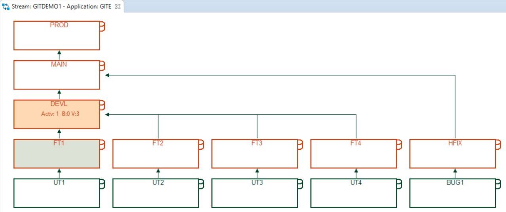

# Git to ISPW Synchronization

Based on the [Git to ISPW Integration Tutorial](../guidelines/ispw/git_to_ispw_integration_tutorial.md), we have created a Git repository connected to ISPW that shows some of the advantges moving to this combination may bring to a development team:

- Storing mainframe code and distributed code for the same application in the same location
- Storing Topaz for Total Test assets in the same location as the mainframe code
- Using a more "meanigful" folder structure for the mainframe application than provided by the default created from ISPW

While the former two address the problem of keeping code for different platforms or tests and code "in synch", the last point is more a question of "esthetics". The folder structure in use is more resembling a structure developers may be used from codeing Java applications and therefore may not be as "alienating" to these developers than the rather flat structure provided by the "default".

## Repository Structure

The repository in use consist of nested projects
- one "root" project encompassing the whole repository
- one sub project for mainframe code and Topaz for Total Test test assets
- one sub project for dirtributed Jave code of the client application

In addition to configuring the mainframe code project to be [connected to ISPW](../guidelines/ispw/GIT_to_ISPW_Integration_Tutorial.html#_2-change-the-ispw-project-properties-to-keep-a-downloaded-copy-of-each-component), it has been configured as Topaz for Total Test project.

## Branching model and ISPW life cycle

The Git repository uses a branching model consisting of two long lived branches and short lived feature or hotfix branches
- `feature/FT<n>/<branch_name>` - branches of this form are used to implement user stories. The [ISPW branch mapping rules in use](#branch-mapping), assure that branches whose name start with `feature/FT<n>` will get mapped to a corresponding `FT<n>` level in the ISPW application's life cycle.
- `bugfix/<branch_name>` - branches of this form are used to implement bug fixes. The [ISPW branch mapping rules in use](#branch-mapping), assure that branches whose name start with `bugfix` will get mapped to the `HFIX` level in the ISPW application's life cycle.
- `development` - this is the first long lived branch. Any development work `feature` branches are branched off and merged into the `development` branch. The [ISPW branch mapping rules in use](#branch-mapping), assure that the `development` branch will get mapped to the `DEVL` level in the ISPW application's life cycle.
- `main` - the second long lived branch. At any time, the `main` branch is supposed to be in a state that is "production ready". Meaning that a merge from the `development` branch into the `main` branch will result in the code to be released to production. The [ISPW branch mapping rules in use](#branch-mapping), assure that the `mail` branch will get mapped to the `MAIN` level in the ISPW application's life cycle.

Code residing in the `main` branch / at the `MAIN` level is ready to be released to production. There is a `PROD` level in the ISPW life cycle, which represents production, and does not have a matching Git branch. Instead ISPW promote, release and deploy are used to move code from the `MAIN` level into production.

Likewise, there are no Git branches directly matching the lowest levels (`UT<n>`, `BUG1`) in the ISPW life cycle. Instead, these levels get synchronized from the local developer's workspace using the Git/ISPW within Topaz. The target level for any "local" ativity (load, generate, build) is determined during the [initial connection of the project to ISPW](../guidelines/ispw/git_to_ispw_integration_tutorial.md#verify-the-ispw-mainframe-play-application-is-available) and can by modified via the project's ISPÜW properties.



## Folder Structure

After the mainframe code project had been connected to ISPW, the sources had been downloaded and the `ispwconfig.yml` file had been created, the new folders and sub folders had been created manually, and the sources files moved into the desired locations. The resulting folder structure looks like the following

```
    (root)
    +- mainframeCodeProject             Project connected to ISPW, containing mainframe code and Topaz for Total Test assets
    |   +- Sources                      Mainframe code, split into separate sub folders by 'feature'
    |   |   +- feature1                     Code for first feature. No sub folders by file type
    |   |       +- sourceFile1.cbl
    |   |       +- sourceFile2.pli
    |   |       +- sourceFile3.cpy
    |   |       ...
    |   |   +- feature2                     Code for second feature. No sub folders by file type
    |   |   ... 
    |   +- Tests                        Topaz for Total Test assets
    |   |   +- Integration              Non Virtualized Test scenarios implementing "integration" tests
    |   |   |   +- feature1                 Test scenarios for first feature
    |   |   |   |   +- sourceFile1              Tests for first source file
    |   |   |   |   ...
    |   |   |   +- feature2
    |   |   |   ...
    |   |   +- Unit                     Virtualized Test scenarios implementing "unit" tests
    |   |       +- feature1                 Test scenarios for first feature
    |   |       |   +- sourceFile1              Tests for first source file
    |   |       |   ...
    |   |       +- feature2
    |   |       ...
    |   +- .project
    |   +- ispwconfig.yml
    +- javaCodeProject                  Jave code project
    |   +- bin                          Executables
    |   +- src                          Sources
    |       +- main                         Class sources
    |       +- test                         Test sources
    +- .project
    +- Git_To_Ispw.Jenkinsfile          Jenkinsfile
```

## `ispwconfig.yml`

Consequently, the `ispwconfig.yml` file needs to be modified from the was it has been generated by ISPW, initially, to reflect the new folder structure and to identify the components and component types as desired:

```yml
!!com.compuware.ispw.wzzms.models.IspwRoot
ispwApplication:
  host: <host_url>
  port: <hci_port>
  runtimeConfig: <runtime_config>
  stream: <stream_name>
  application: <application>
  pathMappings:
  - path: "**/Sources/**"
    types:
    - fileExtension: cbl
      ispwType: COB
    - fileExtension: pli
      ispwType: PLI
    - fileExtension: cpy
      ispwType: COPY
    - fileExtension: incl
      ispwType: INCL
    - fileExtension: jcl
      ispwType: JOB
```

::: tip Note 1
This file makes use of the `ispwconfig.yml` file allowing for wildcards on the `path` element. Since source files of different types are stored in the same subfolders, no further destinction is required.
:::

::: tip Note 2
As will be discussed further below, the `ispwcofig.yml' contains information that also is needed during execution of the pipeline. Therefore, this file will also be used by the pipeline to get required information from here, like ISPW stream and application name.
:::

## The pipeline

Again, based on the tutorial, the Jenkins job is setup as a [Multibranch Pipeline](../guidelines/ispw/git_to_ispw_integration_tutorial.md#_5-configure-the-ispw-and-git-mapping). It is using 
- [Jenkins Shared Libraries](./readme.md) to access pipeline scripts
- [`Git_To_Ispw.Jenkinsfile`](https://github.com/cpwr-devops/DevOps-Examples/blob/april_2021/src/Jenkinsfile/Git_To_Ispw.Jenkinsfile) as Jenkinsfile - stored in the source Git repository root
- two configuration files
    - [`ispwconfig.yml`](https://github.com/cpwr-devops/DevOps-Examples/blob/april_2021/resources/ispwconfig.yml) (as mentioned above) - stored in the mainframe code project root
    - [`synchronization.yml`](https://github.com/cpwr-devops/DevOps-Examples/blob/april_2021/resources/synchronization.yml) - stored in the Shared Library repositories `resources` folder
- two Shared Library pipeline scripts - as Shared Library scripts they are both stored in the `vars` folder of the Shared Library repository
    - [`Git_MainframeCode_Pipeline.groovy`](https://github.com/cpwr-devops/DevOps-Examples/blob/april_2021/vars/Git_MainframeCode_Pipeline.groovy) - executing the mailframe code build steps
    - `Git_JavaCode_Pipeline.groovy` - executing the Java code build steps (as Java builds are not the scope of these tutorial pages, we do not share the code of this script)

### `Git_To_Ispw.Jenkinsfile`

The `Git_To_Ispw.Jenkinsfile` specified as Jenkinsfile when setting up the [Multibranch pipeline](../guidelines/ispw/git_to_ispw_integration_tutorial.md#_5-configure-the-ispw-and-git-mapping) gets triggered whenever the Multibranch pipeline detects changes in one of the branches of the source repository. In contrast to the other pipeline scripts used here, it does not take any parameters. 

As mentioned before, it uses a Shared Library

```groovy
@Library('GITDEMO_Shared_Lib@Git2IspwCWC2') _
```

It clears the workspace from previous builds and checks out (clones) the code from the Git repository. 

```groovy
node {
    stage ('Checkout') {
        dir('./') {
            deleteDir()
        }
      checkout scm
    }
```
::: tip Note
Multibranch pipelines are directly connected to the Git repository, and the script gets executed for each branch having changes, individually. Therefore, there is no need to be more specific on the `checkout`.
:::

::: warning
`checkout scm` works only for Multibranch pipelines.
:::

Since the following will execute the two scripts for mainframe and Java code in parallel, the content of workspace needs to be made available to the agent workspaces. This requires the use of [`stash`](https://www.jenkins.io/doc/pipeline/steps/workflow-basic-steps/#stash-stash-some-files-to-be-used-later-in-the-build) in the calling script and [`unstash`](https://www.jenkins.io/doc/pipeline/steps/workflow-basic-steps/#unstash-restore-files-previously-stashed) in the called script.

```groovy
    stash name: 'workspace', includes: '**', useDefaultExcludes: false
```

::: tip Note
`useDefaultExcludes: false` ensures that the whole workspace (including the `.git` folder) gets stashed. This is required by the ISPW [synchronization step](../guidelines/ispw/git_to_ispw_integration_tutorial.md#create-a-jenkinsfile) of the `Git_MainframeCode_Pipeline`.
:::

As mentioned above, the two scripts for mainframe build and Java build get executed in parallel.

```groovy
    parallel(
        mfCode: {
            node {
                Git_MainframeCode_Pipeline()
            }
        },
        javaCode: {
            node {
                Git_JavaCode_Pipeline()
            }
        },
        failFast: true
    )
}
```
::: tip Note
`failFast: true` unsures that any of the two scripts gets aborted whenever a in the other script fails. This ensures immediate interruption of the job execution whenevr anything fails, without having to wait for the complete build of both scripts to finish, before getting a result.
:::

### `Git_MainframeCode_Pipeline.groovy`

Most of the individual steps executed within this script are the same as documented in other locations and contexts already. Therefore, we document only the parts of the script that seem noteworthy.

#### Method `call` - main "flow" of the script

As Shared Library script this script implements a `call` method as primary method. For enhanced readbility and to better follow the "flow" of the script, execution of the several stages is being implemented by separate methods within the same script.

`executionFlags`, a `Map` of `Boolean` variables helps to determine if a given stage shall be executed. 

The script will execute
-   `stage ("Initialize")` - This stage will 
    - clear the workspace
    - `unstash` the workspace that has been `stashed` by the calling script, i.e. copy the content of workspace of the main script into its own workspace
    - `initialize` global variables, primarily by processing the [two configuration files](#the-configuration-files) and by determining the branch it is executing for. During initialization method `determinePipelineBehavior` sets the flags that determine which stages need to be executed.
-   `stage('Load code to mainframe')` - This stage will [synchronize any changes to mainframe code into ISPW](../guidelines/ispw/git_to_ispw_integration_tutorial.md#create-a-jenkinsfile)
-   If changes were detected the ISPW CLI will create a file called `automaticBuildParams.txt`, listing information about the modified components. This file will be used by the next stage building the mainframe code. Method `checkForBuildParams` verifies that this file got created. If it did not created, it means, that no changes to mainframne code were responsible for the execution of the pipeline, and the build and test stages will be skipped.
-   `stage('Build mainframe code')`- If changes to mainframe code were detected, this stage will use the `automaticBuildParams.txt` to build all components that were changed. "Build" alsoe means that any impacted components will be generated alongside.
-   `stage('Execute Unit Tests')` - If changes to mainframe code were detected and if "unit tests" need to be run for the current branch, this stage will execute any Topaz for Total Test Virtualized tests that match components that were built by the previous stage.
-   `stage('Execute Unit Tests')` - If changes to mainframe code were detected and if "unit tests" need to be run for the current branch, this stage will execute any Topaz for Total Test Virtualized tests that match components that were built by the previous stage.
-   `stage('Execute Module Integration Tests')` - If changes to mainframe code were detected and if "integration tests" need to be run for the current branch, this stage will execute any Topaz for Total Test Virtualized tests that match components that were built by the previous stage.
-   If tests were executed, Code Coverage results get retrieved 
-   `stage("SonarQube Scan")` - This stage execute a Sonar Qube scan. This stage is executed in any case
-   `stage("Trigger Release")` - If the pipeline was triggered by a merge into the `main` branch, this stage will trigger an XL Release template

```groovy
def call(){
    stage ('Initialize') {
        dir('./') {
            deleteDir()
        }
        unstash name: 'workspace'
        initialize(execParms)
    }
    stage('Load code to mainframe') {
        if(executionFlags.mainframeChanges) {
            echo "[Info] - Loading code to mainframe level " + ispwTargetLevel + "."
            runMainframeLoad()
        }
        else {
            echo skipReason + "\n[Info] - No code will be loaded to the mainframe."
        }
    }
    checkForBuildParams(synchConfig.ispw.automaticBuildFile)
    stage('Build mainframe code') {
        if(executionFlags.mainframeChanges){
            echo "[Info] - Building code at mainframe level " + ispwTargetLevel + "."
            runMainframeBuild()
        }
        else{
            echo skipReason + "\n[Info] - Skipping Mainframe Build."
        }
    }
    if(executionFlags.executeVt){
        stage('Execute Unit Tests') {           
            runUnitTests()
        }
    }
    if(executionFlags.executeNvt){
        stage('Execute Module Integration Tests') {
            runIntegrationTests()
        }
    }
    if(executionFlags.mainframeChanges){
        getCocoResults()
    }
    stage("SonarQube Scan") {
        runSonarScan()
    }   
    if(executionFlags.executeXlr){
        stage("Trigger Release") {
            triggerXlRelease()
        }
    }
}
```

#### The configuration files

As mentioned before, this script will use two `.yml` files as primary source for configuration settings.
- [`ispwconfig.yml`](https://github.com/cpwr-devops/DevOps-Examples/blob/april_2021/resources/ispwconfig.yml) contains the ISPW stream and application name
- [`synchconfig.yml`](https://github.com/cpwr-devops/DevOps-Examples/blob/april_2021/resources/synchronization.yml) contains all other settings, many of which correspond to the [parameters](../advanced_pipelines/parameters.md) that are used by the other pipelines script example shared here. 

#### Branch mapping

Worth mentioning is the `branchInfo` of the `synchconfig.yml` file. This is used to determine the `branchMapping` [parameter for the Git to ISPW synchronization](../guidelines/ispw/git_to_ispw_integration_tutorial.md#create-a-jenkinsfile):

Each entry corresponds to a certain branch name or branch name pattern and lists 
- the target level in the ISPW life cycle to use
- and the rule to use for creating assignments for the corresponding branch

Method [`processBranchInfo`](#method-processbranchinfo) is used to match the current branch to any of the entries and build the value vor the `branchMapping` parameter. If a branch cannot be maped, execution of the scipt will be aborted.

#### Method `determinePipelineBehavior`

This method, initially, determines which stages gete executed based on the current situation:
-   If this is the first build for the corresponding branch, only the Sonar scan will be executed to build a "baseline" for "new" code
-   For `feature` branches mainframe changes may have to by synchronized and built, and "unit tests" will be executed
-   For `bugfix` branches mainframe changes may have to by synchronized and built, and "unit tests" will be executed
-   For the `development` branch mainframe changes may have to by synchronized and built, "unit tests" and "integration tests" will be executed
-   For the `main` branch mainframe changes may have to by synchronized and built, "integration tests" will be executed, and an XL Release template will be triggered

```groovy
def determinePipelineBehavior(branchName, buildNumber){
    if (buildNumber == "1") {
        executionFlags.mainframeChanges = false
        executionFlags.executeVt        = false
        executionFlags.executeNvt       = false
        executionFlags.executeXlr       = false
    }    
    else if (BRANCH_NAME.contains("feature")) {
        executionFlags.mainframeChanges = true
        executionFlags.executeVt        = true
        executionFlags.executeNvt       = false
        executionFlags.executeXlr       = false
    }
    else if (BRANCH_NAME.contains("bugfix")) {
        executionFlags.mainframeChanges = true
        executionFlags.executeVt        = true
        executionFlags.executeNvt       = false
        executionFlags.executeXlr       = false
    }
    else if (BRANCH_NAME.contains("development")) {
        executionFlags.mainframeChanges = true
        executionFlags.executeVt        = true
        executionFlags.executeNvt       = true
        executionFlags.executeXlr       = false
    }
    else if (BRANCH_NAME.contains("main")) {
        executionFlags.mainframeChanges = true
        executionFlags.executeVt        = false
        executionFlags.executeNvt       = true
        executionFlags.executeXlr       = true
    }
}
```

#### Method `processBranchInfo`

```groovy
def processBranchInfo(branchInfo, ispwApplication){
    branchInfo.each {
        branchMappingString = branchMappingString + it.key + '** => ' + it.value.ispwLevel + ',' + it.value.mapRule + '\n'
        if(BRANCH_NAME.contains(it.key)) {
            ispwTargetLevel     = it.value.ispwLevel
        }
    }
}
```