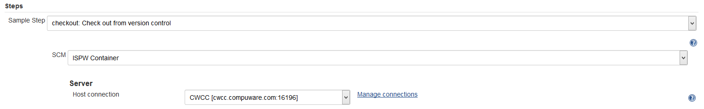

# The pipeline parameter
The two primary pipelines - and some of the other code examples - use a set of parameters where both names and values are taken from several sources.

This table documents the different names these parameters appear under, how and where to define them, where the parameters are read from, how to determine which value to specify as used in the `PipelineConfig` class and the [Mainframe_CI_Pipeline_from_Shared_Lib](./readme.md#mainframe-ci-pipeline-from-shared-lib).

## Webhook Parameters

These values are passed via the ISPW [Webhook](../tool_configuration/webhook_setup.md#URL)

Name in PipelineConfig class | Alias | Parameter / Description
---------------------------- | ----- | -----------------------
`public String ispwStream` | `ISPW_Stream` | The ISPW stream that contains the tasks that were promoted.  This value is passed via the ISPW Webhook as value `$$stream$$`
`public String ispwApplication` | `ISPW_Application` | The ISPW application that contains the tasks that were promoted.  This value is passed via the ISPW Webhook as value`$$application$$`
`public String ispwRelease` | `ISPW_Release` | The ISPW release that contains the tasks that were promoted.  This value is passed via the ISPW Webhook as parameter `$$release$$`
`public String ispwAssignment` | `ISPW_Assignment` | The ISPW assignment that contains the tasks that were promoted.  This value is passed via the ISPW Webhook as parameter `$$assignment$$`
`public String ispwContainer` | `ISPW_Container` | The internal ID of the container/set triggering the pipeline.  This is passed from the Webhook as parameter `$$container$$`
`public String ispwContainerType` | `ISPW_Container_Type` | The type of container being passed by the ISPW webhook parameter as a hardcoded value 2, which indicates a set container
`public String ispwSrcLevel` | `ISPW_Src_Level` | The level in the ISPW life cycle, the sources were promoted from via the ISPW Webhook as parameter `$$level$$`
`public String ispwOwner` | `ISPW_Owner` | The TSO user id of the user promoting the sources and thus triggering the pipeline via the ISPW Webhook as parameter `$$owner$$`

## Total Test / Git Parameters

These are values passed via the config file [tttgit.config](./config_files.md#tttgit.config)

Name in PipelineConfig class | Alias | Parameter / Description
---------------------------- | ----- | -----------------------
`public String gitTargetBranch` | `TTT_GIT_TARGET_BRANCH` | Git/GitHub branch to merge Topaz for Total Test unit tests into after successful execution of the pipeline.  This is not used in the standard example pipeline. Some of the other code examples demonstrate how to use this. If not used, the value may remain empty
`public String gitBranch` | `TTT_GIT_BRANCH` | Git/GitHub branch to use when downloading Topaz for Total Test unit tests.
`public String mfSourceFolder` | `MF_SOURCE_FOLDER` | Folder in the application folder, containing sources downloaded via the ISPW downloader plugin.  This value is currently unchangeable and will always be be `MF_Source`

## Pipeline Configuration Parameters

These are values passed via the config file [pipeline.config](./config_files.md#pipeline.config)

Name in PipelineConfig class | Alias | Parameter / Description
---------------------------- | ----- | -----------------------
`public String sqScannerName` | `SQ_SCANNER_NAME` | SonarQube scanner configuration name within Jenkins In `Manage Jenkins` --> `Global Tool Configuration` --> `SonarQube Scanner` as `Name`
`public String sqServerName` | `SQ_SERVER_NAME` | SonarQube server name within Jenkins in `Manage Jenkins` --> `Configure System` --> `SonarQube servers` as `Name`
`public String sqServerUrl` | `SQ_SERVER_URL` | URL of the SonarQube server
`public String xlrTemplate` | `XLR_TEMPLATE` | XL Release template to use for creation of a new XL Release release
`public String xlrUser` | `XLR_USER` | XL Release credentials token to use for creation of a new XL Release release in `Manage Jenkins` --> `Configure System` --> `XL Release` as `Credentials name`
`public String gitTttRepo` | N/A | The name of the GitHub repository containing the Topaz for Total Test projects.  Built as "${ispwStream}_${ispw_application}_Unit_Tests.git" from `ispwStream` and `ispwApplication`
`public String tttFolder` | `TTT_FOLDER` | Folder in the Jenkins workspace that will contain the Topaz for Total Test project folders after downloading from GitHub.  The examples use `tests` as the value
`private String tttGitConfigFile` | N/A | Name of the config file for the GitHub repository storing Topaz for Total Test projects. The file name is `tttgit.config`. Passed via the class constructor
`public String ispwUrl` | `ISPW_URL` | CES URL to use when executing raw http requests against the ISPW REST API
`public String ispwRuntime` | `ISPW_RUNTIME` | The ISPW runtime being used by the ISPW installation.  The default is `ispw`
`public String gitProject` | `Git_Project` | Name of the GitHub project, used to store Topaz for Total Test projects As parameter in the call of the pipeline.  IF the full URL for the git is for example, https://github.com/ralphnuessecpwr/FTSDEMO_RXN3_Unit_Tests.git "ralphnuessecpwr" would be the project name
`public String gitCredentials` | `Git_Credentials` | Jenkins credentials token to use to authenticate with GitHub As parameter in the call of the pipeline | In `Manage Jenkins` --> `Credentials` | In the list at `Manage Jenkins` --> `Credentials` in column `ID`
`public String cesTokenId` | `CES_Token` | The Jenkins credential token for the CES token as used by most Compuware plugins.  As parameter in the call of the pipeline.  This value can be found in `Manage Jenkins` --> `Credentials` in the list at `Manage Jenkins` --> `Credentials` in column `ID`
`public String hciConnId` | `HCI_Conn_ID` | The connection configuration storing host name and port for the connection to the mainframe LPAR to connect to.  As parameter in the call of the pipeline.  This value can be found In `Manage Jenkins` --> `Configure System` --> `Compuware Configurations`. Use `Pipeline Syntax`, e.g. to define an ISPW container checkout and select the HCI connection from the `Host connection` dropdown 
`public String hciTokenId` | `HCI_Token` | The user ID / password token for a valid logon to the required mainframe LPAR used by plugins that do not use the CES credentials token.  As parameter in the call of the pipeline. This value can be found in In `Manage Jenkins` --> `Credentials` in the list at `Manage Jenkins` --> `Credentials` in column `ID`
`public String ccRepository` | `CC_repository` | The Xpediter Code Coverage repository to use.  The Xpediter Code Coverage repository is defined using Xpediter Code Coverage or Topaz Workbench or defined by the administrator of Xpediter Code Coverage.  As parameter in the call of the pipeline
`public String gitUrl` | N/A | The name of the GitHub project, storing the repository containing the Topaz for Total Test projects.  Built as "https://github.com/${gitProject}" from `gitProject`
`public String applicationPathNum` | N/A | The number of the path through the development life cycle which is in use by the set triggering the pipeline.  Determined from the name of the level `ispwSrcLevel` the sources have been promoted from; the number of the levels `DEV1`, `DEV2`, or `DEV3`
`public String tttJcl` | N/A | Runner jcl to use for unit test execution.  It is built as "Runner_PATH${applicationPathNum}.jcl" using `applicationPathNum`
`public String mailRecipient` | N/A | Recipient of emails sent by the pipeline informing the owner of the ISPW set about the results.  The email file contains TSO user : email address pairs. The owner of the ISPW set will be taken as lookup for the email address.  This value is defined in `Manage Jenkins` -> `Managed Files`.  Email List configuration file `mailList.config`
`private String configPath` | N/A | Path to the configuration files after downloading from GitHub to the Jenkins workspace.  The folder containing all configuration file is `(root)/config/pipeline`
`private String pipelineConfigFile` | N/A | Name of the config file for pipeline and environment specific settings. The file name is `pipeline.config`
`private String configGitPath` | N/A | Folder in the Git repository containing all configuration files. The folder containing all configuration file is `(root)/config`
`private String configGitProject` | N/A | Git project name of repository storing configuration files.  The configuration files are stored in the same Git project which stores the pipeline code itself
`private String workspace` | N/A | Name of current Jenkins workspace.
`public String ispwTargetLevel` | N/A | The level in the ISPW life cycle, the sources were promoted to in ISPW.  The parameter is built as "QA${applicationPathNum}" from `applicationPathNum`
<!--stackedit_data:
eyJoaXN0b3J5IjpbMjA2MjYyNjQsMTEwMjA0NTI5OF19
-->