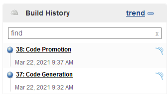

# Shared Library Pipelines

[Shared Libraries](https://jenkins.io/doc/book/pipeline/shared-libraries/) are getting the preferred method of providing code that can can be re-used (**shared**) between pipeline definitions. 

The following example pipelines on the [Compuware GitHub](https://github.com/cpwr-devops/DevOps-Examples/) are built based on shared library principles. 

- [`Mainframe_CI_Pipeline_from_Shared_Lib.groovy`](https://github.com/cpwr-devops/DevOps-Examples/blob/master/vars/Mainframe_CI_Pipeline_from_Shared_Lib.groovy)) is intended to be triggered [after promoting code within ISPW](../pipelines/basic_scenario.md). It implements the same process as the [basic pipleine example](../pipelines/basic_example_pipeline.md).
- Using Shared Libraries allows re-using existing scripts and combining them to build more complex processes. To demonstrate this, we use the two following pipelines which are part of a more [elaborate process](../advanced_pipelines/elaborate_scenario.md). Instead of setting up individual webhooks for each script, we create a third ["dispatching" script](#calling-script-mainframe-combined-pipeline) which gets triggered by several, different ISPW operations. Depending on the operation this script calls one of the two scripts:
    - [`Mainframe_Generate_Pipeline.groovy`](https://github.com/cpwr-devops/DevOps-Examples/tree/master/vars/Mainframe_Generate_Pipeline.groovy) - gets called when the pipeline is triggered by an ISPW Generate and executes **virtualized tests** against those components that have been generated.
    - [`Mainframe_Integration_Pipeline.groovy`](https://github.com/cpwr-devops/DevOps-Examples/tree/master/vars/Mainframe_Integration_Pipeline.groovy) - gets called when the pipeline is triggered by an ISPW Promote and executes **non virtualized tests** against the project/assignment.

    ::: tip Note
    Both these scripts could still be used independently from each other in corresponding Jenkins jobs.
    :::
- Git to ISPW integration/synchronization

In these pages we describe in detail  
- [how to code scripts to be used in Shared Libraries](./coding_schared_lib_scripts.md)
- [how to setup a Jenkins job using a Shared Library script](./setup.md)
- how the example makes use of a [configuration file](./config_files.md)
- the [parameters](./parameters.md) that are passed into the pipeline, and which sources the values come from

## Simple Shared Library example `Mainframe_CI_Pipeline_from_Shared_Lib`

This pipeline executes the following steps [after a developer has promoted their code in ISPW](../pipelines/basic_scenario.md):
- Retrieve the mainframe code from ISPW for later analysis by SonarQube
- Retrieve Topaz for Total Test test definitions for the corresponding ISPW application from GitHub
- Execute those test scenarios that belong to the COBOL programs that have been promoted
- Retrieve the Code Coverage metrics generated during test execution from the mainframe repository
- Pass all information (sources, test results, code coverage metrics) to SonarQube
- Receive a Sonar quality gate webhook callback and analyze the status of the quality gate
- If the quality gate was passed, continue the process by triggering an XL Release release template
- In either case (passed/failed), send an email to the developer informing them of the status of the pipeline

Comparing the [code in this example](https://github.com/cpwr-devops/DevOps-Examples/blob/april_2021/vars/Mainframe_CI_Pipeline_from_Shared_Lib.groovy) to the [basic example pipeline](https://github.com/cpwr-devops/DevOps-Examples/blob/april_2021/src/Jenkinsfile/Mainframe-CI-Example-pipeline.jenkinsfile) you will find that they differ only in a few, minor details. One of the differences being that the "hard coded" configuration parameters are externalized into a configuration `.yml` file, allowing for changes in configuration without havng to change any pipeline code.

## A combined scenario

The two pipelines making up the combined scenario are stored in the same Shared Library and use the same principles and same configuration files. They implement [two steps in a larger process](./elaborate_scenario.md) and get called by a single script exectuting either of them based on the stage in the process.

### Calling script `Mainframe_Combined_Pipeline`

The Jenkins job is configured to use the initial script [Mainframe_Combined_Pipeline.jenkinsfile](https://github.com/cpwr-devops/DevOps-Examples.git/src/Jenkinsfile/Mainframe_Combined_Pipeline.jenkinsfile) from `src/Jenkiksfile` folder in the Git underlying the Shared Library, similar to the [loading the script from GitHub for the basic pipeline](../pipelines/basic_example_pipeline.md#loading-the-script-from-github).

The code will determine the ISPW operation triggering the pipeline from the `ISPW_Operation`parameter, which gets its value from the webhook via the `$$operation$$`parameter. Based on the value of `ISPW_Operation` it will 
- call/execute `Mainframe_Generate_Pipeline` if the value is `'Generate'`
- call/execute `Mainframe_Generate_Pipeline` if the value is `'Promote'`
- stop execution, if the value is none of the above

```groovy
@Library('Shared_Lib@master') _

def parmMap = [
...
]

switch(ISPW_Operation) {
    case 'Generate':
        currentBuild.displayName = BUILD_NUMBER + ": Code Generation"
        Mainframe_Generate_Pipeline(parmMap)
        break;
    case 'Promote':
        currentBuild.displayName = BUILD_NUMBER + ": Code Promotion"
        Mainframe_Integration_Pipeline(parmMap)
        break;
    default:
        echo "Unsupported operation " + ISPW_Operation
        echo "Review your Webhook settings"
        break;
}
```

The `parmMap` is the same `Map` of parameters used for the [simple Shared Library example](setup.md#executing-a-shared-library-script). 

Setting the `currentBuild.displaName` property allows distinguishing the different operations the pipeline job is executed for:



### `Mainframe_Generate_Pipeline`

This [pipeline](https://github.com/cpwr-devops/DevOps-Examples/tree/master/vars/Mainframe_Generate_Pipeline.groovy) is supposed to be executed every time (COBOL) components get `generated` within ISPW. It will
- download those COBOL components that are part of the set resulting from the generate
- retrieve Topaz for Total Test tests from a GitHub repository for the corresponding stream and application
- execute those *virtualized* test scenarios that correspond to the downloaded components
- retrieve the Code Coverage results from the Code Coverage repository
- send sources, test results and coverage metrics to SonarQube
- query the results of the corresponding SonarQube quality gate
- send a mail message to the owner of the set, informing them of the status of the quality gate

### `Mainframe_Integration_Pipeline`

This [pipeline](https://github.com/cpwr-devops/DevOps-Examples/tree/master/vars/Mainframe_Integration_Pipeline.groovy) is supposed to be executed every time (COBOL) components get `promoted` within ISPW. It will
- download those COBOL components that are part of the assignment, for which the promote was executed
- retrieve Topaz for Total Test tests from the same GitHub repository for the corresponding stream and application
- execute **all** *non virtualized* test scenarios
- send sources and test results SonarQube
- query the results of the corresponding SonarQube quality gate
- if the quality gate was passed, it will trigger an XLRelease release template to orchestrate the following CD process
- send a mail message to the owner of the set informing them of the status of the quality gate

## Git to ISPW Synchronization
Comparing the code of the two pipeline scripts reveals a lot of similarities and code repetitions. Alternatively, one might consider creating one single script that contains all steps and - based on the situation - executes only those steps that are required at the specific stage.

This is a strategy that has been used for the [Git/ISPW synchronization scenario](./git_ispw_synchronization.md). As a result, there is one script ([`Git_MainframeCode_Pipeline.groovy`](https://github.com/cpwr-devops/DevOps-Examples/blob/april_2021/vars/Git_MainframeCode_Pipeline.groovy)) executing different steps based on the branch of the underlying application it is executing for. 
<!--stackedit_data:
eyJoaXN0b3J5IjpbLTgyMzc0NDczLC0xMTEzNDEwNjM5XX0=
-->