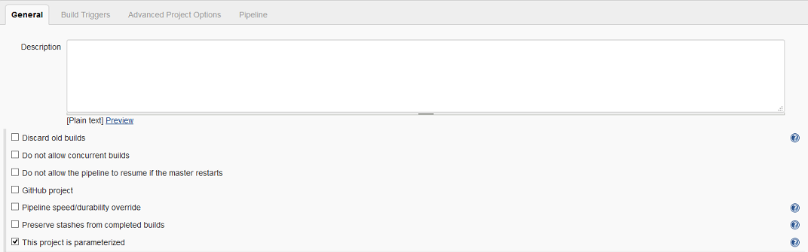

# Configuring a Pipeline from a Shared Library

## Setting up the pipeline job

The job itself is defined via the usual way of creating a new pipeline job. It is important to make sure that the resulting job uses parameters by checking the `This project is parameterized` box. 



## Defining parameters

Successively add the following string parameters.


The parameters in this first set are specific to the individual execution of the pipeline and get passed by the [ISPW Webhook](../tool_configuration/webhook_setup.md).

Name  |  Description
----- |  -----------
ISPW_Stream | ISPW Stream Name
ISPW_Application | ISPW Application
ISPW_Release | ISPW Release Name
ISPW_Assignment | ISPW Assignment Name
ISPW_Src_Level | ISPW Level the promote has been started from
ISPW_Owner | ISPW Owner User ID

## Executing a Shared Library script

To tell Jenkins to execute a pipeline from a shared library, you need to add code like the following to the Pipeline script definition:


::: tip Note
Alternatively, you may place the code below in a separate `.jenkinsfile` and [load this from a Git repository](../pipelines/basic_example_pipeline.md#loading-the-script-from-github).
:::

The example uses

```groovy
@Library('RNU_Shared_Lib@JenkinsFTS') _

Mainframe_CI_Pipeline_from_Shared_Lib(
    ispwStream:        ISPW_Stream,                             
    ispwApplication:   ISPW_Application,
    ispwRelease:       ISPW_Release,
    ispwAssignment:    ISPW_Assignment,
    ispwSrcLevel:      ISPW_Src_Level,
    ispwOwner:         ISPW_Owner,
    cesToken:          'xxxx',            
    jenkinsCesToken:   'xxxx',
    hciConnectionId:   'xxxx',
    hciToken:          'xxxx',
    ccRepository:      'xxxx',
    gitProject:        'xxxx',
    gitCredentials:    'xxxx'
)    )
```

where

- `@Library('RNU_Shared_Lib@JenkinsFTS') _`
refers to the name of a [Shared Library](../tool_configuration/Jenkins_config.md#global-pipeline-libraries), with `@JenkinsFTS` in this example referring to the `JenkinsFTS` branch of the underlying Git repository. The trailing `_` is required by Jenkins.
- `Mainframe_CI_Pipeline_from_Shared_Lib`
refers to the name of the `.groovy` file in the `vars` folder of the GitHub repository, containing the pipeline code
- Within the brackets `(...)` parameters are passed to the pipeline script. `Mainframe_CI_Pipeline_from_Shared_Lib` expects a `groovy` [`Map`](http://groovy-lang.org/syntax.html#_maps), containing the following `key:value` pairs.

The parameters in this first set are specific to the individual execution of the pipeline. They correspond to the parameters defined in the [pipeline configuration](#defining-parameters) above and take the values from these pipeline parameters.

Key  | Value | Description
----- | ------------- | -----------
ispwStream | ISPW_Stream | The ISPW_Stream parameter from the pipeline configuration above
ispwApplication | ISPW_Application | The ISPW_Application parameter from the pipeline configuration above
ispwRelease | ISPW_Release | The ISPW_Release parameter from the pipeline configuration above
ispwAssignment | ISPW_Assignment | The ISPW_Assignment parameter from the pipeline configuration above
ispwSrcLevel | ISPW_Src_Level | The ISPW_Src_Level parameter from the pipeline configuration above
ispwOwner | ISPW_Owner | The ISPW_Owner parameter from the pipeline configuration above

The second set of parameters may be specific to individual jobs/pipelines using the same set of scripts. They reference tokens and other IDs that have been defined during the [Jenkins configuration phase](../tool_configuration/Jenkins_config.md). To determine the appropriate values to use, refer to the [description of the pipeline parameters](./parameters.md).

::: tip Note
These parameters may be installation specific instead of specific to an individual job/pipeline definition. In that case, they also could be placed in a [configuration file](./config_files.md).
:::

Key  |  Description
----- | -----------
cesToken | CES Personal Access Token 
jenkinsCesToken | Jenkins Credentials ID for the CES Personal Access Token
hciConnectionId | HCI Connection ID configured in the Compuware Common Configuration Plugin
hciToken | The ID of the Jenkins Credential for the TSO ID that will used to execute the pipeline
ccRepository | The Compuware Xpediter Code Coverage Repository that the Pipeline will use
gitProject | Github project/user used to store the Topaz for Total Test Projects
gitCredentials | Jenkins credentials for logging into git 
<!--stackedit_data:
eyJoaXN0b3J5IjpbNDgwNzU3MDIyLDc5NDk0ODYxOF19
-->