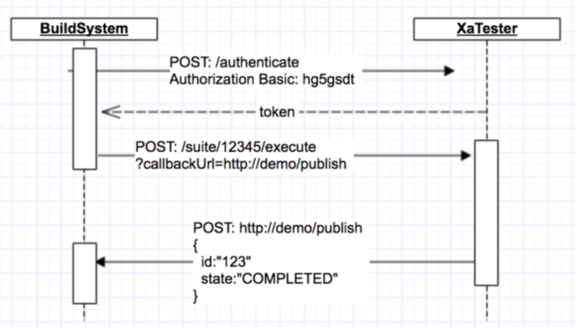

# Compuware Rest APIs

## ISPW Rest API

ISPW's Rest API is documented in [Swagger](https://swagger.io/solutions/api-documentation/), a commonly used format.  The Rest API is hosted in Compuware Enterprise Services (CES), which connects to the underlying mainframe products to perform various actions on the mainframe.  


The APIs use a token based authentication for securely accessing the mainframe.  Please visit the [CES Credentials](../tool_configuration/CES_credentials_token.md) for more information about setting up a Personal Access Token for the APIs.

### Accessing the API Documentation

To see the API Documentation on the internet, please visit our [Swagger REST API documentation](https://ispw.api.compuware.com/) for more details on the various APIs.

To access the APIs within your environment, go to the CES URL and select the `API Documentation` option in the Help menu (see below)


### Example of REST API usage

For an example of how to call the Rest API from a scripting language, please see this [Powershell script](https://github.com/cpwr-devops/DevOps-Examples/blob/master/src/misc-examples/ISPW_Operations.ps1) that calls ISPW's API to perform various ISPW Operations from a command line.

## Total Test REST APIs 

The Total Test REST APIs are also documented with swagger and are found under the Total Test web client at the CES server at `http(s)://<CES url>/totaltestapi/swagger-ui.html`. Here we will introduce how to use the APIs All functionality used by the web client and the Eclipse client is exposed as REST-based APIs and can be used and integrated with third-party software. The Functional Test web client contains a link under the menu: Configuration > API explorer that will open a web page that documents all available APIs including the ones described in this document. From this page it is possible to authenticate your credentials and call all the APIs. Each API shows the URL to use, all parameters and the response is also returned In the browser. Introduction to the API explorer is found in [Introduction to the Web-based API Explorer](#introduction-to-the-web-based-api-explorer). It is also possible to register publish providers through the Web client. A publish provider will be notified when executions have completed and is responsible for handling the report. All APIs are in the form `https://<CES url>/totaltestapi/<rest address>`. The remainder of this section will refer to the `/<rest address>` part of the URL.

### Authentication
Most of the APIs require a security token as a HTTP header parameter in the form:
- URL: `/<rest address>`
- Method: GET, PUT, POST, DELETE
- Headers
  - **token**: `<token>`

A token is valid for 60 minutes and is retrieved by submitting a valid Functional Test UserID and
password with HTTP Basic authentication through HTTP POST with the URL:
- URL: /authenticate
- Method: POST
- Headers: 
  - `Authorization: Basic <encoded>`

where the `<encoded>` parameter is the base64 encoded value of the userID and password
concatenated with a colon between the userID and password (Base64.encode(userid+ ":"
+password))
A token can also be retrieved by a server that will use the APIs. The server uses the API:
- URL: /authenticate/server
- Method: POST

No header information is needed. The Functional Test server will create a new Server user based on
the request IP address. The first time this is executed, the client will receive an error telling that the
user is not enabled. A Functional Test administrator must then assign a license to the server.
#### Example request
```
POST /authenticate
Authorization: Basic c3RlZW46MTIz
```
#### Example response
```
{
  "token":"517a64722f6c482b78544a69666e7373624f4349646e746348666f6d396d6c30467a46666d4c6b392b30466138334d68
2f4a4966524d3973734d634963575233"
}
```

### CRUD and List Operations
Artifacts that support CRUD operations follow standard REST principles by accessing the resource
through the URLS:
- Create: `POST /<resourceName>`
- Read: `GET /<resourceName>/{id}`
- Update: `PUT /<resourceName>/{id}`
- Delete: `DELETE /<resourceName>/{id}`
- List: `GET /<resourceName>`

The Read operation returns a JSON based object while the Create and Update operations requires a JSON based object in the request body. All CRUD operations require a valid token header to be
present

### List Operation
All list operations on artifacts in the repository accepts parameters for filtering, sorting and pagination. This makes it efficient to do server-side filtering, sorting and pagination�which is required when the number of artifacts grow large. A list of artifacts is received from the URL.
- GET `/<resourceName>`
The following URL parameters can be used
- **pageNumber**: The page number starting from 0
- **pageSize**: Number of items to return per page
- **sort**: Name of the attribute on which to do the sorting. It can be followed by a comma and either desc (descending) or asc (ascending) to specific which direction to sort, for example: **name, asc**
- **filter**: A json string containg attribute names and filters, for example:
`{"name":"xapgm","description":"hello"}`

#### Counting total number of items
Artifacts that support list operations all have a count API that takes same parameters as above and
that returns the total number of artifacts matching the filter. The count operation is accessed through
the URL
- GET `/<resourceName>/count`

### Introduction to the Web based API Explorer
From the Functional Test web client the menu: **Configuration->API Explorer** will open a new browser tag and all APIs can be seen and tried out. Below image shows the web page.


Simply select an area like Analyse Component on host and you will see a list of APIs related to this resource. You can click on an API and see details such as query and header parameters, request and response body etc. The following is illustrated for the API to execute test scenarios (or test cases) for a specific component.


Here you can see that the **componentName** and **environmentId** parameters are required while other parameters are optional. Clicking the **Try it out** button will execute the API and you will see the request
URL and response as follows.


#### Authorization
Most APIs require authorization. You first need to provide your Functional Test credentials to get a token and then use this token to authenticate other calls. You can use the **Authorize** button in the top right corner to setup authorization.
To get and use a security token:
1. Click the **Authorize key** and in the dialog enter your Functional Test UserID/password and click **Authorize**.

1. Expand the Authorize API header and expand the POST: /authorize API 

1. Click the **Try it out** button. It will use the HTTP basic authentication settings you setup in the dialog. You will receive a token in the response as illustrated below  

1. Copy the value of the token field. Then click the **Authorize** button again and paste the token value to the API auth key and click **Authorize**.
1. You can use all APIs, except possibly those that require admin permissions, if you are not an Functional Test admin. For instance, expand the Components API, expand the GET: /component
API and click **Try it out**. It will return the first 10 component definitions in the repository.

### Execute a Test Scenario or Suite
A test scenario or test suite can be executed through the APIs below. By default the execution will happen asynchronously at the server and the caller will get a result ID back. The caller can include a callback URL as a parameter in the request. The server will then publish the execution result through a Http POST to the callback URL when the execution completes. The APIs can also execute synchronously by providing a **synchron=true** query parameter. The client will then wait for the result until the test scenario or suite as completed the execution. 
Another API lets you execute all test scenarios in a specific environment that are defined to test a specific component (component under test). With this API you just need to provide environment ID and the component name and a test suite will automatically be generated, it will contain all relevant test scenarios and it will start to execute. 
These APIs can, for example, be used by a build system to initiate a test before the build or by an external continuous integration server to initiate a unit test and collect the result. The result ID that is returned when initiating the test can be used in a later request to get the report of the execution result. 
The APIs for executing a test scenario or suite can also be execute the test scenario or suite synchronously and return the final result after the execution completes. Provide the request parameter synchron=true in the request to make a synchronous request.
Execution of test scenarios and test suites can either be made by first getting an authentication token
and then use this token to initiate the test. Or it can use another API that will not require a token.

#### Scenario
The diagram below illustrates the interaction between Functional Test and e.g. a build system.



#### Resource URL
The following three URLs can be used to execute a test scenario and a test suite. All URLs require a security header token. The first executes a test scenario and the second a test suite. Use the third for both a test scenario and a test suite:
- POST: /testcase/{id}/execute
- POST: /suite/{id}/execute
- POST: /execute/{id}

The {id} path should be replaced with the context or suite ID. Both requests will return a JSON object with the current job status: 
```
{"id":"<the execution id>", "state":"running", "contextId":"<the id of the suite or context"}
```
The callback will receive a JSON object containing the detailed execution result in JUnit output
format. See next section, how to execute without a token for easier integration with build systems
#### Parameters
- **callbackUrl**: optional URL that will be used for a callback after the execution completes. The engine will send a POST request containing the execution result as a body.
- **synchron**: true or false. If true, then the client will wait until the execution has completed. If false, then a result object will be returned immediately with the ID of the result and the state Running.

The callbackUrl will get the result published through a POST request which will contain a JSON
object containing information about the execution
#### Header Parameters
- **token**: a valid token gotten from /authenticate or /authenticate/server
- **credentials**: Base64 encoded host credentials in the form `<UserID>:<password>`

Both calls require a valid token as header parameter and the base64 encoded host credentials as a
header parameter called credentials. 
#### Example Async Request
The example request contains a callback URL to https://someotherurl/publish/demo. The result is sent to this URL through a POST request after the execution finishes
- POST /testcase/56209fc22cec5ffddb2111cf/execute?callbackUrl=https://someotherurl/publish/demo
- Headers
  - token: 517a64722f6c482
  - credentials:U1RFRU46WEFURVNUMQ%3D%3D
#### Example Response
The immediate response from the example request is
```
{
 "id": "59cb78db0b1d2608840dab46",
 "type": "TEST",
 "contextId": "59c8a10e01fa9346123b2490",
 "testCaseResults": [],
 "state": "RUNNING",
 "started": "2017-09-27T10:09:31.217+0000",
 "ended": null,
 "message": null,
 "executedBy": "XATUSER",
 "validationFailures": [],
 "useCodeCoverage": true,
 "codeCoverage": []
}
```
Most important is the ID, which refers to the result ID, which currently is in running state. The contextId refers to the ID of the suite or script and the type is either TEST or SUITE depending on what type was executed. The callback URL later receives a HTTP POST with a request body containing the result. The state can be ERROR, FAILED, COMPLETED, where ERROR means a technical error occurred, FAILED means that data verification was unsuccessful and COMPLETED means a successful execution.

#### Example with Synchronous Request
When executing with the **synchron=true** parameter, the result will be returned after the execution has finished and the state will either be COMPLETED, FAILED or ERROR. The result will also contain optional code coverage information, message and validation failure.
- POST /testcase/56209fc22cec5ffddb2111cf/execute?synchron=true
- Headers
  - token: 517a64722f6c482
  - credentials:U1RFRU46WEFURVNUMQ%3D%3D
  
#### Example Response
The response from the example request is illustrated below
```
{
 "id": "59cb7fa00b1d2608840dab48",
 "type": "TEST",
 "contextId": "59c8a10e01fa9346123b2490",
 "testCaseResults": [],
 "state": "COMPLETED",
 "started": "2017-09-27T10:38:24.675+0000",
 "ended": "2017-09-27T10:38:27.776+0000",
 "message": "",
 "executedBy": "XATUSER",
 "validationFailures": [],
 "useCodeCoverage": true,
 "codeCoverage": [
 {
 "componentName": "XARISCAL",
 "coveragePercentage": 78
 }
 ]
}
```

### Retrieving Execution Result
Results from executing a test suite or test scenario can be retrieved through the two URLs below. The first returns the overall result while the second returns all the details of the result including the log, the resulting abstract syntax three of the result and detailed code coverage information. Detailed result might be deleted automatically from the server after a number of days. The simple result returned is in same format as the result returned by the API for executing a test scenario or test suite.
#### Resource URL
- GET:
  - /testcase/{id}/result/{resultId}
  - /suite/{id}/result/{resultId}
  - /result/{resultId}
- GET:
  - /testcase/{id}/result/{resultId}/details
  - /suite/{id}/result/{resultId/details
  - /result/{resultId}/details
#### Header Parameters
- **token**: a valid token gotten from /authenticate

Both calls require a valid token as header parameter.
#### Example Request to Get Result
- GET /testcase/59c8a10e01fa9346123b2490/result/59cb78db0b1d2608840dab46
- Headers
  - token: 517a64722f6c482
#### Example Response
```
{
 "id": "59cb78db0b1d2608840dab46",
 "type": "TEST",
 "contextId": "59c8a10e01fa9346123b2490",
 "testCaseResults": [],
 "state": "COMPLETED",
 "started": "2017-09-27T10:09:31.217+0000",
 "ended": "2017-09-27T10:09:34.406+0000",
 "message": "",
 "executedBy": "XATUSER",
 "validationFailures": [],
 "useCodeCoverage": true,
 "codeCoverage": [
 {
 "componentName": "XARISCAL",
 "coveragePercentage": 78
 }
 ]
}
```
#### Example Request to get Detailed Result
- GET /testcase/59c8a10e01fa9346123b2490/result/59cb78db0b1d2608840dab46
- Headers
  - token: 517a64722f6c482
#### Example Response
```
{
 "id": "59cb8faa0b1d2609aa31acd9",
 "type": "TEST",
 "contextId": "59c8a10e01fa9346123b2490",
 "testCaseResults": [],
 "state": "COMPLETED",
 "started": "2017-09-27T11:46:50.360+0000",
 "ended": "2017-09-27T11:46:53.554+0000",
 "message": "",
 "executedBy": "XATUSER",
 "validationFailures": [],
 "useCodeCoverage": true,
 "report": "<?xml version=\"1.0\" encoding=\"UTF-8\"?>\r\n<XaUnitResult result..."
 "log": "13:46:50.388 COMMENT XaUnit XaUnit execution started\n13:46..."
 "codeCoverage": [
	{
		 "componentName": "XARISCAL",
		 "coveragePercentage": 78,
		 "level": "LINE",
		 "tags": [],
		 "sourceCode": "000100 Identification division.
		 "hitLines": [
			23,25,29,31,32,35,39
		 ],
		 "untouchedLines": [
		 	36,40
		 ],
		 "executionCount": 1
	 }
 ]
}
```