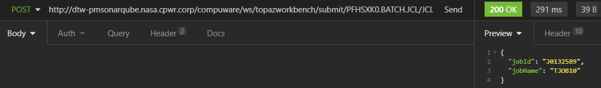
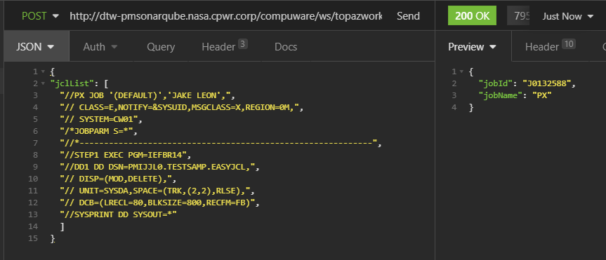
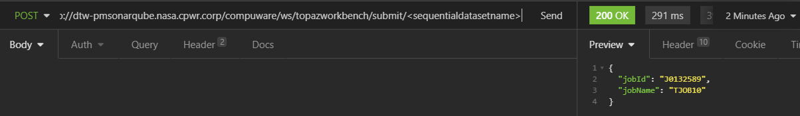
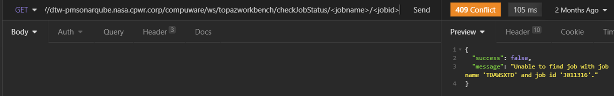

# Topaz Rest APIs

Starting with the CES 20.6.1 release, REST APIs are available that expose the functionality of the Topaz SDK and make it easier for users to take advantage of those capabilities.

The Topaz REST API Specification (Swagger) can be found <a href="../restdoc/topazrestapi.html" target="_blank">here</a>.

The APIs use a token based authentication for securely accessing the mainframe.  Please visit the [CES Credentials](../tool_configuration/CES_credentials_token.md) for more information about setting up a Personal Access Token for the APIs.

## Topaz REST API Methods

### Submit JCL contained in a PDS member

POST `<ces server>/compuware/ws/topazworkbench/submit/<partitioned data set name>/<member name>`

Headers

- Authorization:  `<CES Token>`
- Content-Type: `application/json`
- Accept:  `application/json`

### Submit JCL from the REST Client

POST `<ces server>/compuware/ws/topazworkbench/submit/`

Headers

- Authorization:  `<CES Token>`
- Content-Type: `application/json`
- Accept:  `application/json`

Body

- jcllist

### Submit JCL contained in a sequential dataset

POST `<ces server>/compuware/ws/topazworkbench/submit/<sequential data set name>`

Headers

- Authorization:  `<CES Token>`
- Content-Type: `application/json`
- Accept:  `application/json`

### Check the execution status of a Job

POST `<ces server>/compuware/ws/topazworkbench/checkJobStatus/<Job Name>/<Job Id>`

Headers

- Authorization:  `<CES Token>`
- Content-Type: `application/json`
- Accept:  `application/json`

