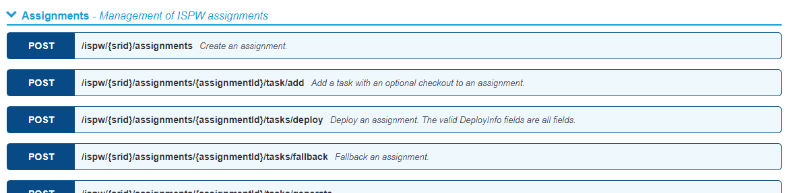

# Rest API

Compuware's Rest APIs are documented in [Swagger](https://swagger.io/solutions/api-documentation/), a commonly used format.  The Rest APIs are hosted in Compuware Enterprise Services (CES), which connects to the underlying mainframe products to perform various actions on the mainframe.  

The APIs use a token based authentication for securely accessing the mainframe.  Please visit the [CES Credentials](../tool_configuration/CES_credentials_token.md) for more information about setting up a Personal Access Token for the APIs.

## Accessing the API Documentation

To see the API Documentation on the internet, please visit our [Swagger REST API documentation](https://ispw.api.compuware.com/) for more details on the various APIs.

To access the APIs within your environment, go to the CES URL and select the `API Documentation` option in the Help menu (see below)

## Example of REST API usage

For an example of how to call the Rest API from a scripting language, please see this [Powershell script](https://github.com/cpwr-devops/DevOps-Examples/blob/master/src/misc-examples/ISPW_Operations.ps1) that calls ISPW's API to perform various ISPW Operations from a command line.

