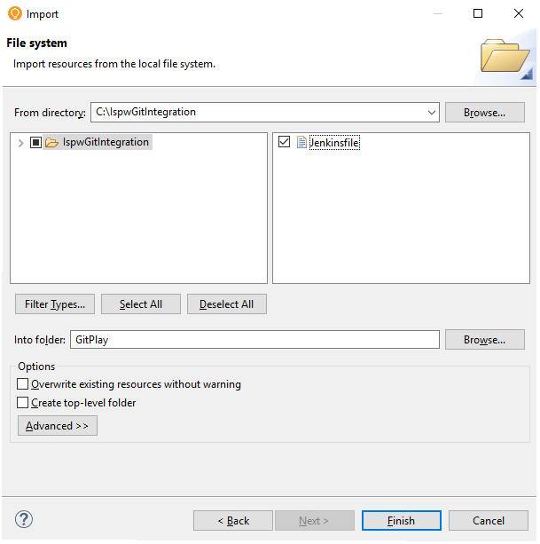
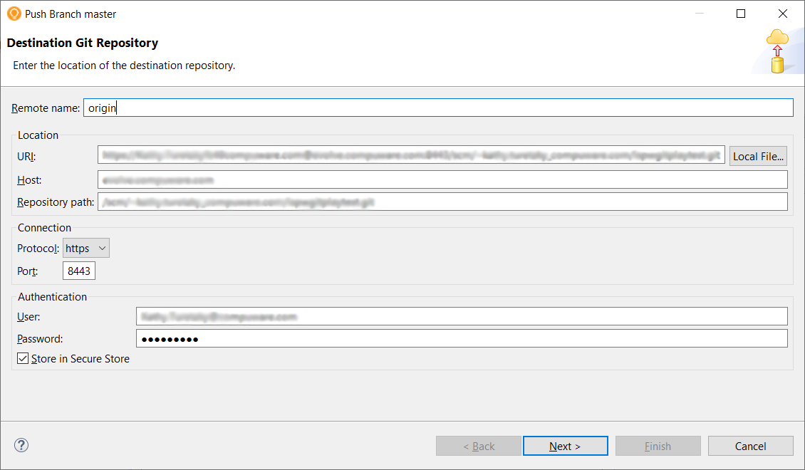
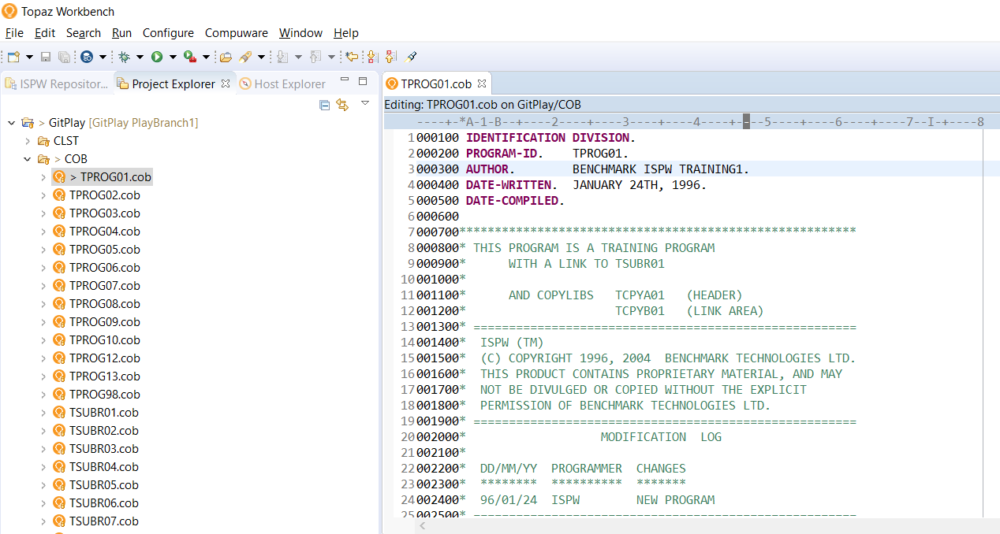

# Git to ISPW Integration - A Tutorial

This tutorial helps a developer understand the process of how the ISPW and Git synchronization process can be performed. It uses the ISPW training application PLAY to synchronize a change to a component from Git to ISPW. Specifically, after the necessary setup is completed, within Topaz Workbench an ISPW project containing the PLAY application source code is imported to a Git project that is then pushed to the Git repository as the master branch in Bitbucket. Then a new file change is pushed to Git, which then triggers a Jenkins multibranch pipeline job to perform the Git to ISPW integration and perform a build.

There are three sections in this guideline: *Environment*, *Overview Steps* and *Detailed Steps*.

The *Environment* section describes what environments to use to follow the steps outlined in this guideline. If a different version of any of the software or plugins are used instead of the versions specified in the *Environment* section, different results may occur than what is shown in this tutorial.

The *Overview Steps* section provides a brief overview of the steps for performing the Git to ISPW integration. This section outlines the following:

- Set up the environment.
- Setup a Git project with the source, YAML file, and Jenkinsfile, and set up a Jenkins multibranch pipeline.
- Make a change and build.
- Submit change to pipeline.

The *Detailed Steps* section provides the comprehensive steps to perform the Git to ISPW integration.

## Environment

Topaz Workbench 20.01.01:
 Egit in Eclipse 5.6.0

 Jenkins version 2.190.3:
 Topaz Workbench CLI version 20.01.01
 Compuware Common Configurations Jenkins plugin 1.0.10-SNAPSHOT
 ISPW Operations Jenkins plugin 1.0.5-SNAPSHOT

 Atlassian Bitbucket v5.16.0

 ISPW PLAY application 18.02

## Overview Steps

### **Set up the environment**

1. Install necessary plugins in Topaz Workbench and Jenkins. 
2. Verify the ISPW mainframe PLAY application is available.
   

### **Set up a Git project with the source, YAML file, and Jenkinsfile, and set up a Jenkins multibranch pipeline** 

1. From Topaz Workbench’s **ISPW Repository Explorer** view, create an ISPW project named **PLAY PLAY**.
2. From Topaz Workbench, change the ISPW project properties for the ISPW project named **PLAY PLAY** to keep a downloaded copy of each component.
3. From Topaz Workbench’s **Project Explorer** view within the **PLAY PLAY** project, export the project.
4. From Topaz Workbench’s **Project Explorer** view, create a new General project called GitPlay and import the ISPW project source.
5.  From Topaz Workbench’s **Project Explorer** view within the GitPlay project, configure the ISPW and Git mapping. 
6. From Topaz Workbench’s **Project Explorer** view, share the GitPlay project as a Git repository. This will convert the General project to a Git project.
7. From Bitbucket, create a new Git repository named IspwGitPlayTest.
8. From Jenkins, create a multibranch pipeline project.     
9. Create a Jenkinsfile, which does a checkout of the source code, performs the ISPW and Git synchronization, and performs a build.
10. From Topaz Workbench’s **Project Explorer** view, import a Jenkinsfile to the root directory of the GitPlay project**.**
11. From the Git Staging view, commit and push the GitPlay project to the master branch in the IspwGitPlayTest repository.

::: tip
If the PLAY application is already in Git but the Jenkins Pipeline is not setup, skip steps 1-7 and proceed to step 8. If the PLAY application is already in Git and the Jenkins Pipeline is setup, skip steps 1-9 and proceed to the next section.

:::

### **Make a change and build**

1. From Topaz Workbench’s **Project Explorer** view, switch to a new branch named PlayBranch1. 
2. From Topaz Workbench’s **Project Explorer** view within the IspwGitPlayTest project, make a change to a Cobol component TPROG01.cob.
3. From Topaz Workbench’s **Project Explorer** view within the IspwGitPlayTest project, perform the build action to verify the source generates successfully along with any impacted components.
4. From Topaz Workbench’s **Project Explorer** view within the IspwGitPlayTest project, update the Jenkinsfile **Build ISPW Assignment** stage.
   

### **Submit change to pipeline**

1. From Topaz Workbench’s **Git Staging** view, commit and push the changes to Git.

2. From Jenkins, check the console output of the multibranch pipeline project job to determine if the synchronization process completed successfully.

3. From Topaz Workbench, go to the assignment where the component was loaded to verify the updates occurred to the mainframe.

   

## Detailed Steps

### Set up the environment

#### **1.**    **Install necessary plugins in Topaz Workbench and Jenkins**

###### Topaz Workbench:

Install Egit: Refer to https://www.eclipse.org/egit/download/ for the installation.

###### Jenkins:

1. Install Topaz Workbench CLI version 20.01.01 on Windows or Linux according to the following: [http://frontline.compuware.com/doc/KB/KB1802/HTML/TopazWorkbench_Install/Responsive%20HTML5/TopazWorkbench_Install/Install_Topaz_Workbench/Install_Topaz_Workbench.htm](http://frontline.compuware.com/doc/KB/KB1802/HTML/TopazWorkbench_Install/Responsive HTML5/TopazWorkbench_Install/Install_Topaz_Workbench/Install_Topaz_Workbench.htm))
   

   **Update Jenkins configuration for the Topaz Workbench CLI** 

   Go to Jenkins > Manage Jenkins > Configure System and set up the [Topaz Workbench CLI location](https://devops.api.compuware.com/tool_configuration/Jenkins_config.html#compuware-configurations) (Sharon link to https://devops.api.compuware.com/tool_configuration/Jenkins_config.html#compuware-configurations) and a host connection.
   
2. Compuware Common Configurations Jenkins. For the installation, refer to https://devops.api.compuware.com/tool_configuration/plugins.html#compuware-common-configuration

3. ISPW Operations Jenkins plugin. For the installation, refer to https://devops.api.compuware.com/tool_configuration/plugins.html#compuware-ispw-operations-plugin

 

#### **2.**    **Verify the ISPW mainframe PLAY application is available** 

 Verify the ISPW PLAY application was installed as part of the ISPW install. It is installed as part of the Training Application delivered in the ISPW SAMPLIB that is as part of the Installation Verification Process (IVP) Process. 

 If the following steps can be executed successfully then the PLAY application was successfully installed in the ISPW instance based on the host connection. 

 If unable to locate the PLAY application, refer to the ISPW Installation and Configuration guide section “Installation Verification Procedures” which includes installing the ISPW mainframe PLAY application. The ISPW Installation and Configuration guide can be found at go.compuware.com. From go.compuware.com, select the ISPW link at the bottom right side of the page under “Build & Deploy” > Select Product Release “18.02” > Select the “Product Documentation” tab > Select the PDF for “ISPW 18.02 Installation and Configuration Guide” > In the PDF, search for “Installation Verification Procedures” to find that section.

1. If the ISPW perspective is not opened, go to the ISPW perspective in Topaz Workbench. Window > Open Perspective > Other > double-click on ISPW.
2. The **ISPW Repository Explorer** view should be visible by default. If not visible, go to Window > Show View > Other > ISPW > double-click on ISPW Repository Explorer.
3. In the **ISPW Repository Explorer** view, in the Stream list, select PLAY. In the Application list, select PLAY. In the Level list, select DEV1. In the Level option, select **First found in level and above.**
4. Click **Apply**.
5. A filtered list of the components within the PLAY application will be shown. 

::: tip
If not logged into a host connection where the ISPW Play application is installed, you will be prompted when you select any list in the Repository Explorer view. 

:::

### Set up a Git project with the source, YAML file, and Jenkinsfile, and set up a Jenkins multibranch pipeline

#### **1. From Topaz Workbench’s ISPW Repository view, create an ISPW project named PLAY PLAY.**

1. In Topaz Workbench, go to the ISPW perspective. If the ISPW perspective is not opened, go to **Window** > **Open Perspective** > **Other** > double-click on **ISPW.**

2. If the **ISPW Repository Explorer** view is not visible, go to **Window** > **Show View** > **Other** > ISPW > double-click **ISPW Repository Explorer.**

3. In the **ISPW Repository Explorer** view, right-click the PLAY application node. 
   

   

4. Select **Create ISPW Project**.

5. In the **New ISPW Project** wizard, click **Finish** since the fields in the **New ISPW Project** page should be pre-populated based on the list selections in the ISPW Repository Explorer view. 
   

   

6. In Project Explorer, the ISPW project **PLAY PLAY** is displayed.

   

#### **2. From Topaz Workbench, change the ISPW project properties for the ISPW project named PLAY PLAY to keep a downloaded copy of each component.**

1. If the **Project Explorer** view is not visible, go to **Window** > **Show View** > **Other** > **General** > double-click **Project Explorer**.
2. In the **Project Explorer** view, right-click on the **PLAY PLAY** project node.
3. Select **Properties** > **ISPW.**
4. Check **Keep a downloaded copy of each component in project PLAY PLAY**
5. Click **Apply and Close**. **Synchronizing ISPW source** download progress displays in the lower right corner in Topaz Workbench.  Wait until the synchronization completes.

#### **3. From Topaz Workbench’s Project Explorer view within the PLAY PLAY project, export the project.**

1. Right-click the **PLAY PLAY** project node.

2. Select **Export** > **General** > **File System**.

3. Click **Next**.

4. Specify a **To directory**.

5. Select **Create directory structure for files**.

6. Check **Resolve and export linked resources**.

   

7. Click **Finish**
   

#### **4. From Topaz Workbench’s Project Explorer view, create a new General project called GitPlay and import the ISPW project source.**

1. **File > New > Project**.

2. In the **New Project** dialog, select **General** > **Project**.

3. Click **Next**.

4. Specify a project name of GitPlay and click **Finish**.

5. Right-click the GitPlay project node.

6. Select **Import**.

7. In the Import dialog, select **General** > **File System**.

8. Click **Next.**

9. In the **From directory** field, browse to the **PLAY PLAY** folder and select that folder.

10. In the Import dialog, expand the **PLAY PLAY** folder in the left pane.

11. In the left pane, select all except the .settings file. In the right pane, do not select the .project file. 

    

12. Click **Finish.** 

13. In Project Explorer view, verify the GitPlay project contains files.

#### **5. From Topaz Workbench’s Project Explorer view within the GitPlay project, configure the ISPW and Git mapping** 

1. From the **Project Explorer** view, right-click the GitPlay project node and select **Configure** > **Configure to Use ISPW**. 
2. In the **Configure ISPW and GIT Mapping** wizard, select **Create a new .yml file** .
3. Click **Next.**
4. Select or Configure the Host where the PLAY application is located if not already done.
5. Indicate an optional Runtime Configuration if not using the default ISPW instance.
6. In the Stream field, specify PLAY .
7. In the Application field, specify PLAY.
8. Click **Finish**.
9. The ispwconfig.yml file is created and added to the root of the PLAY PLAY project.

 

#### **6. From Topaz Workbench’s Project Explorer view, share the GitPlay project as a Git repository. This will convert the ISPW project to a Git project.**

1. In Project Explorer, right-click the GitPlay project node.

2. Select **Team** > **Share Project...** from the popup menu.

   

3. Click **Use or create repository in parent folder of project**.

4. Select the project from the list.

5. Click **Create Repository**.

6. Click **Finish**.
   
   

#### **7. From Bitbucket, create a new Git repository named IspwGitPlayTest**

1. Go to the Bitbucket Server.

2. To create a personal repository, click on your profile > **View profile** > Select the **Create repository**. 
   

   

3. Provide a name for the repository of IspwGitPlayTest.

4. Click **Create Repository**.
   

#### **8. From Jenkins, create a multibranch pipeline project using the Jenkinsfile.**

1. In Jenkins, select **Jenkins** > **New Item**.
2. In the **Enter an item name** field, enter the name for a multi-branch pipeline project.
3. Select **Multibranch Pipeline** for the list.
4. Click **OK.**
5. Enter the display name and description if you want.
6. Select the **Branch Sources** tab, click on **Add source**, select Git from the list.
7. Enter the **Project Repository** name and Credentials if the account is private. The Project Repository URL can be found in the Bitbucket Repository Settings of the IspwGitPlayTest repository under the Name field.
8. Select the **Build Configuration** tab. The Mode should already be set to **by Jenkinsfile** and the **Script Path** should be set to Jenkinsfile. There is no need to make any changes in this tab.
9. Select the **Scan Multibranch Pipeline Triggers** tab. Check **Periodically if not otherwise run** and set the **Interval** to 1 minute. 
10. Click **Save.** A **Scan Multibranch Pipeline Log** will display. If the pipeline was setup correctly, **Finished: SUCCESS** should be shown at the end of the log.
    

#### **9. Create a Jenkinsfile which does a checkout of the source code, performs the ISPW and Git synchronization, and performs a build.**

Use the Jenkins **Snippet Generator** to help create the stages for the pipeline. Within the Jenkins multi-branch pipeline project, click the **Pipeline Syntax**.

 

The following is a Jenkinsfile which implements 3 stages. 

The 1st stage does a **checkout scm**. It is Jenkins out-of-the-box way of checking out code in the pipeline. There is no need to customize this step for this tutorial but it can be done by using the **checkout: Check out from version control** step in the **Snippet Generator**. 

 

The 2nd and 3rd stages were generated by using the Jenkins **Snippet Generator**.
 Stage 2 was generated using the gitToIspwIntegration step. 

Stage 3 was generated using the IspwOperation step BuildAssignment action. The assignmentId that is part of the BuildAssignment script will not be known until a later step. You can leave the assignmentId=PLAY003145 as shown in the Jenkinsfile example above and it will be changed in a later step.

 

Minimally, use the **Snippet Generator** for the 2nd and 3rd step unless you can replace the information in the example Jenkinsfile provided above. Once a step is selected from the **Snippet Generator**, complete the details in the **Snippet Generator** and click the **Generate Pipeline Script** which will generate the script which you can then copy and paste into the Jenkinsfile.

 

#### **10. From Topaz Workbench’s Project Explorer view, import a Jenkinsfile to the root directory of the GitPlay project.**

1. Right-click the GitPlay project node.

2. Select **Import**.

3. In the Import dialog, select **General** > **File System**.

4. Click **Next.**

5. In the **From directory** field, browse to the folder location of the Jenkinsfile.

6. Select the Jenkinsfile in the right pane.

   

7. Click **Finish.**

8. In Project Explorer GitPlay project, the Jenkinsfile should exist at the project root.

 

#### **11. From Topaz Workbench’s Git Staging view, commit and push the GitPlay project to the master branch in the IspwGitPlayTest repository.**

1. Go to the Git perspective. If the Git perspective is not opened, go to **Window** > **Open Perspective** > **Other** > double-click on **Git.**

2. If the Git Staging view is not visible, go to **Window** > **Show View** > **Other** > **Git** > double-click on **Git Staging.**

3. If there is no repository selected in the Git Staging view, use the Switch Repository image in the top left corner of the view to switch to the GitPlay repository.

4. From the **Unstaged Changes** box, select all the components and add to the **Staged Changes** box.

5. Provide a **Commit Message** such as **Commit to master.**

   

6. Click **Commit and Push.**

7. If a **Push Branch master** dialog appears, in the URI field specify the URL of the IspwGitPlayTest repository. The IspwGitPlayTest Repository URL can be found in the Bitbucket Server Repository Settings of the IspwGitPlayTest repository under the Name field. Complete the rest of the fields if not automatically populated. Click **Next** to select a remote and the name the branch should have in the remote**.** No changes needed here. Click **Next** again to confirm the expected push result. Click **Finish**.

   

8. In the **Push Results** dialog, click **Close**

### **Make a change and build**

#### **1. From Topaz Workbench’s Project Explorer view within the GitPlay project, switch to a new branch named PlayBranch1.** 

1. Right-click the GitPlay project node.
2. Select **Team** > **Switch To** > **New Branch**.
3. In the **Create Branch** dialog, specify a **Branch name** of PlayBranch1.
4. Click **Finish**.
5. Verify that GitPlay project node is now set to the PlayBranch1.

#### **2. From Topaz Workbench’s Project Explorer view within the GitPlay project, make a change to a Cobol component TPROG01.cob.**

1. Expand the GitPlay project.

2. Go to **COB** > Right-click **TPROG01.cob.**

3. Select **Open**.

4. Change the Author on line 3 from **COMPUWARE ISPW TRAINING** to **COMPUWARE ISPW TRAINING1.**

5. Select **File** > **Save** from the menu bar.

   

6. Select **File** > **Close** from the menu bar.

 

#### **3. From Topaz Workbench’s Project Explorer view within the GitPlay project, perform the build action to verify the source generates successfully along with any impacted components.**

1. From the **Project Explorer** view, right-click the GitPlay project node and select **Properties** > **ISPW**. 
2. The **ISPW** page of the **Properties** dialog box appears. The *level* value is required to perform any ISPW action. In the **Level** field, enter the life cycle level for the project which will be used to load the file into ISPW at that level. Specify DEV1.
3. Click **Apply and Close**.
4. Right-click **TPROG01.cob** in the **COB** folder.
5. Select **ISPW** > **Build**.
6. If an ISPW pop-up displays, click **YES** to continue.
7. The **Console** view opens to track the progress of the build.
8. In the **Console** view, note the assignment where TPROG01 was loaded. This is the assignment number to specify for the build in the Jenkinsfile **Build ISPW** stage. In the following example, TPROG01 was loaded into assignment PLAY003136 at the DEV1 level.

 

#### **4. From Topaz Workbench’s Project Explorer view within the IspwGitPlayTest project, update the Jenkinsfile Build ISPW Assignment stage**.

1. Right-click Jenkinsfile in the GitPlay project.
2. Select **Open**.
3. Change the assignmentId in the **Build ISPW assignment** stage to the assignment where the build action occurred in the Step 16. In the example in Step 16, the assignment is PLAY003136.
4. Click **File** > **Save.**
5. Click **File** > **Close.**

###  **Submit change to pipeline**

#### **1.**  **From Topaz Workbench’s Git Staging view, commit and push the changes to Git.**

First commit and push only the Jenkinsfile so the updated assignmentId is used for the change to TPROG01. Then commit and push TPROG01.

######  Commit and Push Jenkinsfile

1. Go to the Git perspective. If the Git perspective is not opened, go to **Window** > **Open Perspective** > **Other** > double-click on **Git.**

2. If the Git Staging view is not visible, go to **Window** > **Show View** > **Other** > **Git** > double-click on **Git Staging.**

3. If the Git Staging view is not set to the **GitPlay** repository, use the Switch Repository image in the top left of the view to switch to the **GitPlay.**

4. From the **Unstaged Changes** box, select the Jenkinsfile files and add to the **Staged Changes** box.

5. Provide a **Commit Message** such as **Jenkinsfile commit**.

   

6. Click **Commit and Push.**

7. In the **Push Results**, click **Close**.

 

###### Commit and Push TPROG01

1. From the **Unstaged Changes** box, select the Jenkinsfile files and add to the **Staged Changes** box.

2. Provide a **Commit Message** such as **TPROG01 commit.**

   

3. Click **Commit and Push.**

4. In the **Push Results**, click **Close.**

#### **2.**  **From Jenkins, check the console output of the multibranch pipeline project job to determine if the synchronization process completed successfully.**

1. 2 jobs should be triggered for the Jenkins multibranch pipeline project within a 1 minute interval. One job when the Jenkinsfile was pushed and one job for when TPROG01 was pushed. Examine the 2nd job.

2. Once the job completes, go to the **Console Output.**

3. The following is an example of what will be shown in the **Console Output** for a successful Git to ISPW synchronization (2nd stage of the Jenkinsfile):

   Finished synchronizing changes from Git to ISPW assignment PLAY003145 at level DEV1
   COB/TPROG01.cob     ----- Success
   1 total changes detected during synchronization: Success 1, Failure 0, Skipped 0

4. The following is an example of what will be shown in the **Console Output** for a successful build (3rd stage of the Jenkinsfile):

   1 task will be built as part of S000183395
   TPROG01 has been compiled successfully
   1 of 1 generated successfully. 0 of 1 generated with errors.
   The build process was successfully completed.

 

#### **3.**  **From Topaz Workbench, go to the assignment where the component was loaded to verify the updates occurred to the mainframe.**

1. In Topaz in the ISPW perspective, go to the **ISPW Containers** view. If the **ISPW Containers** view is not showing, go to **Window** > **Show View** > **Other** > **ISPW** > double-click **ISPW Containers**.
2. Find the assignment where TPROG01 was loaded and double-click the assignment to show the **ISPW Tasks** view.
3. Double-click TPROG01 which will display TPROG01 in the editor. If a Copybook Download pop-up is shown, click No to not download copybooks.
4. Check line 3. Author should contain COMPUWARE ISPW TRAINING1.

