# Setting up Azure DevOps Pipelines

As a proof of concept we describe and publish the code to implement a CI/CD process using Azure DevOps pipelines. The pipeline will implement the [general process steps](../../pipelines/basic_scenario.md#ci-pipeline-job). In contrast to the Jenkins examples, the CI build pipeline will trigger an Azure DevOps release pipeline, which we will also describe here.
Azure DevOps pipelines use yaml as language to describe pipeline steps. Therefore, [Powershell scripts](https://github.com/cpwr-devops/DevOps-Examples/blob/master/src/misc-examples/AzureDevOps/Powershell) will be used to code some of the logic required to implement the process. These scripts may also be used as bases to transfer the example to a different CI tool than Azure DevOps or Jenkins.

## Getting started with Azure DevOps Pipelines

We will summarize the basic steps required to setup the pipelines described here (including infrastructure configuration), but the place to go to for detailed descriptions is the [Microsoft online documentation](https://docs.microsoft.com/en-us/azure/devops/pipelines/?view=azure-devops).

## Setting up your own Azure DevOps organization and project

Customers already using Azure DevOps do not need to follow this step. But if you are interested in trying out the concepts described here for the first time, you may set up your own free "trial" version via the [Microsoft Azure DevOps signup pages](https://azure.microsoft.com/en-in/services/devops/). This latter will not allow to run jobs in parallel but will be enough for a proof of concept.
Make sure that, after creating your organization account, you create a project for your mainframe pipelines. You will need to apply a few configuration settings for the organization and the project.

## Personal Access Token (PAT)

Once you have created your account, you have to generate a personal access token (PAT). This will be required, primarliy, during the configuration of the [local agent](#download-and-configure-local-agent) and to be able to trigger the pipeline builds from remote (via REST calls). Anywhere within your Azure DevOps account select your user profile in the upper right hand corner

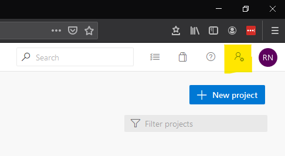

and select the *Personal access tokens* option.

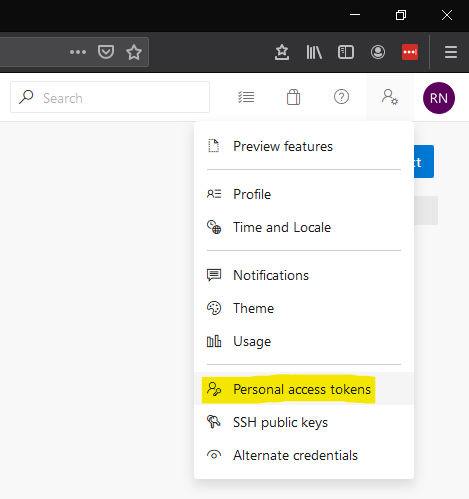

Add a new token, give it a new, define the duration it will be valid and define the access scope. For the latter, the *Full Acces* option will be okay to get started. In a reallife situation, you will, of course, make sure to limit the access to resources in your project as much as possible.

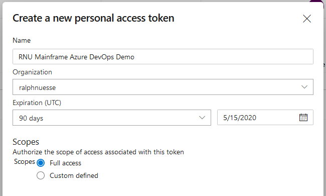

And create the token.

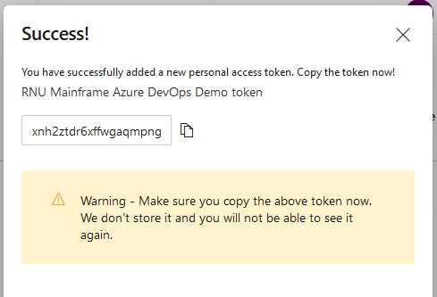

::: warning
Make sure to save a copy of the PAT generated for you. It will not be possible to retrieve the token at a later time. If you loose the token, you need to re-generate a new token.
:::

### Create `authorization` header for the PAT

Within a rest call, the PAT needs to be passed in encrypted form via the `authorization` header of the http request. While there are several ways, to get the encrypted version, one way is by using a REST request testing tool like Google's Advanced Rest Client (ARC). In the tool, create an `authorization` header for any request and use the *pencil* button to provide the credentials you would like to be encrypted. For you Azure DevOps PAT the user id and password to use are both the PAT.

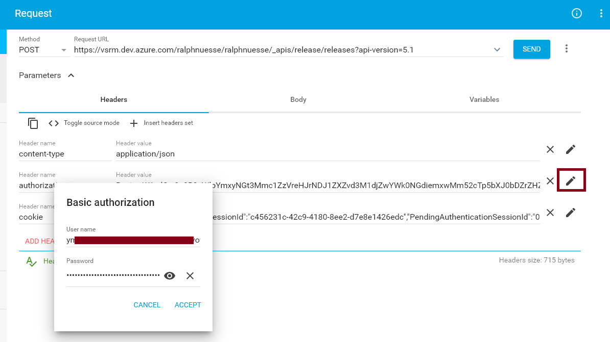

## Download and configure local agent

Since the pipelines rely on the use of the Topaz Command Line Interface it will be necessary to install the CLI on at least one of the agents in use for the pipelines. This means that a local [self hosted agent](https://docs.microsoft.com/en-us/azure/devops/pipelines/agents/agents?view=azure-devops&tabs=browser#install) will be required. Follow the instructions on which version to download, how to install and how to configure.

::: tip Note
During configuration of the agent you will need the PAT defined [previously](#personal-access-token-pat).
:::

### Agent pool

During configuration of the agent you will add it to one of your Agent pools. Agent pools can be reviewed and maintained using the *Organization settings* or *Project settings* in the lower left hand corner.

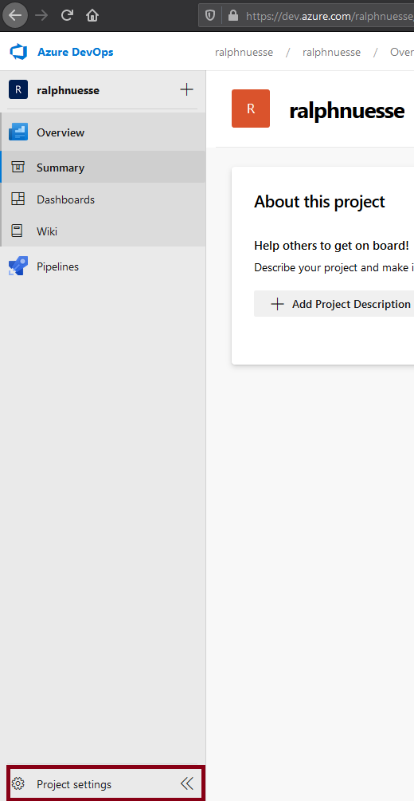

Once selected, you will find the entry *Agent pools" underneath the *Pipelines* heading. Selecting the *Agent pools* entry will display at least two lists of pools. *Azure pipelines* which contains definitions for agents executing in the Azure cloud, and a second entry for local *self hosted agents*. In the example the name of that pool is *Default*.

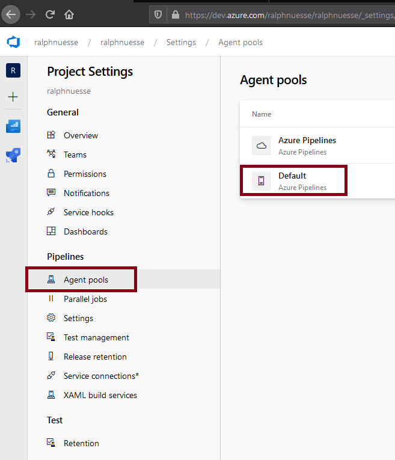

Selecting this pool and selecting the option *Agents" will show the list of all agents defined to this pool and their current status. In the example the agent is *Offline*, meaning the the agent has not been started yet.

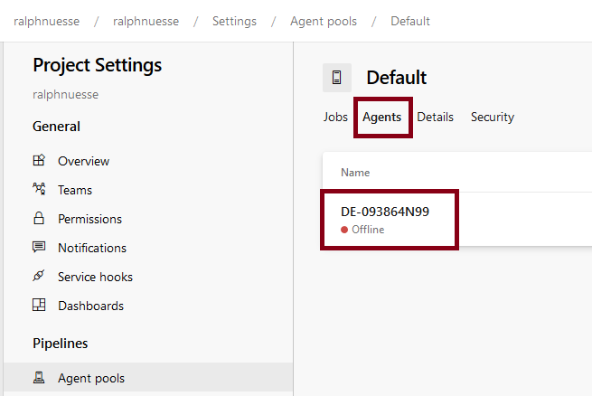

To start a local agent you can use the `run.cmd` files located in the root folder of the agent's installation.

## Define Variable Group

Variable groups allow defining and storing default values that can be used by more than one pipeline. Using variable groups saves from having to define the same variables over and over again. The example uses a variable group. Such a group can be defined by selecting your project, clicking the *Pipeline* selection on the left and selecting the *Library* option.

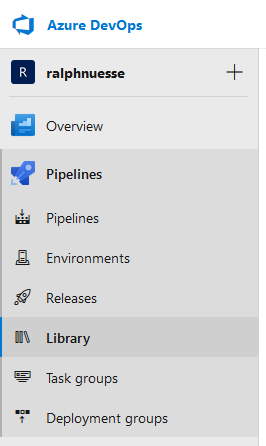

The example uses a variable group named *mainframe-pipeline-parameters* and contains the following variables. Some of these variables are defined as *secret* making them invisible both in the interface as well as in the execution logs.

:::tip Note
Make sure to *Allow access to all pipelines* in order to be able to make use of the variables define in a group.
:::

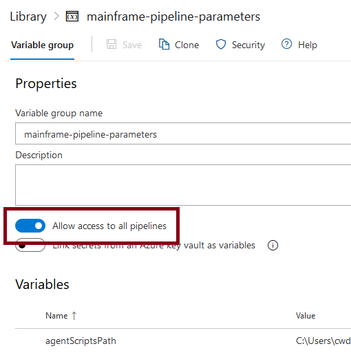

Name | Description | secret
---- | ----------- | ------
agentScriptsPath | Folder containing the [Powershell scripts](./powershell_scripts.md) on the machine the agent executes on  | N
azureOrganization | Azure DevOps organization this variable group belongs to
azureRestAddress | Base URL for the use of the [Azure DevOps REST API](https://docs.microsoft.com/en-us/rest/api/azure/devops/?view=azure-devops-rest-5.1&viewFallbackFrom=azure-devops) | N
ccRepo | Xpediter Code Coverage repository to use | N
ccTestId | Xpediter Code Coverage test id to use | N
cesToken | CES token to be used for [ISPW REST API](../../apis/rest_api.md) calls | Y
cesUri | The URL for CES | N
cliPath | Location of the Topaz CLI in the machine the local agent executes on | N
gitProject | Git(Hub) project that the pipelines are connected to (storing the Topaz for Total Test projects) | N
hostCodePage | Mainframe code page in use | N
hostPassword | Host password | Y
hostPort | TCP port HCI is communicating on | N
hostUri | Host name or IP address of the mainframe LPAR to connect to
hostUser | Host (TSO) user id to logon to the mainframe | Y
ispwConfig | ISPW configuration | N
ispwServer | ISPW Server (usually same as ispWConfig)
releaseDefinitionId | Azure DevOps internal [id of the release pipeline definition](#determining-values-for-ids-in-rest-calls)
sonarAuthorization | `authorization` header for the http request (including the 'Basic ' part of the header), i.e. SonarQube access token [encrypted similarly to the Azure PAT](#personal-access-token-pat)
sonarScannerPath | Folder containing the Sonar SCanner installation on the machine the local agent executes on
sonarServer | URL for the SOnarQube server
tttEnvironment | Id for a Topaz for Total Test Functional Test environment, to execute functional test scenarios
workspaceRoot | Folder on the machine the local agent executes on, to be used as workspace during pipeline execution

## Create a build pipeline

Open your project, select the *Pipelines* entry and create a *New pipeline*. Azure DevOps pipelines assume that they are connected to a source repository. Therefore, you will be asked to point to the repository storing your code. In a mainframe situation this is likely not a repository storing mainframe code, but still you can connect the pipeline to the repository storing Topaz for Total Test projects. The selection process will depend on the specific SCM you choose. For example, when using GitHub, the dialog will list all GitHub repositories you have been active recently as a contributor.

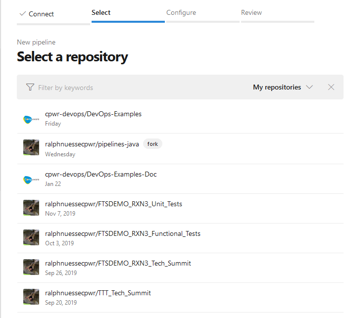

Once connected to the repository (you may be asked for permission to use Azure DevOps for the GitHub repo) select the *Starter pipeline*, since we will build the `yaml` file (describing the pipeline) from scratch and not use an existing one.

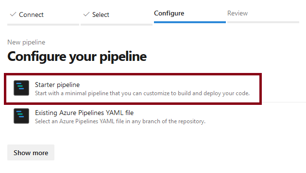

### Define pipeline specific variables / parameters

In addition to the variables from the group [*mainframe-pipeline-parameters*](#define-variable-group), the pipeline uses the following variables. Define them by clicking the *Variables* button in the pipeline definition. As with the variable group, you can and should define some variables a *secret*.

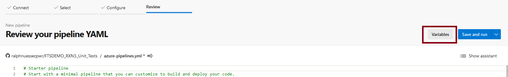

Variable | Description | Secret Value
-------- | ----------- | ------------
`azureRestAuthorization` | `authorization` header for the http request (including the 'Basic ' part of the header), i.e. your [encrypted Azure DevOps PAT](#personal-access-token-pat) | Y
`ispwApplication` |  ISPW application (passed into the process by the [ISPW webhook](#define-ispw-webhook)) | N
`ispwContainerName` |  ISPW container name (passed into the process by the [ISPW webhook](#define-ispw-webhook)) | N
`ispwContainerType` |  ISPW container type (passed into the process by the [ISPW webhook](#define-ispw-webhook)) | N
`ispwLevel` |  ISPW level (passed into the process by the [ISPW webhook](#define-ispw-webhook)) | N

:::tip Note
The `ispwLevel` being passed into the pipeline will be the level the components originated from when triggering a promote, i.e. it will be a `DEV` level. After the promote, components will reside at a `QA` level, though. This means, we will have to determine the tight `QA` level during the execution based on the `DEV` level. 
:::

### Create pipeline `yaml`

You may use the [example pipeline `yaml` file](https://github.com/cpwr-devops/DevOps-Examples/blob/master/src/misc-examples/AzureDevOps/PipelineYAML/mainframe_ispw.yaml), which we will describe in detail, below, as a starting point and adapt to your needs. Refer to the Azure DevOps documentation for details on [how to define the pipeline elements](https://docs.microsoft.com/en-us/azure/devops/pipelines/process/runs?view=azure-devops).


## The pipeline `yaml`

Azure DevOps pipelines allow triggering by events within the underlying SCM, e.g. "every time a changegets pushed to the `master` banch. In our case, the SCM is ISPW, and we will trigger the pipeline using [ISPW webhooks](#define-ispw-webhook). Therefore, we us no trigger

```yml
trigger: none
```

### Agent pool
The agent pool allows specifying requirements for an agent to fulfill in order to be elligible for execution. In our case, we need to run on the only existing local agent, which resides in the `Default` agent pool.

```yml
pool:
  name: 'Default'
```

### Variables / Constants
Next to the [variables defined via the interface](l#define-pipeline-specific-variables-parameters), the pipeline will use the [variable group `mainframe-pipeline-parameters`](#define-variable-group) and some additional variables that are used as constants. Refer to the Azure DevOps documentation on [how to define and use variables in pipelines](https://docs.microsoft.com/en-us/azure/devops/pipelines/process/variables?view=azure-devops&tabs=yaml%2Cbatch).

```yml
variables:
- group: 'mainframe-pipeline-parameters'
- name: 'gitRepo'
  value: 'FTSDEMO_$(ispwApplication)_Unit_Tests'
- name: 'ccSystem'
  value: 'AZURE_$(ispwContainerName)'
- name: 'ccDdio'
  value: 'SALESSUP.$(ispwApplication).$(ispwLevel).LOAD.SSD'
- name: 'sonarProjectName'
  value: 'RNU_$(ispwApplication)_Azure'
- name: 'sonarSources'
  value: '.\$(ispwApplication)\MF_Source'
```

### Stages, jobs, tasks

As with Jenkins jobs, there are different elements that help structure the pipeline. Also, they allow defining conditions under which certain tasks get executed, based on results of previous jobs. Refer to the Azure DevOps documentation on [details about stages, jobs and tasks](https://docs.microsoft.com/en-us/azure/devops/pipelines/process/phases?view=azure-devops&tabs=yaml)

```yml
stages:
```
### Stage `preparation`

The `preparation` stage clears the workspace to use and downloads the required assets, like sources from ISPW and the Topaz for Total Test projects from GitHub.

```yml
- stage: preparation
  displayName: Preparation
  jobs:
```

**Job `getAssets`**

```yml
  - job: getAssets
    displayName: Get Assets from Mainframe and GitHub
    steps:
```

Execute an inline Powershell script. This script will take the `ispwLevel` passed by the webhook (`DEV1`, `DEV2`, or `DEV3`), determine the name of the corresponding `QA` level and create a new variable (`echo "##vso[task.setvariable variable=ispwTargetLevel]$ispwTargetLevel"`). This latter is necessary, since normal variable definition does not allow this kind of calculation. Therefore, we need to [define a new variable during execution](https://docs.microsoft.com/en-us/azure/devops/pipelines/process/variables?view=azure-devops&tabs=yaml%2Cbatch#set-variables-in-scripts)

```yml{9}
    - task: PowerShell@2
      displayName: Determine ISPW Target Level
      name: setTargetLevel
      inputs:
        targetType: 'inline'
        script: |
          $ispwTargetLevel = 'QA' + '$(ispwLevel)'.Substring('$(ispwLevel)'.Length - 1, 1)
          Write-Host 'Determined Level ' $ispwTargetLevel
          echo "##vso[task.setvariable variable=ispwTargetLevel]$ispwTargetLevel"
```

Execute Powershell script [`Clear_Workspace.ps1`](./powershell_scripts.md#clear-workspace-ps1) to clear the designated workspace on the agent.

```yml{4}
    - task: PowerShell@2
      displayName: Clear Workspace
      inputs:
        filePath: '$(agentScriptsPath)\Clear_Workspace.ps1'
        arguments: '$(workspaceRoot)'
```

Execute Powershell script [`ISPW_Download_Container.ps1`](./powershell_scripts.md#ispw-download-container-ps1) to download the components in the ISPW container passed by the webhook.

```yml{4}
    - task: PowerShell@2
      displayName: Download sources for assignment
      inputs:
        filePath: '$(agentScriptsPath)\ISPW_Download_Container.ps1'
        arguments: '$(workspaceRoot) $(hostUri) $(hostPort) $(hostUser) $(hostPassword) $(hostCodePage) $(ispwConfig) $(ispwContainerName) $(ispwContainerType) $(ispwTargetLevel) $(cliPath)'
```

Execute Powershell script [`Git_Clone_TTT_Repo.ps1`](./powershell_scripts.md#git-clone-ttt-repo-ps1) to clone the GitHub repository storing the Topaz for Total Test projects.

```yml{4}
    - task: PowerShell@2
      displayName: Get Unit Tests
      inputs:
        filePath: '$(agentScriptsPath)\Git_Clone_TTT_Repo.ps1'
        arguments: '$(workspaceRoot) $(gitProject)/$(gitRepo)'
```

### Stage `tests`

This stage executes the downloaded tests and gets the Code Coverage results.

```yml
- stage: tests
  displayName: Tests
  jobs:
```

**Job `runTests`**

```yml
  - job: runTests
    displayName: Run unit tests and get results
    steps:
```

Execute Powershell script [`TTT_Run_Tests.ps1`](./powershell_scripts.md#sonar-check-quality-gate-ps1) to execute the tests. The script will execute only tests for those components that have been downloaded for the container.

```yml{4}
    - task: PowerShell@2
      displayName: Execute Unit Tests
      inputs:
        filePath: '$(agentScriptsPath)\TTT_Run_Tests.ps1'
        arguments: '$(workspaceRoot) $(hostUri) $(hostPort) $(hostUser) $(hostPassword) $(hostCodePage) $(ispwApplication) $(ispwLevel) $(ccRepo) $(ccSystem) $(ccTestId) $(cliPath)'
```

Execute Powershell script ['Code_Coverage_Download_Metrics.ps1'](./powershell_scripts.md#code-coverage-download-metrics-ps1) to download the Code COverage results from the mainframe repository to the workspace.

```yml{4}
    - task: PowerShell@2
      displayName: Get Code Coverage Results
      inputs:
        filePath: '$(agentScriptsPath)\Code_Coverage_Download_Metrics.ps1'
        arguments: '$(workspaceRoot) $(hostUri) $(hostPort) $(hostUser) $(hostPassword) $(hostCodePage) $(ispwApplication) $(ccRepo) $(ccSystem) $(ccTestId) $(ccDdio) $(cliPath)'
```
### Stage `qualityGate`

This stage will pass the results to SonarQube, query the quality gate status and based on the result, if the quality was `passed`, trigger the corresponding release pipeline, or regress the assigment, if the quality gate was `failed`.

```yml
- stage: qualityGate
  displayName: Quality Gate
  jobs:
```

**Job `sonar`**

The job will execute the Sonar scanner and query the quality gate.

```yml
  - job: sonar
    displayName: run Sonar Scan, Check Quality Gate
    steps:
```

Execute Powershell script [`Sonar_Scan.ps1`](./powershell_scripts.md#sonar-check-quality-gate-ps1) to pass sources, test results and code coverage data to SonarQube, using the sonar scanner.

```yml{4}
    - task: PowerShell@2
      displayName: Run Sonar Scanner
      inputs:
        filePath: '$(agentScriptsPath)\Sonar_Scan.ps1'
        arguments: '$(workspaceRoot) $(ispwApplication) $(sonarProjectName) $(sonarSources)'
```

**Job `checkQualityGate` (conditional)**

This job is executed based on the condition, that the job `sonar` ran successfully.

```yml{3}
  - job: checkQualityGate
    displayName: Check Quality Gate
    dependsOn: sonar
    steps:
```

Execute Powershell script [`Sonar_Check_Quality_Gate.ps1`](./powershell_scripts.md#sonar-check-quality-gate-ps1) to query the status of the Sonar quality gate.

```yml{4}
    - task: PowerShell@2
      displayName: Check Sonar Quality Gate
      inputs:
        filePath: '$(agentScriptsPath)\Sonar_Check_Quality_Gate.ps1'
        arguments: '$(sonarServer) $(sonarProjectName) $(sonarAuthorization)'
```

**Job `triggerRelease` (conditional)**

This job is executed based on the condition, that the job `checkQualityGate` ran successfully, and will trigger the release pipeline.

```yml{3,4,5}
  - job: triggerRelease
    displayName: Trigger Release Pipeline
    dependsOn: 
    - checkQualityGate
    condition: succeeded('checkQualityGate')
    steps:
```

Again, determine the `QA` level based on the `DEV` level. 

:::tip Note
Per default variables are not 'visible' across job boundaries. Therefore, we need to set the variable again for this job.
:::

```yml
    - task: PowerShell@2
      name: setTargetLevel
      displayName: Determine ISPW Target Level
      inputs:
        targetType: 'inline'
        script: |
          $ispwTargetLevel = 'QA' + '$(ispwLevel)'.Substring('$(ispwLevel)'.Length - 1, 1)
          Write-Host 'Determined Level ' $ispwTargetLevel
          echo "##vso[task.setvariable variable=ispwTargetLevel]$ispwTargetLevel"
```

Execute Powershell script [`Azure_Trigger_Release.ps1`](./powershell_scripts.md#azure-trigger-release-ps1) to trigger an Azure DevOps release pipeline(##create-a-release-pipeline).

```yml{4}
    - task: PowerShell@2
      displayName: Trigger Release
      inputs:
        filePath: '$(agentScriptsPath)\Azure_Trigger_Release.ps1'
        arguments: '$(azureRestAddress) $(azureOrganization) $(System.TeamProject) "$(azureRestAuthorization)" $(ispwApplication) $(ispwContainerName) $(ispwContainerType) $(ispwTargetLevel) $(releaseDefinitionId)'
```

**Job `regressAssigment` (conditional)**

This job is executed based on the condition, that the job `checkQualityGate` failed, and will regress the ISPW assigment.

```yml{2,3,4}
  - job: regressAssignment
    dependsOn: 
    - checkQualityGate
    condition: failed('checkQualityGate')
    steps:
```

Again, determine the `QA` level based on the `DEV` level. 

:::tip Note
Per default variables are not 'visible' across job boundaries. Therefore, we need to set the variable again for this job.
:::

```yml
    - task: PowerShell@2
      displayName: Determine ISPW Target Level
      name: setTargetLevel
      inputs:
        targetType: 'inline'
        script: |
          $ispwTargetLevel = 'QA' + '$(ispwLevel)'.Substring('$(ispwLevel)'.Length - 1, 1)
          Write-Host 'Determined Level ' $ispwTargetLevel
          echo "##vso[task.setvariable variable=ispwTargetLevel]$ispwTargetLevel"
```

Execute Powershell script [`ISPW_Operations.ps1`](./powershell_scripts.md#ispw-operations-ps1) to regress the ISPW assigment

```yml{4}
    - task: PowerShell@2
      displayName: Regress Assignment
      inputs:
        filePath: '$(agentScriptsPath)\ISPW_Operations.ps1'
        arguments: 'ContainerOperation $(cesUri) $(ispwConfig) assignments regress $(ispwContainerName) $(ispwTargetLevel) $(cesToken) FTSDEMO $(ispwApplication) $(ispwServer)'
```

## Create a release pipeline

Open your project, select the *Releases* entry and create a *New* pipeline.

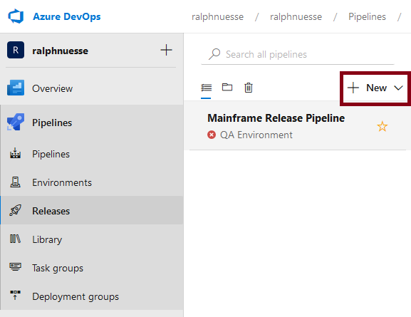

In the dialog do not select a template and start with any *Empty job*.

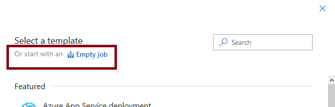

Like build pipelines, release pipelines consist of stages, jobs and tasks. Other than build pipelines, they are usually defined using the UI instead of coding the `yaml` file directly. (Even though the same `yaml` syntax is being generated and used in the background).
Give the first stage a name, e.g. `QA environment.

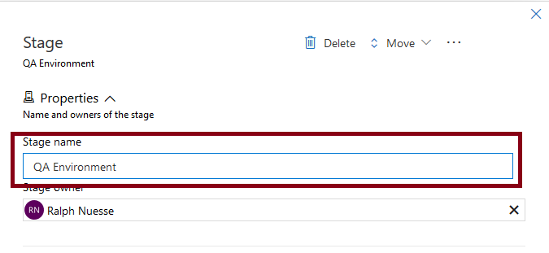

The stage will be generated containing one empty job. Select job to edit it and add tasks to it.

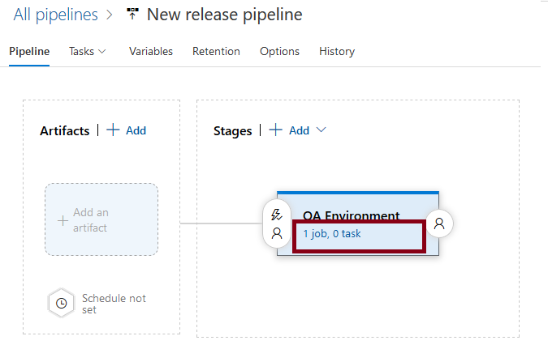

For demonstration purposes (in order to be able to intervene), we would like to add a manual task, that allows to decide if the release is to be resumed or cancelled once it has been triggered. Manual tasks require to be executed on the server in an agentless job, while the job created initially is a agent job. Therefore, we need to add a new, agentless job.

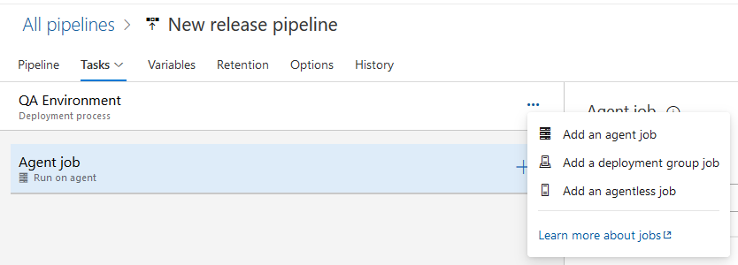

Move the job to the top location (making it the first job in the pipeline), give it a name, e.g. 'Prepare' and use the 'plus' sign to add a task to this job.

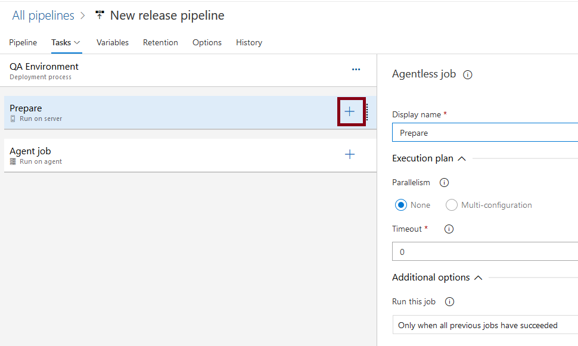

From the list of tasks, select *Manual intervention* and add it

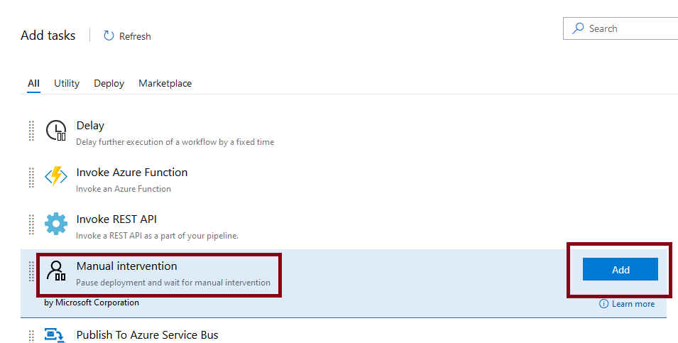

Select the task, give it a name, and add yourself as user to notify.

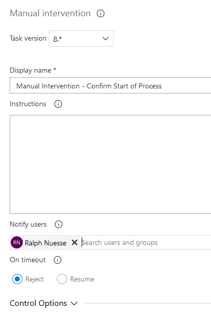

Select the Agent job to modify its settings and to add tasks to it. Especially, in the settings make sure to run it on the local agent pool, using the *Agent pool* dropdown.

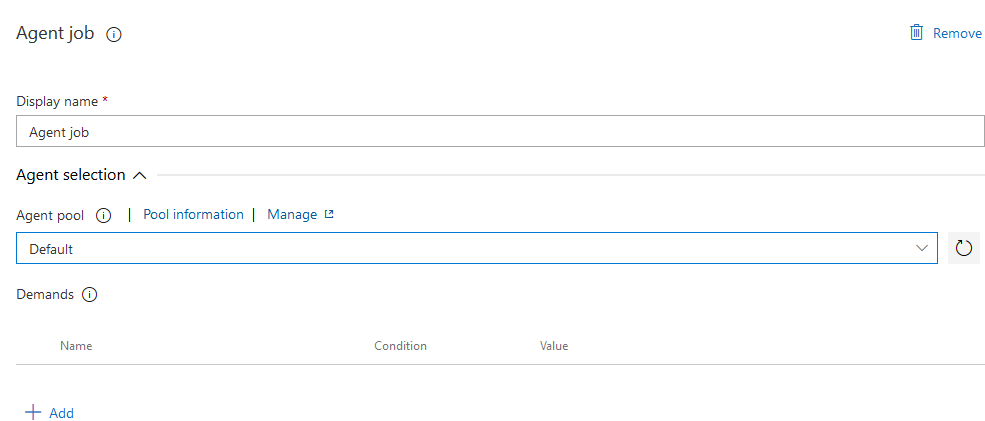

As with the agentless job before, use the 'plus' sign to add the following tasks. All tasks are going to be "Powershell" tasks, meaning the process to define will be the same for each task. First search for 'powershell' in the task list, select the 'PowerShell' entry and use the 'Add' button.

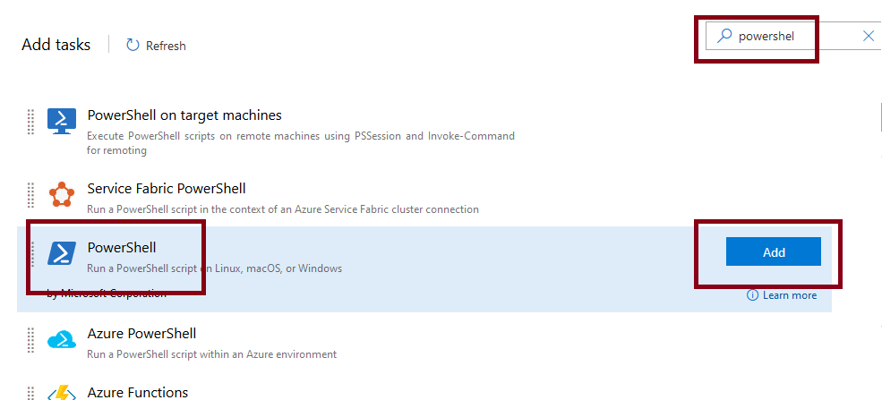

For all tasks to define, set the *Script path* to `$(agentScriptsPath)` followed by the name of the Powershell script to use, e.g. `$(agentScriptsPath)\Clear_Workspace.ps1` and the *Arguments* to the values defined shown below. 

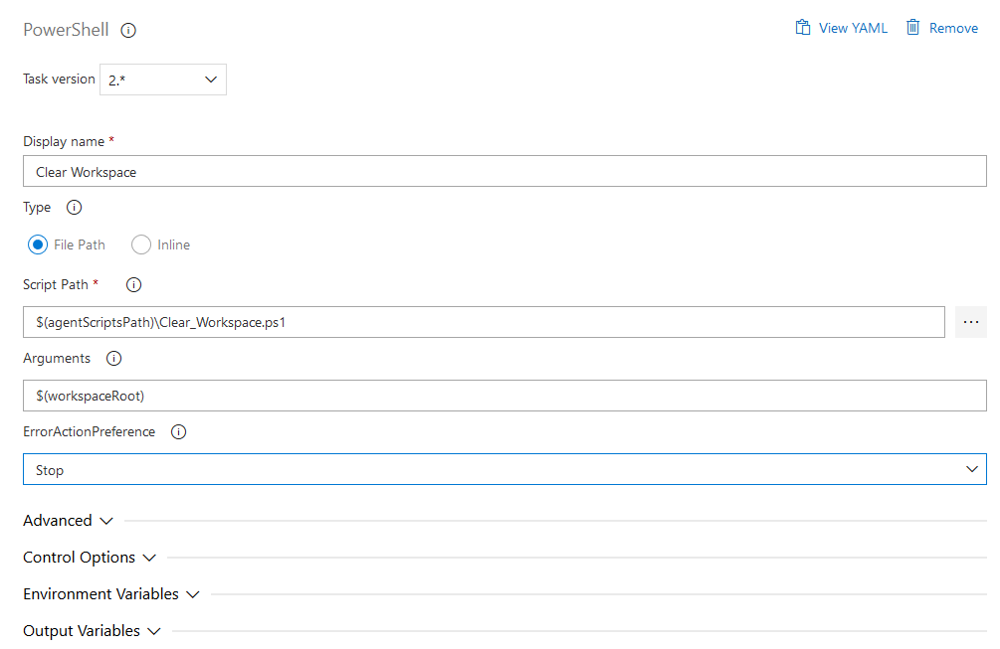

:::tip Note
Ultimately, the use of variables in the definitions, requires [defining the corresponding variables for the release pipeline](#define-release-pipeline-specific-variables-parameters).
:::

Task | Script | Arguments | Description
---- | ------ | --------- | -----------
Clear Workspace | [`Clear_Workspace.ps1`](./powershell_scripts.md#clear-workspace-ps1) | `$(workspaceRoot)` | clear the designated workspace on the agent
Get Sources | [`ISPW_Download_Container.ps1`](./powershell_scripts.md#ispw-download-container-ps1) | `$(workspaceRoot) $(hostUri) $(hostPort) $(hostUser) $(hostPassword) $(hostCodePage) $(ispwConfig) $(ispwContainerName) $(ispwContainerType) $(ispwLevel) $(cliPath)`| Download the sources for the components from ISPW
Get Functional Tests | [`Git_Clone_TTT_Repo.ps1`](./powershell_scripts.md#git-clone-ttt-repo-ps1) | `$(workspaceRoot) ralphnuessecpwr/FTSDEMO_$(ispwApplication)_Functional_Tests` | Clone a Git repository containing Topaz for Total Test Functional Test scenarios (the second parameter points to the GitHub project and repository and will require modification)
Run Functional Tests | [`TTT_Run_Functional_Tests.ps1`](./powershell_scripts.md#ttt-run-functional-tests-ps1) | `$(workspaceRoot) $(cesUri) $(hostUser) $(hostPassword) $(ispwApplication) $(tttEnvironment) $(cliPath)` | Execute the Functional Test scenarios
Promote code to STG | [`ISPW_Operations.ps1`](./powershell_scripts.md#ispw-operations-ps1) | `ContainerOperation $(cesUrl) $(ispwConfig) assignments promote $(ispwContainerName) $(ispwLevel) $(cesToken) FTSDEMO $(ispwApplication) $(ispwServer)` | Promote the code to the next level in ISPW

### Define release pipeline specific variables / parameters

To make use of the variables in the [variable group `mainframe-pipeline-parameters`](#define-variable-group) and to define 'parameters', select *Variables* on the pipeline definition. Select *Variable groups*, click *Link variable group* and add the *mainframe-pipeline-parameters*.

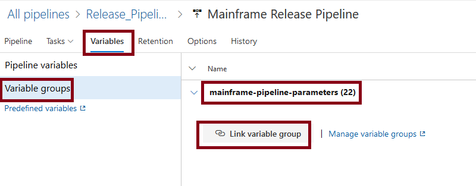

Next select *Pipeline variable* and add the following variables, making them all *Settable at release time*.


Variable | Description
-------- | -----------
`ispwApplication` |  ISPW application (passed into the process by the [ISPW webhook](#define-ispw-webhook))
`ispwContainerName` |  ISPW container name (passed into the process by the [ISPW webhook](#define-ispw-webhook))
`ispwContainerType` |  ISPW container type (passed into the process by the [ISPW webhook](#define-ispw-webhook))
`ispwLevel` |  ISPW level (passed into the process by the [ISPW webhook](#define-ispw-webhook))

## Define ISPW Webhook

Last we need to define the [ISPW webhook in CES](../../tool_configuration/webhook_setup.md) to be able to trigger the build pipeline based on a promote in an ISPW application. The principles and triggering conditions are the same as for the Jenkins examples. The URL for the http request, the headers to use and the body will be different, though.

### URL for the http request

The URL will be `https://dev.azure.com/{organization}/{project}/_apis/build/builds?api-version=5.1` with `organization` being the name of your Azure DevOps organization and the `project` the name of the project containing the build pipeline.

### Headers

You will need headers for
- `content-type` set to `application/json`
- `authorization` set to `Basic ` followed by the [encryption of your Personal Access Token](#personal-access-token-pat).

### Body

The body will have to look like the following

```json
{
    "definition": {
        "id": 2
    },
    "project": {
        "id": "00c89c7a-d744-4376-a334-6ded05cc242c"
    },
    "parameters":"{\"ispwApplication\":\"$$application$$\",\"ispwContainerName\":\"$$assignment$$\",\"ispwContainerType\":\"0\",\"ispwLevel\":\"$$level$$\"}"
}
```

with
- `"definition"` pointing to the [definition ID of the build pipeline](#determining-values-for-ids-in-rest-calls) you want to trigger
- `"project"` pointing to the [ID of the project containing your pipeline](#determining-values-for-ids-in-rest-calls)
- `"parameters"` using a JSON string which lists the pairs of pipeline variables and values to use during the execution of the pipeline

This latter is how to pass values to the parameter of the pipeline via REST calls. The `$$value$$` values are passed by the ISPW webhook.

## Determining values for Ids in REST calls

As seen above, the REST call bodies require the use of internal ids for pipeline and projects. Maybe the simplest way to find out these ids, is by using other [REST calls](https://docs.microsoft.com/en-us/rest/api/azure/devops/?view=azure-devops-rest-5.1). The responses of these calls will contain the required information.

:::tip Note
For all these calls you will require the `authorization` [header for your Azure DevOps PAT]((#personal-access-token-pat)).
:::

Following the [instructions](https://docs.microsoft.com/en-us/rest/api/azure/devops/build/definitions/list?view=azure-devops-rest-5.1), for the example build pipeline in use here, using the `name` parameter to filter by name of the pipeline, the REST call will be a GET call:
```http
https://dev.azure.com/ralphnuesse/ralphnuesse/_apis/build/definitions?api-version=5.1&name=ralphnuessecpwr.mainframe_ispw
```

The result will look similar to the following. The important information can be found at the highlighted rows:

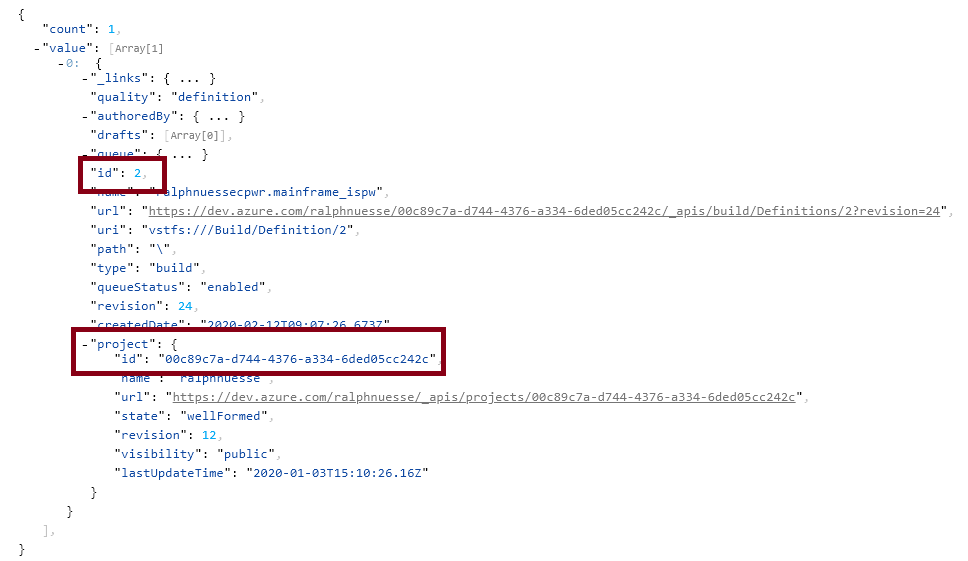

Following the [instructions](https://docs.microsoft.com/en-us/rest/api/azure/devops/release/definitions?view=azure-devops-rest-5.1), for the example release pipeline in use here, using the `search-text` parameter to filter by name of the pipeline, the REST call will be a GET call:
```http
https://vsrm.dev.azure.com/ralphnuesse/ralphnuesse/_apis/release/definitions?api-version=5.1&searchText=Mainframe
```

The result will look similar to the following. The important information can be found at the highlighted rows:

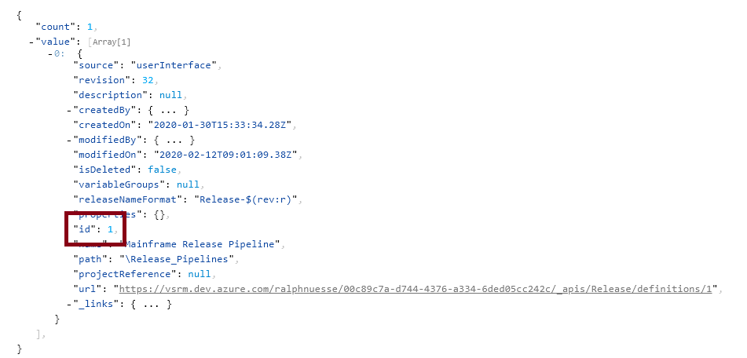
<!--stackedit_data:
eyJoaXN0b3J5IjpbMTEyOTUyODU4Nl19
-->