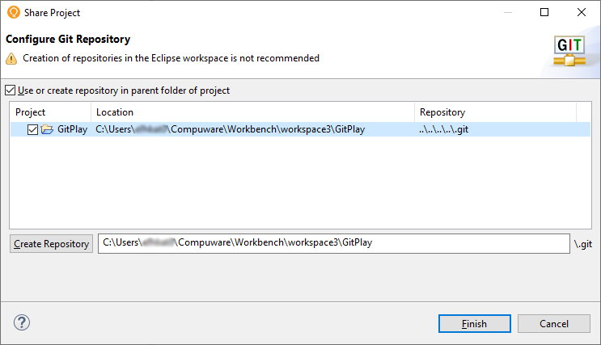
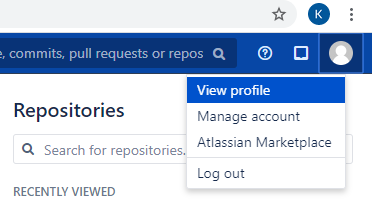
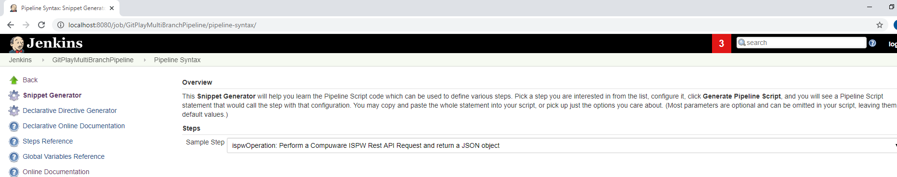
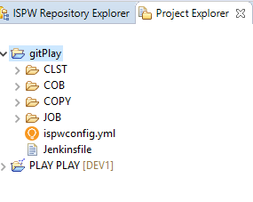
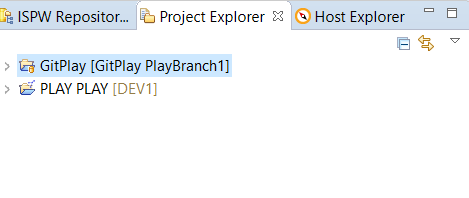
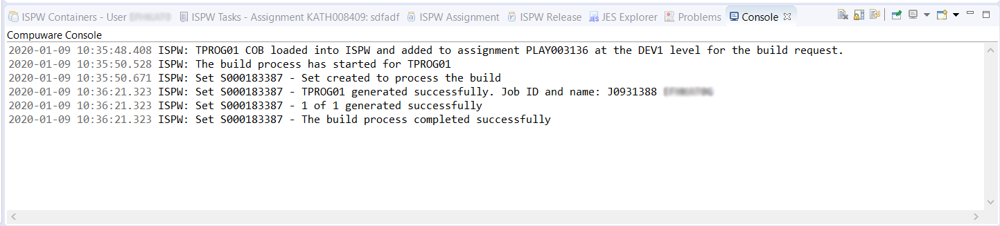
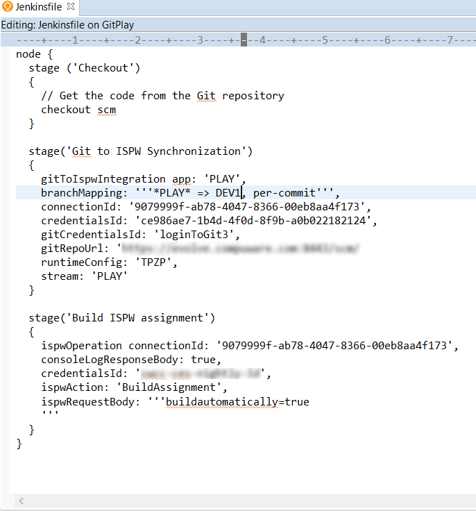
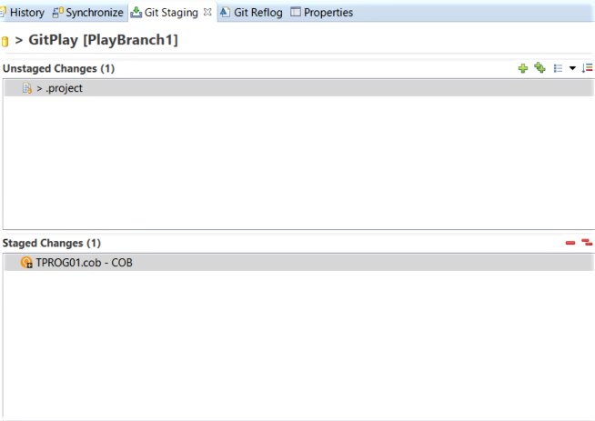

# Git to ISPW Integration Tutorial

This tutorial helps a developer understand the process of how the ISPW and Git synchronization process can be performed. It uses the ISPW training application PLAY to synchronize a change to a component from Git to ISPW. Specifically, after the necessary setup is completed, within Topaz Workbench an ISPW project containing the PLAY application source code is imported to a Git project that is then pushed to the Git repository as the master branch in Bitbucket. Then a new file change is pushed to Git, which then triggers a Jenkins multibranch pipeline job to perform the Git to ISPW integration and perform a build.

There are three sections in this tutorial: *Environment*, *Overview Steps* and *Detailed Steps*.

The *Environment* section describes what environments to use to follow the steps outlined in this tutorial. If a different version of any of the software or plugins are used instead of the versions specified in the *Environment* section, different results may occur than what is shown in this tutorial.

The *Overview Steps* section provides a brief overview of the steps for performing the Git to ISPW integration. This section outlines the following:

- [Set up the environment.](#set-up-the-environment)
- [Set up a Git project with the source, YAML file, and Jenkinsfile, and set up a Jenkins multibranch pipeline.](#set-up-a-git-project-with-the-source-yaml-file-and-jenkinsfile-and-set-up-a-jenkins-multibranch-pipeline)
- [Make a change and build.](#make-a-change-and-build)
- [Submit change to pipeline.](#submit-change-to-pipeline)

The *Detailed Steps* section provides the comprehensive steps to perform the Git to ISPW integration.


## Environment

Topaz Workbench 20.01.01:
 Egit in Eclipse 5.6.0

 Jenkins version 2.190.3:
 Topaz Workbench CLI version 20.01.01
 Compuware Common Configurations Jenkins plugin 1.0.10-SNAPSHOT
 ISPW Operations Jenkins plugin 1.0.8-SNAPSHOT

 Atlassian Bitbucket v5.16.0

 ISPW PLAY application 18.02


## Overview Steps

### **Set up the environment**
<a id="set-up-the-environment"></a>

1. [Install the necessary plugins in Topaz Workbench and Jenkins.](#install-the-necessary-plugins-in-topaz-workbench-and-jenkins)
2. [Verify the ISPW mainframe PLAY application is available.](#verify-the-ispw-mainframe-play-application-is-available)

### **Set up a Git project with the source, YAML file, and Jenkinsfile, and set up a Jenkins multibranch pipeline** 
<a id="set-up-a-git-project-with-the-source-yaml-file-and-jenkinsfile-and-set-up-a-jenkins-multibranch-pipeline"></a>

1. [From Topaz Workbench’s **Project Explorer** view, create a new general project called **GitPlay** and import the ISPW project source.](#_1-create-an-ispw-project-named-play-play)
2. [From Topaz Workbench’s **Project Explorer** view within the GitPlay project, configure the ISPW and Git mapping.](#_2-change-the-ispw-project-properties-to-keep-a-downloaded-copy-of-each-component)
3. [From Topaz Workbench’s **Project Explorer** view, share the GitPlay project as a Git repository to convert the general project to a Git project..](#_3-export-the-project)
4. [From Bitbucket, create a new Git repository named **IspwGitPlayTest**.](#_4-create-a-new-general-project-called-gitplay-and-import-the-ispw-project-source)
5. [In the Jenkins UI, create a multibranch pipeline project using the Jenkinsfile.](#_5-configure-the-ispw-and-git-mapping)
6. [Create a Jenkinsfile, which does a checkout of the source code, performs the Git to ISPW synchronization, and performs a build.](#_6-share-the-gitplay-project-as-a-git-repository-to-convert-the-ispw-project-to-a-git-project)
7. [From Topaz Workbench’s Project Explorer view, import a Jenkinsfile to the root directory of the GitPlay project.](#_7-create-a-new-git-repository-named-ispwgitplaytest)
8. [From Topaz Workbench’s Git Staging view, commit and push the GitPlay project to the master branch in the IspwGitPlayTest repository.](#_8-create-a-multibranch-pipeline-project-using-the-jenkinsfile)

::: tip
If the PLAY application is already in Git but the Jenkins Pipeline is not set up, skip steps 1-7 and proceed to step 8. If the PLAY application is already in Git and the Jenkins Pipeline is set up, skip steps 1-9 and proceed to the next section.

:::

### **Make a change and build**
<a id="make-a-change-and-build"></a>

1. [From Topaz Workbench’s **Project Explorer** view, switch to a new branch named PlayBranch1. ](#_1-switch-to-a-new-branch-named-playbranch1)
2. [From Topaz Workbench’s **Project Explorer** view within the IspwGitPlayTest project, make a change to a Cobol component TPROG01.cob.](#_2-make-a-change-to-a-cobol-component-tprog01-cob)
3. [From Topaz Workbench’s **Project Explorer** view within the IspwGitPlayTest project, perform the build action to verify the source generates successfully along with any impacted components.](#_3-perform-the-build-action-to-verify-the-source-generates-successfully-along-with-any-impacted-components)
4. [From Topaz Workbench’s **Project Explorer** view within the IspwGitPlayTest project, update the Jenkinsfile **Build ISPW Assignment** stage.](#_4-update-the-jenkinsfile-build-ispw-assignment-stage)
   
### **Submit change to pipeline**
<a id="submit-change-to-pipeline"></a>

1. [From Topaz Workbench’s **Git Staging** view, commit and push the changes to Git.](#_1-commit-and-push-the-changes-to-git)
2. [From Jenkins, check the console output of the multibranch pipeline project job to determine whether the synchronization process completed successfully.](#_2-determine-whether-the-synchronization-process-completed-successfully)
3. [From Topaz Workbench, go to the assignment where the component was loaded to verify the updates occurred to the mainframe.](#_3-verify-the-updates-occurred-to-the-mainframe)
   

## Detailed Steps
<a id="install-the-necessary-plugins-in-topaz-workbench-and-jenkins"></a>

### Set up the environment

#### **Install the necessary plugins in Topaz Workbench and Jenkins**

##### <u>Topaz Workbench</u>

Install Egit: Refer to https://www.eclipse.org/egit/download/ for the installation.

##### <u>Jenkins</u>

1. Install Topaz Workbench CLI version 20.01.01 on Windows or Linux according to the following: [http://frontline.compuware.com/doc/KB/KB1802/HTML/TopazWorkbench_Install/Responsive%20HTML5/TopazWorkbench_Install/Install_Topaz_Workbench/Install_Topaz_Workbench.htm](http://frontline.compuware.com/doc/KB/KB1802/HTML/TopazWorkbench_Install/Responsive HTML5/TopazWorkbench_Install/Install_Topaz_Workbench/Install_Topaz_Workbench.htm))
   
   **Update Jenkins configuration for the Topaz Workbench CLI** 
   
   In Jenkins, click **Jenkins**, select **Manage Jenkins**, and then select **Configure System** and set up the [Topaz Workbench CLI location](https://devops.api.compuware.com/tool_configuration/Jenkins_config.html#compuware-configurations) and a host connection.

2. Compuware Common Configurations Jenkins. For the installation, refer to https://devops.api.compuware.com/tool_configuration/plugins.html#compuware-common-configuration.

3. ISPW Operations Jenkins plugin. For the installation, refer to https://devops.api.compuware.com/tool_configuration/plugins.html#compuware-ispw-operations-plugin.
<a id="verify-the-ispw-mainframe-play-application-is-available"></a>

#### **Verify the ISPW mainframe PLAY application is available** 

Verify the ISPW PLAY application was installed as part of the ISPW install. It is installed as part of the Training Application delivered in the ISPW SAMPLIB that is as part of the Installation Verification Process (IVP). 

If the following steps can be executed successfully, then the PLAY application was successfully installed in the ISPW instance based on the host connection.  

If you are unable to locate the PLAY application, refer to the *ISPW Installation and Configuration Guide* section entitled *Installation Verification Procedures*, which includes information on installing the ISPW mainframe PLAY application. The *ISPW Installation and Configuration Guide* can be found at go.compuware.com.

1. In Topaz Workbench, open the **ISPW** perspective. From the **Window** menu, select **Open Perspective>Other**. The **Open Perspective** dialog box appears. Select **ISPW** and click **OK**. The **ISPW Repository Explorer** view appears.

   **Note:** The **ISPW Repository Explorer** view is visible by default. If it is not visible, from the **Window** menu, select **Show View>Other**. The **Show View** dialog box appears. Toggle open **ISPW**, select the **ISPW Repository Explorer** view, and click **OK**. 

2. Do the following:

   - From the **Stream** list, select **PLAY**. 
   - From the **Application** list, select **PLAY**. 
   - From the **Level** list, select **DEV1**. 
   - From the **Level option** list, select **First found in level and above.**

3. Click **Apply**. A filtered list of the components within the PLAY application appears. 

::: tip
If you are not logged into a host connection where the ISPW PLAY application is installed, you will be prompted when you select any list in the **ISPW Repository Explorer** view. 

:::
<a id="_1-create-an-ispw-project-named-play-play"></a>

### Set up a Git project with the source, YAML file, and Jenkinsfile, and set up a Jenkins multibranch pipeline


#### **Create a new general project called GitPlay and import the ISPW project source**

1. In Topaz Workbench’s **Project Explorer** view, from the **File** menu, select **New>Project**. The **New Project** wizard appears. 
2. Toggle open the **General** node, select **Project**, and click **Next**. The **New Project** page appears.
3. In the **Project** name field, enter **GitPlay** and click **Finish**.
   <a id="_2-change-the-ispw-project-properties-to-keep-a-downloaded-copy-of-each-component"></a>

#### Configure the ISPW and Git mapping

1. In Topaz Workbench’s **Project Explorer** view, right-click the **GitPlay** project node and select **Configure>Configure to Use ISPW**. The **Configure ISPW and GIT Mapping** wizard appears.

2. From the **Host** list, select the host where the PLAY application is located, or click **Configure** to configure a host. Compuware recommends using the fully qualified domain name when configuring the host.

3. In the **Runtime Configuration** field, enter the runtime configuration if not using the default ISPW instance.

4. Click **Next**. The next page of the wizard appears.

5. From the **Stream** list, select **PLAY**.

6. From the **Application** list, select **PLAY**.

7. From the **Level** list, select the level used when doing a build. 

8. From the **Download source from path** list, choose the level from which to download source for the project.

9. In the **YAML mapping file location** field, enter or browse to the project folder in which to create the YAML mapping file. By default, the location is the root of project.

10. Click **Finish**. The source is downloaded. The ispwconfig.yml file is created and added to the root of the GitPlay project in the **Project Explorer view**. The **Console** view shows the activity and the **Project Explorer** view shows the downloaded files.

    

11. To examine the contents of the ispwconfig.yml file, right-click the file and select **Open**. 

    

         ,,,   !!com.compuware.ispw.cli.model.IspwRoot
             ispwApplication:
               application: PLAY
               host: somehost.example.com
               pathMappings:
               - path: \CLST
             types:
             - fileExtension: clst
               ispwType: CLST
                 - path: \COB
             types:
             - fileExtension: cob
               ispwType: COB
                 - path: \COPY
             types:
             - fileExtension: copy
               ispwType: COPY
                 - path: \JOB
             types:
             - fileExtension: job
               ispwType: JOB
                 port: 12345
                 runtimeConfig: TPZP
                 stream: PLAY
             ,,,

12. Refer to the *ISPW to GIT Integration: ISPW YAML Configuration File* for information on the available ISPW property settings and path mappings that can be in the ispwconfig.yml file.

     

     <a id="_3-export-the-project"></a>

#### **Share the GitPlay project as a Git repository to convert the ISPW project to a Git project**

1. In Topaz Workbench’s **Project Explorer** view, right-click the **GitPlay** project node and select **Team>Share Project**. The **Share Project** dialog box appears.

2. Select the project from the list.

   

   

4. Click **Use or create repository in parent folder of project**.

5. Click **Create Repository**.

6. Click **Finish**.

   <a id="_4-create-a-new-general-project-called-gitplay-and-import-the-ispw-project-source"></a>

#### Create a new Git repository named IspwGitPlayTest

1. Go to the Bitbucket Server.

2. To create a personal repository, click your profile and select View profile, then select Create repository.

   
   

<a id="_5-configure-the-ispw-and-git-mapping"></a>

#### Create a multibranch pipeline project using the Jenkinsfile

1. In the Jenkins UI, click **Jenkins** and select **New Item**.
2. In the **Enter an item name** field, enter the name for a multi-branch pipeline project.
3. Select **Multibranch Pipeline** for the list.
4. Click **OK**.
5. Optionally, on the **General** tab for configuring the pipeline just created, enter the display name and description.
6. Select the **Branch Sources** tab, click **Add source**, and select **Git** from the list.
7. In the **Project Repository** field, enter the project repository URL and, in the **Credentials** field, enter the credentials if the account is private. The project repository URL can be found in the Bitbucket Repository Settings of the IspwGitPlayTest repository in the **Name** field.
8. Select the **Build Configuration** tab. The **Mode** field should already be set to by **Jenkinsfile** and the **Script Path** should be set to **Jenkinsfile**. In a later step, the Jenkinsfile will be created at the root of the project where this setting expects it to be located. Therefore, do not make any further changes on this tab. 
    Select the **Scan Multibranch Pipeline Triggers** tab. Select the **Periodically if not otherwise run** check box and set the **Interval** field to 1 minute. 
9. Click **Save**. A **Scan Multibranch Pipeline Log** appears. If the pipeline was set up correctly, **Finished: SUCCESS** will appear at the end of the log.

#### **Create a Jenkinsfile**

This step implements a Jenkins pipeline within a Jenkinsfile. The Jenkinsfile is broken up into three stages:

- **Checkout** - checks out the source code.
- **Git to ISPW Synchronization** - performs the Git to ISPW synchronization.
- **Build ISPW assignment** - performs a build.

The following is an example of the Jenkinsfile.

```
node {
  stage ('Checkout') 
  {
    // Get the code from the Git repository
    checkout scm
  }

  stage('Git to ISPW Synchronization')
  { 
	gitToIspwIntegration app: 'PLAY', 
	branchMapping: '''*Play* => DEV1, per-branch''', 
	connectionId: '9079999f-ab78-4047-8366-00eb8aa4f173', 
	credentialsId: 'ce986ae7-1b4d-4f0d-8f9b-a0b022182124', 
	gitCredentialsId: 'loginToGit3',
	gitRepoUrl: 'https://evolve.compuware.com:8443/scm/~kathy.turetzky_compuware.com/ispwgitplaytest.git', 
	runtimeConfig: 'TPZP', 
	stream: 'PLAY'
  }

  stage('Build ISPW assignment')
  {
	ispwOperation connectionId: '9079999f-ab78-4047-8366-00eb8aa4f173', 
	consoleLogResponseBody: true, 
	credentialsId: 'CES20.1Conn', 
	ispwAction: 'BuildAssignment', 
	ispwRequestBody: '''buildautomatically = true
	'''
  }
}
```


1. Launch a text editor.

2. Copy the script from the example above and paste it into an empty text file. It will be customized in the following steps.

   **Note:** There is no need to customize the first stage, **Checkout**, for this tutorial as it does a *checkout scm*, which is Jenkins’ out-of-the-box method for checking out code in the pipeline. It can, however, be customized using the the Snippet Generator’s **checkout: Check out from version control**, if desired.

3. In Jenkins, navigate to the Jenkins **multibranch pipeline** project.

4. From the project’s left pane, select **Pipeline Syntax**. The Snippet Generator appears.

   

5. To begin defining the syntax for the second stage, **Git to ISPW synchronization**, in the **Sample Step** field, select **gitToIspwIntegration: Git to ISPW Integration**.

   

6. In the **Branch Mapping** field, enter ***Play\* => DEV1, per-branch**.

   ::: tip
   The first field in the branch mapping (***Play\\***) is part of the branch name **PlayBranch1**, which will be used to do the commit and push in a later step. Therefore, it is important that the mapping matches the branch name or part of the branch name with a wildcard for the multibranch pipeline project to be completed successfully.

   :::

7. Complete the rest of the fields, referring to the available help as needed. 

8. Click **Generate Pipeline Script**. The generated script appears below the **Generate Pipeline Script** button. 

   


   **Note:** For ISPW Operations Jenkins plugin 1.0.7 or older, if any user ID or login credentials are present at the beginning of the Git repository URL, remove them. 

9. Copy and paste the generated script within the second stage in the text file, replacing all code between the curly braces for that stage.

10. To begin defining the syntax for the third stage, **Build ISPW assignment**, in the Snippet Generator’s **Sample Step** field, select **ispwOperation: Perform a Compuware ISPW REST API Request and return a JSON object**.

    

    

11. In the **Action** field, select **BuildAssignment**.

12. In the **Request** field, specify the following:

    ```
    buildautomatically=true
    ```
    
13. Complete the rest of the fields, referring to the available help as needed. 

14. Click **Generate Pipeline Script**. The generated script appears below the **Generate Pipeline Script** button. 

    

    

15. Copy and paste the generated script within the third stage in the text file, replacing all code between the curly braces for that stage.

16. In the text editor, from the **File** menu, click **Save**. The **Save As** dialog box appears.

17. In the **File name** field, enter the following, exactly as shown and including quotation marks to create the file without an extension. The file name is case-sensitive.

    “Jenkinsfile”

18. Click **Save**.
    <a id="_10-import-a-jenkinsfile-to-the-root-directory-of-the-gitplay-project"></a>

#### **Import a Jenkinsfile to the root directory of the GitPlay project**

1. In Topaz Workbench’s **Project Explorer** view, right-click the **GitPlay** project node.

2. Select **Import**. The **Import** wizard appears.

3. Select **General>File System** and click **Next**. The **File system** page appears.

4. In the **From directory** field, browse to the folder location of the Jenkinsfile.

   

5. Select the Jenkinsfile in the right pane.

6. Click **Finish.** The Jenkinsfile appears at the root of the GitPlay project in the **Project Explorer** view. 

   
   
   <a id="_11-commit-and-push-the-gitplay-project-to-the-master-branch-in-the-ispwgitplaytest-repository"></a>
   ::: tip
   It is important to ensure that the Jenkinsfile is located at the project root, where the multibranch pipeline project’s configuration **Script Path** field expects it to be.
   :::

#### **Commit and push the GitPlay project to the master branch in the IspwGitPlayTest repository**

1. In Topaz Workbench, open the **Git** perspective. 

2. If the **Git Staging** view is not visible, from the **Window** menu, select **Show View>Other**. The **Show View** dialog box appears. Select **Git>Git Staging**, and click **Open**. 

3. If there is no repository selected in the **Git Staging** view, click  and select **GitPlay** to switch to the **GitPlay**  repository.

4. In the **Unstaged Changes** box, select all of the components and click  to add them to the **Staged Changes** box.

   

5. In the **Commit Message** box, enter a commit message, such as **Commit to master.**

6. Click **Commit and Push.**

7. If the **Push Branch master** dialog box appears, in the **URI** field, specify the URL of the IspwGitPlayTest repository. The repository URL can be found in the Bitbucket Repository Settings of the IspwGitPlayTest repository under the **Name** field. Complete the rest of the fields if not automatically populated. Click **Next** to select the remote repository. The repository name should contain the branch name. Click **Next** again to confirm the expected push result, then click **Finish**.

   
   
8. In the **Push Results** dialog, click **Close**
    

<a id="_1-switch-to-a-new-branch-named-playbranch1"></a>
### **Make a change and build**

#### **Switch to a new branch named PlayBranch1** 

1. In Topaz Workbench’s **Project Explorer** view, right-click the GitPlay project node and select **Team**>**Switch To**>**New Branch**. The **Create Branch** dialog box appears.
2. In the **Branch name** field, specify **PlayBranch1** as the branch name.
3. Click **Finish**.
4. Verify that **GitPlay** project node in **Project Explorer** is now set to **PlayBranch1**.


<a id="_2-make-a-change-to-a-cobol-component-tprog01-cob"></a>

#### **Make a change to Cobol component TPROG01.cob**

1. In Topaz Workbench’s **Project Explorer** view, expand **GitPlay>COB**.

2. Right-click **TPROG01.cob** and select **Open**. The source opens in the editor.

3. On line 3, change the **Author** from **BENCHMARK ISPW TRAINING** to **BENCHMARK ISPW TRAINING1.** 

   

4. From the **File** menu, select **Save**.

5. From the **File** menu, select **Close**.
    <a id="_3-perform-the-build-action-to-verify-the-source-generates-successfully-along-with-any-impacted-components"></a>

#### **Perform the build action to verify the source generates successfully along with any impacted components**

1. In Topaz Workbench’s **Project Explorer** view, right-click the **GitPlay** project node and select **Properties>ISPW**. The **ISPW** page of the **Properties** dialog box appears.

2. In the **YAML mapping file location** field, enter or browse to the YAML mapping file.

3. In the **Level** field, enter **DEV1** as the life cycle level for the project that will be used to load the file into ISPW at that level.  The *level* value is required to perform any ISPW action. 

4. Optionally, in the **Assignment description** field, enter the assignment name to be used for the generate/build process; click **Insert Variable**, if desired, to choose variables to build the assignment name. Note that, if no valid value exists for the chosen variable, the **Description** field in the **Containers** view will treat the variable as empty, Descriptions longer than 50 characters will be truncated. The default assignment description is ${user} ${branch_name}.

5. Click **Apply and Close**.

6. In the **Project Explorer** view’s **COB** folder, right-click **TPROG01.cob** and select **ISPW>Build**. The **Console** view shows the progress of the build.

    **Note:** If an ISPW pop-up appears, click **YES** to continue.

    

7. In the **Console** view, note the assignment where TPROG01 was loaded. In the example above, TPROG01 was loaded into assignment PLAY003136 at the DEV1 level.
    <a id="_4-update-the-jenkinsfile-build-ispw-assignment-stage"></a>

#### **Update the Jenkinsfile Build ISPW assignment stage**

1. In Topaz Workbench’s **Project Explorer** view’s **GitPlay** project, right-click **Jenkinsfile** and select **Open**. The source’ opens in the editor.

3. In the **Build ISPW assignment** stage, verify that the ispwRequestBody reads “‘buildautomatically=true’”.

   

4. From the **File** menu, select **Save.**
5. From the **File** menu, select **Close.**


<a id="_1-commit-and-push-the-changes-to-git"></a>
###  **Submit change to pipeline**

#### **Commit and push the changes to Git**

First commit and push only the Jenkinsfile so the updated assignmentId is used for the change to TPROG01. Then commit and push TPROG01.

######  <u>Commit and push the Jenkinsfile</u>

1. In Topaz Workbench, open the **Git** perspective’s **Git Staging** view.

3. If the **Git Staging** view is not set to the **GitPlay** repository, click  and select **GitPlay** to switch to the **GitPlay** repository.  

4. In the **Unstaged Changes** box, select the Jenkinsfile file and click  to add it to the **Staged Changes** box.

   

5. In the **Commit Message** box, enter a commit message, such as **Jenkinsfile commit**.

6. Click **Commit and Push.** The **Push Results** dialog box appears.

6. Click **Close**.

 ###### <u>Commit and push TPROG01</u>

1. In the **Unstaged Changes** box, select **TPROG01** and click  to add it to the **Staged Changes** box.

   

2. In the **Commit Message** box, enter a commit message, such as **TPROG01 commit.**

3. The **Push Results** dialog box appears.

4. Click **Close**.
   <a id="_2-determine-whether-the-synchronization-process-completed-successfully"></a>

#### **Determine whether the synchronization process completed successfully**

Two jobs will be triggered for the Jenkins multibranch pipeline project within a one-minute interval: one job when the Jenkinsfile was pushed and one job when TPROG01 was pushed. 

1. In Jenkins, examine the second job. In the multibranch pipeline project, in the **Branches** section, select **PlayBranch1**. Within the **Pipeline PlayBranch1**, go to the **Build History** section where the jobs are listed.
2. Once the job completes, go to the **Console Output.** The **Console Output** link is in the multibranch pipeline project’s sidebar.

The following is an example of what the **Console Output** will show for a successful Git to ISPW synchronization (the second stage of the Jenkinsfile):

```
Finished synchronizing changes from Git to ISPW assignment PLAY003145 at level DEV1
COB/TPROG01.cob     ----- Success
1 total changes detected during synchronization: Success 1, Failure 0, Skipped 0
```

The following is an example of what the **Console Output** will show for a successful build (the third stage of the Jenkinsfile):

```
1 task will be built as part of S000183395
TPROG01 has been compiled successfully
1 of 1 generated successfully. 0 of 1 generated with errors.
The build process was successfully completed.
```

<a id="_3-verify-the-updates-occurred-to-the-mainframe"></a>

::: tip

Git commit information can be viewed in Topaz within the **ISPW Assignment** view and the **ISPW Release** view.


:::

#### **Verify the updates occurred to the mainframe**

1. In Topaz Workbench’s **ISPW Containers** view, find the assignment where TPROG01 was loaded and double-click the assignment. The **ISPW Tasks** view appears.

2. Double-click **TPROG01**. The source is opened in the editor. 

   **Note:** If a copybook download message appears, click **No** to not download copybooks.

3. Verify that line 3 shows **BENCHMARK ISPW TRAINING1** for **Author**.

