# GitHub Workflow and ISPW Integration Tutorial

This tutorial helps a developer understand the process of how the ISPW and GitHub synchronization process can be performed by GitHub actions. It uses the ISPW training application PLAY to synchronize a change to a component from GitHub to ISPW. Specifically, after the necessary setup is completed, within Topaz Workbench an ISPW project containing the PLAY application source code is imported to a GitHub project that is then pushed to the GitHub repository as the main branch. Then a new file change is pushed to GitHub, which then triggers a GitHub workflow to perform the GitHub to ISPW integration and perform a build.

There are three sections in this tutorial: *Environment*, *Overview Steps* and *Detailed Steps*.

The *Environment* section describes what environments to use to follow the steps outlined in this tutorial. If a different version of any of the software or plugins are used instead of the versions specified in the *Environment* section, different results may occur than what is shown in this tutorial.

The *Overview Steps* section provides a brief overview of the steps for performing the GitHub workflow and ISPW integration. This section outlines the following:

- [Set up the environment.](#set-up-the-environment)
- [Set up a GitHub project with the source, YAML file, and GitHub workflow.](#set-up-a-git-project-with-the-source-yaml-file-and-jenkinsfile-and-set-up-a-jenkins-multibranch-pipeline)
- [Make a change and build.](#make-a-change-and-build)
- [Submit change to pipeline.](#submit-change-to-pipeline)

The *Detailed Steps* section provides the comprehensive steps to perform the GitHub workflow and ISPW integration.


## Environment
These are the minimum releases of software and plugins required.

Topaz Workbench 20.07.01:
- Egit in Eclipse 5.6.0

GitHub

ISPW PLAY application 18.02


## Overview Steps

### **Set up the environment**
<a id="set-up-the-environment"></a>

1. [Install the necessary plugins in Topaz Workbench.](#install-the-necessary-plugins-in-topaz-workbench)
2. 
3. [Verify the ISPW mainframe PLAY application is available.](#verify-the-ispw-mainframe-play-application-is-available)

### **Set up a Git project with the source, YAML file, and Jenkinsfile, and set up a Jenkins multibranch pipeline** 
<a id="set-up-a-git-project-with-the-source-yaml-file-and-jenkinsfile-and-set-up-a-jenkins-multibranch-pipeline"></a>

- [GitHub Workflow and ISPW Integration Tutorial](#github-workflow-and-ispw-integration-tutorial)
  - [Environment](#environment)
  - [Overview Steps](#overview-steps)
    - [**Set up the environment**](#set-up-the-environment)
    - [**Set up a Git project with the source, YAML file, and Jenkinsfile, and set up a Jenkins multibranch pipeline**](#set-up-a-git-project-with-the-source-yaml-file-and-jenkinsfile-and-set-up-a-jenkins-multibranch-pipeline)
    - [**Make a change and build**](#make-a-change-and-build)
    - [**Submit change to pipeline**](#submit-change-to-pipeline)
  - [Detailed Steps](#detailed-steps)
    - [Set up the environment](#set-up-the-environment-1)
      - [**Install the necessary plugins in Topaz Workbench and Configure GitHub Self-hosted Runner**](#install-the-necessary-plugins-in-topaz-workbench-and-configure-github-self-hosted-runner)
        - [<u>Topaz Workbench</u>](#utopaz-workbenchu)
        - [<u>Jenkins</u>](#ujenkinsu)
      - [**Verify the ISPW mainframe PLAY application is available**](#verify-the-ispw-mainframe-play-application-is-available)
    - [Set up a GitHub project with the source, YAML file](#set-up-a-github-project-with-the-source-yaml-file)
      - [**Create a new general project called GitPlay and import the ISPW project source**](#create-a-new-general-project-called-gitplay-and-import-the-ispw-project-source)
      - [Configure the ISPW and Git mapping](#configure-the-ispw-and-git-mapping)
      - [Create a new Git repository named GitPlay](#create-a-new-git-repository-named-gitplay)
      - [**Share the GitPlay project as a GitHub repository to convert the ISPW project to a GitHub project**](#share-the-gitplay-project-as-a-github-repository-to-convert-the-ispw-project-to-a-github-project)
      - [Create a multibranch pipeline project using the Jenkinsfile](#create-a-multibranch-pipeline-project-using-the-jenkinsfile)
      - [**Create a Jenkinsfile**](#create-a-jenkinsfile)
      - [**Import a Jenkinsfile to the root directory of the GitPlay project**](#import-a-jenkinsfile-to-the-root-directory-of-the-gitplay-project)
      - [**Commit and push the GitPlay project to the main branch in the IspwGitPlayTest repository**](#commit-and-push-the-gitplay-project-to-the-main-branch-in-the-ispwgitplaytest-repository)
    - [**Make a change and build**](#make-a-change-and-build-1)
      - [**Switch to a new branch named PlayBranch1**](#switch-to-a-new-branch-named-playbranch1)
      - [**Make a change to Cobol component TPROG01.cob**](#make-a-change-to-cobol-component-tprog01cob)
      - [**Perform the build action to verify the source generates successfully along with any impacted components**](#perform-the-build-action-to-verify-the-source-generates-successfully-along-with-any-impacted-components)
      - [**Update the Jenkinsfile Build ISPW assignment stage**](#update-the-jenkinsfile-build-ispw-assignment-stage)
    - [**Submit change to pipeline**](#submit-change-to-pipeline-1)
      - [**Commit and push the changes to Git**](#commit-and-push-the-changes-to-git)
          - [<u>Commit and push the Jenkinsfile</u>](#ucommit-and-push-the-jenkinsfileu)
          - [<u>Commit and push TPROG01</u>](#ucommit-and-push-tprog01u)
      - [**Determine whether the synchronization process completed successfully**](#determine-whether-the-synchronization-process-completed-successfully)
      - [**Verify the updates occurred to the mainframe**](#verify-the-updates-occurred-to-the-mainframe)

::: tip
If the PLAY application is already in Git but the Jenkins Pipeline is not set up, skip steps 1-7 and proceed to step 8. If the PLAY application is already in Git and the Jenkins Pipeline is set up, skip steps 1-9 and proceed to the next section.

:::

### **Make a change and build**
<a id="make-a-change-and-build"></a>

1. [From Topaz Workbench’s **Project Explorer** view, switch to a new branch named PlayBranch1. ](#_1-switch-to-a-new-branch-named-playbranch1)
2. [From Topaz Workbench’s **Project Explorer** view within the IspwGitPlayTest project, make a change to a Cobol component TPROG01.cob.](#_2-make-a-change-to-a-cobol-component-tprog01-cob)
3. [From Topaz Workbench’s **Project Explorer** view within the IspwGitPlayTest project, perform the build action to verify the source generates successfully along with any impacted components.](#_3-perform-the-build-action-to-verify-the-source-generates-successfully-along-with-any-impacted-components)
4. [From Topaz Workbench’s **Project Explorer** view within the IspwGitPlayTest project, update the Jenkinsfile **Build ISPW Assignment** stage.](#_4-update-the-jenkinsfile-build-ispw-assignment-stage)
### **Submit change to pipeline**
<a id="submit-change-to-pipeline"></a>

1. [From Topaz Workbench’s **Git Staging** view, commit and push the changes to Git.](#_1-commit-and-push-the-changes-to-git)
2. [From Jenkins, check the console output of the multibranch pipeline project job to determine whether the synchronization process completed successfully.](#_2-determine-whether-the-synchronization-process-completed-successfully)
3. [From Topaz Workbench, go to the assignment where the component was loaded to verify the updates occurred to the mainframe.](#_3-verify-the-updates-occurred-to-the-mainframe)

## Detailed Steps
<a id="install-the-necessary-plugins-in-topaz-workbench"></a>

### Set up the environment

#### **Install the necessary plugins in Topaz Workbench and Configure GitHub Self-hosted Runner**

##### <u>Topaz Workbench</u>

Install Egit: Refer to [https://www.eclipse.org/egit/download/](https://www.eclipse.org/egit/download) for the installation.

##### <u>Jenkins</u>

1. Install Topaz Workbench CLI version 20.01.01 on Windows or Linux according to the following [Topaz Workbench Installation Guide](https://docs.compuware.com/kb/KB2005/HTML/TopazWorkbench_Install/Responsive%20HTML5/index.html#t=TopazWorkbench_Install%2FInstall_Topaz_Workbench%2FInstall_Topaz_Workbench.htm%23TOC_Task_2_3_Install_Topazbc-4&rhsearch=command%20line%20interface&rhsyns=%20&rhtocid=_5_0_2)
   
   **Update Jenkins configuration for the Topaz Workbench CLI** 
   
   In Jenkins, click **Jenkins**, select **Manage Jenkins**, and then select **Configure System** and set up the [Topaz Workbench CLI location](https://devops.api.compuware.com/tool_configuration/Jenkins_config.html#compuware-configurations) and a host connection.

2. Compuware Common Configurations Jenkins. For the installation, refer to [Tool Configurations/Compuware Common Configuration](https://devops.api.compuware.com/tool_configuration/plugins.html#compuware-common-configuration).

3. ISPW Operations Jenkins plugin. For the installation, refer to [Tool Configurations/Compuware ISPW Operations Plugin](https://devops.api.compuware.com/tool_configuration/plugins.html#compuware-ispw-operations-plugin).
<a id="verify-the-ispw-mainframe-play-application-is-available"></a>

#### **Verify the ISPW mainframe PLAY application is available** 

Verify the ISPW PLAY application was installed as part of the ISPW install. It is installed as part of the Training Application delivered in the ISPW SAMPLIB that is as part of the Installation Verification Process (IVP). 

If the following steps can be executed successfully, then the PLAY application was successfully installed in the ISPW instance based on the host connection.  

If you are unable to locate the PLAY application, refer to the *ISPW Installation and Configuration Guide* section entitled *Installation Verification Procedures*, which includes information on installing the ISPW mainframe PLAY application. The *ISPW Installation and Configuration Guide* can be found at go.compuware.com.

1. In Topaz Workbench, open the **ISPW** perspective. From the **Window** menu, select **Open Perspective>Other**. The **Open Perspective** dialog box appears. Select **ISPW** and click **OK**. The **ISPW Repository Explorer** view appears.

   **Note:** The **ISPW Repository Explorer** view is visible by default. If it is not visible, from the **Window** menu, select **Show View>Other**. The **Show View** dialog box appears. Toggle open **ISPW**, select the **ISPW Repository Explorer** view, and click **OK**. 

2. Do the following:

   - From the **Stream** list, select **PLAY**. 
   - From the **Application** list, select **PLAY**. 
   - From the **Level** list, select **DEV1**. 
   - From the **Level option** list, select **First found in level and above.**

3. Click **Apply**. A filtered list of the components within the PLAY application appears. 

::: tip
If you are not logged into a host connection where the ISPW PLAY application is installed, you will be prompted when you select any list in the **ISPW Repository Explorer** view. 

:::


### Set up a GitHub repository with the ISPW source and YAML configuration file


#### Create a new GitHub repository named GitPlay

1. Go to the GitHub.
2. To create a personal repository, select **Your repositories** from profile, then select **New**.

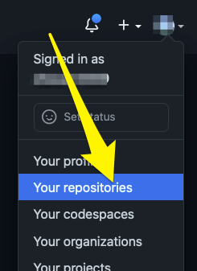

3. Make sure **Add a README file** is checked, so the repository is fully initialized.


::: tip The repository can also be created under an organization. Refer to GitHub online help.
:::

#### **Clone GitPlay repository from GitHub and Import as an Eclipse project**

1. In Topaz Workbench, open the Git perspective.

2. Clone the GitPlay repository.

   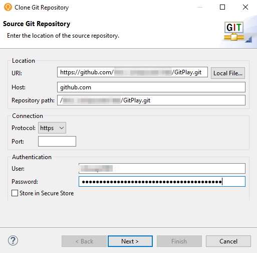

3. Import the repository as standard Eclipse project once the repository is cloned successfully, 

   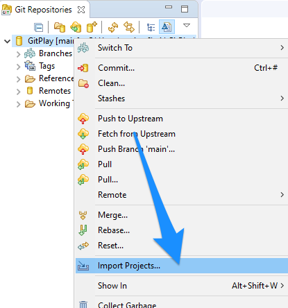

   

#### Configure the ISPW and Import the ISPW Source

1. In Topaz Workbench’s **Project Explorer** view, right-click the **GitPlay** project node and select **Configure>Configure to Use ISPW**. The **Configure ISPW and GIT Mapping** wizard appears.

2. From the **Host** list, select the host where the PLAY application is located, or click **Configure** to configure a host. Compuware recommends using the fully qualified domain name when configuring the host.

3. In the **Runtime Configuration** field, enter the runtime configuration if not using the default ISPW instance.

4. Click **Next**. The next page of the wizard appears.

5. From the **Stream** list, select **PLAY**.

6. From the **Application** list, select **PLAY**.

7. From the **Level** list, select the level used when doing a build. 

8. From the **Download source from path** list, choose the level from which to download source for the project.

9. In the **YAML mapping file location** field, enter or browse to the project folder in which to create the YAML mapping file. By default, the location is the root of project.

10. Click **Finish**. The source is downloaded. The ispwconfig.yml file is created and added to the root of the GitPlay project in the **Project Explorer view**. The **Console** view shows the activity and the **Project Explorer** view shows the downloaded files.

    

11. To examine the contents of the ispwconfig.yml file, right-click the file and select **Open**. 

    

```
!!com.compuware.ispw.cli.model.IspwRoot
   ispwApplication:
   application: PLAY
   host: somehost.example.com
   pathMappings:
   - path: \CLST
   types:
   - fileExtension: clst
   ispwType: CLST
      - path: \COB
   types:
   - fileExtension: cob
   ispwType: COB
      - path: \COPY
   types:
   - fileExtension: copy
   ispwType: COPY
      - path: \JOB
   types:
   - fileExtension: job
   ispwType: JOB
      port: 12345
      runtimeConfig: TPZP
      stream: PLAY
```

12. Refer to the *ISPW to GIT Integration: ISPW YAML Configuration File* for information on the available ISPW property settings and path mappings that can be in the ispwconfig.yml file.


#### **Commit and push the initial source into GitPlay repository**

1. In Topaz Workbench, open the **Git** perspective. 

2. If the **Git Staging** view is not visible, from the **Window** menu, select **Show View>Other**. The **Show View** dialog box appears. Select **Git>Git Staging**, and click **Open**. 

3. If there is no repository selected in the **Git Staging** view, click  and select **GitPlay** to switch to the **GitPlay**  repository.

4. In the **Unstaged Changes** box, select all of the components and click  to add them to the **Staged Changes** box.

   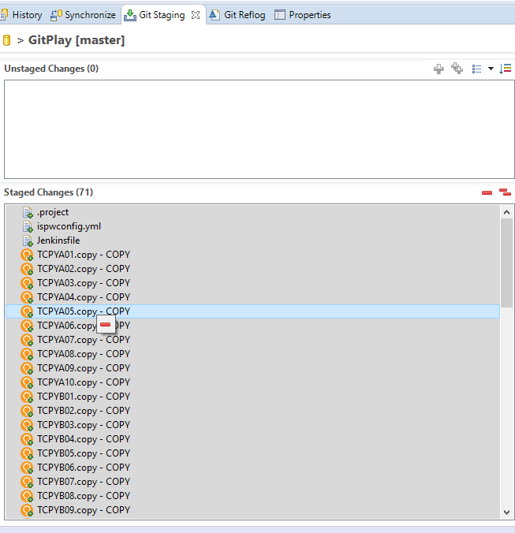

5. In the **Commit Message** box, enter a commit message, such as **Commit to main.**

6. Click **Commit and Push.**


#### Create a GitHub workflow

1. In Topaz Project Explorer View, select **Filters and Customization...**, then uncheck **\.\*resources** to show hidden files and folders for the GitPlay project.

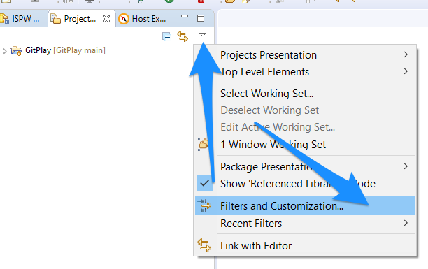

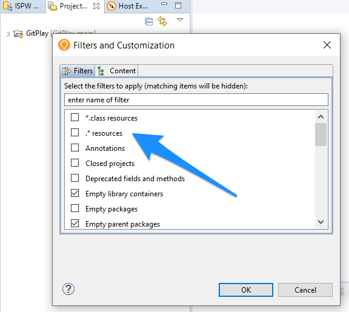

2. Expand GitPlay project, create folder **.github/workflows**.

3. Create a GitHub workflow file, for example, **ispw-sync-build-deploy.yml**, the workflow is broken up into the following stages:

   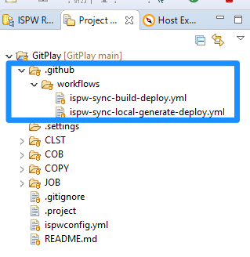

   * Checkout - checks out the source code.
   * Synchronize changeset to ISPW - uses GitHub action **ispw-sync** to perform GitHub to ISPW synchronization.
   * Build ISPW tasks - uses GitHub action **ispw-build** to perform a build
   * Deploy ISPW tasks - uses gitHub action **ispw-deploy** to perform a deploy

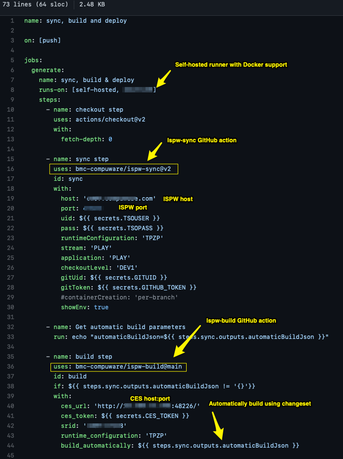


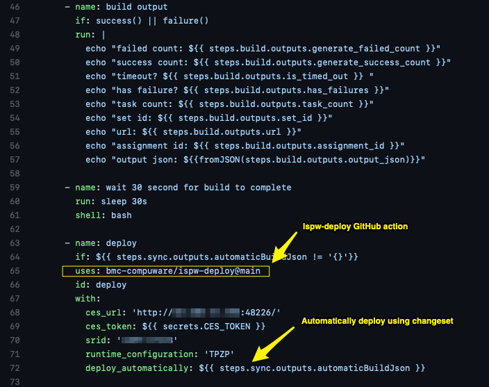


4. Or if you prefer to use GitHub action **ispw-sync-local** , you may specify the **sync** step as below, the workflow is broken up into the following stages:
   * Checkout - checks out the source code.
   * Synchronize changeset to ISPW - uses GitHub action **ispw-sync-local** to perform GitHub to ISPW synchronization.
   * Generate ISPW tasks - uses GitHub action **ispw-generate** to perform a generate
   * Deploy ISPW tasks - uses gitHub action **ispw-deploy** to perform a deploy

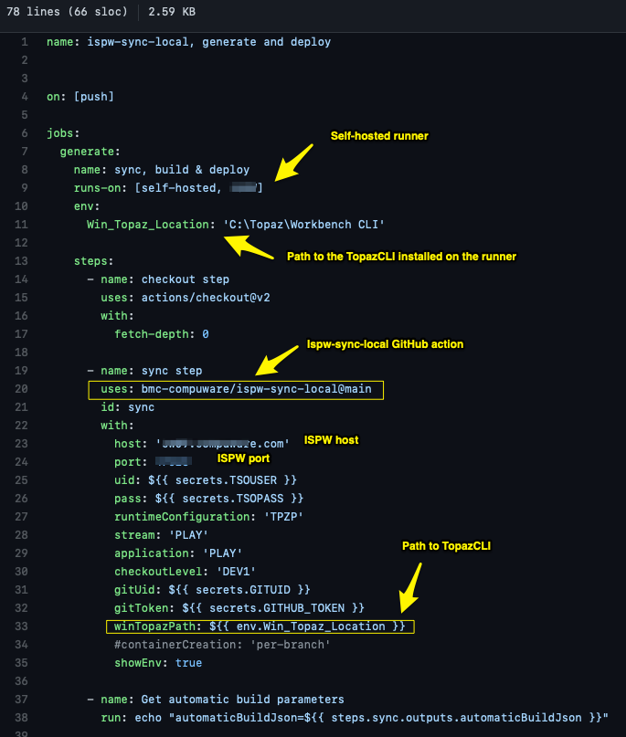

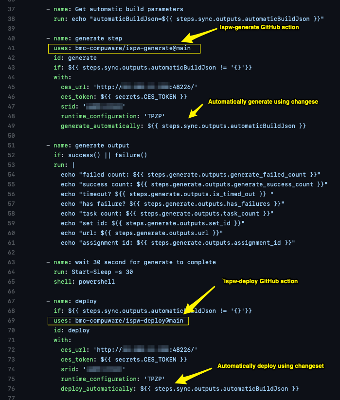


### **Make a change and build**

#### **Make a change to Cobol component TPROG15.cob**

1. In Topaz Workbench’s **Project Explorer** view, expand **GitPlay>COB**.
2. Right-click **TPROG15.cob** and select **Open**. The source opens in the editor.
3. On line 8, append the **TEST** to **...PROGRAM**.


4. From the **File** menu, select **Save**.

5. From the **File** menu, select **Close**.

   

#### **Perform the build action to verify the source generates successfully along with any impacted components**

1. In Topaz Workbench’s **Project Explorer** view, Right click on **GitPlay** project, select **Properties**, add **ISPW Nature**, then click **Apply and Close**.


2. In Topaz Workbench’s **Project Explorer** view, right-click the **GitPlay** project node and select **Properties>ISPW**. The **ISPW** page of the **Properties** dialog box appears.

3. In the **YAML mapping file location** field, enter or browse to the YAML mapping file.
4. In the **Level** field, enter **DEV1** as the life cycle level for the project that will be used to load the file into ISPW at that level.  The *level* value is required to perform any ISPW action. 

5. Optionally, in the **Assignment description** field, enter the assignment name to be used for the generate/build process; click **Insert Variable**, if desired, to choose variables to build the assignment name. Note that, if no valid value exists for the chosen variable, the **Description** field in the **Containers** view will treat the variable as empty, Descriptions longer than 50 characters will be truncated. The default assignment description is ${user} ${branch_name}.

6. Click **Apply and Close**.

7. In the **Project Explorer** view’s **COB** folder, right-click **TPROG15.cob** and select **ISPW>Build**. The **Console** view shows the progress of the build.

**Note:** If an ISPW pop-up appears, click **YES** to continue.

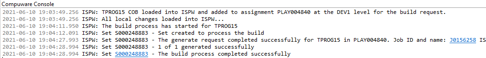

8. In the **Console** view, note the assignment where TPROG15 was loaded. In the example above, TPROG15 was loaded into assignment PLAY004840 at the DEV1 level.
   

###  **Submit change to GitHub**

#### **Commit and push the changes to GitHub**

 ###### <u>Commit and push TPROG15</u>

1. In the **Unstaged Changes** box, select **TPROG15** and click  to add it to the **Staged Changes** box.

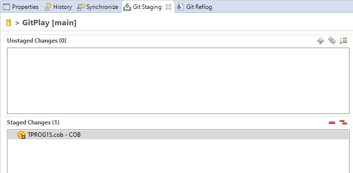


2. In the **Commit Message** box, enter a commit message, such as **TPROG15 commit.**

3. The **Push Results** dialog box appears.

4. Click **Close**.


#### **Determine whether the synchronization process completed successfully**

Two jobs will be triggered for the Jenkins multibranch pipeline project within a one-minute interval: one job when the Jenkinsfile was pushed and one job when TPROG01 was pushed. 

1. In Jenkins, examine the second job. In the multibranch pipeline project, in the **Branches** section, select **PlayBranch1**. Within the **Pipeline PlayBranch1**, go to the **Build History** section where the jobs are listed.
2. Once the job completes, go to the **Console Output.** The **Console Output** link is in the multibranch pipeline project’s sidebar.

The following is an example of what the **Console Output** will show for a successful Git to ISPW synchronization (the second stage of the Jenkinsfile):

```
Finished synchronizing changes from Git to ISPW assignment PLAY003145 at level DEV1
COB/TPROG01.cob     ----- Success
1 total changes detected during synchronization: Success 1, Failure 0, Skipped 0
```

The following is an example of what the **Console Output** will show for a successful build (the third stage of the Jenkinsfile):

```
1 task will be built as part of S000183395
TPROG01 has been compiled successfully
1 of 1 generated successfully. 0 of 1 generated with errors.
The build process was successfully completed.
```

<a id="_3-verify-the-updates-occurred-to-the-mainframe"></a>

::: tip

Git commit information can be viewed in Topaz within the **ISPW Assignment** view and the **ISPW Release** view.


:::

#### **Verify the updates occurred to the mainframe**

1. In Topaz Workbench’s **ISPW Containers** view, find the assignment where TPROG01 was loaded and double-click the assignment. The **ISPW Tasks** view appears.

2. Double-click **TPROG01**. The source is opened in the editor. 

   **Note:** If a copybook download message appears, click **No** to not download copybooks.

3. Verify that line 3 shows **BENCHMARK ISPW TRAINING1** for **Author**.

