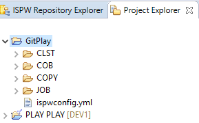

# GitHub Workflow and ISPW Integration Tutorial

This tutorial helps developers understand how the ISPW and GitHub synchronization process can be performed using GitHub actions. It uses PLAY, the ISPW training application, to synchronize a change to a component from GitHub to ISPW. After the necessary setup is complete, an ISPW project containing the PLAY application source code is imported to a GitHub project within Topaz Workbench. The GitHub project is then pushed to the GitHub repository as the main branch. Then a new file change is pushed to GitHub, which then triggers a GitHub workflow to perform the GitHub to ISPW integration to perform a build.

There are three sections in this tutorial:

- *Environment Specifications:* this section describes what environments to use when following the steps outlined in this tutorial. If a different version of any of the software or plugins are used different results may occur than what are shown in this tutorial.

- *Process Overview:* this section provides an overview of the steps for performing the GitHub workflow and ISPW integration. This section outlines the following:

   - [Set up the environment.](#set-up-the-environment)
   - [Set up a GitHub project with the source, YAML file, and GitHub workflow.](#set-up-a-git-project-with-the-source)
   - [Make a change and build.](#make-a-change-and-build)
   - [Commit, Push the changes to GitHub and Trigger GitHub workflow.](#submit-change-to-github)

- *Detailed Steps:* this section details the comprehensive steps to perform the GitHub workflow and ISPW integration.


## Environment Specifications
These are the minimum releases of software and plugins required.

- Topaz Workbench 20.07.01:
   - Egit in Eclipse 5.6.0

- ISPW PLAY application 18.02

- GitHub

- Windows or Linux based self-hosted runner


## Process Overview

   1. [Set up the environment](#set-up-the-environment)
   2. [Install the necessary plugins in Topaz Workbench, Configure GitHub Self-hosted Runner and Extra Setup for Synchronization](#install-the-necessary-plugins-in-topaz-workbench)
      *  [<u>Topaz Workbench</u>](#install-the-necessary-plugins-in-topaz-workbench)
      *  [<u>Config GitHub Self-hosted Runner</u>](#configure-github-self-hosted-runner)
   3. [Verify the ISPW mainframe PLAY application is available](#verify-the-ispw-mainframe-play-application-is-available)
   4. [Set up a GitHub repository with the ISPW source and YAML configuration file](#set-up-a-github-repository-with-the-ispw-source-and-yaml-configuration-file)
   5. [Create a new GitHub repository named GitPlay](#create-a-new-github-repository-named-gitplay)
   6. [Clone GitPlay repository from GitHub and Import as an Eclipse project](#clone-gitplay-repository-from-github-and-import-as-an-eclipse-project)
   7. [Configure the ISPW and Import the ISPW Source](#configure-ispw-and-import-the-ispw-source)
   8. [Commit and push the initial source into GitPlay repository](#commit-and-push-the-initial-source-into-the-gitplay-repository)
   9. [Create a GitHub workflow](#create-a-github-workflow)
   10. [Make a change and build](#make-a-change-and-build)
   11. [Make a change to Cobol component TPROG15.cob](#make-a-change-to-cobol-component-tprog15-cob)
   12. [Perform the build action to verify the source generates successfully along with any impacted components](#perform-the-build-action-to-verify-the-source-generates-successfully-along-with-any-impacted-components)
   13. [Submit change to GitHub](#submit-the-change-to-github)
   14. [Commit and push the changes to GitHub and Trigger GitHub workflow](#commit-and-push-the-changes-to-github-and-trigger-the-github-workflow)
       *  [<u>Commit and push TPROG15</u>](#commit-and-push-tprog15)
   15. [Determine whether the synchronization process completed successfully](#determine-whether-the-synchronization-process-completed-successfully)
   16. [Verify the updates occurred to the mainframe](#verify-the-updates-occurred-to-the-mainframe)

## Detailed Steps

### Set up the environment

To set up the environment, you will:
1. Install the necessary plugins in Topaz Workbench
2. Configure GitHub Self-hosted Runner
3. Complete Extra Setup for ISPW Synchronization


#### Install the necessary plugins in Topaz Workbench
<a id="install-the-necessary-plugins-in-topaz-workbench"></a>

Install Egit: Refer to [https://www.eclipse.org/egit/download/](https://www.eclipse.org/egit/download) for the installation.

#### Configure GitHub Self-hosted Runner
<a id='setup-self-hosted-runner'></a>

This how-to will guide you on the setup required for creating a self-hosted runner and some configurations to get you started.

##### Step-by-step Guide to Create the Self-hosted Runner

Before starting, ensure you know what machine/environment you would like to create the self-hosted runner. In some cases, you would want this installed on a **virtual machine**, and in other cases on your **own machine**. 
It's also important to understand the difference between all 3 levels that a self-hosted runner can be set-up on. See the explanation below to better understand the 3 levels and which one is more applicable for you.

- **Repository-level** runners are dedicated to a single repository.
- **Organization-level** runners can process jobs for multiple repositories in an organization.
- **Enterprise-level** runners can be assigned to multiple organizations in an enterprise account.

The steps below will be more geared towards creating a **repository/organization level** self-hosted runner with one pre-requisite, that you have a machine, whether it's a VM or your own machine ready to host a self-hosted runner.

1. Create the necessary environment before we run the steps for creating a self-hosted runner.

   * For an **organization-level** self-hosted runner, now is the time to create an organization if one does not already exist.

   * For a **repository-level** self-hosted runner, create a new repository through GitHub, or you may simply use an existing repository if you already have one created.

   **IMPORTANT:** **Only create private repositories when working with self-hosted runners. You do not want public access to your privately self-hosted machines.**

2. In GitHub, navigate to the settings page that will allow you to create a self-hosted runner. You can find this page by going into the settings of your **organization/repository** and clicking on the **Actions** menu option within the settings.

3. Go to the bottom of the page and find the **Self-hosted runners** section (or may see "Runners" under the Actions menu). From there, select the Add new option → New runner for an **Organization** and New runner for a **Repository**


3. You will be redirected to a new page that will outline the steps for creating a runner. Within that page, prior to running any of those steps, you will need to select the **Operating System** of the machine on which you will host the runner from. The steps described below will be for a Windows VM, but the steps are similar to any other OS.

4. Run the commands/steps provided on that page. Keep in mind that the token within the **Configure** section of that instructions page expires and the page will need to be refreshed to retrieve a new token if the old one has expired. 

   You will need to use your shell to run the commands. Use the correct shell for your OS. In order for the service to execute, the Powershell has to be started with the **run as administrator** option within Windows. You may need to download Powershell for Windows from Github (run the .msi in Github from https://github.com/PowerShell/PowerShell/releases/tag/v7.1.3) or bash shell for Linux. When asked if you want the runner to run as a service, We recommend you indicate Yes, so it does not need to be manually started each time you want to use it. Else go to the actions-runner location and execute the run.cmd.

   You can also provide labels for your runner while running the GitHub instructions in the shell window. Towards the beginning of the runner installation, a step will ask you the following:<br />
      **This runner will have the following labels...** <br />
      **Enter any additional labels** <br />

   At this point, you can enter any labels you prefer to associate to this runner. Labels can be used to run specific runners by their label during an action execution.
   You can also change the labels after installing the runner. To change them through GitHub, follow the steps which can be found [here](https://docs.github.com/en/actions/hosting-your-own-runners/using-labels-with-self-hosted-runners)

5. After running the steps within your **shell**, the shell should look something like this


7. To double-check that the runner installed successfully, for a Windows machine once the process is completed, you can go into your services (not from task manager, but rather open your start menu and search for services) and look for **GitHub Actions Runner**. If you see that, then that means the process completed successfully and that your runner is currently running.


#### Complete Extra Setup for ISPW Synchronization
Extra setup steps are required for ISPW Synchronization when using:
- ispw-sync GitHub Docker action
- ispw-sync-local GitHub action 

<a id='extra-setup1'></a>

##### Setup if using the ispw-sync GitHub Docker action

In order to use **ispw-sync** Docker container action (a TopazCLI Docker image is distributed from Docker hub and no need to install TopazCLI on the self-hosted runner), self-hosted runner must use a Linux operating system and have Docker installed. Currently, GitHub only supports Linux self-hosted runner for Docker container action. 

Assume an Ubuntu based self-hosted runner is prefered, run the following commands to [install Docker]( https://docs.docker.com/engine/install/ubuntu/)

```

$ sudo apt-get remove docker docker-engine docker.io containerd runc

$ sudo apt-get update

$ sudo apt-get install \
    apt-transport-https \
    ca-certificates \
    curl \
    gnupg \
    lsb-release

$ curl -fsSL https://download.docker.com/linux/ubuntu/gpg | sudo gpg --dearmor -o /usr/share/keyrings/docker-archive-keyring.gpg

$ echo \
  "deb [arch=amd64 signed-by=/usr/share/keyrings/docker-archive-keyring.gpg] https://download.docker.com/linux/ubuntu \
  $(lsb_release -cs) stable" | sudo tee /etc/apt/sources.list.d/docker.list > /dev/null

$ sudo apt-get update

$ sudo apt-get install docker-ce docker-ce-cli containerd.io
```

Because the action-runner cannot run under root, so the action-runner will have the following error to trigger an antion of any docker action: ```Got permission denied while trying to connect to the Docker daemon socket```

To resole the issue, modify the permission and restart Docker daemon:

```
$ sudo usermod -aG docker ${USER}
$ sudo rm -rf ~/.docker
$ sudo systemctl restart docker
$ sudo chmod 666 /var/run/docker.sock
```


::: tip NOTE
You certainly can setup Docker on Windows WSL2 (Windows Subsystem for Linux, version 2). In this case, ispw-sync will work on Windows self-hosted runner too. Please following the [link](https://docs.microsoft.com/en-us/windows/wsl/tutorials/wsl-containers) for more information. 


:::

<a id='extra-setup2'></a>

##### Setup if using the ispw-sync-local GitHub action

If Windows based self-hosted runner, install the TopazCLI windows distribution.

If Linux based self-hosted runner, install the TopazCLI Linux distribution. 

Please remember the root path to TopazCLI, then specify the CLI location in the ispw-sync-local action.


<a id="verify-the-ispw-mainframe-play-application-is-available"></a>

#### Verify the ISPW mainframe PLAY application is available

Verify that the ISPW PLAY application is installed. It should be included as part of the Training Application delivered in the ISPW SAMPLIB as part of the Installation Verification Process (IVP). 

If the following steps can be executed successfully, then the PLAY application was successfully installed in the ISPW instance based on the host connection.  

If you are unable to locate the PLAY application, refer to the *ISPW Installation and Configuration Guide* section entitled *Installation Verification Procedures*, which includes information on installing the ISPW mainframe PLAY application. The *ISPW Installation and Configuration Guide* can be found at go.compuware.com.

1. In Topaz Workbench, open the **ISPW** perspective. From the **Window** menu, select **Open Perspective>Other**. The **Open Perspective** dialog box appears. Select **ISPW** and click **OK**. The **ISPW Repository Explorer** view appears.

::: tip NOTE 
The **ISPW Repository Explorer** view is visible by default. If it is not visible, from the **Window** menu, select **Show View>Other**. The **Show View** dialog box appears. Toggle open **ISPW**, select the **ISPW Repository Explorer** view, and click **OK**. 

:::

2. Do the following:

   - From the **Stream** list, select **PLAY**. 
   - From the **Application** list, select **PLAY**. 
   - From the **Level** list, select **DEV1**. 
   - From the **Level option** list, select **First found in level and above.**

3. Click **Apply**. A filtered list of the components within the PLAY application appears. 

::: tip
If you are not logged into a host connection where the ISPW PLAY application is installed, you will be prompted when you select any list in the **ISPW Repository Explorer** view. 

:::

<a id='set-up-a-github-project-with-the-source-yaml-file'></a>

### Set up a GitHub repository with the ISPW source and YAML configuration file

<a id='create-gitplay-repo'></a>

#### Create a new GitHub repository named GitPlay

1. Go to the GitHub.
2. To create a personal repository, select **Your repositories** from profile, then select **New**.


3. Make sure **Add a README file** is checked, so the repository is fully initialized.


::: tip
The repository can also be created under an organization. Refer to GitHub online help.

:::

<a id='clone-gitplay'></a>

#### Clone GitPlay Repository From GitHub and Import as an Eclipse Project

1. In Topaz Workbench, open the Git perspective.

2. Clone the GitPlay repository.

   

3. Import the repository as standard Eclipse project once the repository is cloned successfully, 

   

   

<a id='config-import-ispw-source'></a>

#### Configure ISPW and Import the ISPW Source

1. In Topaz Workbench’s **Project Explorer** view, right-click the **GitPlay** project node and select **Configure>Configure to Use ISPW**. The **Configure ISPW and GIT Mapping** wizard appears.

2. From the **Host** list, select the host where the PLAY application is located, or click **Configure** to configure a host. Compuware recommends using the fully qualified domain name when configuring the host.

3. In the **Runtime Configuration** field, enter the runtime configuration if not using the default ISPW instance.

4. Click **Next**. The next page of the wizard appears.

5. From the **Stream** list, select **PLAY**.

6. From the **Application** list, select **PLAY**.

7. From the **Level** list, select the level used when doing a build. 

8. From the **Download source from path** list, choose the level from which to download source for the project.

9. In the **YAML mapping file location** field, enter or browse to the project folder in which to create the YAML mapping file. By default, the location is the root of project.

10. Click **Finish**. The source is downloaded. The ispwconfig.yml file is created and added to the root of the GitPlay project in the **Project Explorer view**. The **Console** view shows the activity and the **Project Explorer** view shows the downloaded files.

    

11. To examine the contents of the ispwconfig.yml file, right-click the file and select **Open**. 

    

```
!!com.compuware.ispw.cli.model.IspwRoot
   ispwApplication:
   application: PLAY
   host: somehost.example.com
   pathMappings:
   - path: \CLST
   types:
   - fileExtension: clst
   ispwType: CLST
      - path: \COB
   types:
   - fileExtension: cob
   ispwType: COB
      - path: \COPY
   types:
   - fileExtension: copy
   ispwType: COPY
      - path: \JOB
   types:
   - fileExtension: job
   ispwType: JOB
      port: 12345
      runtimeConfig: TPZP
      stream: PLAY
```

12. Refer to the *ISPW to GIT Integration: ISPW YAML Configuration File* for information on the available ISPW property settings and path mappings that can be in the ispwconfig.yml file.

<a id='commit-init-source'></a>

#### Commit and Push the Initial Source into the GitPlay Repository

1. In Topaz Workbench, open the **Git** perspective. 

2. If the **Git Staging** view is not visible, from the **Window** menu, select **Show View>Other**. The **Show View** dialog box appears. Select **Git>Git Staging**, and click **Open**. 

3. If there is no repository selected in the **Git Staging** view, click  and select **GitPlay** to switch to the **GitPlay**  repository.

4. In the **Unstaged Changes** box, select all of the components and click  to add them to the **Staged Changes** box.

   

5. In the **Commit Message** box, enter a commit message, such as **Commit to main.**

6. Click **Commit and Push.**

<a id='create-github-workflow'></a>

#### Create a GitHub Workflow

1. In Topaz Project Explorer View, select **Filters and Customization...**, then uncheck **\.\*resources** to show hidden files and folders for the GitPlay project.


2. Expand GitPlay project, create folder **.github/workflows**.

3. Create a GitHub workflow file, for example, **ispw-sync-build-deploy.yml** ([Download a template](./ispw-sync-build-deploy.yml)), the workflow is broken up into the following stages:

   

   * Checkout - checks out the source code.
   * Synchronize changeset to ISPW - uses GitHub action **ispw-sync** to perform GitHub to ISPW synchronization.
   * Build ISPW tasks - uses GitHub action **ispw-build** to perform a build
   * Deploy ISPW tasks - uses gitHub action **ispw-deploy** to perform a deploy


::: tip 
To better understand how variable substitutions work in the workflow file, visit [the following page](https://docs.github.com/en/actions/reference/environment-variables)

:::


4. Or if you prefer to use GitHub action **ispw-sync-local** , you may specify the **sync** step as below, the workflow is broken up into the following stages ([Download a template - ispw-sync-local-generate-deploy.yml](ispw-sync-local-generate-deploy.yml)):
   * Checkout - checks out the source code.
   * Synchronize changeset to ISPW - uses GitHub action **ispw-sync-local** to perform GitHub to ISPW synchronization.
   * Generate ISPW tasks - uses GitHub action **ispw-generate** to perform a generate
   * Deploy ISPW tasks - uses gitHub action **ispw-deploy** to perform a deploy


5. Create secrets to hide usernames, passwords, or tokens that will be used in the workflows
   a. Navigate to your GitHub repository where your workflows are stored.
   b. Click on the **Settings** tab that is located on the top left just under the repository path
   c. Click on the **Secrets** section
   d. From the following screen, you can either create organization level secrets (secrets that can be used across all repositories within your organization group) or repository level secrets.
   e. Some secrets examples you may create based on the **ispw-sync-build-deploy.yml** ([Download a template](./ispw-sync-build-deploy.yml))
      * secrets.TSOUSER
      * secrets.TSOPASS
      * secrets.GITUID
      * secrets.GITHUB_TOKEN
      * secrets.CES_TOKEN


### **Make a Change and Build**

<a id='make-a-change-to-a-cobol-component-tprog15-cob'></a>

#### **Make a change to Cobol component TPROG15.cob**

1. In Topaz Workbench’s **Project Explorer** view, expand **GitPlay>COB**.
2. Right-click **TPROG15.cob** and select **Open**. The source opens in the editor.
3. On line 8, append the **TEST** to **...PROGRAM**.


4. From the **File** menu, select **Save**.

5. From the **File** menu, select **Close**.

<a id='perform-the-build-action-to-verify-the-source-generates-successfully-along-with-any-impacted-components'></a>

#### **Perform the build action to verify the source generates successfully along with any impacted components**

1. In Topaz Workbench’s **Project Explorer** view, Right click on **GitPlay** project, select **Properties**, add **ISPW Nature**, then click **Apply and Close**.


2. In Topaz Workbench’s **Project Explorer** view, right-click the **GitPlay** project node and select **Properties>ISPW**. The **ISPW** page of the **Properties** dialog box appears.

3. In the **YAML mapping file location** field, enter or browse to the YAML mapping file.
4. In the **Level** field, enter **DEV1** as the life cycle level for the project that will be used to load the file into ISPW at that level.  The *level* value is required to perform any ISPW action. 

5. Optionally, in the **Assignment description** field, enter the assignment name to be used for the generate/build process; click **Insert Variable**, if desired, to choose variables to build the assignment name. Note that, if no valid value exists for the chosen variable, the **Description** field in the **Containers** view will treat the variable as empty, Descriptions longer than 50 characters will be truncated. The default assignment description is ${user} ${branch_name}.

6. Click **Apply and Close**.

7. In the **Project Explorer** view’s **COB** folder, right-click **TPROG15.cob** and select **ISPW>Build**. The **Console** view shows the progress of the build.

::: tip NOTE

If an ISPW pop-up appears, click **YES** to continue. 

:::


8. In the **Console** view, note the assignment where TPROG15 was loaded. In the example above, TPROG15 was loaded into assignment PLAY004840 at the DEV1 level.
9. Delete the task from container PLAY004840 and close the container.

###  **Submit the Change to GitHub**

<a id='submit-change-trigger-workflow'></a>

#### **Commit and Push the Changes to GitHub and Trigger the GitHub Workflow**

 ##### Commit and Push TPROG15

1. In the **Unstaged Changes** box, select **TPROG15** and click  to add it to the **Staged Changes** box.


2. In the **Commit Message** box, enter a commit message, such as **TPROG15 commit.**

3. The **Push Results** dialog box appears.

4. Click **Close**.


<a id='determine-whether-the-synchronization-process-completed-successfully'></a>

#### Determine Whether the Synchronization Process Completed Successfully

Once the TPROG15 is pushed to GitHub, the workflow on GitHub is immediately triggered (for demo purpose, **ispw-sync-local-generate-deploy** workflow is disabled, workflow **ispw-sync-build-deploy** is enabled). 

1. Visit GitHub repository **GitPlay | Actions**.

   

2. Once the job completes, click **TPROG15 commit** to view workflow run detail.


The following is an example of what the **sync step** will show for a successful Git to ISPW synchronization:

```
Finished synchronizing changes from Git to ISPW assignment PLAY005107 at level DEV1

 COB/TPROG15.cob                                     -----  Success                               
 
1 total changes detected during synchronization: Success 1, Failure 0, Skipped 0
```

The following is an example of what the **build step** will show for a successful build:

```
Build parameters are being retrieved from the build_automatically input.
Starting the build process for task 7E5655E16646

ISPW: Set S000248884 - The generate request completed successfully for TPROG15 in PLAY005107. Job ID and name: J0156513 ISPWTPZG
ISPW: Set S000248884 - The build process completed successfully

The build request completed successfully.
```

The following is an example of what the **deploy step** will show for a successful build:

```
Deploy parameters are being retrieved from the deploy_automatically input.

Starting to submit the deploy request for task 7E5655E16646
ISPW: received set ID: S000248885

ISPW: received URL: http://10.100.12.250:48226/ispw/cw09-47623/sets/S000248885

The deploy request has been submitted.
```


::: tip

Git commit information can be viewed in Topaz within the **ISPW Assignment** view and the **ISPW Release** view.

:::

<a id='verify-the-updates-occurred-to-the-mainframe'></a>

#### Verify the Updates Occurred to the Mainframe**

1. In Topaz Workbench’s **ISPW Containers** view, find the assignment where TPROG15 was loaded and double-click the assignment. The **ISPW Tasks** view appears.

2. Double-click **TPROG15**. The source is opened in the editor. 

   ::: tip NOTE
   If a copybook download message appears, click **No** to not download copybooks. 

   :::

3. Verify that line 8 shows **TEST** appended.


