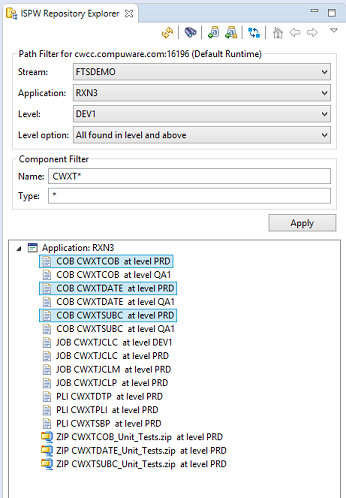
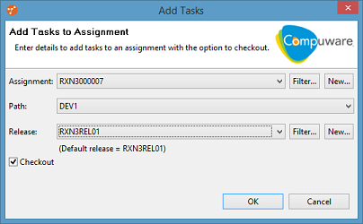
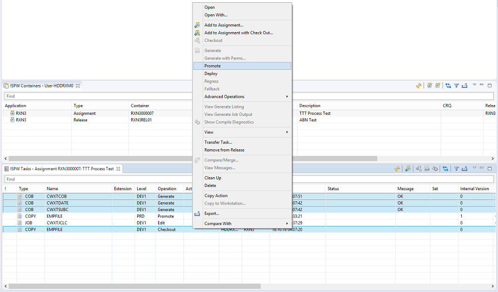
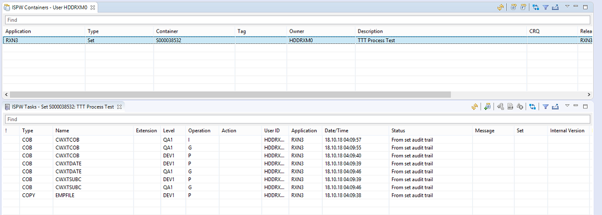
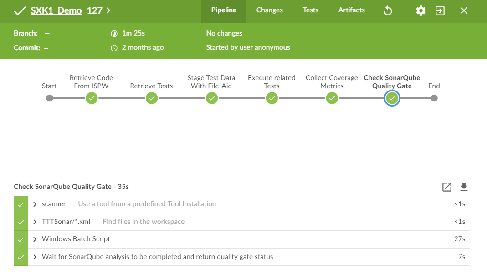

# ISPW Step by Step Example

Both scenarios handled by the two primary pipelines work on Compuware's demonstration stream `FTSDEMO`, using application `RXN3`, in our example. In this version of the application, some of the components (`CWXTSUBC`) use copybooks.

# Checking out code to an assignment

In ISPW the developer checks out a few components to a new or existing assignment. Depending on the pipeline being used:

- [Mainframe-CI-Example-pipeline](../../pipelines/basic_example_pipeline.md)
The developer has to check out all related copybooks for the final analysis in SonarQube to work. This is issue will be handled differently by the second pipeline
- [Mainframe_CI_Pipeline_from_Shared_Lib](../../advanced_pipelines/readme.md#mainframe-ci-pipeline-from-shared-lib)
The developer may check out any component. Missing copybooks will be determined and gathered in one of the pipeline steps.

They check out the following components

- COBOL program `CWXTCOB`
- COBOL program `CWXTSUBC`
- COBOL program `CWXTDATE`

and add them to a new or existing assignment. In the example, they use the `DEV1` path.

In case of the first scenario, the developer also needs to check out the copybook `EMPFILE`.

# Changing code

The developer applies changes to the code, stores them back to ISPW, and generates (`compile`, `link`, `bind`, etc.) the new code.

# Modifying the unit tests

Parallel to changing the code, the developer also adds new test cases or modifies existing test cases to the set of unit tests for the components in question./scenario/TTT_scenario.md). Since the unit tests are stored in GitHub, the changes need to be `committed` and `pushed` to the GitHub repository, before continuing.  For best practices for creating Topaz for Total Test Unit test cases in a CI pipeline, please review this page-> [Total Test Best Practices](../ttt/TTT_scenario.md).

# Promoting the code changes

Once the new code has been `generated`, and the unit tests have been `pushed` to GitHub, the develop can promote the selected components, or the complete assignment to the next level.

# The resulting set

The promote will create a `set container` in ISPW, which will perform the steps required for the `promotion` of the code. This `set` has its own ID and contains all `tasks` that were `promoted`. The way the [ISPW webhook](../../tool_configuration/webhook_setup.md) has been set up, once the `promotion` has finished, the webhook will trigger one of the two pipeline jobs. (Depending on the job being triggered by the webhook's `POST` request.)

# Jenkins Pipeline Triggered

The webhook triggers the Jenkins job which executes the tasks defined in the pipeline script.  

