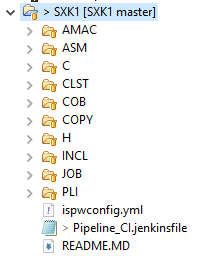
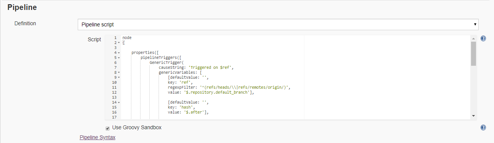
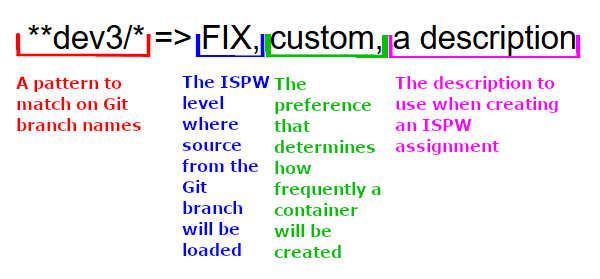
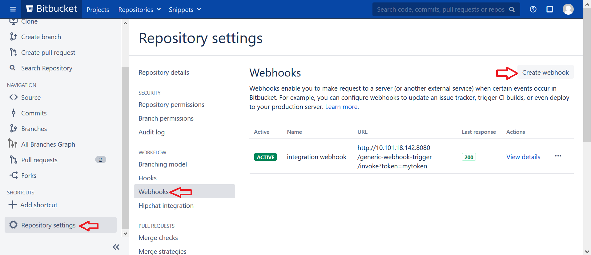
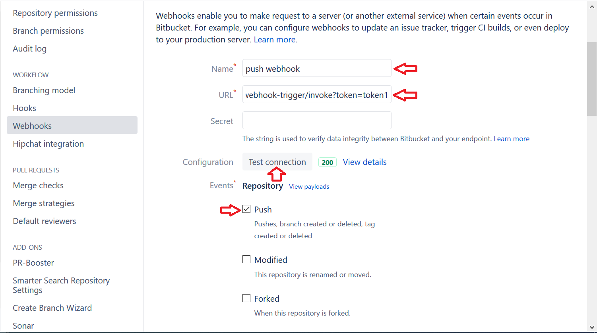
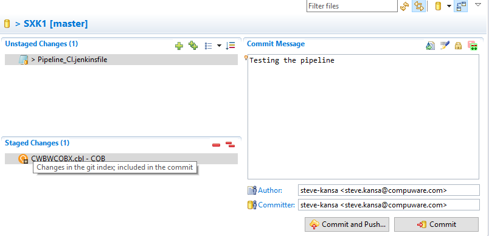
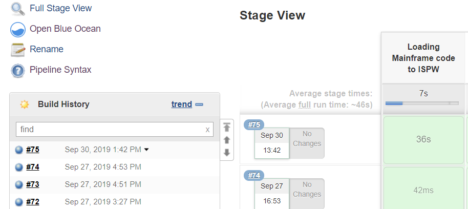

# Overview

This page walks you through how to configure an Jenkins Pipeline that takes source from an Enterprise git repository and syncs it with ISPW.

## Quick overview of Git to ISPW integration flow

1. A project is created that contains ISPW sobkbk
2. The project is stored in a Git repository.
3. A yaml mapping file is created which contains the mapping data for file extensions to ISPW types.
4. The yaml file is stored in the Git repository
5. Developers clone the Git repository onto their local machines and start to make changes.
6. The developer is finished with their changes and they commit and push them to their Git branch.
7. A pull request is created in Git.
8. A code reviewer reviews the changes, tests them and confirms that the changes are safe.
9. The code reviewer approves the pull request and the changes are merged to a Git master branch.
10. The merge into a Git master branch creates a webhook API callback to the configured URL. The webhook callback starts a build on a Jenkins job.
11. The Jenkins build will run the syncGitToIspw operation.
12. The syncGitToIspw operation will get the commits that were pushed to the Git repository, find the changed files within those commits, and load the changes into an ISPW container.
13. The ISPW repository is now up to date with the Git repository and the pipeline can continue.

## System Requirements

- ISPW version 18.02 with July cumulative maintenance applied
- Topaz Workbench CLI version 19.06.03 [installation](../tool_configuration/plugins.md#installing-the-topaz-workbench-cli)
- Jenkins
- Git Jenkins plugin
- [Compuware Common Configuration](https://wiki.jenkins.io/display/JENKINS/Compuware+Common+Configuration+Plugin)
- [Compuware ISPW Operations Plugin](https://wiki.jenkins.io/display/JENKINS/Compuware+ISPW+Operations+Plugin)
- Generic Webhooks Trigger Jenkins plugin
- Git repository

## Guidelines for configuring Git to ISPW integration

### Install CLI

Follow the installation guide for the TopazWorkbenchCli

### Set up a Git server and decide on a branching strategy and naming convention for the branches

The setup of a Git server will vary based on the Git client used. Some possible options are BitBucket or GitHub. Some recommendations on creating a branching strategy are outlined here. It is recommended that for each code change a developer needs to make, they should create a “topic” branch. Once the changes are complete, they can be merged into a “master” branch. The master branch would be what gets synced to ISPW, so it is worth considering what the names are of the ISPW levels that changes will get loaded into and the naming conventions of the branches in Git. Consistent naming conventions will make it easier to configure the synchronization later. Once a naming convention has been decided on, create the master branch and clone the Git repository so it is available locally.

### Create the yaml mapping file and commit the initial ISPW source

The Git to ISPW synchronization relies on a yaml mapping file to understand the structure of your repository and how your file extensions relate to ISPW types. The yaml file can be created manually, but the Topaz Workbench CLI provides a command to expedite the process. Open a terminal window in the Topaz Workbench CLI installation location and run the following command (changing the relevant fields)

```
IspwCLI.bat -host hostname -port 12345 -id admin -pass admin -code 1047 -timeout 0 -ispwServerConfig ISPW -operation init -targetFolder C:\temp\git_to_ispw -ispwServerStream PLAY -ispwServerApp PLAY
```

Where the “targetFolder” should be your local Git repository location. After running the command, a folder structure and the yaml file will be created in the specified “targetFolder” directory. The file is named ispwconfig.yml and contains some initial information about the repository. The folder structure will contain set of folders that are named after ISPW types. You can choose to use the given folder structure for storing your source, or you can modify it any way you like. Note that if you modify the folder structure in the repository, the yaml file will need to be updated since it uses the relative path of a file to find its ISPW type. Storing multiple streams and applications in the same Git repository is currently not supported. If you plan to use the git repository in Topaz, it is recommended to store the source in an Eclipse project.
Once you have decided on a folder structure for your repository, modify the information in the yaml file to suit your needs. The yaml file should contain the following:

- The host and port for this repository
- The runtime configuration to use when connecting to ISPW
- The correct ISPW stream for this repository
- The correct ISPW application for this repository
- All the file extensions and types that you want to be synced to ISPW. Files with extensions not defined in the yaml file will not be synced to ISPW.
  
Once the changes to the yaml file are complete, commit and push them to the Git repository.

Below is an example of what a yaml file would look like for a project structured like the screenshot below:



```yaml
!!com.compuware.ispw.cli.model.IspwRoot
ispwApplication:
  application: SXK1
  host: cwcc
  pathMappings:
  - path: \ASM
    types:
    - fileExtension: asm
      ispwType: ASM
  - path: \C
    types:
    - fileExtension: c
      ispwType: C
  - path: \CLST
    types:
    - fileExtension: clst
      ispwType: CLST
  - path: \COB
    types:
    - fileExtension: cbl
      ispwType: COB
  - path: \COPY
    types:
    - fileExtension: cpy
      ispwType: COPY
  - path: \JCL
    types:
    - fileExtension: jcl
      ispwType: JCL
  - path: \JOB
    types:
    - fileExtension: jcl
      ispwType: JOB
  - path: \LST
    types:
    - fileExtension: srx
      ispwType: LST
  - path: \PLI
    types:
    - fileExtension: pli
      ispwType: PLI
  port: 16196
  runtimeConfig: ISPW
  stream: FTSDEMO
```


### Install the Jenkins plugins and set up a host connection and CLI location

Install the Git and Generic Webhook Trigger Jenkins plugins, and the Compuware Common Configuration and the Compuware ISPW Operations plugins into Jenkins. 

The following shows the “Git” plugin installed in Jenkins. Go to Jenkins > Manage Jenkins > Manage Plugins > Click on “Installed” tab > From here, search for “git plugin” in the filter.  If the “Git plugins” is already installed, it will display it here as shown below.

The following shows an install of the ”Generic Webhook Trigger Plugin”.

The following shows an install of the Compuware Common Configuration and the Compuware ISPW Operations plugins from the Installed tab in Jenkins > Manage Jenkins > Manage Plugins.

Go to Jenkins > Manage Jenkins > Configure System and set up the [Topaz Workbench CLI location](../tool_configuration/Jenkins_config.html#compuware-configurations) and a host connection.

### Configure a Jenkins Pipeline Project

Within the Jenkins Pipeline project in the Pipeline section, add the below pipeline script



```groovy
node
{
    properties([
        pipelineTriggers([
            GenericTrigger(
                causeString: 'Triggered on $ref',
                    genericVariables: [
                    [key: 'ref', 
                    value: '$.changes[0].ref.displayId', 
                    expressionType: 'JSONPath', 
                    regexpFilter: '^(refs/heads/\\|refs/remotes/origin/)'],
                    [ key: 'toHash', 
                    value: '$.changes[0].toHash', 
                    expressionType: 'JSONPath', 
                    regexpFilter: '^(refs/heads/\\|refs/remotes/origin/)'],
                    [ key: 'fromHash', 
                    value: '$.changes[0].fromHash', 
                    expressionType: 'JSONPath', 
                    regexpFilter: '^(refs/heads/\\|refs/remotes/origin/)'],
                    [key: 'refId', 
                    value: '$.changes[0].ref.id', 
                    expressionType: 'JSONPath', 
                    regexpFilter: '^(refs/heads/\\|refs/remotes/origin/)'],
            ],
                ], 
                printContributedVariables: true, 
                printPostContent: true, 
                regexpFilterExpression: '', 
                regexpFilterText: '', 
                token: 'token1'
            )]
        )
    ])
    stage("Loading Mainframe code to ISPW") 
    {
            gitToIspwIntegration app: 'SXK1', 
            branchMapping: '''**/master => STG, per-branch
            **/feature/** => QA1, per-branch
            **/bugfix/** => EMR, per-branch''', 
            connectionId: 'fd1745f3-2289-4a13-ab89-4334bf7158ee', 
            credentialsId: 'pfhsxk0', 
            gitCredentialsId: '234eab28-be19-4558-806e-bc27c25dab6e', 
            gitRepoUrl: 'http://localhost:7990/scm/sxk2/sxk2.git', 
            runtimeConfig: '', 
            stream: 'FTSDEMO'
    }
}
```

Modify your pipeline to have the appropriate values for:

- 'token1' - Define a Token to be used to link a webhook to this specific Jenkins job. The token can be whatever you choose, but the same token should not be shared by multiple jobs.
- 'connectionId' - The ID for the HCI connection.  This can be retrieved by using the pipeline syntax generator.
- 'credentialId'- The ID of the mainframe credentials.  This can be retrieved by using the pipeline syntax generator.
- 'gitRepoUrl' - The ID of the git repo that contains your mainframe code.
- 'branchMapping' - The Branch Mapping field dictates how the Git source is synced back to ISPW. Each line in the Branch Mapping field is a separate mapping.

The breakdown of a line



The ISPW synchronization will use the first branch mapping that matches on the Git branch name. If multiple mappings match a given branch name, only the first one will be used. 
Each branch mapping has four fields. The first two fields of the branch mappings are used to define where source will come from in Git, and what level it will be placed in in ISPW. The next two fields define how often an ISPW container will be created, and what description it will have.

The third field in the Branch mapping is called the “container creation preference”. There are three possible values for this field:

1. per-commit
2. per-branch
3. custom

Respectively they mean that an ISPW container will be created for each Git commit that is synced to ISPW, an ISPW container will be created for each branch that Git commits are coming from, or all syncing for a branch mapping will use a container with a custom description. The fourth field is the custom description field and will only be read if “custom” is specified in the third field. To reduce the number of containers created, we recommend using the “per-branch” or “custom” container creation preferences. There is no limit on the number of branch mappings that can be created.

::: warning
Once you pipeline job is configured, run it once and it will fail, but it will also populate the webhook parameters that will be used in the actual execution of the pipeline when it is trigger from git.  
:::

### Set up a webhook trigger in the Git repository

Go to the Repository Settings for your Bitbucket repository.
In the Repository Settings menu, go to Webhooks
On the Webhooks page, select Create Webhook



On the Create Webhook page, give the webhook a name and specify the URL. The URL will be the address of your Jenkins server followed by “/generic-webhook-trigger/invoke?token=” and your token that was specified in the Jenkins job above.

Example: http://10.100.10.100:8080/generic-webhook-trigger/invoke?token=token1

Click the “Test connection” button and if the URL has been defined correctly, it should return a status code of 200. If everything has been configured correctly up to this point, clicking “Test connection” will actually trigger your Jenkins job.  In the Events section, check the box next to Push and leave the other boxes unchecked.



## Test the pipeline

Once the configuration is set, you can now make a change in to Topaz to the code in a Eclipse project that is linked to git and commit the change to your git server.



Once the change is successfully push to the git server, the webhook will trigger the jenkins job and the changes source code will be pushed to ISPW!

