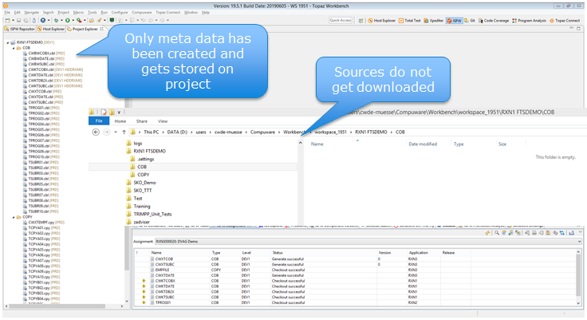

# Using SonarLint for ISPW managed sources

Not directly linked to Jenkins pipelines but important to consider in the context of DevOps, is the use of SonarLint for sources that are managed by ISPW. The challenge is that SonarLint requires the sources to be stored in (or referenced via) an Eclipse project. For a mainframe development team that usually means the extra effort of copying the sources from the mainframe SCM into an Eclipse project. If you are using a mainframe SCM and maybe have an Eclipse based UI for this SCM then having to copy your sources to yet another location - "just" to be able to get SonarLint analyzing the sources - seems like a lot of work; especially since it is a manual process.

To alleviate this situation for customers using Compuware's SCM ISPW, Compuware introduced the concept of ISPW projects. Even though, these will open the way for other integrations of third party tools, typically used by distributed development teams, into a mainframe based development process, the primary focus of ISPW projects is enabling the use of SonarLint. From a mainframe developer's perspective the term "project" and the use of projects and the way ISPW projects are implemented might be confusing at first - especially when they are used to working with ISPW.

## Overview

### ISPW Applications and Assignments

Usually, developers using ISPW are working in the context of an "assignment" or "release", which is a collection of different components into one container to be treated as one unit of work. Assignments are linked logically to a user story or similar. Depending on the requirements of the user story, the components within an assignment can origin from several different ISPW applications. Consequently, assignments usually are very short lived, and as soon as the story is completed they get closed.

On the other hand, applications are long lived, and are serve as a high level way of grouping software components into a logical unit. This might be a whole business application or a sub component of a large business application. Within these ISPW applications ISPW keeps track of the versions of components belonging to the ISPW application.

### Eclipse projects

Other than the name "project" suggests, Eclipse projects are also not meant to be short lived objects keeping sources of components of an application for the duration of a development project, e.g. a user story, rather they store components for a business application or a component of a business application for the whole life time of this application. When it comes to version controlling the sources, Eclipse itself does not provide any means per default. Rather third party tools like SVN or Git come into play.

During a development project like implementing a user story, Eclipse provides several tools and plugins that support with limiting the view onto the list of all projects to those elements that are important for one story. Some of these tools are Working Sets, Resource filters and Task lists.

### ISPW projects

Consequently, Eclipse projects correspond more naturally to ISPW applications, than they would to other concepts within ISPW. For this reason, when implementing ISPW projects, Compuware decided to base ISPW projects on ISPW applications. More precisely, an ISPW project is defined by the ISPW stream (a higher level grouping of ISPW applications), ISPW application, and the Path.

The latter is based on the ISPW concept of a life cycle, which allows to define different, parallel ways a component can be promoted from development to production, thus allowing for parallel development on the same components. In the life cycle below there are 4 parallel paths, 3 standard paths, moving components through a complete QA process and one path for emergency fixes, which allows for some "shortcuts" to be taken.

As a result the ISPW project's folder structure consists of 
- The root that refercences the ISPW applciation, stream and path
- Sub folders corresponding to each component type
- Files corresponding to each component

In addition, during creation of an ISPW project from an ISPW application you can specify which component types and components are being "tracked" by the ISPW project. This definition acts as a filter on the whole ISPW application.

::: tip
An ISPW project only stores references to and meta data about components. The sources do not get downloaded to the workspace. Thus, no perfromance or disk space are wasted, and no sources are stored at two different places.

:::

::: tip
After defining an ISPW project initially, users can modify the path the project is referencing and the filtering of the components and types.
:::

::: tip
If the sole purpose of using ISPW projects is providing the integration point for using SonarLint, the only component types that are required for the ISPW project are those that can be analyzed by SonarLint. In general this would only be COBOL sources and copybooks. Any other component type, e.g. Assembler sources, JCL and suchlike, are not rquired for SOnarLint.
:::

### Setting up usage of Sonar Lint

Like any other Eclipse project, ISPW projects need to be bound to SonarQube, in order for SonarLint to know, which rules to apply to the code it analyzes. 

::: tip
Even though there might be several different projects defined in SonarQube, serving different purposes, usually they all share the same set of COBOL rules to apply. Therefore, it simplifies things, if the local ISPW projects in Eclipse are bound to the same "master" project within SonarQube.
:::

From the technical standpoint the result can be viewed in the following way:

- The component sources are stored and monitored in ISPW and grouped by ISPW application. 
- In the Eclipse workspace there is an ISPW project fodler structure, consisting of links to the components and meta data about them.
- Each of these projects is bound to a SonarQube project
- Thereby, SonarLint can analyze sources once they are opened by the developer

## Using Sonar Lint from a developers perspective

Usually, for mainframe developers, their primary focal point for working is the ISPW assinment. The way ISPW projects are implemented, developers can continue they usual way of working, e.g. opening a program source from within an assignment task list, and still SonarLint will kick in, analyzing the source. 

So, once an ISPW has been bound to SonarQube, developers can use SonarLint while editing their sources **without having to be aware** of the ISPW project. 

## Setup process

In order to get this working properly for a whole development team, there is a one time setup process that could be used without every single developer on the team to define and bind each ISPW project step by step themselves. Instead the idea is to use Topaz Team Profile Sharing.

The setup process consists of the **administrative task** of
- defining the ISPW projects from the underlying ISPW applications
- binding these to SonarQube
- exporting the ISPW projects to Topaz/CES team profiles
- copying the SonarLint binding definitions to a central file location

::: warning
SonarLint does not store its binding information in an exportable format. Therefore, a specific folder needs to be copied "manually"
:::

Once these have been performed, the **developers** need to
- With their Topaz workbench closed down
  - copy the SonarLint definitions into their workspace
- After starting their Topaz workbench
  - define a connection to their SonarQube server
  - import the ISPW projects from CES team profiles into their workspace

Once this developer specific setup has been performed, they can use SonarLint in the [way described previously](#using-sonar-lint-from-a-developers-perspective).

### Administrative tasks

#### Defining the ISPW projects

- From the ISPW Repository Explorer define a filter on the stream, application and level you would like to create the ISPW project for. Once components are displayed in the application tree, right click the root of the application tree, and select "Create IPSW Project".

- During the course of the dialog, based on the previous tip, filter by those component types that are required for SonarLint to work

- The resulting project will appear in the Project Explorer. Note that no sources get downloaded.

#### Binding ISPW project to SonarQube

- Once an ISPW project has been created, right click the project root and select `SonarLint` -> `Bind to SonarQube or SonarCloud`

- Follow the dialog to bind the ISPW project to the desired SonarQube project

#### Export ISPW projects to Topaz/CES team profiles

- Once the projects have been bound to SonarQube, they can be exported to CES team profiles

::: tip
- Several projects can be exported to a shared team profile at the same time
- The same project can be shared in different profiles

This allows for creating **Team specific** profiles that **may overlap** in content between different teams
:::

#### Copy the SonarLint binding definitions to a central file location

- Within the administrator's workspace there will be a `.sonarlint` folder. This folder contains the binding information for SonarLint. To be precise, there will be a folder for each SonarQube project, conatining references to the Eclipse/ISPW projects that are bound to one specific SonarQube project.
- This folder needs to be shared with the developers

### Developers tasks

#### Copy the SonarLint definitions into their workspace

- With their Topaz workbench closed down, the developers need to copy the `.sonarlint` folder into the root directory of their Topaz workspace.

#### Define a connection to SonarQube server

- After starting their Topaz workbench, define a connection to their SonarQube server, by opening the `SonarLint Bindings` view

- Within the view click the "Connect to a SonarQube server" link

- Follow the dialog to define the connection to the SonarQube server until reaching this step

- And cancel the dialog here. The actual binding has been done by the administrator, and will be imported together with the project definition

#### Import the ISPW projects from CES team profiles into their workspace

- Lastly, they use the import from CES team profiles to import the desired ISPW projects

Once this developer specific setup has been performed, they can use SonarLint in the [way described previously](#using-sonar-lint-from-a-developers-perspective).

### Adding new ISPW applications/ISPW projects

At points, new ISPW applications get defined or get to a point when they shall be made read for use of SonarLint. In this case the administrators will have to follow [their setup task steps](#administrative-tasks) for the new ISPW applications/ISPW project. Whereas the developers only will have to import the new projects (or re-import the underlying team profiles), but they **do not have to re-perform any SonarLint related steps**.