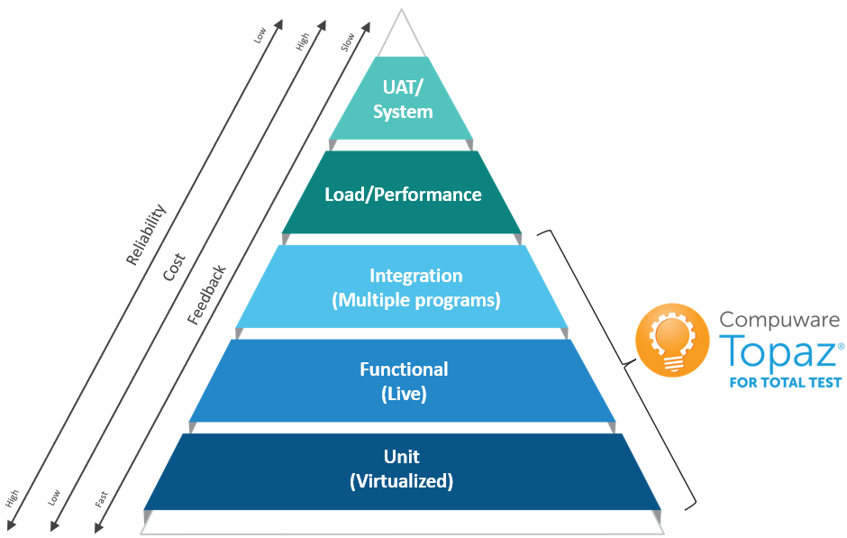
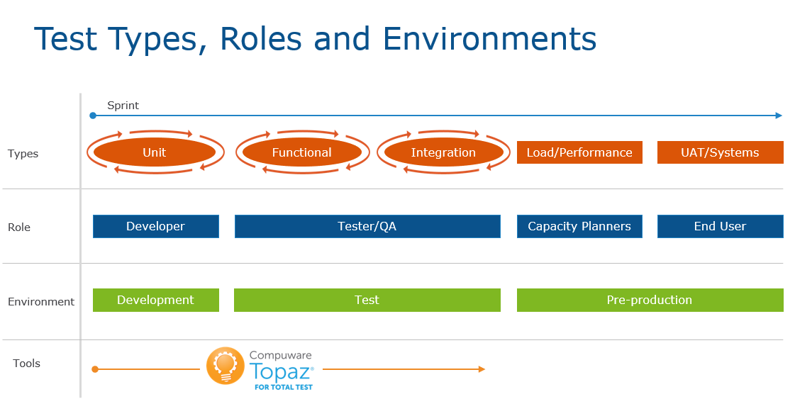

# Total Test Best Practices - Introduction

Whether you’re a COBOL developer creating unit tests for code, or an application test domain expert validating that programs meet business needs through functional tests, this document will guide you through best practices for using Compuware’s automated testing tool, Topaz for Total Test (From now on Total Test). You will learn how to get started using Total Test as an organization and as an individual and you will get an understanding of how to organize test cases and minimize the work of creating, executing and maintaining unit, functional and integration tests through the use of automation.

## Unit, Functional and Integration Testing

Total Test supports developers to create, execute and automate unit, functional and integration tests. To make it very simple and understandable, from a technical point of view, the difference between unit and functional test is that a unit test virtualizes all external calls while a functional test runs using live data 

*-* **Unit test** – executing a test case of a program in isolation where all external calls (Files, DB2, sub programs CICS/IMS apis) are virtualized / stubbed out by the test case.
* **Functional test** – executing a test case of a program in a live environment with live data.
* **Integration test** – executing a test case that tests collaboration between two or more programs in a live environment with live data.

The test types are illustrated in the pyramid below. The pyramid illustrates that unit tests should be the major part of test cases. On top of unit tests we then have functional tests and integration tests, and in the end, we have the User Acceptance Testing (UAT), which should be a minor part compared to unit, functional and integration testing.

There are no officially agreed upon clear definitions of different test types and each vendor and customer seems to have their own definitions. As a start let us define what these test types means in relation to Total Test and elaborate a bit more on the differences compared to the technical difference above.

* **Unit Test**. A unit test tests the smallest piece of executable code in an application. For COBOL this is a program. It is created by a developer that understands the program code and logic and knows how to e.g. get into a specific if statement to test this part of the code. The developer is in control and can stub out all external calls from the program to other systems such as IO, DB2, sub programs and CICS/IMS. The developer can decide what an external call from the program should return in a specific test case. A unit test can be described as a whitebox test where the developer has deep knowledge about the source code, and the test is executed in an isolated environment without requirements for access to external systems and data.
* **Functional Test**. A functional test tests a function of an application. A function is typically implemented as a COBOL program. The functional test tests that the program implements its specification correctly and is typically created by a developer or tester/QA role. The tester understands what the program is supposed to do and sets up the functional test case by providing input to the program and defining expected output. The functional test is a black box test where the tester does not need to know about the internal source code of the program, and the program is executed in a live environment with live data and live systems.
* **Integration Test**. An integration test tests the collaboration between two or more functions/programs and the data they use. This could e.g. be one program creating an entry in a table and another program reading the entry. The integration test will verify that the collaboration between the programs and their data works as expected. It can be made by a tester or developer. Like for functional testing, integration tests are executed at a live environment with live data and systems.

## Shifting left

In DevOps we often talk about shifting left. This means that testing should be done earlier in the development process. Traditionally testing on the mainframe has mostly been done in the later stages of a project, typically as part of end user acceptance testing. This is very late in the process for finding issues. Shifting left means that bugs should be found as early as possible. The earliest they can be found is at the same time as they are introduced into the source code by the developer. This is where unit testing comes in. A developer should write unit tests that test the changed code and in this way the bug is found as soon as it is introduced into the code. This is the fastest way to detect and correct bugs and has the largest benefit for increasing velocity, quality and efficiency. Functional test is typically done in a test environment with live data and is performed later in a sprint where a developer has moved the compiled load modules from a development environment to a test environment. This means that functional tests find bugs later, and hence the feedback to development is slower and more costly. Integration testing typically comes after functional testing which mean that it is more expensive to detect bugs compared to both unit and functional testing.
The below illustration shows how unit, functional and integration tests can be used by developers and testers in different environments during an agile sprint.

## Structure of this document

We will in the first two chapters start by explaining from a high level how to best get started to use Total Test as a user, and how to best adopt the use of Total Test and test automation in an organization. Following these initial chapters, we will then discuss general best practices that are valid for both unit, functional and integration testing. This covers areas like use of SCM to version test cases, how to relate tests to source code versions, how to automate test case executions etc. Finally, we will delve into detailed best practices related to unit, functional and integration testing in Total Test.

[//]: #
[//]: #
[//]: #

# How to get started with Topaz for Total Test as a User

Are you new to Total Test and test automation, there will be a learning curve to use the tool, to adopt new development and testing processes and getting started with test automation. Therefore, we recommend starting simple with the first test cases to simply learn how Total Test works before moving into more complex program testing. The simplest program to get started with is a called BATCH module which does not have any external dependencies or just uses input/output files.

**Suggested list of activities to get started with Total Test.**

1. Install and setup required software and install Topaz Workbench
1. Find a simple Batch program for the first test case
1. Record test case from Xpediter launch configuration
    1. If you don’t have Xpediter you cannot record a test case and you will have to create it manually- This is easiest to do with functional testing where you don’t have program and data stubs
1. Execute test case and see result
1. Modify test case with different expected values, execute and look at assertions failures in result
1. Do the above with a more complex program
1. Get experience with Code Coverage and use this actively when creating and executing test cases.

When you have become familiar with recording and executing test cases with Total Test its time to move on in the learning journey of DevOps and test automation. Next step is to start using a SCM to share test cases. We recommend using a Git repository, but other repository technologies work fine as well.

**Suggested list of activities to get started with Total Test and the use of a repository**

1. Setup or get access to a SCM and create a repository for test cases. If you don’t have an internal git server, you can always get started with free alternatives on Github, Bitbucket or Gitlab.
1. In Topaz workbench, install the SCM plugin (e.g. eGit) and clone/checkout the repository
1. Share your created test projects in the repository
1. Take another machine and clone the repository and see that you have the shared testcases here as well
1. Start to experiment collaborating with the shared repository

After getting yourself familiar with a SCM and Total Test you are ready to get the most benefit from test automation. You can now create and share automated test cases. With automated we mean, you manually execute the test case, but the test case automatically tests the program. This is the most important step in test automation – to have a suite of regression tests that you can execute after a program has changed.

When you have built a small suite of test cases you will soon find that its annoying to manually remember to execute and evaluate that test suite. Its actually easy to forget, and that means that it will take longer before you detect bugs. And this is where the last piece in test automation comes in – you want to automate the execution and evaluation of the test suite. This can be done with a number of commonly used pipeline technologies such as Jenkins, ElectricCloud, Urban Code Deploy, Xebialabs XLR etc. and you might even have your homegrown solution. No matter of technology used, these steps are recommended to get started to adopt an automated pipeline.

**Suggested list of activities to get started with automated pipelines**

1. Install or get access to a pipeline technology. If you don’t have access, installing and getting started with the open source version of Jenkins is easy and Total Test has a plugin for it as well
1. Install a plugin for the SCM you are using for your test cases. Jenkins e.g. has a Git plugin
1. Install Compuware plugins if its Jenkins, XebiaLabs XLR or Electric Cloud. Otherwise you will need to use the Total Test CLI
1. Install Topaz CLI at the server
1. Setup a new pipeline; 
    1. Add a step that checks out the SCM repository
    1. Add a step that executes the test cases from your projects
1. Run the pipeline and look at the report
1. Determine how and when you want to get the pipeline triggered.

[//]: #
[//]: #
[//]: #

# How to Adopt Topaz for Total Test as an Organization

When you as an organization wants to adopt Total Test in your development organization, we recommend the same principles of adoption as for individual users; start small and simple, get experience, get successful results, and then expand the adoption. 
Adopting Total Test is more than just starting to use a new tool. Its about changing developers habits, which can be very hard for many people, especially the very experienced persons that have been working the same way for decades. There will be resistance to change, and there will be complaints that its too difficult or impossible to do test automation. This is not specific to Total Test, this is true for adopting tools in general that change peoples work practices and habits. The same experiences were seen 30 years ago in a completely other industry; mechanical engineers and designers getting CAD (Computer Aided Design) systems to make drawings of designs digitally instead of on paper. It took many years to adopt the new technology, and today its unthinkable not to use CAD in design processes. We believe the same is true for test automation on the mainframe. This is new to developers and the adoption has to be gradual. Big bang implementations where everybody must start writing and executing tests from the same starting day will not give the expected results. Instead, since there is no experience in house and no success stories to tell, it will cause a lot of frustration and resistance and there is a risk that developers will simply refuse to use the tools. Again, this is not specific to testing, the same result has been seen in organizations adopting a modern IDE to replace ISPF interface. This also causes challenges.

**Suggested approach for adopting Total Test (and any new tool) in an organization**

1. Pick a small team that is motivated to get started using Total Test. It will be good to have a mix of younger developers and senior developers. What we often see is that the younger developers have a better understanding of the need for test automation and DevOps, they have learned this in college, and they are often more motivated and have easier to learn new methods and tools. Their minds are still fresh and not fixated by old habits. The senior developers might have resistance in adopting tools – but when they see the results produced by the younger developers, they often get motivated. They see how test automation can actually help them be more productive and increase quality. They get more time to do what they find interesting, and that is to develop business functionality. 
1. If possible, have the team measure how much time they use on manual testing when they implement changes and deploy these. Also try to estimate how many bugs that are leaked into production. These numbers are interesting since they can later be compared to similar numbers after adopting test automation and Total Test. The comparison can be used to calculate ROI seen from a pure cost/quality perspective. 
1. The team should choose a number of programs to get started with. This document later describes how to pick these programs. Start simple to learn the tool and get success, and then increase complexity. Programs that are frequently changed or are business critical are best candidates for test automation since this is where you get most benefit of automation. If the team finds programs that cannot be tested due to various reasons, then focus on other programs that can be tested.
1. Team should approach learning and adopting Total Test by following the steps suggestion in “How to get started with Total Test as a user”, and understand the best practices in this document.
1. You don’t need all processes in place from the start, and you don’t need 100% test coverage. Most important is to get started building up a regression test suite and get experience in the organization. Processes and automated execution in pipelines are secondary and can come later.
1. After creating test cases for a selected number of programs, the team should evaluate the use of testing. How much time will be saved going forward, now that automated testing is in place? Time used on creating the intial tests should not be taken into account. There will always be an intial cost of creating test cases. The benefits come when using the tests is a regression test suite the next times programs change. Also what has the impact of leaked bugs to production been? 
1. After the initial experiences and success with the first team, you will have ambassadors internally that can help spread the message about the benefits using Total Test and test automation. This will make the continued adoption much easier since other teams can see and hear the value from coworkers.
1. Start to establish practices on how to do and adopt testing. Use the rest of this document as inspiration. Work closely with one team on describing, establishing and adopting the processes. For instance, we recommend to adopt a Test Driven Development/Maintenance approach where you always start to reproduce a bug by creating a new test case that fails, then you fix the bug and then rerun the test case until its successful. Use of a SCM to share test cases is another important best practice that should be adopted. No developers should have test cases only on their machines. The use of code coverage is also a practice that should be encouraged. Actively using code coverage will make sure that a program is tested sufficient.
1. Establish a “Test Automation Knowledge Center” or what you want to call it. You should have at least one expert user of Total Test and who has understanding test automation and DevOps that can help coworkers getting started, educate team in understanding best approach for success, and help solve issues. The expert user should also be the one responsible for having contact with Compuware support to create and update support cases. Having expertise in house to do first level support of internal users learning to use the tool is the fastest way to improve adoption.

::: tip
You can access a Forester Total Economic Impact report on a customer adopting Topaz for Total Test here [Forrester TEI study](https://resources.compuware.com/forrester_tei_topaz_for_total_test_lp). The study shows how the customer measured developers performance and leak of bugs to their integration test environment before and after adopting Topaz for Total Test and how their developers gained a 233% productivity improvement while number of bugs decreased with 83%.
:::

[//]: #
[//]: #
[//]: #

# Best Practices for Testing in General

## Different Types of Testing

For unit and functional tests - there are different variations of what the purpose of a specific test case is. While all of them should validate that a program behaves its intended way under testing, some tests validate that a change to the program yields the desired (new) outcome, while others make sure the same change did not yield undesired outcomes in parts of the program that were not supposed to change. Other tests make sure that the program behaves as desired under rare conditions like error handling or specific date/time handling.

A common problem when adopting unit and functional testing is that the developers and testers only create test cases for successful outcomes. Often the failure scenarios or the rare cases are not tested, and its often here the bugs are hidden. Therefore, negative testing and well and boundary condition testing described below are important to cover as well.

### Positive Testing

First test cases you should consider creating, and that most start with is scenarios where your program gets valid input and returns valid output – the normal successful execution. Many users only create a few test cases of their programs, and these are typically the positive test cases where everything are as expected. This is a good start of creating tests, but not sufficient to get good test coverage.

### Boundary Testing

Unit and functional test cases should test values that have high and low boundaries. For unit test ideally you should know what the valid range of data is for every field and variable in your program. Verifying the maximum range of values is a great way to validate that calculations work at the edge of valid values. This includes testing values from input to the program as well as values from any external sources like datasets, sub programs, DB2 and CIC/IMS api calls. For functional test you should know all significant input values where a program will behave differently and cover these in test cases. 

Generally, this will also test the format of the expected data. If the format of the data isn't correct, it should cause the test case to fail. You will often need several tests to cover all high and low boundary values and different variations. It is good practice to also include out-of-bounds testing to verify that data validation and error-handling code is working correctly – which is related to the next subject – negative testing.

### Negative Testing
Negative test cases are for the failure pathways in your program. For example, you simulate an out of memory condition that you know will cause your program to fail. You write these test cases to validate that your program error-handling code is working correctly.  

You need to write these types of test cases to achieve a high code coverage percentage. If only normal execution is tested, none of the error-handling code will be executed and validated and added into the code coverage percentage.  

Most well-written, robust programs have a fair amount of error-handling code in them and can account for a substantial percentage of the size of a program. Topaz for Total Test Db2 stubs allow you to edit the SQLCODE and SQL Result and program stubs allow you to edit the data returned by a sub program and the return code it exists with to simulate an error and test the error-handling code in you program. 

Negative testing also includes test cases where you send invalid data to your program and see that it either abends correctly or return a specific error code. Negative testing can be made with both unit and functional testing where the return code can be asserted. Functional testing can also verify that a program abends in a negative test.

### Date/Time Testing

Many programs will have special code that gets executed at specific times. Many financial applications have end-of-day, end-of-month, end-of-quarter and end-of-year processing. To test those pieces of code that only get processed at those dates and times, you need a way to simulate the system date to be the specifically required date. 

Simply changing the system clock is not only difficult on the mainframe, but surely not advisable. Unforeseen, negative consequences include things like deletion/archiving of data that suddenly has become outdated as well as software licenses. 

Even though there are shops that have set up their own special “time travel” LPARs, most shops use tools targeted at simulating dates/times for individual program runs or applications, without impacting the execution of other applications on the same system. These tools should also be used when you need to run unit tests for date- or time-dependent functionality. 
When recording a unit test with Total Test, Data/Time interactions are recorded and stubbed out as well. This means that the unit test will be executed and data asserted for the same Date/Time as when it was recorded.

Compuware Xpediter’s Xchange tool allows a program to execute with a specific user-selected time. This approach only requires a change to the Topaz for Total Test runner JCL to include Xchange and to set the desired date and time. It’s a good idea to indicate in the JCL file name that you have a date and include a description in the JCL related to what date is set and why the specific date was chosen.

### Regression Testing

Regression tests ensure previously developed and tested software continues to work the same way after code changes have been made or after it has interfaced with other software. Changes may include bug fixes, feature enhancements, configuration changes or running on new systems. New bugs that are uncovered are called software regressions.  Regression testing simply means, run all relevant test cases again and ensure no bugs have been introduced into parts of the program that previously worked.

One approach to regression testing is to run automated tests after each time code is built. You want to identify problems introduced into the software as quickly as possible and doing this in an automated fashion instead of depending on testers remembering to manually execute them is preferred. If code gets checked in and built, you should run your regression tests to check if new problems have been introduced with those changes.

Some customers want to run tests after every code check-in or code promotion. Compuware’s source code management tool, ISPW, integrates with Topaz for Total Test via webhooks to kick off unit and functional tests after a code promotion.

### Baseline Testing and Re-baseline test cases

With baseline we mean that you create test cases for a program that works. These tests are the baseline tests for the program. Baseline tests are run before making code changes to ensure the current system is working as expected. Otherwise, you may discover after making a change and testing new changes that the code fails, not because of the new changes but because of problems that existed before the changes. When you have finished code changes and updated test cases for a program, these test cases now make up the new baseline test suite of the program. A good collection of baseline tests should cover the different kinds of testing described above – both testing boundary conditions, negative testing and date/time testing where relevant. Baseline tests should be part of your regression test suite. 

When a program is changed, it might make baseline test cases fail, either because requirements to the program has changed or – for unit tests – that the internal logic has changed, and internal assertions fail. The process of changing the failed test case to match the updated program is called re-baselining. This involves changing expected values in the test case to new expected values, and when data structures have changed, e.g. fields changed, added or removed, it means updating the test case and related stubs to conform to the new data structures.

## Planning for Testing

First steps in the process of identifying and prioritizing programs that you should cover with unit and functional tests include:

* Create a list of applications 
* Identify the importance and risk of these applications
* Create a list of programs for each application

Your source code repository is a good place to start identifying applications, components that make up applications and programs that make up components.

### Identifying What Programs Should Be tested

Use information from your source code management (SCM) system to identify programs. Prioritize building and executing test cases for those that are modified most frequently. 

Initially, look at programs that had changes in the last 90 days and sort by programs with the most changes. Then look at programs that changed in the prior year and see how many programs are found in both sets. The intersection of those two lists probably provides a good indication of programs that continue to evolve and that will provide good payback for creating unit and functional tests.

### Prioritize tests for High-maintenance Programs

Programs don’t have equal importance and don’t have equal maintenance requirements. We recommend selecting a set of programs that regularly require maintenance as the place to initially start the process of building test cases. You will get the most benefit from automated testing on programs that require frequent re-testing.

In a mainframe environment, you generally have large number of programs that aren't automatically tested. When planning for testing, think about the return on your test automation investment. The following should be high on your list of priorities for automated testing:

* Complicated programs that change frequently
* Programs executing complex and complicated financial or statistical computations
* Programs that bear a large commercial or financial risk if incorrectly coded
* Programs that require constant maintenance because of regulatory requirements or other changing requirements
* Programs that have many test permutations that are difficult to do manually 
* Programs that are impossible to test manually because of the data the program uses
* Programs that people are afraid to change
* Programs with high McCabe complexity calculations

### Determine Quick Wins

From those programs high on your priority list, go for some quick wins first. Immediately trying to tackle the monoliths in your environment is likely to fail and result in frustration. The faster developers see first successful results, the faster they will gain the necessary experience, confidence and conviction to try unit testing more daunting programs.

One sign of a program qualifying as a “quick win” is how easy it is to isolate the program from its environment. As we explain later in this document, programs being tested, as well as their unit tests, should not access live databases or other external data sources, nor should they depend upon called sub-programs to be executable.

Topaz for Total Test allows you to define stubs and other means of “simulating” a working environment for the program in question. However, the high variance of possible data sources and data-access functions on the mainframe makes it difficult for unit testing tools to cover every possible constellation.

Although vendors do their best to provide full support over time, there are gaps in what is possible to stub out. Therefore, when in doubt and you have the choice between two programs, go for the one with a more complete set of interactions that can be simulated.

Finally, it may have been a decade since some mainframe software was completely rebuilt. Infrequently changed programs should be low on the priority list for getting unit tests.

### Creating a Test Plan

Think about the risk and cost of being wrong versus the cost of writing some tests. Look around at what you already have. You may not be doing automated testing, but you probably have been doing manual testing. 

You may be able to use your manual testing plan as a blueprint for creating your automated tests. A good first step would be to run the tests manually while running code coverage to get a sense of how complete the manual test cases are. 

### Create Unit, Functional or Integration Tests

With Total Test you can create unit, functional and integration tests of your program. So, what kind of testing should you choose when you create your test plan? The answer is that you probably want them all. In general, you should start focusing on unit testing. A developer creates the unit tests and should be able to locate bugs as soon as they are introduced. With unit testing it is also possible to simulate error scenarios to test error routines – testing that can be very difficult to do with functional testing that is executed at live systems with live data. 

When you have unit tests for a program you would probably also want to verify that your program executes “live”, and this is where functional testing comes in. It can be the developer that creates the functional test, but it can also be a QA person that only knows what the program is expected to do. The QA person sets up input data for the program and also sets up expected output of the program. Input and output data in a functional test can be data in DB2, datasets, and through the linkage section. Total Test functional test supports all of these.

## Verifying Test Cases Before Code Changes

Before you apply any changes to a piece of code, you should make sure you have a set of tests that capture the current behavior of your code. Use code coverage to make sure these tests cover a sufficiently large percentage of your code, and make sure these tests still run without failures. These tests will serve a two-fold purpose:

* Regression tests for those parts of your code that don’t and should not undergo any changes
* Baselines for testing your changes if they already execute the parts of your code that will undergo changes

In the latter case, these tests will have to be re-baselined, either before or after you change your code. Re-baselining is the process of updating your test cases to work with newly changed program code.

When you first create a test case, verify it is correct. This test case is considered a baseline test. As programs change, you may have to update the test case to validate the updated program. We call the updating of a test case to work with an updated program re-baselining the test. For example, you may have to update assertion values if program calculations change or add new assertions if new data values are used.

If you find that your current set of test cases do not achieve sufficient code coverage (or if you don’t have any tests at all), be sure to define missing tests before you change your code, thus capturing its current behavior. You want to validate that unexpected changes have not been introduced into the program.

### Fixing bugs and Test Driven Development

It is a best practices in test driven development to not fix a bug before you have a test case that produces the bug. Therefore, if you find a bug in a program, start with creating a test case that reproduces the bug, and defines how the program is intended to work. Then start to fix the bug and rerun the test case until it is successful. Finally add the test case to your regression test suite. Following this process will ensure you that the bug has been fixed and that it will never appear again. The regression test suite will make sure of it.

### Run Unit Tests After Code Changes

This recommendation may seem obvious, but we’ve encountered customers who were so concerned about the cost of running their unit tests that they tried to limit the number of times they executed them. The cost of requiring people to relearn the code to fix bugs is higher than the cost of running a test frequently. The cost of letting bugs move into the next phase of testing is higher than the cost of rerunning tests. If you’re concerned about the cost of running tests, make sure you don't have duplicate tests, and remove tests if no one knows what they test.

## Re-Baselining a Test Case

The more frequently the program is updated, the more frequently the test case will have to be re-baselined. When a test case is updated, you should keep an old version of the test case for validating an old version of the program and create a new version after re-baselining the test for the new version of the program. We recommend keeping these versions of a test case in a source code management (SCM) system. In this way you don’t have to manually keep copies of the test cases.

There are two ways to re-baseline a test. You can recapture the test, but this requires you to repeat any modifications made to the test after the original capture. Alternatively, you can update the test manually by changing the data captured into the data stubs and updating the modified COBOL data structures.

## Use Source Control Management (SCM) System to Share Test Cases

Test cases should be viewed as first class citizens – they are as important as the source code of the programs they are testing since they ensure the quality of delivered applications. Test cases should therefore be shared in a Source Control Management system as their counterpart source code is. Hence, developers and testers can collaborate on them and manage test cases for different versions of the programs they are testing. Testing of programs should never depend on test cases saved on individual developers or testers workstations.

### Save Test Cases in Your SCM

Once a test case is working, save it in your source code management (SCM) solution so it can be tracked. Provide some way of linking the version of program code to the correct version of the test case. You can use branching in the SCM that correspond to the different versions of the source code of your applications and programs, and you can use tagging to tag specific commits in the SCM and describe what source code version the state of the testcases at that point corresponds to.

### What SCM to use?

With Total Test, unit, functional and integration test cases are all XML based files and can be shared in any SCM system that supports decentral files. This can be Git, Subversion, MS Team concert, IBM RTC and so on. We recommend using Git since this is an open, very strong and very popular SCM that is used by multiple open source project and business and has multiple free and commercial offerings. And test cases shared with Git can easily be integrated into all modern IDEs and pipeline technologies.

### Do not use the Total Test web repository to version Test Cases

Total Test Functional testing also provides the possibility to create test cases through a web browser. These test cases are saved in a local repository at the Total Test server and can be executed multiple times – even through a REST API. Using a web browser and a built-in repository to create and execute functional tests of a load module is very easy and is a good way of getting started with test automation. However, sharing test cases in the server repository is not recommended practice. They cannot be maintained and its harder to integrate into DevOps pipelines. Instead we recommend importing these test cases into Topaz and where they can be maintained, shared and automated with a real SCM.

### Reuse existing Test Cases

Before you create a new test case, take a quick look in your test case repository to see if there is already a test case available to test your code. There may not be an exact-match test, but you might find one that can be easily modified that will save you the work of building one from scratch.

Remember, you don't want to have duplicate test cases. If you created a new test case and it’s working reliably, put it into the repository as soon as possible. If you wait, someone else might duplicate your work—or worse, you might lose track of the test case, losing the benefit of getting it executed with the rest of the regression tests. Also, keep the JCL to run the test case with it in the test repository. Note that functional tests through Topaz for Total Test can, with limits, automatically generate JCL for test cases for different environments.

## Use of Repositories, Projects and Folders

Managing test cases for a small number of programs is easy – but what happens when we have thousands of programs to be tested in multiple different applications? How should we organize our test cases with such huge number of tests in so many different contexts? How many SCM repositories do we need? How many test projects do we create? How many test cases can we have in one project? How many different programs should we test in one project?

There is not one definite answer to all these questions, and the way you choose to structure test cases into folders, projects and repositories depend on the complexity of your organization, applications, internal processes etc. Here we will try to give some overall recommendations that can hopefully help in determining your strategy in organizing tests

### Repository – One per Application

Most SCMs operate with a repository that has the collection of folders that you share. With a repository you can create branches so you can work on multiple versions and features concurrently. Therefore a repository should be used to contain only the folders and files that share the same life cycle and that belong to each other. Otherwise you will have to merge changes with developers that work on test cases not related to your programs/application. 
The simplest way of using repositories is probably to have one repository per Application. If you have a very large application maintained by multiple teams you might want to also use multiple repositories for one application. One approach could be to have one repository per application team.

### Project – only unit test one program in a project

An Application typically contains multiple programs. To make it simple and clear we suggest to only test one program in a test project when its related to unit testing. You can have multiple test cases of the same program in the same project. If you have a lot of test cases for one program you might want to create multiple test projects, each one focusing on a specific area of testing. It is only a suggestion to use one project for one program. For some use cases if might be more pragmatic to have tests of multiple programs that relate closely to each other in the same project. In that case it is suggested to only test one program per test scenario. Again, this is also just a suggestion to simplify the orchestration of tests, and you have the flexibility to orchestrate and organize your test cases into test scenarios, suites folders and projects as you find best.

For a project containing only functional tests this “Test one program per project” is not as strong. With functional testing there are more freedom to place test scenarios in a folder structure which makes it easier to separate test scenarios and different program testing from each other. If you choose to have functional tests of multiple programs in one test project, then we recommend to use a folder structure to separate test scenarios for different programs, e.g. by having one folder for each program and under each program folder organize test scenarios for that program into sub folders.

### Folders – Organize Test Scenarios into Feature Testing 

In a test project you can organize test scenarios into a folder structure. This makes it easier to understand what specific test scenarios test, and it makes it easier to see where all the generated test stubs belong to. In this way – if you have generated 20 test cases, you would have 20 sub folders describing the scenarios. Organizing tests into folders also makes it easier to work concurrently. (Using subfolders is not yet available for unit tests (19.6.1))
With functional testing its possible to place test scenarios in any folder making it easy to organize the tests.

### Test scenario – Only test one program per scenario

With a test scenarios – both for unit and functional testing it is possible to add test cases of different programs. We recommend to only test one program within a test scenario. It will make it clearer to understand the purpose of the test scenario and it makes it easier to only test one program what that has changed. A test scenario that is made for integration testing will of course contain test of multiple programs since this is the definition of an integration test.

## Use Branching for Multiple Versions

If a program exists in multiple concurrent versions, test cases must also be available in multiple versions. This is both the case if structures (linkage section, copybooks etc.) change or if program logic is changed. When structures change, test cases and data must be updated to reflect the new structures, and when program logic changes, it must be ensured that there are test cases that cover the logic and ensure that its bug-free. In both cases it might be necessary to have test cases for the new and old version of the program and be able to switch back and forth. The technology to use for this is “branching”. Most SCMs have the possibility to create branches, and this means work on a “copy” of the code/test cases and have the original version intact. With branching its always possible to go back to the old version, and its possible to concurrently work on the old and the new version – and later merge the changes together. Its only necessary to create branches if you want to work on two different versions. You can always check out an older version of the test cases and use for the older version. Its only when you want to change test cases for the older version and you or someone else already have started to work on test cases for the newer version that you need to create a new branch.

## Concurrent Test Case Development 

If you have more than one developer creating test cases for the same program at the same time, you will have to coordinate a bit between developers, or setup some naming standards. Lets see what kind of problem you can get into with concurrent development;

::: tip
We have two developers, Per and Elsa. They are both going to create a unit test case for the same program in the same test project in the same repository. They have both checked out the same branch from the repository and are ready to get started. Per generates a test case and accepts all the default values. A test scenario with one test case and corresponding stubs are generated with default names. Elsa does the same. They are using different launch configurations with different data to cover their specific test cases and hence the test cases they generated are very different. Per is first to commit and push the changes to the repository. Then Elsa does the same – but get Merge conflicts. She cannot push her changes to the repository because Per already pushed a test scenario and stubs that were named the same as Elsas files.
:::

Solution to this is to make sure to generate test scenarios and corresponding artifacts into meaningful sub folders – or create separate test projects when that is preferred. If Elsa and Per had generated their test scenarios into sub folders, they would have separated their test cases from each other and they would not have got into merge conflicts. This problem is the exact same with writing source code as Java. Reason why its so obvious an issue with unit testing is that the test scenario and artifacts are generated automatically, and therefore a bit of coordination on the use of folder structures should be established.

## Naming Conventions and Documentation

Document What Test Scenarios and Test Cases are Testing
When number of programs being tested and the number of test cases for each program grow, it becomes necessary to document what each repository, project, test scenario and test case covers so when getting back to these its easy to understand what the specific resources is meant for.

It’s very important to document what a test case is testing. There are test repositories that contain hundreds of undocumented test cases. When many test cases start to fail, it’s extremely difficult to know where to begin fixing them. In these situations, test cases are often thrown away because no one knows what they were attempting to test. What a tremendous waste! 

The documentation for a test case can be very straight forward. If you don't know what the purpose of the test case was, you don't know why it failed and you can't fix the test or the program when it fails. Documentation should include a short description (a sentence or two) describing what the test was supposed to verify and additional details about any setup required to execute the test and any limitations where the test won't work. 

It is possible to write documentation directly into test scenarios and test cases, and for functional test, each of the palette elements used in a test scenario can also be documented. Currently it is not possible to write documentation to a test project, and a solution to this could be to add a “readme.txt” file to the project and write the documentation of the project here.

### Using Sub Folders for Test Cases

When number of testcases and programs being tested grow, its helpful to organize test scenarios so its easy to understand what specific test scenarios are actually testing. Documentation is important, but structuring test scenarios into a folder structure can help a lot to get a overview and to navigate to a concrete test scenario. Folders can be used in both unit and functional testing, and you can place them in any folder underneath the project. For unit tests, the complete unit test folder must be copied to a sub folder.
One example of creating a folder structure is to break down an application into functional areas and sub areas and create a similar folder structure. For each area or sub area you can then add unit and functional test scenarios.

### Use Intelligent Naming Conventions

It might seem unimportant but providing a good name for your test case is important. Use intelligent naming standards for your unit test cases. The entire development team for an application should adhere to using the same naming convention. 

A name should provide some indication of what the test is doing and what is being tested. A name that immediately helps people understand what the test is for makes it easier every time someone new has to work with the test or every time a test case fails. A name should provide immediate clues about where to start diagnosing the test failure. We recommend including the name of the: 

* Program/subprogram being tested
* Feature being tested 
* Business rule being tested

### Adopt a Naming Standard

It’s a very good idea to define a naming standard for repositories, projects, test scenarios, test cases, and test suites. The naming standard will of course depend on how you use these artifacts to divide your testing artifacts. If we follow our general recommendation for using a repository for an application and a project for testing one program, and test scenarios for testing different scenarios of the program, then this is a suggestion.

| Artifact            | Naming standard                      | Example                           |
| ------------------- |--------------------------------------| ----------------------------------|
| SCM Repository      | Name after application name App\<NAME\>Tests         | App\<NAME\>Tests AppLOANAPPSTests   |
| Total Test project  | Name after program, \<NAME\>_Tests, or after application/use case if it covers multiple program tests | CWKTCOBX_Tests CreateLoan_Test |
| Test Scenario       | Name it after the program being tested  | CWKTCOBX_Scenario   |
| Test Case           | Name it after the program being tested and some additional info about the concrete test case and business rule \: \<name\> - \<feature\> - \<rule/outcome\> | CWKTCOBX – report - OK   CWKTCOBX – report - Error code 12  |
| Use of sub folders  | Name of the use case the scenario and test cases cover (not directly available in <20.2 for unit testing, but can be created manually)          | AddCustomer AccountInfo |

### Use Descriptive Messages in the Assertions

When creating the unit test and authoring the assertion messages, think about what you would want to know when the test fails. If this assertion fails, what should you look for? Is it a consistent error that doesn't need investigation? If you decide to keep your assertion messages short, include a comment in the test case providing more information about why the test case could fail.

Topaz for Total Test generates a default assertion message, which just indicates what field values don’t match the expected values. You can edit the assertion message with more information to better describe a test failure. It’s best to focus on failures that you have already encountered rather than creating messages for everything. If the failure needs more description, it can be added into the Test Scenario Properties tab in the description box.

### Use Test Case Categories

Organize your test cases by category to ensure the tests for test cases are similar. It’s best to know what the test categories are before you start generating test cases. Categorization can also help you organize test cases into test suites. Furthermore, in writing up descriptions of each category, you will help people understand which categories should hold their test cases. Possible categories might be:

* The application a program is part of  
* The feature(s) a program implements
* How fast or slow a program executes, which might help you decide if you should run unit tests only in full regression tests (longer-running tests) or if you could run them also during smoke tests (quick-running tests)
* Resources needed; for example, if a Db2 database is required

Whatever you decide, categories should remain consistent. You want these categories to stand the test of time, otherwise you will be creating more maintenance work than benefits with categorization.

You can put the category name in the Test Scenario or Test Case Description box on the Properties Tab in Topaz for Total Test.  You can use the Search | Files… feature of Topaz/Eclipse to find the files using the “Containing text” entry box with your category name. 

## Group Test Scenarios into Test Suites

A test suite is a way to logically group test scenarios. When you create a test suite you should decide what the organizing theme of the test suite should be. There are many reasons to organize test scenarios into test suites. For example, you may want to regression-test an entire application, or a program or you may want a quick smoke test to determine if a build was successful before running the entire regression test suite. Use a descriptive naming convention for test suites and document the goal or reason for why a test suite exists:

* Determine the goal of the test suite
* Determine which test cases help meet the goal of the test suite
* Create a naming convention for each type of test suite (Smoke Test Suite, Component Test Suite, Application Test Suite, Regression Test Suite, etc.)
* Document the purpose of the test suite on the Properties Tab in the description box of Topaz for Total Test.

## Use Pipeline Technology for Test Automation
First step in test automation is to have test cases that can be reused again and again without the need for manual setup. With this first step a developer or tester initiates the execution of the test scenarios and evaluates if the execution was successful or not. This brings a lot of value since these regression tests the applications and ensure that no bugs have been introduced. Problem with this first step is that someone must remember to find, execute and evaluate the test scenarios. This is where pipelines come in. A DevOps pipeline is used to automatically test, build and/or deploy changes. They are typically called Continuous Integration/ Continuous Delivery/Deployment (CI/CD) pipelines since they either automatically builds or deploys code when needed. Total Test fits very well into a pipeline technologies such as Jenkins, Electric Cloud and XebiaLabs XL Release where we have dedicated plugins. It can also fit into other pipeline technologies as well through the use of the Command Line Interface (CLI). 

Within a pipeline, you can automatically checkout test scenarios and test suites from a SCM like git, then find and execute the test scenarios and test suites, and produce output reports in Junit output and Sonar Qube format. Hence you can view the test results in Jenkins and Sonar Qube in case a test failed, and then go back to your IDE and reproduce and fix the problem. 

Adoption of CI/CD pipelines are typically something that happens after an organization has adopted unit/functional testing tools and want to improve the testing practices more. It is the next natural step in a DevOps journey.

Having pipelines being responsible for the execution and evaluation of the tests ensure that changes are being tested and hence lower the time to make a change at the same time as leaked bugs are reduced.

Once the development or maintenance of the test cases is complete and the cases are running successfully in their test suites, you are ready to add test steps into your new or existing pipeline scripts. The pipeline scripts can be scheduled or executed on demand. We recommend an initial short test suite being first in the pipeline script to verify that tests are running correctly, a smoke test to verify that the configuration and security authorization are set up. After the initial smoke test scenario, you can add the more detailed and longer-running test suites.

The combination of using a SCM for sharing test cases and a pipeline technology like Jenkins is strong. When it is first setup, developers don’t need to worry about automation. When they add or update a test scenario and commit the changes to the SCM, the pipeline can automatically checkout the new or modified test cases and execute them without any additional work.

[//]: #
[//]: #
[//]: #

# Best Practices for Unit Testing

## What Is Unit Testing, and Why Automate It?

Unit testing is the earliest point in development at which you can remove identified flaws and ensure program logic works. Failures are removed when developers can easily recall what they coded, making issues easier to resolve. Ultimately, the value of unit testing is that you to trap bugs within development, thereby minimizing the negative consequences of failures that otherwise would have been externalized.

Mainframe applications are composed of many programs/sub-programs, sub-system services for databases, and stored procedures, file access and communications. Currently, Topaz for Total Test treats a program, sub-program and stored procedure as the units that can be tested. An additional level of verification can be done on data that is written from a program into QSAM, VSAM, Db2 (Insert, Update, Delete), IMS (ISRT, REPL, DLET) or many CICS Commands (i.e., WRITEQ and many others).

However, mainframe unit testing has historically been a practice of manual processes that are laborious and time-consuming—to the extent that developers will cut short or even forgo unit testing to ensure other priorities are accomplished. The consequence of neglecting thorough unit testing is lower code quality throughout the delivery pipeline, which drives down efficiency in future testing due to extant low-level bugs. This reduces delivery velocity and quality.

That’s why automating mainframe unit testing is business-critical. But best practices for automated unit testing aren’t always apparent or well understood, as true automated unit testing on the mainframe was unavailable until the release of Compuware Topaz for Total Test. Before we get into best practices for carrying out this method of testing, here are some things to consider.

### Automated unit tests verify that a program works and continues to work as the developer intended for it to work. 

Without automation, setting up test environments takes a long time, and testing teams often serve more than one development team. Thus, changes by an individual developer may have to wait in a “queue” for quite some time before they know if their changes passed or failed their tests.

Due to these time constraints, if developers don’t accomplish unit testing, root causes of failure are much harder to identify in later stages of the application life cycle—any of the components that have been changed since the earliest stages of development could have caused the failures.

With automation, developers can quickly run tests independently after every code change so they get feedback immediately while they’re still familiar with the changes. As new changes introduce new failures, identification of the cause and location of each issue is made quick and simple through automated unit testing.

Once a developer’s changes pass all unit tests, they can be sufficiently sure their changes fulfill any new requirements and don’t break existing functionality. With this knowledge, they can start working on new requirements or new projects without as much fear of being interrupted later to revisit changes and resolve issues that should have been identified earlier.

In summary, automating unit testing not only reduces the time it takes to identify and resolve issues, thereby improving developer productivity; it also improves focus on tasks by decreasing the likelihood of interruptions, further improving productivity.

### Automated unit testing helps managers better manage and control software projects

Automated unit testing improves managerial duties for product managers and functional managers, both of who are concerned with daily 
developer productivity, in the following ways:

* Project tractability: Automated unit testing exposes failures and incomplete implementations so they can be reported early in the life cycle and addressed before accumulating and causing project delays.
* Project manageability: Failures identified in automated unit testing can be classified once the cause and its type and location have been determined. When bugs are better classified, they can be prioritized to eliminate the worst problems first.
* Insurance against regressions: Automated unit tests can verify that developers’ new changes don’t break existing code. These tests virtually eliminate accidental or unintended side effects.
* Efficiency and speed: Automated unit tests are significantly faster to run than manual tests. They require just a few people to review results and identify test failures, which speeds time to error resolution because it’s faster and easier to assign the right person to fix the failure. Test setup can also be very time consuming and error prone. Automated test setup and tear-down provide additional time savings over manual testing and minimize the risk of a bad test setup.
* Planning and predictability: Applications are complex systems made from individual components that must be reliable to ensure the overall system works. Unit testing verifies the component making up the larger system. Automating unit testing is the only way to effectively and efficiently ensure the reliability of those individual components. 
* Customer satisfaction: Automated unit testing can improve customer satisfaction by preventing copious errors from escaping and by providing a baseline assurance that the product works when shipped. Confidence is much higher with good automated unit tests.

### Unit testing is different than functional/integration/system testing

* Unit tests are created and executed during development, either manually by developers or through automation with a tool like Topaz for Total Test. Functional/integration/system tests are usually created and executed by a test organization. These tests can also be automated with Topaz for Total Test’s functional testing capabilities. 
* Unit testing verifies a single program or a single part of a program. Functional/integration/system tests verify several components of the system work together. Unit tests try to test a component in isolation from the rest of the system. They may use mocking/stubbing to eliminate the need for other system components. This allows unit tests to focus on a specific component. Often, this helps the tests run more consistently by eliminating component behavior, which varies, for example, based upon the date of execution.
* Unit tests should be run after every build, which means they are run much more frequently than functional/integration/system tests. Developers will run unit test suites after making updates to ensure their most recent fixes haven't broken existing code. Functional/integration/system tests are scheduled for a team and run at scheduled times.
* Unit testing provides information about the specifics of a test failure, type of failure and location. Functional/integration/system tests usually require more development investigation to find the cause of a failure.
* You will have many unit tests but fewer functional/integration/system tests for a single program, partly because many will be executed manually and partly because each functional/integration/system test encompasses more features in a test case. 
* With a tool like Topaz for Total Test, unit tests will have automated test setup and tear-down, so the test can be run repeatedly whenever. Automatic setup and tear down can also be done for functional tests by Topaz for Total Test. Without Topaz for Total Test, a test engineer is generally required to set up test systems and test data.

## Use Code Coverage

Verify how much ground your existing manual test cases cover with a code coverage tool that provides visibility into the blocks of code the application is executing. This review helps you understand if you have a good set of test data driving your application testing. Test cases may have limited coverage because you have limited data but adding more data won't help; you need *specific* data to drive execution through different logic branches.

Error path testing, or negative testing, is something you should strive to include in your automated testing. Code coverage identifies the gaps in your testing and helps you determine if you need additional test cases, thereby providing direction on what to test next. Code coverage generally will not hit error-handling blocks of code unless you specifically provide data to trigger the error handling. 

If you have important error handling in your programs it should be tested. Creating purposefully wrong data should be used to drive the program execution into error-handling pathways. You need to carefully define what is a successful test versus a successful execution. A successful test verifies that the program error handling executes correctly and that the wrong data is identified and handled without the program crashing, or worse silently failing.

## Determine Frequency of Running Unit Tests

You should rerun your unit tests whenever a component within the application/program is rebuilt. You want to run the tests before developers forget changes they’ve made. Relearning the code to fix a problem later is very expensive. We recommend a few options when rerunning unit tests in an automated fashion:

1. After each compile/build of the program under test
2. When developers check in their changes to your SCM, so they get immediate feedback
3. On a daily/nightly basis so developers get daily feedback before they forget their changes

## Rerunning Test Suites

If you can determine the items below, you can limit rerunning tests to specific cases:

* All dependent software related to an updated program
* Which tests test all the changed programs
* All tests associated with all related programs

Unfortunately, you probably don't know all that information and it would be very rare if all your code and test cases were that well-defined and organized. The cost of running an automated regression unit test is low compared to the cost of finding a bug in the field. We would err on the side of rerunning the entire test suite.

## Where to Execute Unit Tests

A problem for many mainframe testers is the limited availability of test environments that are fully configured for running tests. Because these systems are scarce resources, you usually have a rigidly scheduled time when they are available for your program testing. Unfortunately, testing time can vary widely, depending on the types of issues found. Often, other test teams will overrun their allocated time and foul up the schedule for subsequent teams. Therefore, the more test system options you have, the more likely you can maintain your project plans. 

In Topaz for Total Test the term unit test isolation refers to ability to stub out data and sub-systems like IMS, Db2 and CICS. Unit test isolation reduces the dependencies for a specific test system. Because you have fewer test system dependencies, your tests have more flexibility to run on a wider range of test systems.

For maximum isolation and flexibility, “test stubs” or "test mocks" should be used whenever possible. This encompasses:

* Data passed into a program from calling programs and external data sources
* Data leaving a program to be written to external data sources

"External sources" could mean, for example, VSAM/QSAM datasets, Db2 tables and IMS databases. Instead of accessing the “real” components, unit tests make use of simulation data in the form of stubs—mocks, also called virtualized data and commands. The reduced number of dependencies from using "test doubles" may provide more options where your tests can be executed. Don't just assume you need a complete test environment to run your unit tests. If you’re waiting for a complete test environment to become available, check if a less complete test system would suffice for running your unit tests.

A cost factor to consider when executing tests on an LPAR is the system software running on that LPAR. Even if the program doesn’t use it, you must pay for Db2, IMS, CICS, etc. if they are active on the LPAR. So, you may consider running unit tests that have removed the requirements for subsystems to run them on a really “basic” LPAR and avoid the cost of system software. Ideally customers could set up a non-Db2, non-IMS, non-CICS LPAR for unit test execution.

As a result, unit tests should be able to execute anywhere, at any time, in any order, regardless of the availability of other application components, databases or data within the databases. It’s this independence that allows for executing unit tests at the level of frequency we’ve recommended here.

## Creating Unit Tests

### Unit Tests Should Focus on Testing a Single Thing

If a test case attempts to validate more than one item, it requires more work to determine which item in the test failed. It’s much better to have each test case focus on validating a single item. It also makes it easier to diagnose why the test case failed as well as easier to maintain the test case.

Focusing on testing a single item also generally requires less test data for the test case. Given that data must also be maintained for the test case, more data means more data maintenance in addition to code maintenance. The goal of “test one item” can be difficult with COBOL programs that are large (hence the value of modularizing code by splitting logical sets of code into sub-programs).  
Topaz for Total Test makes it easy to copy a unit test and edit data stubs to create new test cases. We recommend selecting the smallest amount of data to execute the item under test. To test another similar item, copy the unit test and make the required change to the test data in the data stub. The goal should be many small tests with small amounts data.

### Identify Where in the Process to Unit Test

Think about when you want to unit test in the development process and application life cycle. This information will help later when you integrate with DevOps automation processes. Organizations vary in running automated unit tests: after every code commit; after a software build; at a scheduled interval; before starting user acceptance testing; before promoting to production; or just on demand. Your organization should choose when to run automated unit tests based on your specific process.

### Unit Tests Should Pass

You need to get a test project successfully executing before checking it in to a test repository or adding it into your CI/CD system (e.g., Jenkins) or even sharing it with co-workers. Get the happy-path tests working first. Add boundary condition tests to verify high and low values. When using negative tests, set the conditions so that tests of expected error conditions also pass. In total, make sure that 100% of your unit tests pass, and after you have applied changes to your code, make sure that this continues to be the case—before you check in your changes to version control. Topaz for Total Test allows you to change the assertions used in a test. If needed, you can also remove an assertion that isn’t relevant to a test. For example, a date that changes, causing a test failure, can just be removed if it isn’t important to the test validation.

Unlike in later stages of testing, there is no wiggle room for interpretation of the results. If any unit test fails, it means the program does not work as desired. Of course, this also means that your tests themselves have to be maintained with your application.

### Unit Tests Should Be Reliable

You really don't want to track down a failed test case only to discover it was a false failure. A test case needs to fail only when there is a program error and pass when the program works. Get your unit tests working reliably in your development environment before adding them into a test case repository. Don't have your team chasing phantom failures.

### Unit Tests Should Have Code Coverage

You want to understand how good a job your test cases have done to verify your code base. When—and how—do you know that a 100% pass rate is a good indicator of the quality of your code? Only when you can be sure that your tests have executed a sufficiently large portion of your code, and if you can be sure that the critical parts of your program have been executed. Code coverage tools are the best way to identify which parts of your code have been executed during your tests and which haven’t.

Code coverage tools also help you manage the size of your testbed. It does not make sense to execute the same (standard) path several hundred times, while the critical (sometimes exotic error handling) paths don’t get tested at all. Tools for static code analysis can be valuable resources to help you determine:

* Different paths through your program
* Conditions under which these parts get executed
* Estimates for the number of test cases needed

For the latter, the cyclomatic complexity metric—also known as the McCabe metric—provides a lower bound for the number of different test cases needed to reach full code coverage.

On the other hand, a high code coverage percentage is a necessary condition for high-quality test suites, but not always a sufficient condition, e.g., executing a certain path once may not always be enough; or, if there are boundaries to conditions determining if a certain path gets executed, these should also be tested.

While experts like Jez Humble and David Farley stress the importance of a coverage of no less than 80% of your code—for each individual program under test, not on average or in total—we would like to stress that you should also make sure the right 80% gets executed.

### Keep Unit Tests Independent

A unit test should only test a single item and shouldn't be dependent on the execution of other test cases, so you should eliminate dependencies between them. Some people run many programs in a series because the data from earlier programs feeds data to subsequent programs.

Topaz for Total Test’s data capture lets you unit test programs without these dependencies because you have previously captured the data for the test. You can also capture or specify the program parameter values so you don't need to re-execute the preceding programs to compute the values required for the program under test.

### Test Smaller Units

It can be very difficult to test a single thing in a large COBOL program. Many people don't use sub-programs to provide logical units to test. If you’re working on a large COBOL program and need to do extensive maintenance, we recommend breaking the program into logical sets of code and grouping them into sub-programs.

Keep your redesign goals in mind. Are you trying make callable services? Are you trying to create microservices? Are you trying to turn a batch program into an online program?

We have seen companies successfully redesign their programs with a common core set of sub-programs and other sets of sub-programs that allow different interfaces to the core set of sub-programs. The different interfaces include a batch interface, web service interface and online CICS interface. This approach reduces the amount of duplicate code and simplifies testing because each sub-program is a testable unit.

### Creating Related Unit Tests

Once a unit test has been captured with Topaz for Total Test, it’s often useful to create derivative tests based upon the generated unit test. For example, you capture a unit test and then review the code coverage report, which indicates a block of unexecuted code. You can review the code and see that by changing a single value you could execute the previously unexecuted code.

To do so, make a copy of the test case in Topaz for Total Test’s test scenario editor, find the read stub where that value is read into the program, copy the input stub with the data value that needs updated and change it. Move the changed stub into your new test case and remove the old stub. You now have a new test case that executes more of the code without having to record a new test case with Compuware Xpediter.

### Limit Data Used in Unit Tests

The goal of unit testing is to limit the code you test to a small unit of a program. That way, if a unit test fails, it’s easy to identify the area of a program having an issue. By extension, you should limit the amount of data a unit test uses so that if a program stops processing data correctly it’s easy to identify the data causing the problem. You want just enough data to test a specific item you’re trying to verify—and each unit test should only try to verify one item.

There are at least three major issues with using too much data in unit tests: 

1. **Wasted time:** Too often, we see unit tests that use much more data than they really need. When the test case fails, it requires more work because you have to sift through not only more code to determine the issue but also more data.
2. **Too much code tested per unit test:** The other thing about using too much data in a unit test is it ends up executing more program code than a single unit test should. Sometimes more data used in the unit test means more code that will be utilized to process that data. Again, your goal should be to unit test a single item per test case. By limiting the amount of data in a single test case you also limit the amount of code that will be exercised, bringing you closer to that goal. Another way to think of this is: test a single pathway through the program.
3. **Redundant testing:** Software doesn’t require wear testing like sneakers. Running the same or very similar data through the program won’t find new problems. You want unique test cases with unique data to exercise your business rules and program execution. Using more data just creates more work to diagnose and takes more time to execute without any added value.

These points aren’t to say you can’t use a lot of varied data for testing, rather that you should separate the data into small sets for many different unit tests. You want to focus on the unit of code being tested and the unit of data needed to test it. Extra data just increases the amount of time required to diagnose a unit test failure.

## How Topaz for Total Test Creates Unit Tests

In contrast to unit testing in distributed development, which is often based on the xUnit framework, Topaz for Total Test does not use code written by a developer to accomplish tasks. Instead, it allows you to define tests using a graphical interface with forms and table-like editors to collect test data, define assertions and build stubs.

The results are stored in XML format files, which are used by a component called the Test Runner that sets up the data-handling and executes the test. The Test Runner acts as the driver for any program under test and handles feeding test data into the program under test as well as handles the use of stubs and returned results that are used by the comparison done in the test assertions.

Compared to a distributed testing framework like JUnit, this might result slightly in less flexibility when it comes to testing exotic situations. On the other hand, Topaz for Total Test does not require manual coding in any kind of programming language, thus reducing the potential for making mistakes while coding your test cases.

What’s more, Topaz for Total Test integrates with Compuware Xpediter, a debugger, allowing developers to execute an existing program under the control of the debugger and collect the relevant data during execution. Additionally, you can gather code coverage metrics while creating the test cases.  

Topaz for Total Test projects are created inside the Project Explorer view of the Host Explorer perspective. Test suites are held within a test project. Test suites can hold test scenarios, and test scenarios hold test cases.

To create a test case, you need to know the COBOL structures used in the program and use Xpediter to gather them or import them into structures called “listructures“ in Topaz for Total Test. You also need to know which structures are passed to and from programs. In Topaz for Total Test, these items are called interfaces. Xpediter can automatically create these, or you can manually create them in Topaz for Total Test.

## When to Do Unit Test Maintenance
When your Program changes its logic so that it computes new data values or the program is updated to read and process new data values the unit test cases will probably need updating. The test cases include assertions, which have expected values. If your program changes produce different values, your assertions’ expected values also need to change.

## How to Do Unit Test Maintenance

When should you modify a test case and when should you use Xpediter to re-record the program data for a test (i.e. recollect expected values)? It depends. Recreating a test scenario entails recollecting the data and data structures and interfaces. The result is that everything in the test case is completely up to date with the program. This approach is usually quick and easy unless you have modified the data to execute specific code pathways.

* Test scenario/test case updates can be done for Batch Programs using VSAM and QSAM
* Test scenario/test case using Db2 stubs, IMS stubs or CICS stubs cannot be updated

You can update test scenarios that contain VSAM and QSAM; you can update the field structures and stubs; and if a COBOL structure is updated, you can import the updated copy book into the program. But you must find all the places in the test projects where that structure is used. This task can be done using the file search in Workspace and specifying the structure name that changed, then updating the references to the old structure to the new structure. This work may mean that you must update some data stubs. If new fields were added, data for those additional fields will need to be added.

There are some limitations in Topaz for Total Test related to editing Db2 SQL stubs. Currently, you can't edit Db2 stubs to add or remove fields. This is related to some internal structures we create to handle the Db2 preprocessor statements. When host variables (fields) are added or removed from a Db2 SQL call, you need to recollect data for the test case to capture those changes. However, you can also change the values of individual fields, assuming the data can be processed by the program. You can change the data values of the Db2 host variables in the Db2 SQL stubs.

There are similar limitations in Topaz for Total Test related to editing IMS stubs. You can change field values in the I/O area and in the segment search arguments (SSA); however, you cannot change values in the program communication block (PCB). The PCB information is held in the PCB tab of the IMS Stub Editor. The PCB holds information used by IMS to communicate information between the program and the IMS sub-system.

If you have easy access to an existing test program and you haven't edited the stub data with specific test data, it’s probably faster to just run and recollect the data rather than doing a lot of manual editing. Currently, recollecting is the only choice for Db2 SQL programs and IMS programs.  

With programs using VSAM and QSAM files, if there are few fields changed and few records in the stub, it may be relatively quick to manually update the test case. However, if there are many field additions, it’s probably easier to just recollect data for the test case. If you have to manually edit the data, you will need to compare the stubs. You can select both files and right click to use the Compare With option to compare the files and identify your previous changes and the structure changes.

Here are scenarios to help you decide:
| Scenario | Solution |
| --------------- | ------------- |
| How many fields were changed? | Compare fields manually updated versus fields recollected |
| Is the program still available with the original data? | Recollect or else manually update |
| Changes to the structure/interfaces/data stubs | If possible, recollect; otherwise manually edit |
| If just a data calculation change, and if a small number of records | Manually update, otherwise recollect |
| Records added or removed | If few changes, just manually edit, otherwise recollect |
| How much time have you spent developing specific data for executing specific logic? | If many changes, collect a new stub and compare the new stub to your existing stub |
| If a couple COBOL structures changed | you could manually update, otherwise recollect |
| Is test data available? Is the program still available? | If so just recollect, otherwise manually update |

## Easy Test Scenario/Test Case Recreation

To make the process of recreating a unit test scenario, you should keep track of the:

* Original version of the program module to generate the unit test scenario/test case
* Original data used with the program module to generate the unit test scenario/test case

If any changes were made to the original data do a file compare between the changed data stubs and original data stubs and then update the newly generated data stubs with those changes.

## Tracking Test History
Turn on the history option in Topaz for Total Test once you have instituted regular builds with regular unit tests. This option is called “Save time stamped archive files;" it’s a project property. Right click on the root of the test project and select “properties.” This option will keep the test archive results files in the Topaz for Total Test history folder. It allows you to review the specific changes that occurred between specific test executions.

If you are moving test results and code coverage data into SonarQube, it can provide a graphical view of the data.

[//]: #
[//]: #
[//]: #

# Best Practices for Functional/Integration Testing

A user can create and execute functional tests from the web and the Topaz client. The web client is mainly meant for non-developers testing called programs (having a linkage section) by providing input and expected output values. For more advanced test cases, the Topaz client is recommended. It is in any cases recommended to use Topaz to share test cases with a SCM like git. The built-in version control in the Total Test web repository is very limited and does not allow collaboration on the same test case.
Below we will explain best practice of creating functional and integration test for specific use cases – or program types.

## Testing Called Programs

To test a called program in Batch and CICS, you should define a Component in the repository and create test cases by providing input and expected output values. When you are working in Topaz, consider to use the Microsoft Excel integration that makes management of test data much easier when you want to test your program with many different sets of input/output data.
Remember the advises from the first part of this document – test boundary values and do negative testing. With functional test you can both assert on return code and that the program abends.
If you want to test the same program in many different load libraries, you don’t need to and should not create multiple Component definitions. Instead you can have just one test scenario (xaunit file) and multiple execution context files (xactx). When you execute the test scenario you have the possibility to override the runtime values of the Component definition, and you can e.g. define a specific list of load libraries to use. The runtime parameters are saved to the xactx file and will be used at next executions.

If the called program uses input/output files, and they can be different from test to test, then you should define the DD statements in the functional test case itself in the test scenario instead of using the default DD statements setup in the Component definition.

## Testing Main batch programs

If the program you want to test is a Batch program without linkage section, there is no need to use a Component definition. Instead you can use a Job element in a test scenario to submit a complete JCL specification. Its up to you what to choose. The Job element gives some more freedom to have multiple steps as to create temporary datasets used by the program.
After executing the main batch program, you should verify if the data produced by the program is as expected. You can use the SQLSelect element to select data in DB2 and verify with the Verify element, and you can use the elements VerifyRemoteFile or FileAIDCompare to compare actual and expected datasets at the mainframe. You can also extract a spool file from the job witl SpoolFile and verify its content with a Verify element.

It is best practice to create self-contained test case, and before running the job you can use the SQLUpdate element to update DB2, and you can use the WriteRemoteFile to create input and expected output datasets.

## Keeping Test Scenarios Reasonable in Size

A test scenario has the flexibility to have hundreds or thousands of test case define. However, if you make a test scenario too large, it can take a long time to complete and you will get your feedback later, and you might run into memory issues, that all data simply cannot be contained in memory. Therefore, design test scenarios of reasonable size. A suggestion is to not have more than maximum 100 test cases in one test scenario. This is just a suggestion and there might be reasons to have more – could be the case for called programs with small linkage sections.

## Prefer Test Cases in a SCM over the Web Repository

The web client allows users to create test cases of called programs that are saved in the Total Test repository and that are executable from the web client and from a REST API. If you use this functionality to create and save test cases, we strongly recommend to import the test cases into Topaz and share them in a real SCM. You can maintain the test cases in Topaz and upload them back to the repository if you want to execute them here. You can import test scenarios from repository directly in Topaz from the Repository view.

## Prefer Automation with the CLI and SCM over REST APIs

You can use test cases in the repository for test automation by executing these through a REST API. This is typically done from e.g. Jenkins. However, we recommend to setup a CI/CD pipeline with integration to an SCM and use the Total Test CLI instead. This is a more mature solution that will also allow you to get additional benefits like access to Junit and Sonar Qube reports directly in the pipeline.

## Don’t use the Scheduling mechanism available in the web client

The original development of functional testing focused on a complete product for DevOps test automation without the need for additional products. This means that its possible to define test cases in the web based repository and execute these through either rest based APIs or through a built in scheduling mechanism that can execute test cases and suites based on a time interval and send email notifications. We strongly recommend not to use these options in the product – the scheduling mechanism and the possibility to send emails. Its two features that we will deprecate from the product since there are much better alternatives – both free and commercial. Its much better to use a pipeline technology like Jenkins to solve the test automation and email sending possibilities.

[//]: #
[//]: #
[//]: #

# Summary

This document contains a lot of information and best practices of using Total Test and getting started with Test Automation. Therefore, let us summarize the most important tips in this best practices list

1. As an organization, start with one dedicated team, get experience and success, and then expand the adoption
2. As a user or team, pick simple programs first, learn the tool and its limitations, and then expand to more complex programs and test scenarios.
3. Do different kind of testing – the successful path, boundary value testing and negative testing
4. Use Code Coverage to understand the quality of the test cases
5. Use a SCM to share test cases
6. Integrate into CI/CD pipelines after getting success with manual execution. CI/CD pipelines are not critical to get most success with test automation. The execution can still be manual.

[//]: #
[//]: #
[//]: #

# Digesting These Best Practices and Tips

There’s a lot more to successfully automating unit testing on the mainframe than implementing a new tool, which is, of course, critical to enabling automation. Topaz for Total Test is the leading automated testing tool, first designed to automate unit testing and now enhanced to enable automated functional, regression and integration testing. This guide is intended to help you adopt the tool in your organization and learn how to use the tool for unit, functional and integration testing based on scenarios you’re likely to encounter.

We welcome your feedback as we continue to update this document alongside the continuous improvement of Topaz for Total Test with quarterly enhancements. To share your feedback on or ask a question about a best practice, please contact your Compuware account manager.

For more information on Topaz for Total Test, please visit <http://compuware.com/topaz-for-total-test> or contact your Compuware account manager.
<!--stackedit_data:
eyJoaXN0b3J5IjpbLTEzMzI2MTc1NTBdfQ==
-->