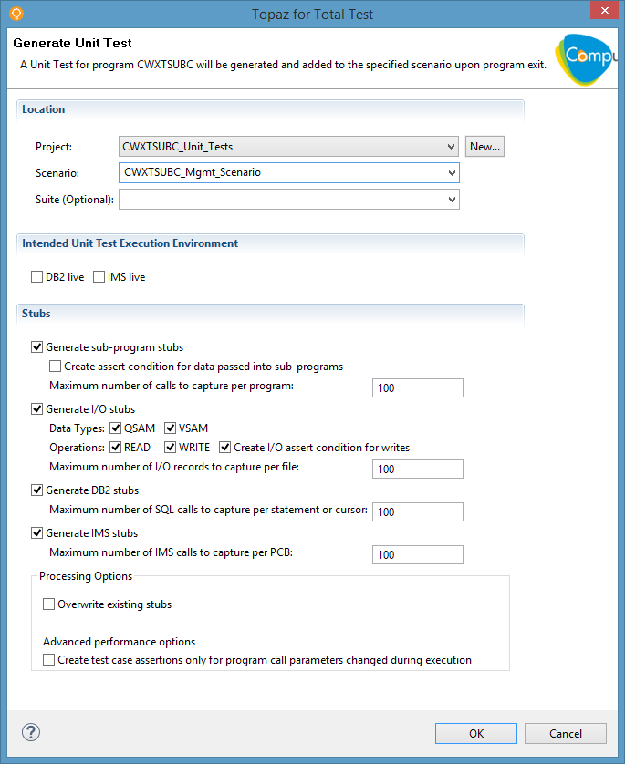
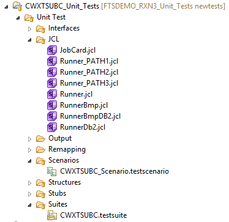
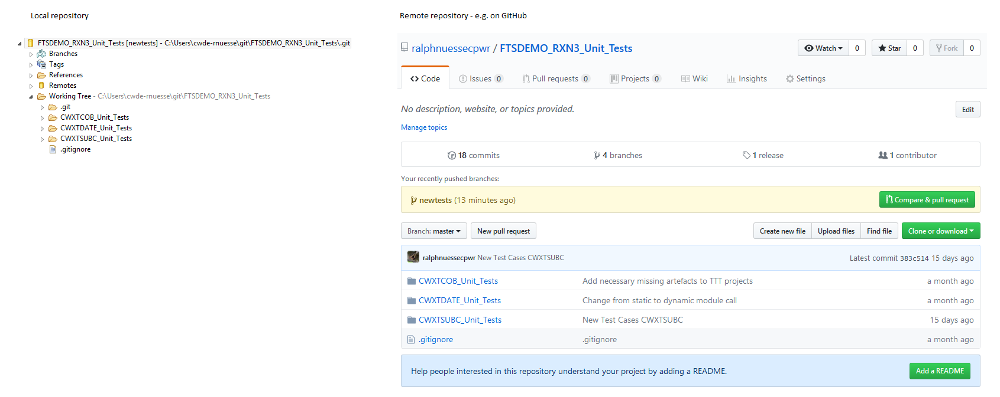

## Best Practices for Topaz for Topaz Total Unit Tests

Since most mainframe development is not green field development, the first step in working with Topaz for Total Test will be executing a program in question under control of the Xpediter debugger. During the debugging session Xpediter and Topaz for Total Test allow recording individual test cases. One such test case, in the sense of Topaz for Total Test, is one execution of a program (compile unit) from beginning (`PROCEDURE DIVISION` or `ENTRY` point) to end (e.g. `GOBACK`). It consists of:

- Input values as recorded at program `ENTRY`
- Output values as recorded at program exit (e.g. `GOBACK`)
- Assertions for the recorded output values
- Stubs (simulation data) for:
    - Sub program calls
    - File I/O, i.e. `QSAM` or `VSAM` reads and writes
    - `DB2 SQL` statement execution
        - Host variables
        - Column values
        - `SQLCODE`
    - `IMS DL/I` calls
        - PCB/ACB before and after each call (incl. `IMS STATUS-CODE`)
        - Segment Search Argument (`SSA`)
        - Segment data
- Any write stub will also create assertions for the data written to the external data source



## Structuring Tests

Topaz for Total Test allows storing one or more test case for one or more programs. It is a recommended practice, though, to create one Topaz for Total Test project per program. These projects allow grouping test cases into different scenarios (e.g. by major program branch being executed) and to define and use test suites to execute all test scenarios in one run.

## Naming conventions

In order to map Topaz for Total Test project assets, stored in Git, to program components, stored in ISPW, naming conventions are used. These should be followed already when recording the unit tests, but asset names may be changed later, after recording, to use the following naming conventions:

- The Topaz for Total Test project name uses `<Target_Program_Name>_Unit_Tests` as project name
- The test scenario files or test suite files contain the `<Target_Program_Name>` as first part of their file name, followed by an underscore `_`, follwowed by any trailing name.
- Topaz for Total Test itself requires the file extensions
    - `.testscenario` for test scenarios
    - `.testsuite` for test suites

The [Git repository](./ttt_in_git) uses `<ISPW_Stream_Name>_<ISPW_Application_Name>_Unit_Tests` as name.

## The Topaz for Total Test project structure

A Topaz for Total Test project will use the following folder structure, which will be generated and populated automatically, when the first test case gets recorded by Xpediter/Topaz for Total Test:

    <project_name>(root)                            # e.g. <Target_Program_Name>_Unit_Tests
    +- Unit Tests
        +- Interfaces                               # interfaces to programs (LINKAGE SECTION) and I/O stubs
        +- JCL                                      # jcl 'members' for the execution of tests
        +- Scenarios                                # test scenarios
        +- Structures                               # COBOL structures (01-levels and sub-fields) making up the different interfaces
        +- Stubs                                    # Simulation data for sub-programs and external I/O
        +- Suites                                   # test suite(s) executing one or more test scenarios



## The runner.jcl

When using Xpediter/Topaz for Total Test to record test cases, the `JCL` folder will contain sample `JCL` code which is required to execute the Topaz for Total Test driver program `TTTRUNNR`. As of now, Topaz for Total Test cannot create stub data for 100% of all  `SQL` statements or `DL/I` calls. Therefore, test execution of some programs will require a "mixed" mode - partly stubbed, partly using life data. For these situations the following sample `JCL`is generated:

- `RunnerBmp.jcl` for tests of `IMS` programs in "mixed" mode
- `RunnerBmpDB2.jcl` for tests of `DB2/IMS` programs in "mixed" mode
- `RunnerDb2.jcl` for tests of `DB2` programs in "mixed" mode

In case all I/O can be stubbed, the `Runner.jcl` can be used as a template for the test execution `JCL`.

Due to the design of the example application, there are three paths through the development stages. Therefore, there will be three different `STEPLIB` concatenations to use in the Topaz for Total Test `runner.jcl`. The approach taken in the example is to have three different versions of the `runner.jcl` each using a different `STEPLIB` concatenation. The code of the pipeline will determine which `jcl` to use.

- `Runner_PATH1.jcl` is used for the path from `DEV1` to `PRD`
- `Runner_PATH2.jcl` is used for the path from `DEV2` to `PRD`
- `Runner_PATH3.jcl` is used for the path from `DEV3` to `PRD`


```jcl
//RUNNER EXEC PGM=TTTRUNNR

//STEPLIB  DD DISP=SHR,DSN=SYS2.CW.&CWGACX..SLCXLOAD
//         DD   DSN=CEE.SCEERUN,DISP=SHR
//         DD   DISP=SHR,DSN=SALESSUP.RXN3.DEV2.LOAD
//         DD   DISP=SHR,DSN=SALESSUP.RXN3.QA2.LOAD
//         DD   DISP=SHR,DSN=SALESSUP.RXN3.STG.LOAD
//         DD   DISP=SHR,DSN=SALESSUP.RXN3.PRD.LOAD

```

## Adding new test cases

New test cases may be added to an existing test scenario by duplicating existing test cases and modifying the input and assertion data (based on any new requirements). Refer to the Topaz for Total Test online help for more details.

## Storing the Topaz for Total Test project in Git/GitHub

The recommended procedure to share Topaz for Total Test projects across teams and to use them in automation pipelines is storing these projects in Git/GitHub repositories.

