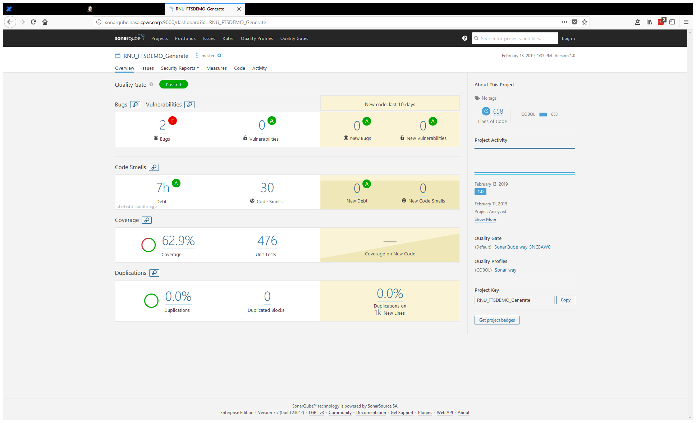
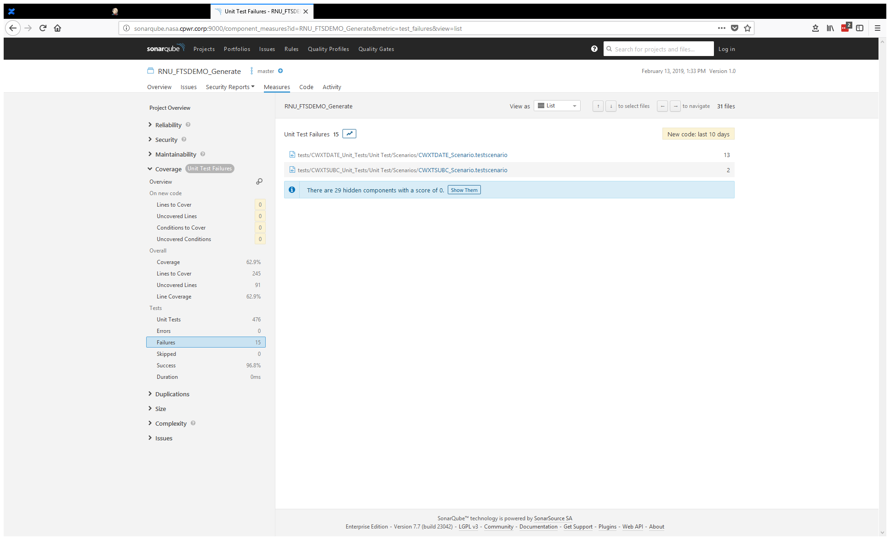
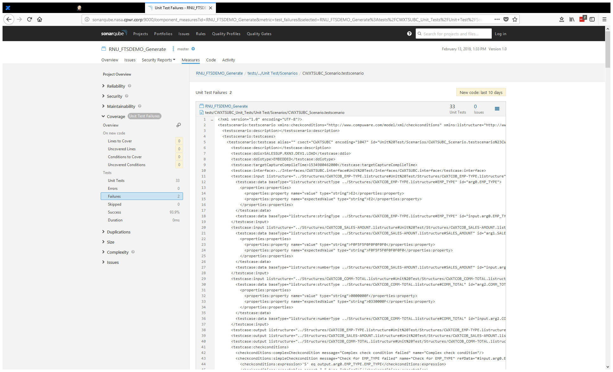
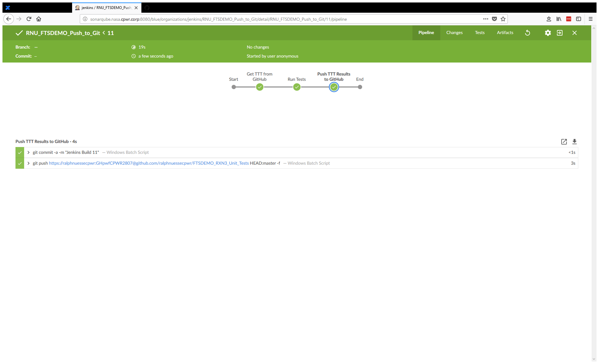
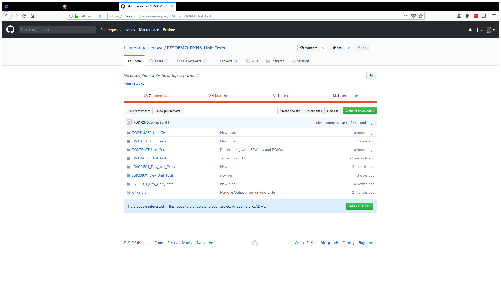
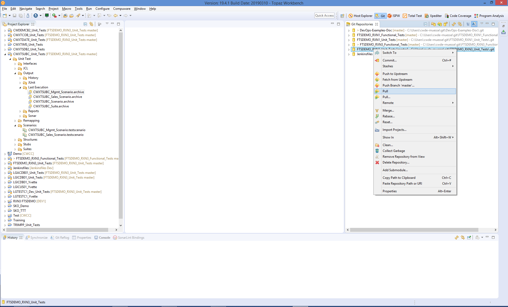
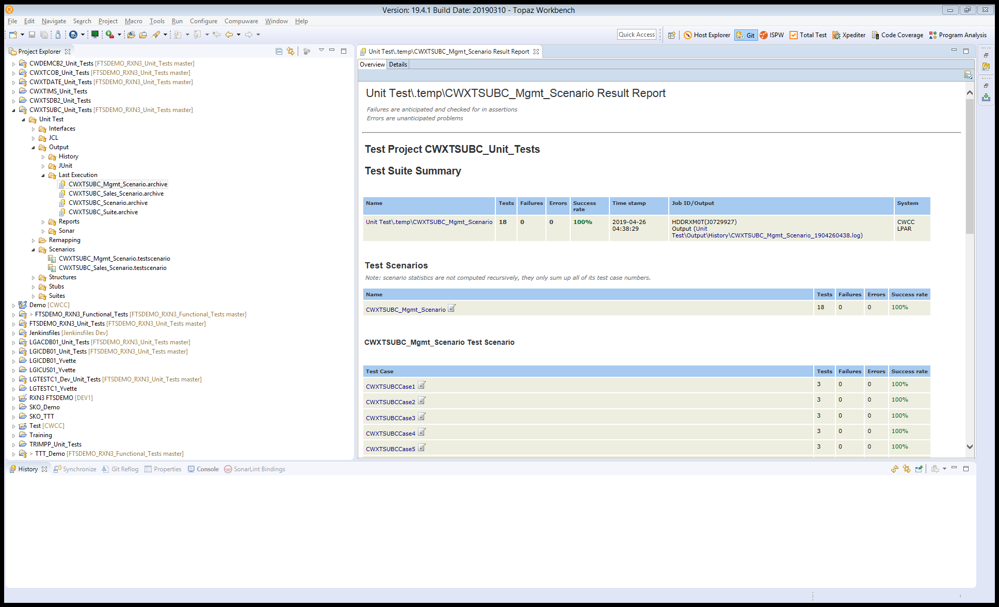

# Pushing Topaz for Total Test unit test results to GitHub
This is a simple pipeline demonstrating a solution developed for a customer specific problem.

## Problem to solve

When using Topaz for Total Test unit tests and SonarQube to analyze the results, the SonarQube dashboard will tell users how many cases (assertions) have been executed.

Drilling down into the test cases will also tell how many assertions have passed and how many have been failed. This also allows defining and using SonarQube quality gates.

The problem arises when users would like to see more details. E.g. when selecting a failed test scenario to find out which assertions failed, SonarQube will only show the raw xml that defined the test scenario and assertions, but it does not show the assertions (name, definition etc.) themselves.

This in part due to the way Topaz for Total Test stores and uses test and assertion definitions. The execution results passed to Sonar refer to these definition files. Other than in JUnit they are not defined as code but defined using xml, which SonarQube is not able to “understand”. Resolving this issue on the product level would require a considerable change in Topaz for Total Test’s architecture, since the assertion definitions are used not only for reporting but primarily used for execution of the tests.

## Idea

The idea of this work around is to make use of the reporting capability in Topaz for Total Test itself and of the fact that Compuware and most of our customers use GitHub (or any other server edition of Git) to store, share, and make Topaz for Total Test unit tests available to Jenkins. Whenever I refer to “GitHub” in the following description, read “GitHub or similar”. Since, prior to executing the tests, they need to be downloaded from GitHub. This means cloning the underlying Git repository (completely or partly using a sparse checkout), which in turn means, the resulting project in the Jenkins workspace is a fully functional Git repository. Any changes to the project appearing on the Jenkins server can be pushed back to GitHub.

Every time a user executes a test scenario or suite, Topaz for Total Test generates a set of reports that can be used for analysis. These reports are stored in the Output in different sub folder using different formats, depending on further purposes. These are

- As *.archive* files in the *Last Execution* folder. This is the format that Topaz for Total Test uses after execution of a scenario in the Eclipse UI.
- As *.xml* files in the *JUnit* folder. This is standard JUnit format.
- As *.xml* files in the *Sonar* folder. This is the format passed to SonarQube.
- As *.html* files in the *Reports* folder. This format can be used to publish reports on a web page using a web server.

This means, after execution of the Topaz for Total Test unit tests inside Jenkins, we add another step that pushes the results of the unit tests back to GitHub. (For an example of the code, see below.)

::: warning
For the commit and push to pick up changes in the reports, you need to make sure, that any *.gitignore* files do not include the Output folder or at least the Last Execution folder
:::

After execution of the job the resulting reports are available on the GutHub repository. The example code uses commit message *Jenkins build xx* as can be seen for the Topaz for Total Test project *CWXTSUBC_Unit_Tests*:

If a user needs to analyze the results of a test execution, since Sonar reported failures, they can pull the results of the execution back to their workspace.

And review the results in their Eclipse UI.

## Code

The code is published as [jenkinsfile](https://github.com/cpwr-devops/DevOps-Examples/tree/master/src/Jenkinsfile/Push_TTT_results_to_Git.jenkinsfile). The important part is the last `stage("Push TTT Results to GitHub")`.
<!--stackedit_data:
eyJoaXN0b3J5IjpbMTg5MDUyNzA3MF19
-->