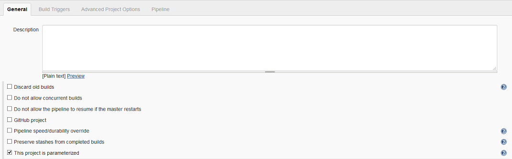
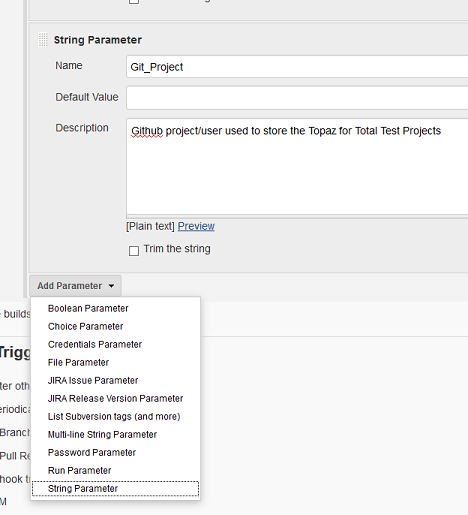
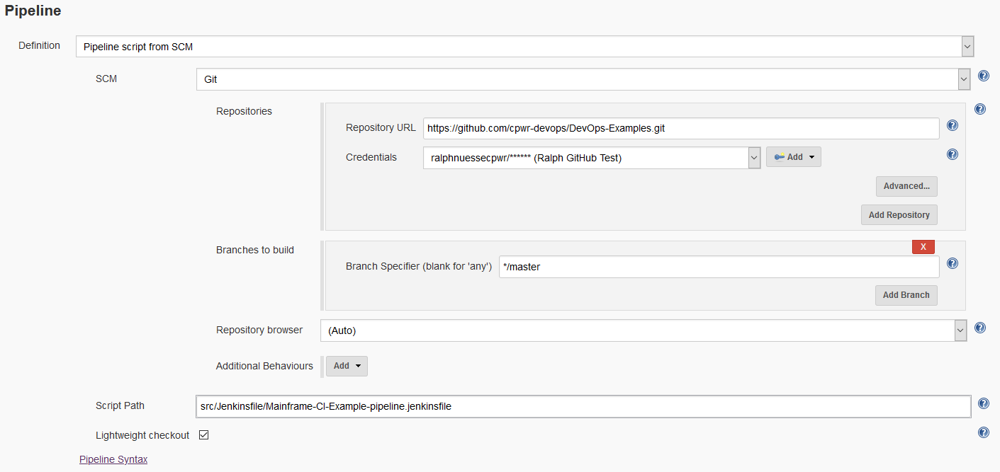

# Basic CI Pipeline

The pipeline described here will be triggered [after a developer has promoted their code in ISPW](../pipelines/basic_scenario.md) from `DEV` to `QA` within an ISPW application. The container resulting from the promote, and subsequent triggering of this pipeline, will be the ISPW set  generated by the promote. The pipeline will implement the [general process steps](../pipelines/basic_scenario.md#ci-pipeline-job).

## Setting up the pipeline job

The pipeline (???) job itself is defined within Jenkins by creating a new pipeline job. It is important, to make sure that the resulting job uses parameters by checking the `This project is parameterized' box.



### The pipeline parameters

Successively add the following string parameters (default values are used in the examples).



The parameters in this first set are specific to the individual execution of the pipeline and get passed by the [ISPW Webhook](../tool_configuration/webhook_setup.md)

Name | Default Value | Description
---- | ------------ | -----------
`ISPW_Stream` | FTSDEMO | ISPW Stream Name
`ISPW_Application` | RXN3 | ISPW Application
`ISPW_Src_Level` | DEV1 | ISPW Level the promote has been started from
`ISPW_Release` |  | ISPW Release Name
`ISPW_Assignment` |  | ISPW Assignment
`ISPW_Set` | | ISPW Set ID
`ISPW_Container_Type` | 0 | ISPW Container Type (0. - assignment, 1. - release, 2. - set)
`ISPW_Owner` | | ISPW Owner User ID

The second set of parameters are installation specific settings, reference tokens, and other IDs that have been defined during the configuration phase in Jenkins. To determine the appropriate values to use, refer to the [description of the pipeline parameters](../advanced_pipelines/parameters.md).

Name | Description
---- | -----------
`CES_Token` | Jenkins internal Token ID for the CES Token
`HCI_Conn_ID` | Jenkins internal ID for HCI Connection
`HCI_Token` | Jenkins internal ID for HCI Token
`CC_repository` | Code Coverage Repository - Check with your Xpediter Code Coverage administrator for the name to use
`Git_Project` | Github (or other Git based repository) project used to store the Topaz for Total Test Projects

## Loading the script from GitHub

Instead of using a Pipeline script and placing the pipeline code into the Script text box, the pipeline uses a Pipeline from SCM stored in GitHub. Make sure to use the proper GitHub (or other Git server version) branch, path, and file name to point to the script file. The example uses the `master` branch and file `src\Jenkinsfile\Mainframe-CI-Example-pipeline.jenkinsfile`.



## Jenkins Pipeline Script

Once this pipeline has been triggered, the pipeline will execute the following code implementing the previously described steps.

### Global Variables

The first part initializes global variables that are specific to the environment the pipeline executes in:

Name | Description
---- | -----------
`Git_Credentials` | Jenkins credentials token to be used to connect to GitHub
`Git_URL` | URL to the GitHub project containing the repository storing the TTT projects
`Git_TTT_Repo` | Name of the repository
`Git_Branch` | GitHub branch to use for accessing the TTT scenarios
`SQ_Scanner_Name` | Name of the Sonar Scanner as defined in Jenkins `Manage Jenkins`->`Global Tools Configuration`->`SonarQube Scanner`
`SQ_Server_Name` | Name of the SonarQube server configuration in Jenkins `Manage Jenkins`->`Configure System`->`SonarQube servers`
`SQ_Project` | Name of the SonarQube project to use
`MF_Source` | Folder that the ISPW download plugin will download the sources to
`XLR_Template` | Name of the XLRelease release template to use when triggering the releas
`XLR_User` | Jenkins credentials token to use to connect to XLRelease
`TTT_Folder` | The code will download the TTT projects to this sub folder of the Jenkins workspace
`ISPW_URL` | URL for the CES to execute ISPW REST API calls
`ISPW_Runtime` | ISPW runtime configuration to use
`mailRecipientMap` | [Groovy Map]() to store ISPW Owner Ids (TSO user id) and email addresses

```groovy
String Git_Credentials      = "github"
String Git_URL              = "https://github.com/${Git_Project}"
String Git_TTT_Repo         = "${ISPW_Stream}_${ISPW_Application}_Unit_Tests.git"
String Git_Branch           = "master"
String SQ_Scanner_Name      = "scanner"
String SQ_Server_Name       = "localhost"  
String SQ_Project           = "${JOB_NAME}"
String MF_Source            = "MF_Source"
String XLR_Template         = "A Release from Jenkins"
String XLR_User             = "admin"
String TTT_Folder           = "tests"
String ISPW_URL             = "http://cwcc.compuware.com:2020"
String ISPW_Runtime         = "ispw"

Map    mailRecipientMap     = ["HDDRXM0":"ralph.nuesse@compuware.com"]
```

### Node and Stages

The node statement tells Jenkins which node (agents in a Jenkins network) to use. It may be used to distribute work, run jobs in parallel, or run steps in a job in parallel. This pipeline will use one node with several stages. All variables defined within the node are local to the node and available to all stages therein.

```groovy
node{
```

### Initialization

The example application uses three parallel paths (`DEV1`, `DEV2`, `DEV3`). In order to use the correct STEPLIB concatenation in the Topaz for Total Test `runner.jcl` there are three versions of the JCL file in each Topaz for Total Test project used. To determine the correct JCL file to use, the script determines the current path from the ISPW level being passed to the pipeline. Using the path number, the name for the runner JCL to be used is being built and the next level in the path being determined.

```groovy
    def PathNum              = ISPW_Src_Level.charAt(ISPW_Src_Level.length() - 1)
    def TTT_Jcl              = "Runner_PATH" + PathNum + ".jcl"
    def ISPW_Target_Level    = "QA" + PathNum
```

Get the email address of the owner of the promotion set from the map of mail recipients.

```groovy
    def mailRecipient        = mailRecipientMap[(ISPW_Owner.toUpperCase())]
```

### Stage # - Clear out the workspace

This stage cleans out the workspace from any previous runs of the pipeline. The call to `dir(...)` sets the location to the root of the workspace. Any code within the code block is executed in relation to this location. Therefore, the `deleteDir()` will delete the current directory including all sub folders.

```groovy
    stage("clean previously downloaded source")
    {
        dir("./")
        {
            deleteDir()
        }
    }
```

### Stage # - Download sources from ISPW

This stage downloads all COBOL sources and COBOL copybooks from ISPW (the mainframe) that are part of the set triggering this specific pipeline execution, using the ISPW Container downloader. The code has been generated by the Jenkins Syntax Generator using "Sample step": *Checkout*, "SCM": *ISPW Container*.

```groovy
    stage("Retrieve Code From ISPW")
    {
        checkout([
            $class: 'IspwContainerConfiguration',
                componentType:      '',
                connectionId:       "${HCI_Conn_ID}",
                credentialsId:      "${HCI_Token}",
                containerName:      "${ISPW_Assignment}",
                containerType:      "${ISPW_Container_Type}",
                ispwDownloadAll:    false,
                serverConfig:       '',
                serverLevel:        ''
        ])
    }
```

### Stage # - Download Topaz for Total Test assets from GitHub

This stage use a Git clone to download the Topaz for for Total Test assets for the ISPW stream and application. The convention used in the example is that the name of the repository is made up from the stream name and application name, e.g. `FTSDEMO_RXN3_Unit_Tests`. The code has been generated by the Jenkins Syntax Generator using "Sample step": *Checkout*, "SCM": *Git*.

```groovy
    stage("Retrieve Tests")
    {
        def Git_Repo_URL = "${Git_URL}/${Git_TTT_Repo}"

        checkout changelog: false, poll: false,
            scm: [$class: 'GitSCM',
            branches: [[name: "*/${Git_Branch}"]],
            doGenerateSubmoduleConfigurations: false,
            extensions: [[$class: 'RelativeTargetDirectory', relativeTargetDir: "${TTT_Folder}"]],
            submoduleCfg: [],
            userRemoteConfigs: [[credentialsId: "${Git_Credentials}", name: 'origin', url: "${Git_Repo_URL}"]]]
        }
```

### Build list of scenarios to execute

For the following, we need to determine the list of test scenarios to be executed. This example will execute only those scenarios that apply to one of the COBOL components that have been downloaded.
The list of downloaded component files gets determined by the `findFiles` method provided by the [Pipeline Utility Steps Plugin](). The result is a list of `file` objects. Using the `name` property of each of the files, the program names can be determined and placed in a list of program names.

```groovy
    def ListOfSources  = findFiles(glob: "**/${ISPW_Application}/${MF_Source}/*.cbl")
    def ListOfPrograms = []
    
    ListOfSources.each
    {
        ListOfPrograms.add(it.name.substring(0, it.name.indexOf('.cbl')))
    }
```

Second the `findFiles`method is being used to determine the list of all `.testscenario` files.

```groovy
    def TTTListOfScenarios = findFiles(glob: '**/*.testscenario')
```

### Stage - Execute the test scenarios

This stage match will loop through all test scenario files determined previously. For each such file it will determine the project folder containing it and the name of the target program. The example uses the convention that the name of the target program is part of the `.testscenario` file, e.g. `CWXSUBC_Mgmt_Scenario.testscenario`. Using the name of the target program it will check, if that name is contained in the list of downloaded programs. In that case, the test scenario is being executed (`step([ $class: 'TotalTestBuilder'...`). The code for this latter has been generated by the Jenkins Syntax Generator using "Sample step": *totaltestUT*.

After the execution of each scenario the Topaz for Total Test plugin will copy the results in formats both for SonarQube and JUnit into corresponding folders `TTTSonar` and `TTTUnit`. These results can later be consumed by plugins for either tool.

```groovy
    stage("Execute related Unit Tests")
    {
        TTTListOfScenarios.each
        {
            def TTTScenarioPath        = it.path
            def TTTProjectName         = TTTScenarioPath.substring(0, TTTScenarioPath.indexOf('\\Unit Test'))
            def TTTScenarioFullName    = it.name
            def TTTScenarioName        = TTTScenarioFullName.substring(0, TTTScenarioFullName.indexOf('.testscenario'))
            def TTTScenarioTarget      = TTTScenarioName.substring(0, TTTScenarioName.indexOf('_'))

            if(ListOfPrograms.contains(TTTScenarioTarget))
            {
                println "*************************"
                println "Scenario " + TTTScenarioFullName
                println "Path " + TTTScenarioPath
                println "Project " + TTTProjectName
                println "*************************"

                step([
                    $class: 'TotalTestBuilder',
                        ccClearStats:   false,
                        ccRepo:         "${CC_repository}",
                        ccSystem:       "${ISPW_Application}",
                        ccTestId:       "${BUILD_NUMBER}",
                        credentialsId:  "${HCI_Token}",
                        deleteTemp:     true,
                        hlq:            '',
                        connectionId:   "${HCI_Conn_ID}",
                        jcl:            "${TTT_Jcl}",
                        projectFolder:  "${TTTProjectName}",
                        testSuite:      "${TTTScenarioFullName}",
                        useStubs:       true
                ])
            }
        }
```

After execution of the test scenarios, the results are being passed to the JUnit plugin. This will generate a diagram showing development of the test results over time. Also, it allows to drill into the test results to determine which test cases and assertions failed.

```groovy
        junit allowEmptyResults:    true, 
            keepLongStdio:          true, 
            testResults:            "TTTUnit/*.xml"
    }
```

### Stage - Download Code Coverage results after test execution

This stage will download the code coverage results stored in the Xpediter Code Coverage repository on the mainframe to the Jenkins workspace. The results will be placed in the `Coverage` subfolder.
During download the plugin matches the downloaded source for each program it finds coverage data for against the corresponding DDIO file. This way it makes sure that code coverage information ending up in SonarQube actually flags the right statements as not being executed or being executed. Therefore the parameter `cc.sources` is required to point to the folder containing the downloaded sources.
The properties defined by the `cc.` parameters need to be one parameter per line, therefore `\r` is being used.
The code for downloading the code coveragre results has been generated by the Jenkins Syntax Generator using "Sample step": *step*, "Build step": *Retrieve Xpediter Code Coverage Statistics*.

```groovy
    stage("Collect Coverage Metrics")
    {
            def String sources   ="${ISPW_Application}\\${MF_Source}"

            def ccproperties     = 'cc.sources=' + sources +
                '\rcc.repos=' + CC_repository +
                '\rcc.system=' + ISPW_Application  +
                '\rcc.test=' + BUILD_NUMBER +
                '\rcc.ddio.overrides=' + ccDdioOverrides

            step([
                $class: 'CodeCoverageBuilder',
                    analysisProperties:     ccproperties,
                    analysisPropertiesPath: '',
                    connectionId:           "${HCI_Conn_ID}",
                    credentialsId:          "${HCI_Token}"
            ])
    }
```

### Stage - Pass data to SonarQube using Sonar Scanner

This stage will pass the downloaded COBOL sources, the results of the unit tests, and code coverage metrics to SonarQube using the Sonar Scanner.
The `tool` method returns the installation path of to the Sonar Scanner. `withSonarQubeEnv` retrieves information about the SonarQube server, which in then does not need to be specified via parameters for the Sonar Scanner.
Since the Topaz for Total Test plugin creates one result file per testscenario, the location and name of all these files need to be passed to the Sonar Scanner via the `sonar.testExecutionReportPaths` parameter. The value will have to be a comma separated list of path and file names which is being built in the initial stage.

```groovy
    stage("Check SonarQube Quality Gate") 
    {
        def scannerHome = tool "${SQ_Scanner_Name}";

        withSonarQubeEnv("${SQ_Server_Name}")
        {
            def TTTListOfResults     = findFiles(glob: 'TTTSonar/*.xml')
            def SQ_TestResult        = ''

            TTTListOfResults.each 
            {
                def TTTResultName    = it.name   // Get the name of the Total Test results file   
                SQ_TestResult = SQ_TestResult + "TTTSonar/" + it.name +  ',' // Append the results file to the property
            }

            bat "${scannerHome}/bin/sonar-scanner" +
                " -Dsonar.projectKey=${JOB_NAME}" +
                " -Dsonar.projectName=${JOB_NAME}" +
                " -Dsonar.projectVersion=1.0" +
                " -Dsonar.sources=${ISPW_Application}\\${MF_Source}" +
                " -Dsonar.cobol.copy.directories=${ISPW_Application}\\${MF_Source}" +
                " -Dsonar.cobol.file.suffixes=cbl,testsuite,testscenario,stub -Dsonar.cobol.copy.suffixes=cpy " +
                " -Dsonar.tests=" + TTT_Folder +
                " -Dsonar.testExecutionReportPaths=" + SQ_TestResult +
                " -Dsonar.sourceEncoding=UTF-8" +
                " -Dsonar.coverageReportPaths=Coverage/CodeCoverage.xml"
        }
```

After the results have been passed to SonarQube, query the resulting Sonar quality gate, by registering a Sonar Webhook call back. `timeout` will wait up to the specified time for the results of the quality gate to be returned.

```groovy
        timeout(time: 2, unit: 'MINUTES') 
        {
            def qg = waitForQualityGate()
```

The results can be queried by the `status` property. If the status is not okay, i.e. the quality gate failed, the assignments corresponding to the set will be regressed using the [`ISPW operation plugin`](), an email is sent to the owner of the set, and the pipeline being aboorted using the `error` method.
The code to regress the assignment has been generated by the Jenkins Syntax Generator using "Sample step": *ispwOperation*.

```groovy
            if (qg.status != 'OK')
            {
                echo "Sonar quality gate failure: ${qg.status}"
                echo "Pipeline will be aborted and ISPW Assignment(s) will be regressed"

                ispwOperation connectionId: HCI_Conn_ID,
                    consoleLogResponseBody: true,
                    ispwAction: 'RegressAssignment',
                    ispwRequestBody: """assignmentId=${ISPW_Assignment}
                        level=${ISPW_Target_Level}
                        """,
                    skipWaitingForSet: true

                emailext subject:       '$DEFAULT_SUBJECT',
                            body:       '$DEFAULT_CONTENT',
                            replyTo:    '$DEFAULT_REPLYTO',
                            to:         "${mailRecipient}"


                error "Exiting Pipeline"
            }
        }
    }
}
```

### Stage - Trigger XLRelease release

If the quality gate passes, i.e. the pipeline does not get aborted, an XL Release template will be triggered - using the XL Release plugin - to execute CD stages beyond the Jenkins pipeline. The code has been generated by the Jenkins Syntax Generator using "Sample step": *xlrCreateRelease*.

```groovy
    stage("Start release in XL Release")
    {
        def XLRPath = "QA" + PathNum

        xlrCreateRelease(
            releaseTitle:       'A Release for $BUILD_TAG',
            serverCredentials:  "${XLR_User}",
            startRelease:       true,
            template:           "${XLR_Template}",
            variables:          [
                                    [propertyName:'ISPW_Dev_level', propertyValue: "${ISPW_Target_Level}"],
                                    [propertyName: 'ISPW_RELEASE_ID', propertyValue: "${ISPW_Release}"],
                                    [propertyName: 'CES_Token', propertyValue: "${CES_Token}"]
                                ]
        )
    }
}
```
<!--stackedit_data:
eyJoaXN0b3J5IjpbMTcwNjk1ODU2MywtMjA2NTc0NzI3NiwtMT
cwNjM2NzY3MiwtMTY2NTE4NTk2Nl19
-->