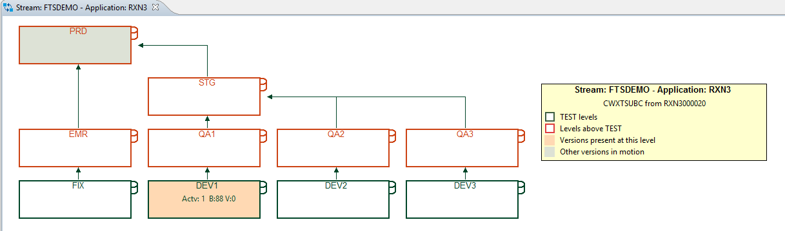

# Basic Continuous Integration (CI) Scenario

The pipeline examples make use of Compuware's and other plugins to implement the following process and scenario. They can be used to create a standardized approach for implementing a CI process for mainframe development. The scenario(s) and code are based on requests and requirements from customers who already have started implementing their own pipeline and asked Compuware for advice. Regardless of the tool in use to implement a CI strategy, the process we encounter or have helped implement at our customers always looks similar to what we describe here.

The code we share here to implement these process steps, shows Compuware's example approach to these requirements. It does not necessarily reflects actual customer implementations, and is - in parts considerably - different than those implementations.

The Jenkins examples will help mainframe developers to familiarize themselves with [Groovy](http://groovy-lang.org/documentation.html) and its concepts, as well as demonstrate some of the [idiosyncrasies of the Jenkins Groovy dialect](../guidelines/jenkins_groovy) that we come across.

The Azure DevOps Pipeline example, and underlying Powersheel scripts, illustrate that you are not limited to Jenkins when implementing a mainframe-based CI process.  

## Developer's tasks

### Step 1 - Checking out Code
In Topaz a developer [checks out a set of sources, copybooks and other components](../guidelines/ispw/ispw_setup.md) required to fulfill a specific requirement.

### Step 2 -  Creating/Maintaining Unit Tests
In Topaz [Topaz for Total Test](../guidelines/ttt/ttt_scenario.md) the developer creates or modifies a set of unit tests for the modified programs. In order to share the unit tests between development teams and to use them in Jenkins, the Topaz for Total Test projects are stored and administered using Git/GitHub.

### Step 3 - Promote Code
In Topaz, once the developer has finished working on the code, they promote their changes from the `DEV` level to `QA`, the next level in the application's life cycle.

::: tip Note
The IPSW life cycle of the application used for these examples consists of three parallel development paths (`DEV1`, `DEV2`, and `DEV3`). At certain points in the implementation you will need to know the actual path of the life cycle that the developer is working in.
:::

### Step 4 - Trigger an ISPW webhook
In ISPW, the promotion from the `DEV` level to the `QA` level in ISPW automatically creates an ISPW set containing all components that are part of this specific promotion. Once the promotion completes, ISPW triggers a Jenkins job that executes a series of automated steps.  The Jenkins job is triggered via a [Webhook](../tool_configuration/webhook_setup.md).  The webhook also passes [Parameters](../advanced_pipelines/parameters.md) to the Jenkins job to control the execution.

### Step 5 - Trigger a CI pipeline job
In Jenkins or similar a pipeline job or build gets triggered automatically.  

## CI pipeline job
While there might be differences in details when it comes to the individual implementation examples, certain "stages" are common, as depicted [at the top of this page](#basic-continuous-integration-ci-scenario). We provide some examples here: 
  - **Self-contained pipeline**: For a simple self-contained pipeline example using Jenkins, follow the [description for implementing a basic pipeline](./basic_example_pipeline.md) using the code in [`Mainframe-CI-Example-pipeline`](https://github.com/cpwr-devops/DevOps-Examples/blob/master/src/Jenkinsfile/Mainframe-CI-Example-pipeline.jenkinsfile).
  - **Enterprise grade pipeline**: For a more realistic enterprise grade example [using Jenkins shared libraries](../advanced_pipelines/readme.md#mainframe-ci-pipeline-from-shared-lib) use the code in [`Mainframe_CI_Pipeline_from_Shared_Lib`](https://github.com/cpwr-devops/DevOps-Examples/blob/master/vars\Mainframe_CI_Pipeline_from_Shared_Lib.groovy).
  - **Non-Jenkins pipeline**: For an example using [Azure DevOps Pipelines](./alternatives_to_jenkins.md#an-example-using-azure-devops-pipelines) - the [Compuware Command Line Interface](../apis/topaz_cli.md) and [REST APIs](../apis/rest_api.md) maybe used. [`mainframe_ispw`](https://github.com/cpwr-devops/DevOps-Examples/blob/master/src\misc-examples\AzureDevOps\PipelineYAML\mainframe_ispw.yaml) makes use of the CLI and REST API, using Powershell scripts "wrapped" around these calls.

### Step 1 - Retrieve mainframe sources
The ultimate goal of this process is to use SonarQube quality gates to determine if the promoted code is ready to be released. For SonarQube to work, it needs the source code. The source code will be downloaded in one of the early steps (often the first step) of the pipeline. 

### Step 2 - Retrieve Topaz for Total Test Unit Tests
Topaz for Total Test Unit Test assets are stored in a Git server repository and need to be downloaded to the Jenkins workspace.

### Step 3 - Execute Unit Tests
This step will execute the downloaded unit tests. Determining which tests to download or which tests to execute may vary based on the requirements of the individual implementation. The examples show how to download every Topaz for Total Test project and execute only those test scenarios that belong to the programs that have been promoted by the developer.

### Step 4 - Retrieve Code Coverage statistics from the mainframe
The unit tests will collect code coverage data and store the results in a Xpediter Code Coverage repository dataset on the mainframe. To be able to pass the results to SonarQube, they need to be extracted from the mainframe repository and downloaded to the mainframe.

### Step 5 - Pass results to SonarQube
The sources, test execution results, and code coverage data will be passed to SonarQube for analysis.

### Step 6 - Check Quality Gate results
The analysis will be checked against a SonarQube quality gate definition. Based on the result of the quality gate check (`pass` or `fail`) further actions will be taken.

### Step 6a - On Failure - Regress code in ISPW
If the quality gates `failed`, usually the code that has been promoted will be regressed (and the responsible personnel will be informed about the failure)-

### Step 6b - On success - Trigger a CD release
If the quality gate `passed` the code is ready to be passed onward in the application life cycle. The Jenkins example will trigger a release in XLRelease, while the Azure DevOps example will trigger an Azure DevOps release pipeline.
<!--stackedit_data:
eyJoaXN0b3J5IjpbMTA0ODEyODE0MSwxNDQ2Nzg0MDE4LC0yMD
k2MTI1Nzg2LC00OTc4ODMzODVdfQ==
-->