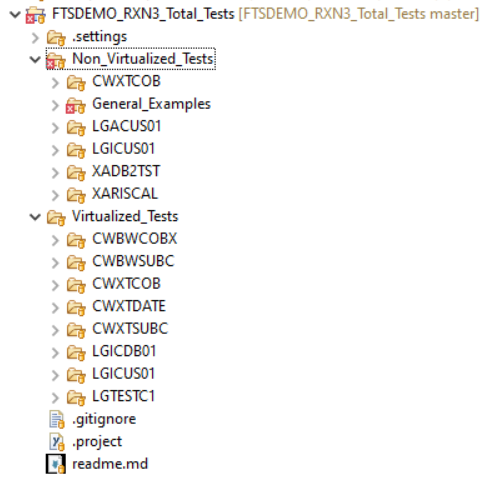

# Getting Started

To get started building your own mainframe DevOps pipeline, we have provided pipeline examples and setup instructions using Jenkins. To implement a pipeline using other tools, refer to  [Mainframe CI using alternatives Jenkins](https://devops.api.compuware.com/pipelines/alternatives_to_jenkins.html).

Example code and documentation are provided for:
-   A suggested starting point for Jenkins CI pipelines
-   Compuware and 3rd party tools used in the pipelines
-   Instructions setting up and configuring Jenkins and SonarQube
-   Code snippets or sample code for:
	- general purpose for use in Jenkins
	- making use of the  [ISPW REST API](https://devops.api.compuware.com/apis/rest_api.html)  and  [Topaz CLI](https://devops.api.compuware.com/apis/topaz_cli.html), which may be  [used in tools other than Jenkins](https://devops.api.compuware.com/pipelines/alternatives_to_jenkins.html).

::: warning
The code published serves as example code, using Compuware example applications and environments. It needs to be adjusted to site specific needs and requirements.
:::

::: tip Note
The descriptions and tutorials assume a certain level of familiarity with using Jenkins, Topaz for Total Test and other Compuware tools. The required level of knowledge expected, is not too high. E.g. it helps to know, how to define a new job in Jenkins.
:::

## Code examples

Code examples are stored in this GitHub repository [https://github.com/cpwr-devops/DevOps-Examples/](https://github.com/cpwr-devops/DevOps-Examples/).

### Pipeline examples

We have published several examples of "complete" pipelines which show different process steps and techniques in Jenkins.

- **[Mainframe-CI-Example-pipeline](./basic_scenario.md)** - ([jenkinsfile](https://github.com/cpwr-devops/DevOps-Examples/tree/master/src/Jenkinsfile/Mainframe-CI-Example-pipeline.jenkinsfile)) - a scripted pipeline using parameters. This is a simple approach to a DevOps pipeline that allows you to get up and going quickly, but may not be the best when scaling pipelines across your enterprise. The job is intended to be triggered [after promoting code within ISPW](../pipelines/basic_scenario.md)

  ::: tip Note
  This pipeline serves as the model for most of the other pipelines examples. Meaning, other pipelines follow the same structure, implementing bascially the process and just differing in nuances, e.g. the types of test being executed at different stages of the development process, and demonstrating certain techniques that proved to be helpful.
  :::

- **[Mainframe_CI_Pipeline_from_Shared_Lib](../advanced_pipelines/readme.md#mainframe-ci-pipeline-from-shared-lib)** - ([groovy](https://github.com/cpwr-devops/DevOps-Examples/blob/master/vars/Mainframe_CI_Pipeline_from_Shared_Lib.groovy)) - a pipeline loaded from a Jenkins shared library.  Shared Libraries are a useful approach to scale pipelines across an enterprise since it moves the bulk of the pipeline logic to shared components that individual pipelines can reference as steps.  This allows organizations to develop pipelines in a more standard way.  The job is also intended to be triggered [after promoting code within ISPW](../pipelines/basic_scenario.md).

  ::: tip Note
  Thanks to the [changes in the Compuware CLI and plugins](#what-has-changed-in-april-2021) the complexity of the code required to implement such a pipeline has been reduced so much that the use of *helper classes* does not seem to be necessary anymore. Older versions of this pipeline made use of such classes to encapsulate some of the compleity and make the flow of the job easier to folow.
  :::

- The following two pipelines are part of a more [elaborate process](../advanced_pipelines/elaborate_scenario.md) and are triggered at different stages of that process
    - **[Mainframe_Generate_Pipeline.groovy](https://github.com/cpwr-devops/DevOps-Examples/tree/master/vars/Mainframe_Generate_Pipeline.groovy)** - a pipeline that is triggered by an ISPW Generate that executes unit tests against those components that have been generated.
    - **[Mainframe_Integration_Pipeline.groovy](https://github.com/cpwr-devops/DevOps-Examples/tree/master/vars/Mainframe_Integration_Pipeline.groovy)** - a pipeline that is triggered by an ISPW Promote that executes functional/integration tests against the project/assignment.

  ::: tip Note
  Also using the Shared Library technique, these two example show how Shared Library scripts can be used for modularization and re-use of exeisting code to implement such more elaborate processes.
  :::

### Other Code examples

Next to the pipeline examples, we also publishe code snippets and short Jenkins jobs that demonstrate individual features and use cases of the Compuware plugins or CLIs.

The GitHub repository is organized as follows:
- ***vars* folder**: example pipelines using Shared Library technology.
- ***src* folder**: class definitions for code related to these pipelines.
-  `src/Jenkinsfile` folder: example code not directly related, but that *define Jenkins jobs*. Currently these are:
    - [JCL_Pipeline_Example](https://github.com/cpwr-devops/DevOps-Examples/tree/master/src/Jenkinsfile/JCL_Pipeline_Example.jenkinsfile) contains a simple example of mainframe jobs being submitted from Jenkins — both with the JCL residing on the mainframe and the JCL stored/generated in the pipeline code itself.
    - Three examples of downloading sources (COBOL programs and copybooks) from the mainframe using different download stores for the code and methods to download, pushing the sources to SonarQube using the Sonar scanner and querying the resulting Sonar Quality Gate.
        - [Scan_Sources_from_ISPW_Container_with_Sonar](https://github.com/cpwr-devops/DevOps-Examples/tree/master/src/Jenkinsfile/Scan_Sources_from_ISPW_Container_with_Sonar.jenkinsfile) - using the *container* downloader for sources stored in ISPW.
        - [Scan_Sources_from_ISPW_Repository_with_Sonar](https://github.com/cpwr-devops/DevOps-Examples/tree/master/src/Jenkinsfile/Scan_Sources_from_ISPW_Repository_with_Sonar.jenkinsfile) - using the *repository* downloader for sources stored in ISPW.
        - [Scan_Sources_from_PDS_with_Sonar](https://github.com/cpwr-devops/DevOps-Examples/tree/master/src/Jenkinsfile/Scan_Sources_from_PDS_with_Sonar.jenkinsfile) - uses the *PDS* downloader for sources stored in PDS's (inside or outside a mainframe SCM tool).
    - [Push_TTT_results_to_Git](../pipeline_snippets/push_ttt_results_to_git.md) - ([jenkinsfile](https://github.com/cpwr-devops/DevOps-Examples/tree/master/src/Jenkinsfile/Push_TTT_results_to_Git.jenkinsfile)) - shows how to push results of unit test execution back to GitHub for a developer to consume locally.
- ***misc-examples/Powershell* sub-folder**: that resides within the *src* directory of the repository, Powershell scripts and examples for using alternatives to Jenkins or the Jenkins plugins**. These scripts make use of the [ISPW REST API]() and the [Topaz CLI](), and we describe them in detail in [Mainframe CI using alternatives Jenkins](./alternatives_to_jenkins.md).

## What has changed in April 2021

Over the recent few releases of [Topaz for Total Test](../guidelines/ttt/ttt_scenario.md), the [Topaz CLI](../apis/topaz_cli.md), and the corresponding [Jenkins plugins](../tool_configuration/plugins.md), integration between different tools has been greatly improved, moving much of the complexity of implementing certain requirements from the code of the scripts into functionality provided by the plugins/CLI. Therefore, many of the example pipelines will have become far simpler, compared to the older versions, while providing the same flexibility and functionality as before. For customers this means that the coding effort and complexity of the resulting pipeline scripts has been reduced considerably.

### Topaz for Total Test project structure

Earlier versions of Topaz for Total Test Virtualized Testing required a very strict structure of the underlying project to be used. If folders were renamed, removed or where not exactly "at the right place", the scenarios became unusable. This greatly reduced flexibility when it came to combining Topaz for Total Test projects into e.g. one repository, into one encompassing project, or to combine Virtualized and Non-Virtualized scenarios into one single Test project.

Starting with Topaz for Total Test 20.04.01, Topaz for Total Test allows storing Virtualized and Non-Virtualized test scenario in any folder of a given Topaz for Total Test project. For Virtualized Test scenarios, the corresponding sub folders still need to meet the required folder structure, but with the new architecture storing Topaz for Total Test assets has become highly flexible. 

::: tip Note
It is now even possible to store mainframe code alongside Topaz for Total Test scenarios within the same Eclipse project and Git repository, when using the [Git to ISPW integration](../guidelines/ispw/GIT_to_ISPW_Integration_Tutorial.md).
:::

**Old Version folder structure** | **New Version fodler structure** | **New Version folder structure with sources**
---------------------------------|----------------------------------|----------------------------------------------
Each sub folder containing tests for a component, is a project in its own right, resulting in nested projects. Importing new test projects into an existing repository like this requires manual tweaking of .project files, making maintenance less straight forward. | Each sub folder is just a sub folder within a single project. Adding new tests for a ew component is a simple as specifying a new folder when recording the corresponding tests. | Configuring a Topaz for Total Test project to be "connected" to ISPW (or vice versa) allows storing mainfgrame code alongside tests for this code.
 |  | 
### One Topaz for Total Test CLI

Initially, following the integration of the Non-Virtualized test technology into Topaz for Total Test, there have been two different CLIs to use for execution of Topaz for Total Test scenarios. 
- A CLI for the *traditional* Topaz for Total Test Vritualized Test scenarios (f.k.a. "Unit Tests")
  
- A CLI for the new Non-Virtualized Test scenarios (f.k.a. "XATester" or "Functional Tests")
  

While the *traditional* the CLI is still available, it will be deprecated, and ultimately completely be replaced by on CLI for execution of both kinds of test scenarios. Using this one CLI bears additional advantages apart from reducing confusion as to which CLI to use for which purpose. Among these are:

### Intelligent Test Execution

If you wanted to execute test scenarios only for thos components that were affected by a "change", in the past you had to 
- determine the list of affected programs
- detremine the list of test scenarios
- match test scenarios against the list of programs
- execute matching scenarios in a loop

In contrast, with the **Intelligent Test Execution** feature any ISPW operation will automatically create a `.json` file containing information about the tasks affected by the corresponding operation. This file can be processed by the Topaz for Total Test CLI, telling it to execute any test scenario that matches any of the entries in the `.json` file. The resulting code consists of exactly one call to the Topat for Totel Test CLI.

### Runner JCL

One of the main concerns when using the *traditional* Topaz for Total Test CLI to execute Virtualized Test scenarios, was setting up the correct Runner.jcl to use. Depending on the complexity of the environment (e.g. several parallel development paths), the JCL had to modified at runtime, adding yet more complexity to the resulting pipeline scripts.

Using the one CLI in future, the "runner.jcl" can be configured and stored centrally for all scenarios of a project or even on the CES. The use of Context Variables has completely removed to modify any file content at runtime.

**Old Version runner.jcl per component** | **Local TotalTestConfiguration** | **"Runner JCL" stored in CES**
-----------------------------------------|----------------------------------|-------------------------------
Old versions of Topaz for Total Test required the runner.jcl ro be located in the JCL folder of each Topaz for Total Test project. The user had to setup the runner JCL for each project, individually, even if they old would look the same. If the environment required different load library concatenations, e.g. for parallel development paths, the best option was to create a runner JCL for each path and selecting the required one at runtime. | With version 20.04.01 of Topaz for Total Test, it allows using a central TotalTestConfiguration project, allowing to use one single JCL skeleton for each Topaz for Total Test scenario on any project/folder within the same workspace. Use of variables allows for change of load library concatenations at runtime. | Instead of storing the JCL skeleton locally in the users' workspaces, the skeleton can be stored in CES as part of a connection definition. This allows sharing of the same skeleton with every user in the environement, without them having to maintain local copies.
 |  | 

### Context Variables

Topaz for Total Test allows defining your own variables to use at runtime of a scenario. The Topaz for Total Test CLI allows setting these variables at runtime via command line parameters. This allows for high flexibility in defining scenarios for one environement and and executing them in different target environements without manual intevention or preparation by a user.

 

## Tools Used
The example pipelines use a development scenario based on:

- [ISPW](https://compuware.com/ispw-source-code-management/) as the SCM to store and govern mainframe sources
- [Git (GitHub)](https://github.com/) as the SCM to store unit test assets.
- [Topaz for Total Test](https://compuware.com/topaz-for-total-test-automation/) as the mainframe unit, functional, and integration testing tool to create and maintain test assets.
- [Xpediter Code Coverage](https://compuware.com/xpediter-mainframe-debugging-tools/) as the tool to gather code coverage data during execution of the unit tests.
- [SonarQube](https://www.sonarsource.com/) as the server for code analysis and setting up quality gates.
- [XLRelease](https://xebialabs.com/) as the CD server for release steps following the initial CI process Jenkins.
 
Instructions for configuring the various tools can be found in the [Configuration](../tool_configuration/readme.md) section of this site.

## The code repository folder structure

Based on the description above and due to the requirements for the use of [Pipeline Shared Libraries](https://jenkins.io/doc/book/pipeline/shared-libraries/) in Jenkins, the folder structure of the DevOps-Examples repository is as follows:

```
    (root)
    +- resources                                            # Files used by the pipelines
    |   +- pipeline                                         # Configuration files for pipeline variables
    |   |
    |   +- skels                                            # Mainframe JCL "skeleton" files
    |
    +- src                                                  # (Groovy) source files
    |   +- com
    |   |   +- compuware
    |   |       +- devops
    |   |           +- util                                 # Classes used by the pipelines
    |   |
    |   +- Jenkinsfile                                      # "simple" example job scripts
    |   |
    |   +- misc-examples                                    # non Jenkins related (non Groovy) code examples
    |       +- AzureDevOps
    |           +- PipelineYAML                             # YAML file(s) describing Azure DevOps pipelines (builds or releases)
    |           |
    |           +- Powershell                               # Powershell scripts being used by an Azure DevOps example pipeline
    |
    +- vars                                                 # Shared Library Pipeline Examples
    |
    +- resources                                            # Files used by the pipelines
        +- pipeline                                         # Configuration files for pipeline variables
        |
        +- skels                                            # Mainframe JCL "skeleton" files
```

## People wanting to contribute

Everyone perusing these pages is welcome to provide feedback, input and suggestions for improvement; as well as asking for specific topics to be covered in the future.
<!--stackedit_data:
eyJoaXN0b3J5IjpbOTYwNDA5OTg4LDQ3MDM3ODg3NCwtNzc5OD
U0MjAsLTE5OTg3NzEyNzEsODYyNDUwOTI0LC0xNDYwNzQ0OTAy
LC0xMTM1NjUxMzcyLDYxNTgwOTAzLDEyNjE2MzQwMzAsLTE2OD
E0MzgxNzIsLTIwNzI0OTgzOTUsMjA2MDI3MzczLC0xNTc4Nzg4
ODIzLC0xMDI3NDYzMTksLTIwMjY0MjE0NzVdfQ==
-->