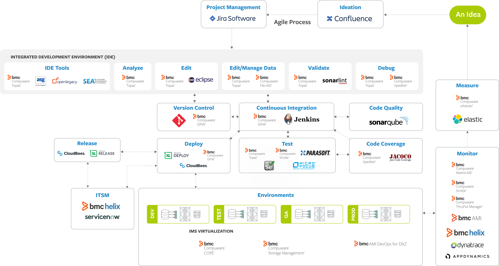

# Getting Started

To get started building your own mainframe DevOps pipeline, we have provided Jenkins pipeline examples and setup instructions.

The pages contains example code and documentation on:

- Jenkins CI pipelines as we would suggest as starting point
- Compuware and 3rd party tools used in the pipelines
- Instructions setting configuring Jenkins and SonarQube
- code snippets for specific tasks and purposes outside the general purpose

## CI Pipeline examples

We have published two examples of "complete" pipelines which show partly different process steps and different techniques in Jenkins.

- [Mainframe-CI-Example-pipeline](./Mainframe-CI-Example-pipeline.md) - ([jenkinsfile](https://github.com/cpwr-devops/DevOps-Examples/blob/suggest/Jenkinsfile/Mainframe-CI-Example-pipeline.jenkinsfile)) - is a scripted pipeline using parameters.  This is a simple approach to a DevOps pipeline that allows you to get up and going quickly, but may not be the best approach to scale a pipelines across your enterprise.

- [Mainframe_CI_Pipeline_from_Shared_Lib](./Mainframe_CI_Pipeline_from_Shared_Lib.md) - ([groovy](https://github.com/cpwr-devops/DevOps-Examples/blob/suggest/vars/Mainframe_CI_Pipeline_from_Shared_Lib.groovy)) - is a pipeline loaded from a Jenkins shared library.  Shared Libraries are a useful approach to scale pipelines across an enterprise since it moves the bulk of the pipeline logic to shared components that individual pipelines can reference a steps.  This allows organizations to develop pipelines in a more standard way.

## Tools Used

The example pipelines use a development scenario based on:

- [ISPW](https://compuware.com/ispw-source-code-management/) as SCM to store and govern mainframe sources
- [Git (GitHub)](https://github.com/) as SCM to store unit test assets
- [Topaz for Total Test](https://compuware.com/topaz-for-total-test-automation/) as mainframe unit testing tool to create and maintain unit test assets
- [Xpediter Code Coverage](https://compuware.com/xpediter-mainframe-debugging-tools/) as tool to gather code coverage data during execution of the unit tests
- [SonarQube](https://www.sonarsource.com/) as server for code analysis and setting up quality gates
- [XLRelease](https://xebialabs.com/) as CD server for release steps following the initial CI process Jenkins

Instructions on configuring the various tools can be found in the [Configuration](../tool_configuration/readme.md) of this site.

## Code examples

Code examples related are stored in a GitHub repository located at  [https://github.com/cpwr-devops/DevOps-Examples/](https://github.com/cpwr-devops/DevOps-Examples/).

The example pipelines, snippets and other examples related to Jenkins/Groovy will be stored alongside the *Mainframe-CI-Example-pipeline* in the [Jenkinsfile folder](https://github.com/cpwr-devops/DevOps-Examples/tree/master/Jenkinsfile) of the repository.

Code snippets and examples not directly related are stored in separate folders in the root directory of the repository. Currently these are:

- [ISPW-REST-API-Examples](https://github.com/cpwr-devops/DevOps-Examples/tree/suggest/ISPW-REST-API-Examples) containing a Windows powershell script that demonstrates the use of ISPW's REST APIs. This code may be used a starting point if Jenkins is not the CI server of choice.

<->
## The code repository folder structure

Based on the description above and due to the requirements for the use of [Pipeline Shared Libraries](https://jenkins.io/doc/book/pipeline/shared-libraries/) in Jenkins the folder structure of the DevOps-Examples repository is as follows:

    (root)
    +- src                                                  # Groovy source files
    |   +- com
    |       +- compuware
    |           +- devops
    |               +- util                                 # Classes used by the pipelines
    |
    +- vars                                                 # Shared Library Pipeline Examples
    |
    +- resources                                            # Files used by the pipelines
    |   +- pipeline                                         # Configuration files for pipeline variables
    |   +- skels                                            # Mainframe JCL "skeleton" files
    |
    +- Jenkinsfile                                          # Basic pipeline examples
    |   +- Mainframe-CI-Example-pipeline.jenkinsfile        # Primary example pipeline (Scripted Pipeline)
    |   +- JCL_Pipeline_Example.jenkinsfile                 # Example of execution JCL from a pipeline
    |
    Other_Examples
    |   +- ISPW_Operations.ps1                              # Windows powershell script that drives ISPW

<->
## People wanting to contribute

Everyone perusing these pages is welcome to provide feedback, input and suggestions for improvement; as well as asking for specific topics to be covered in the future.

## Next Steps

- [Required Plugins](../tool_configuration/plugins.md) for a list and description of plugins that are used within the examples