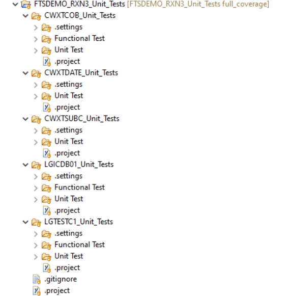
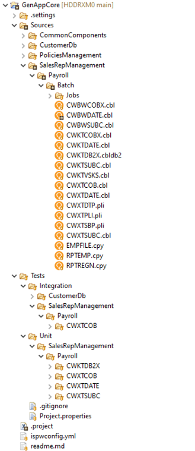
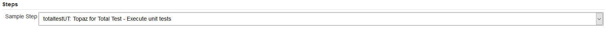
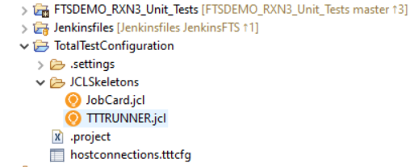
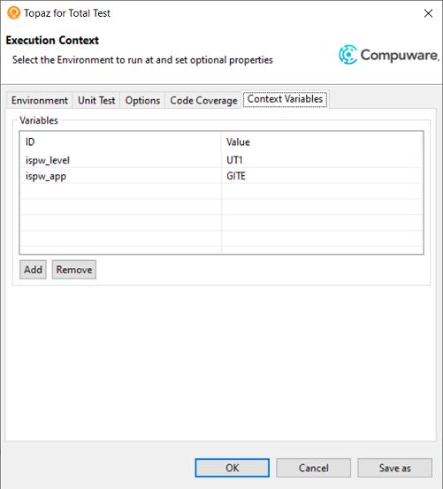

# What has changed in April 2021

Over the recent few releases of [Topaz for Total Test](../guidelines/ttt/ttt_scenario.md), the [Topaz CLI](../apis/topaz_cli.md), [ISPW](), the [ISPW CLI]() and the corresponding [Jenkins plugins](../tool_configuration/plugins.md), integration between different tools has been greatly improved, moving much of the complexity of implementing certain requirements from the code of the scripts into functionality provided by the plugins/CLI. Therefore, many of the example pipelines will have become far simpler, compared to the older versions, while providing the same flexibility and functionality as before. For customers this means that the coding effort and complexity of the resulting pipeline scripts has been reduced considerably.

## Topaz for Total Test project structure

Earlier versions of Topaz for Total Test Virtualized Testing required a very strict structure of the underlying project to be used. If folders were renamed, removed or where not exactly "at the right place", the scenarios became unusable. This greatly reduced flexibility when it came to combining Topaz for Total Test projects into e.g. one repository, into one encompassing project, or to combine Virtualized and Non-Virtualized scenarios into one single Test project.

Starting with Topaz for Total Test 20.04.01, Topaz for Total Test allows storing Virtualized and Non-Virtualized test scenario in any folder of a given Topaz for Total Test project. For Virtualized Test scenarios, the corresponding sub folders still need to meet the required folder structure, but with the new architecture storing Topaz for Total Test assets has become highly flexible. 

::: tip Note
It is now even possible to store mainframe code alongside Topaz for Total Test scenarios within the same Eclipse project and Git repository, when using the [Git to ISPW integration](../guidelines/ispw/git_to_ispw_integration_tutorial.md).
:::

**Old Version folder structure** | **New Version fodler structure** | **New Version folder structure with sources**
---------------------------------|----------------------------------|----------------------------------------------
Each sub folder containing tests for a component, is a project in its own right, resulting in nested projects. Importing new test projects into an existing repository like this requires manual tweaking of .project files, making maintenance less straight forward. | Each sub folder is just a sub folder within a single project. Adding new tests for a component is a simple as specifying a new folder when recording the corresponding tests. Virtualized and Non Virtualized Tests may reside in the same project and can be grouped into dedicated folder by type, instead of by component. | Configuring a Topaz for Total Test project to be "connected" to ISPW (or vice versa) allows storing mainfgrame code alongside tests for this code.
 |  | 
### One Topaz for Total Test CLI

Initially, following the integration of the Non-Virtualized test technology into Topaz for Total Test, there have been two different CLIs to use for execution of Topaz for Total Test scenarios. 
- A CLI for the *traditional* Topaz for Total Test Vritualized Test scenarios (f.k.a. "Unit Tests")
  
- A CLI for the new Non-Virtualized Test scenarios (f.k.a. "XATester" or "Functional Tests")
  

While the *traditional* the CLI is still available, it will be deprecated, and ultimately completely be replaced by on CLI for execution of both kinds of test scenarios. Using this one CLI bears additional advantages apart from reducing confusion as to which CLI to use for which purpose. Among these are:

## Intelligent Test Execution

If you wanted to execute test scenarios only for thos components that were affected by a "change", in the past you had to 
- determine the list of affected programs
- detremine the list of test scenarios
- match test scenarios against the list of programs
- execute matching scenarios in a loop

In contrast, with the **Intelligent Test Execution** feature any ISPW operation will automatically create a `.json` file containing information about the tasks affected by the corresponding operation. This file can be processed by the Topaz for Total Test CLI, telling it to execute any test scenario that matches any of the entries in the `.json` file. The resulting code consists of exactly one call to the Topat for Totel Test CLI.

## Runner JCL

One of the main concerns when using the *traditional* Topaz for Total Test CLI to execute Virtualized Test scenarios, was setting up the correct Runner.jcl to use. Depending on the complexity of the environment (e.g. several parallel development paths), the JCL had to modified at runtime, adding yet more complexity to the resulting pipeline scripts.

Using the one CLI in future, the "runner.jcl" can be configured and stored centrally for all scenarios of a project or even on the CES. The use of Context Variables has completely removed to modify any file content at runtime.

**Old Version runner.jcl per component** | **Local TotalTestConfiguration** | **"Runner JCL" stored in CES**
-----------------------------------------|----------------------------------|-------------------------------
Old versions of Topaz for Total Test required the runner.jcl ro be located in the JCL folder of each Topaz for Total Test project. The user had to setup the runner JCL for each project, individually, even if they old would look the same. If the environment required different load library concatenations, e.g. for parallel development paths, the best option was to create a runner JCL for each path and selecting the required one at runtime. | With version 20.04.01 of Topaz for Total Test, it allows using a central TotalTestConfiguration project, allowing to use one single JCL skeleton for each Topaz for Total Test scenario on any project/folder within the same workspace. Use of variables allows for change of load library concatenations at runtime. | Instead of storing the JCL skeleton locally in the users' workspaces, the skeleton can be stored in CES as part of a connection definition. This allows sharing of the same skeleton with every user in the environement, without them having to maintain local copies.
 |  | 

## Context Variables

Topaz for Total Test allows defining your own variables to use at runtime of a scenario. The Topaz for Total Test CLI allows setting these variables at runtime via command line parameters. This allows for high flexibility in defining scenarios for one environement and and executing them in different target environements without manual intevention or preparation by a user.

 

## ISPW source code downloader - include copybooks

Current versions of the plugin allow for donwloading related copybooks automatically, no matter ate which level in the life cycle they reside within the path relative to the container you are downloading sources for. This resolves aproblem many customers were facing, and had to write their own code for, unnecessarily complicating the code of their pipelines:

Early versions of the ISPW source download plugin - especially of the container downloader - would only download those sources that were part of the specified container. This would cause problems if copybooks that were used by components were not part of that same container, e.g. component `CWXTCOB` within an assignment uses copybook `EMPFILE`, but `EMPFILE` is not part of the container. In such a case, the container downloader would only get `CWTXCOB`. Passing the source to SonarQube would then result in "false positive" errors being flagged by Sonar due to missing copybooks.
