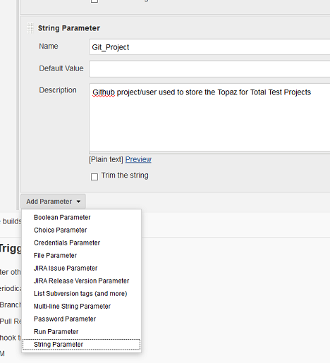

# Pipeline from a Shared Library
This pipeline executes the following steps [after a developer has promoted their code in ISPW](../pipeline_scenario/pipelines.md):
- Retrieve the mainframe code from ISPW for later analysis by SonarQube
- Retrieve any missing copbboks that were not part of the promotion, but are required by SonarQube 
- Retrieve Topaz for Total Test unit test definitions for the corresponding ISPW application from GitHub
- Execute those test scenarios that belong to the COBOL programs that have been promoted
- Retrieve the Code Coverage metrics generated during test execution from the mainframe repository
- Pass all information (sources, test results, code coverage metrics) to SonarQube
- Receive a Sonar quality gate webhook callback and analyze the status of the quality gate
- If the quality gate was passed, continue the process by triggering an XL Release release template
- In either case (passed / dailed), send an email to the developer informing them of the status of the pipeline

## Setting up the pipeline job

The job itself is defined via the usual way of creating a new pipeline job. It is important, though, to make sure that the resulting job uses parameters by checking the `This project is parameterized` box, 

Successively add the following string parameters (the default values are the ones used for the examples).



The parameters in this first set are specific to the individual execution of the pipeline and get passed by the [ISPW Webhook](../tool_configuration/webhook_setup.md).

Name  |  Description
----- |  -----------
ISPW_Stream | ISPW Stream Name
ISPW_Application | RXN3 ISPW Application
ISPW_Src_Level | ISPW Level the promote has been started from
ISPW_Release | ISPW Release Name
ISPW_Container | ISPW Set ID
ISPW_Container_Type | ISPW Container Type -0 - assignment -1 - release -2 - set
ISPW_Owner | ISPW Owner User ID

## Loading the script from a shared library

To tell Jenkins to execute a pipeline from a shared library, you need to add code like the following to the Pipeline script definition.


The example uses

```groovy
@Library('RNU_Shared_Lib@Dev') _
Mainframe_CI_Pipeline_from_Shared_Lib(
    ISPW_Stream         :"${ISPW_Stream}",                          // ISPW Stream
    ISPW_Application    :"${ISPW_Application}",                     // ISPW Application
    ISPW_Release        :"${ISPW_Release}",                         // ISPW Release
    ISPW_Assignment     :"${ISPW_Assignment}",                      // ISPW Assignment
    ISPW_Container      :"${ISPW_Container}",                       // ISPW Container (Set)
    ISPW_Container_Type :"${ISPW_Container_Type}",                  // ISPW Container Type (2 for Set)
    ISPW_Src_Level      :"${ISPW_Src_Level}",                       // ISPW Level the promote worked from
    ISPW_Owner          :"${ISPW_Owner}",                           // ISPW User doing the promote
    CES_Token           :'xxxx',
    HCI_Conn_ID         :'xxxx',
    HCI_Token           :'xxxx',
    CC_repository       :'xxxx',
    Git_Project         :'xxxx',
    Git_Credentials     :'xxxx'
    )
```

where

- `@Library('RNU_Shared_Lib@Dev') _`
refers to the name of a [Shared Library](./helper_classes/PipelineConfig.md), with `@Dev` in this example referring to the `Dev` branch of the underlying GitHub repository. The trailing `_` is required by Jenkins.
- `Mainframe_CI_Pipeline_from_Shared_Lib`
refers to the name of the `.groovy` file in the `vars` folder of the GitHub repository, containing the pipeline code
- Within the brackets `(...)` parameters are passed to the pipeline script. `Mainframe_CI_Pipeline_from_Shared_Lib` expects a `groovy` [`Map`](http://groovy-lang.org/syntax.html#_maps), containing the following `key:value` pairs.

The parameters in this first set are specific to the individual execution of the pipeline. The values are the parameters defined as pipeline parameters). The syntax `"${parameter}"` ensures that the value passed to this parameter is taken as value in the `Map`.

Key  | Default Value | Description
----- | ------------- | -----------
ISPW_Stream | "${ISPW_Stream}" | The ISPW_Stream parameter from the pipeline configuration above
ISPW_Application | "${ISPW_Application}" | The ISPW_Application parameter from the pipeline configuration above
ISPW_Release | "${ISPW_Release}" | The ISPW_Release parameter from the pipeline configuration above
ISPW_Assignment | "${ISPW_Assignment}" | The ISPW_Assignment parameter from the pipeline configuration above
ISPW_Container | "${ISPW_Container}" | The ISPW_Container parameter from the pipeline configuration above
ISPW_Container_Type | "${ISPW_Container_Type}" | The ISPW_Container_Type parameter from the pipeline configuration above
ISPW_Src_Level | "${ISPW_Src_Level}" | The ISPW_Src_Level parameter from the pipeline configuration above
ISPW_Owner | "${ISPW_Owner}" | The ISPW_Owner parameter from the pipeline configuration above

The second set of parameters is installation specific and reference tokens and other IDs that have been defined during the configuration phase. To determine the appropriate values to use refer to the [description of the pipeline parameters](./pipeline_parameters.md).

Usually, these parameters will be installation specific rather than pipeline job or execution specific. Future versions of the example will take care of this, and move these parameters to configuration files.

Key  |  Description
----- | -----------
CES_Token | The Jenkins token, referring to the CES token
HCI_Conn_ID | The Jenkins internal ID for the HCI connection to use
HCI_Token | Jenkins internal ID for HCI Token
CC_repository | The Xpediter Code Coverage repository to use
Git_Project | The name of the GitHub repository storing Topaz for Total Test assets
Git_Credentials | Jenkins internal ID for credentials to use the GitHub repository

## Shared Library Pipeline Steps

Being a pipeline from a [shared library](https://jenkins.io/doc/book/pipeline/shared-libraries/) this pipeline must extend a `call` method. This pipeline expects a [`Map`](http://groovy-lang.org/syntax.html#_maps) object, containing the parameters to be passed to the pipeline from the job configuration and trigger.

Once this pipeline has been triggered, the job will execute the following steps.

Execute its `call` method, within which it will

```groovy
def call(Map pipelineParams)
{
    node
    {
```

1. Execute its `initialize` method to read configuration files and instantiate objects of [helper classes](./helper_classes/PipelineConfig.md)
    - Reading the [mail list configuration file](../tool_configuration/Jenkins_config.md#the-email-list) and build in internal map of ISPW owner IDs and corresponding email addresses
    - `PipelineConfig` containing global parameter values that:
        - passed by the job configuration/trigger and are pipeline/execution specific
        - not pipeline or execution specific, like server URLs. These parameters will be read from external configuration files
    - `GitHelper` serving as a wrapper for a set of interactions with Git/GitHub
    - `IspwHelper` serving as a wrapper for use of the ISPW plugins' methods
    - `TttHelper` serving as a wrapper for use of the TTT plugin's and Code Coverage plugin's methods
    - `SonarHelper` serving as a wrapper for use of the Sonar plugins' methods

```groovy
        initialize(pipelineParams)
```

3. Use the `downloadSources` method of class `IspwHelper` to download all COBOL sources and COBOL copybooks from ISPW (the mainframe) that are part of the set triggering this specific pipeline execution

```groovy
        stage("Retrieve Mainframe Code")
        {
            ispwHelper.downloadSources()
```

4. Not always will all required COBOL copybooks be part of an ISPW assignment or set. In order to retrieve any missing copybooks, the next stage will use the `downloadCopyBooks` method of class `ispwHelper` to determine all required copybooks and download them from the mainframe

```groovy
            ispwHelper.downloadCopyBooks("${workspace}")
        }
```

5. Use the `checkout` method of the `gitHelper`class to clone the Git repository for the ISPW application.  

```groovy
        stage("Execute Unit Tests")
        {
            def gitUrlFullPath = "${pConfig.gitUrl}/${pConfig.gitTttRepo}"

            gitHelper.checkout(gitUrlFullPath, pConfig.gitBranch, pConfig.gitCredentials, pConfig.tttFolder)
```

6. Initialize the `TttHelper` instance, loop through the downloaded Topaz for Total Test scenarios, and pass the results to JUnit (within Jenkins) using the methods `initialize`, `loopThruScenarios`, and `passResultsToJunit` of the `TttHelper` class, respectively.

```groovy
            tttHelper.initialize()
            tttHelper.loopThruScenarios()
            tttHelper.passResultsToJunit()
        }
```

7. Use the `collectCodeCoverageResults` method of the `TttHelper` class to download the code coveragre metrics from the Xpediter Code Coverage repository

```groovy
        stage("Collect Metrics")
        {
            tttHelper.collectCodeCoverageResults()
        }
```

8. Use the `scan` method of the `SonarHelper` class to pass downloaded COBOL sources, the results of the unit tests, and code coverage metrics to SonarQube

```groovy
        stage("Check SonarQube Quality Gate")
        {
            sonarHelper.scan()
```

9. Query the resulting Sonar quality gate, by registering a Sonar Webhook call back, if the quality gate fails, an email will be sent to the owner of the ISPW set - notifying them about the failure of the promote -, and the pipeline job will be aborted

```groovy
            timeout(time: 2, unit: 'MINUTES') {

                def sonarGate = waitForQualityGate()

                if (sonarGate.status != 'OK')
                {
                    echo "Sonar quality gate failure: ${sonarGate.status}"
                    echo "Pipeline will be aborted and ISPW Assignment will be regressed"

                    currentBuild.result = "FAILURE"

                    emailext subject:       '$DEFAULT_SUBJECT',
                                body:       '$DEFAULT_CONTENT',
                                replyTo:    '$DEFAULT_REPLYTO',
                                to:         "${pConfig.mailRecipient}"

                    withCredentials([string(credentialsId: pConfig.cesTokenId, variable: 'cesTokenClear')])
                    {
                        ispwHelper.regressAssignment(pConfig.ispwAssignment, cesTokenClear)
                    }

                    error "Exiting Pipeline" 
                }
            }
        }
```

10. If the quality gate passes an XL Release template will be triggered - using the XL Release plugin - to execute CD stages beyond the Jenkins pipeline, and an email will be sent to the owner of the ISPW set - notifying them about the success of the promote

```groovy
        stage("Start release in XL Release")
        {
            xlrCreateRelease(
                releaseTitle:       'A Release for $BUILD_TAG',
                serverCredentials:  "${pConfig.xlrUser}",
                startRelease:       true,
                template:           "${pConfig.xlrTemplate}",
                variables:          [
                                        [propertyName:  'ISPW_Dev_level',   propertyValue: "${pConfig.ispwTargetLevel}"],
                                        [propertyName:  'ISPW_RELEASE_ID',  propertyValue: "${pConfig.ispwRelease}"],
                                        [propertyName:  'CES_Token',        propertyValue: "${pConfig.cesTokenId}"]
                                    ]
            )

            emailext subject:       '$DEFAULT_SUBJECT',
                        body:       '$DEFAULT_CONTENT \n' + 'Promote passed the Quality gate and a new XL Release was started.',
                        replyTo:    '$DEFAULT_REPLYTO',
                        to:         "${pConfig.mailRecipient}"
        }
    }
}
```