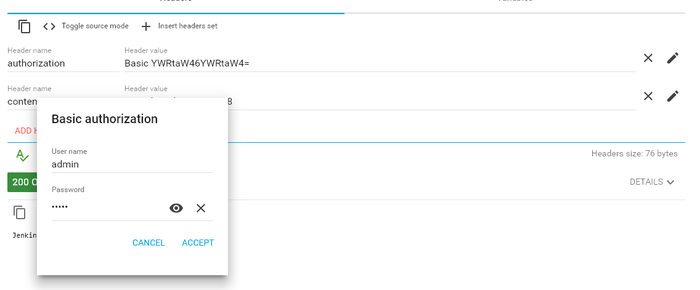

# Jenkins Configuration
The plugins installed into Jenkins used by the examples require additional setup like server locations/URLs or additional credentials to use. We describe the required steps by "location" in the Jenkins UI.

## Compuware Configurations

In `Manage Jenkins` -> `Configure System`, under the heading **Compuware Configurations** use either the Windows or Linux path fields to point to the location of the Topaz Workbench CLI (Command Line Interface).

Use the `Add Host Connection` button to add new host connection definition (connection to a mainframe LPAR). Use `Description` for name to be used during the scripts. Use `Host:port` to point to the host name of the mainframe LPAR to connect to (HCI port), select the required `Code page`, and use `CES URL`to point to the CES to use.


## SonarQube server information

In `Manage Jenkins` -> `Configure System`, under the heading **SonarQube servers** use the `Add SonarQube` button to add a new definition. Provide a `Name` to be used during the scripts, provide the URL to your SonarQube server and the SonarQube server access token for this server. Refer to your SonarQube administrator for required information.


In order to have a [Jenkins Job wait](https://jenkins.io/doc/pipeline/steps/sonar/#waitforqualitygate-wait-for-sonarqube-analysis-to-be-completed-and-return-quality-gate-status) for a SonarQube quality gate to be calculated, the SonarQube server needs to have a [SonarQube webhook](https://docs.sonarqube.org/latest/project-administration/webhooks/) configured to pass the quality gate status back to Jenkins.  A SonarQube webhook is configured in the SonarQube `Project` -> `Administration` section or globally in the `Adminstration` -> `Configuration` -> `Webhooks` section as show below.


## Global Pipeline Libraries

In `Manage Jenkins` -> `Configure System`, under the heading **Global Pipeline Libraries** use a name for the Shared Library to refer to during pipeline definitions. Use select "Modern SCM" and the matching SCM you use for storing `jenkinsfiles`. The examples use GitHub and use the `master` branch as default branch. This can be overridden during pipeline definition.

Point to the repository used for storing `jenkinsfiles` and provide the [Git credentials defined elsewhere](./#Git).


## XL Release

In `Manage Jenkins` -> `Configure System`, under the heading **XL Release** use the `Add` button to add a new definition. Use `Default Server Url` to point to your XL Release server, provide a `Name` to be used during the scripts and credentials to use for authentication.


## SonarQube Scanner

In `Manage Jenkins` -> `Global Tool Configuration`, under the heading **SonarQube Scanner** use the `Add SonarQube Scanner` button to add a new definition. Use `SONAR_RUNNER_HOME` to point to the path to the SonarQube Scanner local to the Jenkins server and provide a `Name` to be used during the scripts.


## Git

In `Manage Jenkins` -> `Global Tool Configuration`, under the heading **Git**** use the `Add Git` button to add a new definition. Use `Path to Git executable` to point to the path to the git.exe local to the Jenkins server and provide a `Name`.

## Credentials

Use the credentials manager to store the following credentials for use in the examples

- A user ID / password token for a valid logon to the required mainframe LPAR used by plugins that do not use the CES credentials token (used as parameter `HCI_Token`)
- A secret text credential token to mask the [CES credentials ID created and retrieved from CES](CES_credentials_token.md) (used as parameter `CES_Token`)
- A user ID / password token for a valid logon to the GitHub repository storing Topaz for Total Test unit test assets (used as parameter `Git_Credentials`)


## Cross Site Request Forgery (CSRF) Protection

Usually, Jenkins gets installed with [Cross site request forgery Protection](https://wiki.jenkins.io/display/JENKINS/CSRF+Protection) being turned on. This prevents people to trigger jobs from outside using the REST API unless they have a so called "crumb", which acts as a kind of authentication Token. The result if CSRF Protection is turned on and you try to use the REST API without specifying the required crumb header will look something like this:


### Setting CSRF Protection
It is not recommended to turn the protection off, instead you will need to modify your API call to include a "crumb" header. Here I describe how to determine the header. First make sure that CSRF Protection is turned on, by going to ```Manage Jenkins``` -> ```Configure Global Security``` and scrolling down to the CSRF Protection section:


Make sure, the check box is checked, and the radio button "Default Crumb Issuer" is marked. Next you need to determine the correct crumb to use in your further REST calls. This page explains the details in general.

### Getting the Jenkins crumb
Use a REST API tool, for example ARC (The Google Advanced Rest Client Plugin to Chrome) to issue the required GET call.

```http://<jenkins URL>/crumbIssuer/api/xml?xpath=concat(//crumbRequestField,":",//crumb)```


**Make sure to include an authorization header and using the pencil button to provide your credentials for your Jenkins server.**



**Otherwise you will not be allowed to retrieve the crumb:**


### Using the Jenkins crumb in a REST call
To, finally, use the crumb in a REST call, make sure to include the `Jenkins-crumb` header, as well as the `authorization` header from above. From ARC this looks like the following:


## Managed Files

The option `Manage Jenkins` -> `Managed Files` will be available after installation of the [Config File Provider](https://wiki.jenkins.io/display/JENKINS/Config+File+Provider+Plugin) plugin. The examples make use of configuration files handled and stored by this plugin. Especially this will be a list of TSO user IDs and [corresponding mail addresses](../advanced_pipelines/config_files.md). Over time other configuration files will use the same technology.

In `Manage Jenkins` -> `Managed Files` select `Add a new Config` to add a new configuration file to be handled by this plugin. Once files are created you can select the existing files to review and modify their content.

Configuration files used in the examples are plain text files. Therefore, chose `Custom file` as file type when defining a new file, and provide an ID that is meaningful. The examples use `MailList`as ID:


After `submitting` specify a file name to use and start filling the file with content. 

### The email list

The example mail list file uses a file name of `mailList.config` and pairs of `<TSO User ID>:<mailaddress>`, each on a separate line. The TSO user IDs used in this file correspond to the ISPW owner values passed by the [ISPW webhooks](./webhook_setup.md).

