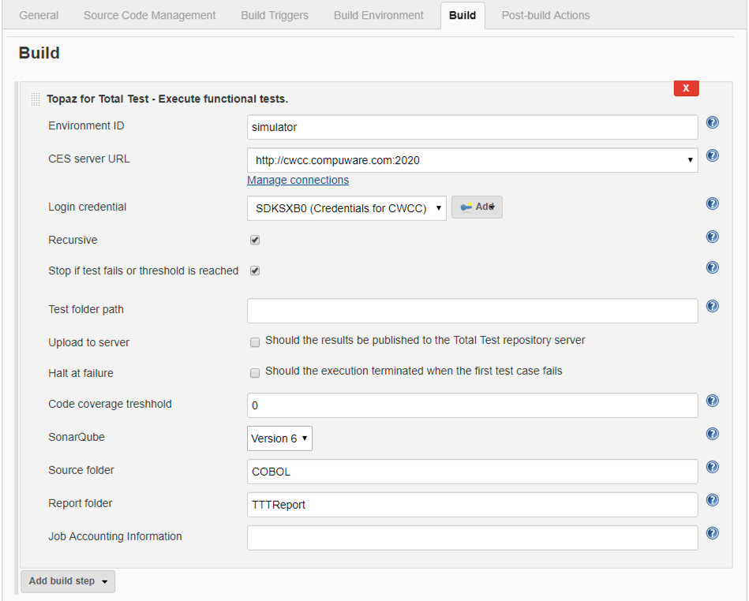
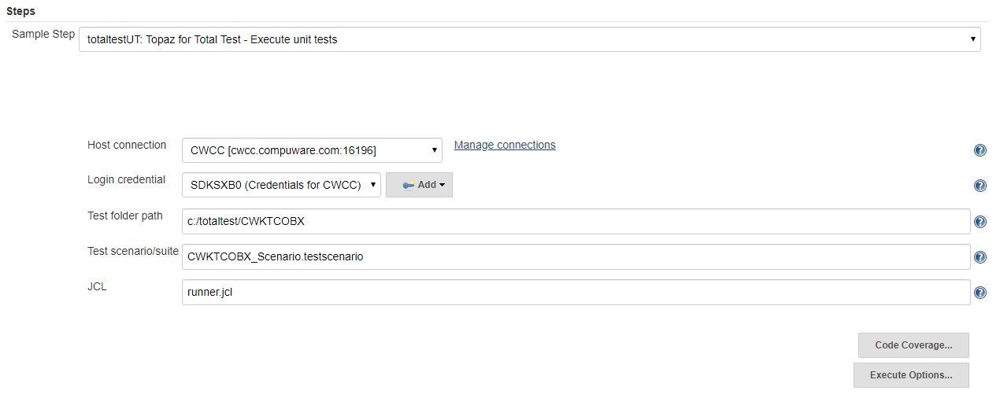

# Using Jenkins Plugins

The following sections describe how you use the various Jenkins plugins from Compuware

## Getting started with the Total Test Jenkins plugin 
The execution of Topaz for Total Test test scenarios/test suites for unit, functional and integration tests can be initiated from Jenkins. You will use two different steps in your pipeline when using unit tests or functional/integration tests.

The Topaz for Total Test Jenkins plugin makes it easy to configure Topaz for Total Test in your CI/CD process driven by Jenkins. Topaz for Total Test is a Unit, Functional and Integration Testing Tool for Mainframe COBOL Batch, CICS and IMS Programs. Using the Topaz for Total Test Jenkins plugin allows you initiate Test scenarios and test suites and associated Test Cases for your mainframe programs. The plugin communicates with a TestRunner Component that executes your program on the mainframe. 

The test scenarions and/or test suites are defined in the Topaz for Total Test Eclipse client. The CLI used by the Jenkins plugin operates on plain files in the file system on the Jenkins server and expects a complete Topaz for Total Test Test project structure. The test files can be manually copied to the Jenkins server, but typically the will be automatically imported from the Jenkins pipeline.

Test results are produced as native XML reports, as JUnit output and as Sonar Qube reports. The test results can then be viewed with Jenkins (and SonarQube, if installed).

You can setup both Jenkins Freeform pipelines as well as using Jenkins Pipeline scripts with Groovy. Freeform pipelines are easiest to get started with while pipeline scripts are more powerful and flexible.

### Prerequisites
The Total Test Jenkins plugin has requirements as all other Compuware Jenkins plugins and requires using the Compuware configuration plugin
The following are required to use the Topaz for Total Test Jenkins plugin:
* Jenkins Credentials Plugin
* Compuware configuration plugin
* Topaz Workbench CLI installed on the Jenkins server. Refer to *Topaz Workbench CLI Installation* in the *Topaz Workbench Installation Guide* for instructions
* Topaz for Total Test licenses
* Host Communications Interface (HCI) Connection to the LPAR on which tests should run 
* Enterprise Communication Components (ECC) which contains the Topaz for Total Test `TestRunner Mainframe component`
* For functional testing - access to the Total Test repository server


#### Upgrading from a Previous Release 
::: tip 
Whenever you upgrade the Topaz Workbench from a previous release, always backup existing Test Projects and then update the Topaz for Total Test CLI on the Jenkins servers, including any Jenkins Build Slave servers.
:::

### Prepare Jenkins and Install the Topaz for Total Test Jenkins Plugin
Follow these steps to prepare Jenkins:
* Install Jenkins
* Login to Jenkins as Admin
* Install the Compuware Configuration plugin from list of available plugins.
* Install the Compuware Topaz for Total Test Plugin from list of available plugins.
* Select **Manage Jenkins**
* On the Manage Jenkins page, click on **Configure System**
* Locate the **Compuware Configuration** section and follow the setup described in [Compuware Configurations](./Jenkins_config.html).

Now Jenkins can execute Topaz CLI including the Topaz for Total Test Unit and Functional testing CLI from the Topaz for Total Test Jenkins plugin.


## Using Total Test Jenkins plugin for Functional Test 

### Create a Freestyle Project
Follow these steps to create a Freestyle Project and name it the same as the Topaz for Total Test Project.
* Open Jenkins and select **New Item**
* Enter an appropriate project name and select Freestyle project
* Click **OK**. This will open the project for configuration and the General tab displays.
* In the Description field, enter a comment describing the project.
* Scroll down to the Build section and click **Add build step**
* In the dropdown, select **Topaz for Total Test - Execute functional tests**. This will show the below properties that have to be filled.

* The **Environment** field specifies in which environment/lpar the tests should run. The id is found at the Total Test repository server
* The **CES URL** must be specified at the Compuware configuration setup and is selected here. The CES server must have the Total Test repository server installed and setup.
* Login credentials are the TSO credentials to be used for executing the tests
* Click the **Advanced**  button to see optional/advanced parameters. 
* By default all functional test scenarios that have a corresponding .xactx file for the specified environment will be found. The pipeline will look into the folder specified by the **Test folder path** in the advanced section. If this is a relative path or if the path is empty or a ., if will use the Jenkins workspace as the root folder.
* If **Recursive** is selected, test cases will be found recursively in sub folders to the Test folder path.
* If **Stop if test fails...** is selected, the test execution will stop as soon as one of the test cases fails.

* **Code coverage threshold** is used to stop the build if any program has a code coverage % less than this value. Currently this only works for IBM Debug.
* **Sonar Qube** versions specifies how the Sonar qube reports are written. There is a difference between version 5 and 6.
* **Source folder** is used for the Sonar reports to link to where the source is located.
* **Report folder** is the name of the folder to which JUnit output format and SonarQube reports are written. Default is TTTReport.
* **Job Accounting Information** (optional). Use the accounting information parameter to enter an account number and any other accounting information that your installation requires.
* Press **SAVE**.

We have now configured the build step for running Total Test for functional testing. We can also add a post build step that allows us to see the result as JUnit output - a often used view of test results in Jenkins. See [Add step for JUnit result](#add-step-for-jenkins-to-process-the-test-results-files) for how to do this.

### Create a Pipeline Project
Follow these steps to create a Pipeline Project and name it the same as the Topaz for Total Test Project.
* Open Jenkins and select **New Item**
* Enter an appropriate project name and select **Pipeline**.
* Click **OK**. This will open the project for configuration and the General tab displays.
* Copy the following information and paste it into the **Pipeline script** field:
```groovy
stage("Run Topaz for Total Test - functional test")
{
  // This stage uses the Topaz for Total Test Plugin (general post build step) to run a Topaz for Total Test Unit Test
  node{
    // This line pulls the Topaz for Total Test functional Test Results in Junit format into Jenkins
    junit 'TTTReport/*.xml'
  }
}
```
* Press **SAVE**
* Select **Configure**
* Select the **Pipeline Syntax** link below the script field
* Select 'totaltest: Topaz for Total Test - Execute functional tests'  from the Build Step drop-down list.
* The same fields are available as for setting up the Freestyle project. See [Create a Freestyle project](#create-a-freestyle-project) for details on each field. Fill the fields as illustrated below

* Click the **Generate Pipeline Script** button.
* Copy the generated script step as illustrated below into your clipboard.

* Return to the Project and select **Configure**.
* In the Script field, add a new line after the **node{** line.
* Paste the generated script step from the clipboard into the new line. You would now have a pipeline script looking like this
```groovy
stage("Run Topaz for Total Test")
{
  // This step executes the test  
  totaltest credentialsId: 'SDKSXB0 CWCC', environmentId: 'simulator', folderPath: '', serverUrl: 'http://cwcc.compuware.com:2020', sonarVersion: '6'
  
  // This stage uses the Topaz for Total Test Plugin (general post build step) to run a Topaz for Total Test Unit Test
  node{
    // This line pulls the Topaz for Total Test Unit Test Results in Junit format into Jenkins
    junit 'TTTReport/*.xml'
  }
}
```
* Press **SAVE**.

:::tip
The above Functional Test examples shows how you setup a pipeline with one build step that will execute all test scenarios in the Jenkins workspace that have a .xactx file with the Environment ID similar to the one defined in the build step. This means that you will have to have the files in the workspace before the build step and that is typically done by integrating with a SCM like Git. It is also possible to setup an absolute path in the **Test folder path** to use static files on the Jenkins server. You can look into our example pipelines to get inspiration and understanding. 
:::

### Add step for Jenkins to process the test results files
Complete the following steps to let users see test results as JUnit output after the pipeline has executed.
* Open the Project page for the Jenkins project.
* Click **Configure**.
* In the "Post-build Actions", click **Add post build action**.
* Select the **Publish JUnit test result report**
*Enter `TTTReport/*.xml` in the *Test reports XMLs field*. This holds the Total Test result files. If the report output folder has been customized in the pipeline, that value must be used here instead.
* Press **SAVE**.
* Click the **Build Now** button to ensure the Test Results files are copied correctly into the Jenkins WORKSPACE TTTUnit Folder.
* Notice whether the build completed with Success Status (blue ball), Warning Status (yellow ball), or Error Status (red ball).
* Click on the Build # to review build results. Notice the new 'Test Result' tab/menu point.
* Click on **Test Result** to display the results.
* Drill down to view the details of the individual test case. 


## Using Total Test Jenkins plugin for Unit Test 

### Create a Freestyle Project
Follow these steps to create a Freestyle Project and name it the same as the Topaz for Total Test Project.
* Open Jenkins and select **New Item**
* Enter an appropriate project name and select **Freestyle project**
* Click **OK**. This will open the project for configuration and the General tab displays.
* In the **Description** field, enter a comment describing the project.
* Scroll down to the Build section and click **Add build step**
* In the dropdown, select **Topaz for Total Test - Execute unit tests**. This will show the below properties that have to be filled.

* Click on the **Code Coverage** button to display the Code Coverage options. Optional, only required if Code Coverage is requested.
* Click on the **Execute Options** button to display the Execute options: Use Stubs, Delete temporary files, and High level qualifier.

* Gather the information for the required fields from the Topaz for Total Test project and enter it in the fields:
  * **Host Connection**: Select the desired host connection, from the drop-down list. The *Manage Connections* link can be used to define a new host connection.
  * **Login Credentials** : Select or add your mainframe login credentials (userID and password) to connect to the host with.
  * **Test Project Folder** : The Topaz for Total Test project folder path (from Topaz for Total Test Project Folder Properties). This location must be accessible to Jenkins. Read/write access is required to all files in this location.
  * **Test Scenario/Suite** : Test suite or test scenario name for the specified project (from Topaz for Total Test Project Folder) or select **all_scenarios** from the list.
  * **JCL** : The file name containing the JCL to submit (from Topaz for Total Test Run Test Scenario dialog). NOTE: If you use the Topaz for Total Test Preference option to hold the JobCard information you need to have executed the Test Suite or Test Scenario at least once in the Topaz for Total Test interface for this file to get generated.
  * **Main executable program type** : Select the main executable program (this is the program specified on the `EXEC PGM=` JCL statement in runner*.JCL) for Code Coverage: 
    * **Live DB2** when the main program is IKJEFT01 or IKJEFT1B 
    * **TOTALTEST** when the main program is TTTRUNNR Live 
    * **IMS when** the main program is DFSRRC00
  * **Code Coverage Repositor**y : The name of the Code Coverage repository dataset. Must be specified to enable Code Coverage (from Topaz for Total Test Run Test Scenario dialog).
  * **System Name** : Code Coverage system. If not specified, defaults to the test suite or test scenario name (from Topaz for Total Test Run Test Scenario dialog).
  * **Test ID** : Code Coverage test id. If not specified, defaults to the test suite or test scenario name (from Topaz for Total Test Run Test Scenario dialog).
  * **Clear existing statistics before the test**: Check if existing Code Coverage statistics should be deleted before running the test.
  * **Use Stubs** : Check if the test should use stubs (from Topaz for Total Test Run Test Scenario dialog).
  * **Delete temporary files** : Check if temporary files are to be deleted (from Topaz for Total Test Run Test Scenario dialog).
  * **High Level Qualifier** : Optional high level qualifier to be used when allocating datasets during test execution (from Topaz for Total Test Preferences).
  * Press **SAVE**.
We have now configured the build step for running Total Test. We can also add a post build step that allows us to see the result as JUnit output - a often used view of test results in Jenkins. See [Add step for Jenkins to process the test results files](#add-step-for-jenkins-to-process-the-test-results-files) for how to do this.

### Create a Pipeline Project
Follow these steps to create a Pipeline Project and name it the same as the Topaz for Total Test Project.
* Open Jenkins and select **New Item**
* Enter an appropriate project name and select **Pipeline**.
* Click **OK**. This will open the project for configuration and the General tab displays.
* Copy the following information and paste it into the Pipeline Script field:
```groovy
stage("Run Topaz for Total Test")
{
  // This stage uses the Topaz for Total Test Plugin (general post build step) to run a Topaz for Total Test Unit Test
  node{
    // This line pulls the Topaz for Total Test Unit Test Results in Junit format into Jenkins
    junit 'TTTUnit/*.xml'
  }
}
```
* Press **SAVE**
* Select **Configure**
* Select the **Pipeline Syntax** link below the script field
* Select **totaltestUT: Topaz for Total Test - Execute unit tests**  from the Build Step drop-down list.
* The same fields are available as for setting up the Freestyle project. See [Create a Freestyle Project]("create-a-freestyle-project) details on each field. Fill the fields as illustrated below

* Click the **Generate Pipeline Script** button.
* Copy the generated script step as illustrated below into your clipboard.

* Return to the Project and select **Configure**.
* In the Script field, add a new line after the **node{** line.
* Paste the generated script step from the clipboard into the new line. You would now have a pipeline script looking like this
```groovy
stage("Run Topaz for Total Test")
{
  // This step executes the test  
  totaltestUT ccRepo: '', ccSystem: '', ccTestId: '', connectionId: 'b1f67f6b-cab4-4b84-98a5-7b6fd09e2b8c', credentialsId: 'SDKSXB0 CWCC', hlq: '', jcl: 'runner.jcl', projectFolder: 'c:/totaltest/CWKTCOBX', testSuite: 'CWKTCOBX_Scenario.testscenario'
  
  // This stage uses the Topaz for Total Test Plugin (general post build step) to run a Topaz for Total Test Unit Test
  node{
    // This line pulls the Topaz for Total Test Unit Test Results in Junit format into Jenkins
    junit 'TTTUnit/*.xml'
  }
}
```
* Press **SAVE**.

:::tip
The above simple unit test examples shows how you setup a pipeline with one build step that will execute a test scenario from a specific hardcoded folder. In a real life pipeline you would have multiple steps that would checkout your code and test cases from SCMs, and then build and test the application. You can look into our example pipelines to get inspiration and understanding. 
:::

### Run a pipeline
* Return to the Jenkins Home page.
* In the list of project, find the project that you want to run and click on it. It will show a page where you see details about the project.
* At the project page, click **Build Now**. You will see a new Build start in the Build History area.
* When the built has completed, click on the **Build #** for the completed build in the Build History area.
* Click on **Console Output** to review the Console Output for the Build #.
* Scroll to the bottom and look for "SUCCESS" or "FAILURE".

### Add additional information in the console output
If you are having problems with getting a Test Suite to run from Topaz for Total Test Jenkins Plugin you may find it helpful to put additional information in the console output. Also if your Test Case isn't running it may be helpful to turn debug information on the TestRunner component by modifying a Runner.jcl file or your test jcl file for your Test Suite.

`TotalTestCLI.bat`

* Find the TotalTestCLI.bat file in the location where the Topaz for Total Test CLI was installed.
* Open TotalTestCLI.bat.
* Change `@echo off` to `@echo on`.
* Save TotalTestCLI.bat.

`Runner.jcl`

* Find the TestRunner JCL for the Test Run
* Open the TestRunner JCL file
* Change DEBUG(OFF) to DEBUG(ON).
* Save the TestRunner JCL file.

### Add step for Jenkins to process the test results files
Complete the following steps to let users see test results as JUnit output after the pipeline has executed.
* Open the Project page for the Jenkins project.
* Click **Configure**.
* In the "Post-build Actions", click **Add post build action**.
* Select the **Publish JUnit test result report**
* For unit testing Enter `TTTUnit/*.xml` and optionally `TTTSONAR/*.xml` in the Test reports XML file as illustrated below. These holds the Total Test result files. 

* Press **SAVE**.
* Click the Build Now button to ensure the Test Results files are copied correctly into the Jenkins WORKSPACE TTTUnit Folder.
* Notice whether the build completed with Success Status (blue ball), Warning Status (yellow ball), or Error Status (red ball).
* Click on the **Build #** to review build results.
* Notice the new 'Test Result' tab/menu point.
* Click on **Test Result** to display the results.
* Drill down to view the details of the individual test case. 