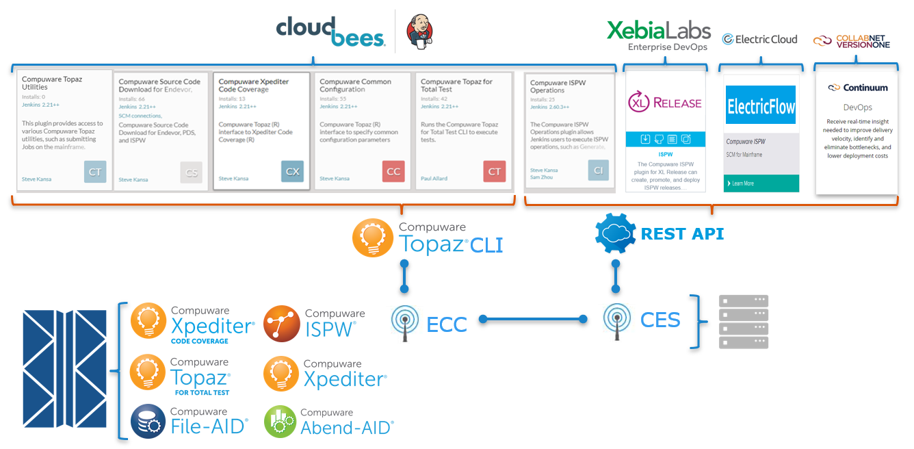
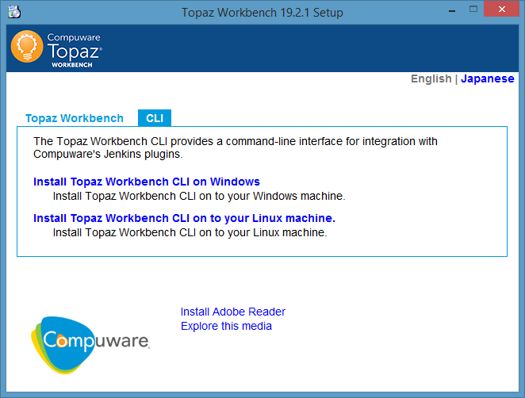

# Plugins

The examples - especially the two [primary pipelines](../pipelines/pipelines.md) - use plugins that may not be part of a standard installation of Jenkins; this will likely be the case for the Compuware plugins. All plugins described here can be obtained from the Jenkins plugin marketplace using `Manage Jenkins` / `Manage Plugins`.

## Compuware plugins

Compuware provides a continuously growing set of plugins that allow connecting to the mainframe and using Compuware's (and other) tools within a Jenkins job/pipeline.

### Compuware Common Configuration

The [Compuware Common Configuration](https://wiki.jenkins.io/display/JENKINS/Compuware+Common+Configuration+Plugin) plugin allows defining and storing configuration settings that are used by and shared between the other Compuware plugins.

### Compuware ISPW Operations Plugin
The [Compuware ISPW Operations Plugin](https://wiki.jenkins.io/display/JENKINS/Compuware+ISPW+Operations+Plugin) allows using ISPW REST API operations without having to code native http requests

### Compuware Source Code Download for Endevor, PDS, and ISPW

The [Compuware Source Code Download for Endevor, PDS, and ISPW](https://wiki.jenkins-ci.org/display/JENKINS/Compuware+Source+Code+Download+for+Endevor%2C+PDS%2C+and+ISPW+Plugin) plugin allows downloading source code and other assets stored in mainframe SCM tools:

- ISPW
- Endevor
- Plain PDS

### Compuware Topaz for Total Test

The [Compuware Topaz for Total Test](https://wiki.jenkins-ci.org/display/JENKINS/Compuware+Topaz+for+Total+Test+Plugin) plugin allows execution of Topaz for Total Test unit test scenarios and suites and retrieving of the results. The results will be downloaded and stored in `html` format as well as `xml` format for further use by SonarQube. Collection of Xpediter Code Coverage data can be triggered alongside the execution of the unit tests.

### Compuware Xpediter Code Coverage

The [Compuware Xpediter Code Coverage](https://wiki.jenkins-ci.org/display/JENKINS/Compuware+Xpediter+Code+Coverage+Plugin) plugin allows querying an Xpediter Code Coverage repository and downloading the results. These results will be stored in `xml` format for further use by SonarQube.

### Compuware Topaz Utilities

The [Compuware Topaz Utilities](https://wiki.jenkins-ci.org/display/JENKINS/Compuware+Topaz+Utilities+Plugin) plugin will provide a collection of utilities around interfacing to and using tools on mainframes. In its first version it allows execution and checking return codes of JCL. The JCL may be stored in PDS members on the mainframe or in string variables during execution.

## Installing the Topaz Workbench CLI

This interface is delivered with the Topaz Workbench full install download and can be installed using the provided setup.exe. In this dialog select the tab `CLI` and select either Windows or Linus installation.

The CLI must be installed locally to the Jenkins server.

## Third party plugins

Other plugins that are used by the examples are:

### Pipeline Utility Steps

The [Pipeline Utility Steps](https://wiki.jenkins.io/display/JENKINS/Pipeline+Utility+Steps+Plugin) plugin provides a set of script methhods that are being used in the examples like

- `findFiles`   to search for files by name pattern
- `zip`         to create zip archives
- `unzip`       to unzip archives

### Config File Provider

The [Config File Provider](https://wiki.jenkins.io/display/JENKINS/Config+File+Provider+Plugin) allows defining files and storing their content within Jenkins thus allowing to define configuration files that do not have to be stored on disk within e.g. the Git repository storing the `jenkinsfile`.

### Credentials Binding Plugin

Some plugins/methods like the `httpRequest` require the use of plain text credentials or tokens rather than using credential IDs as provided by the Jenkins Credentials manager. The [Credentials Binding Plugin](https://plugins.jenkins.io/credentials-binding) allows converting a Jenkins credentials ID into a variable containing the plain text stored in the credential definition. Thus, these plugins can be used without having to expose any plain *secret* texts within the code of the scripts.
