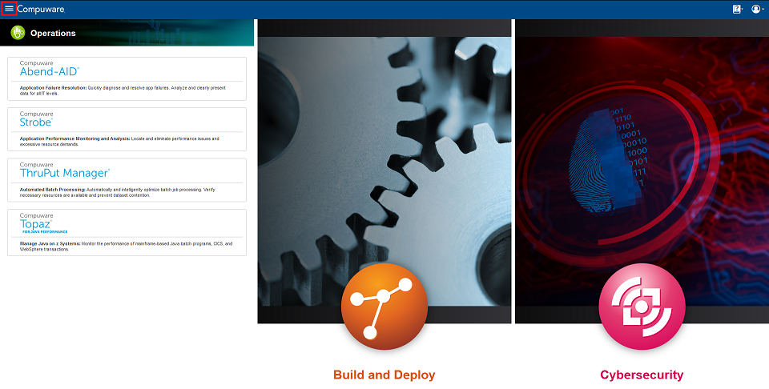
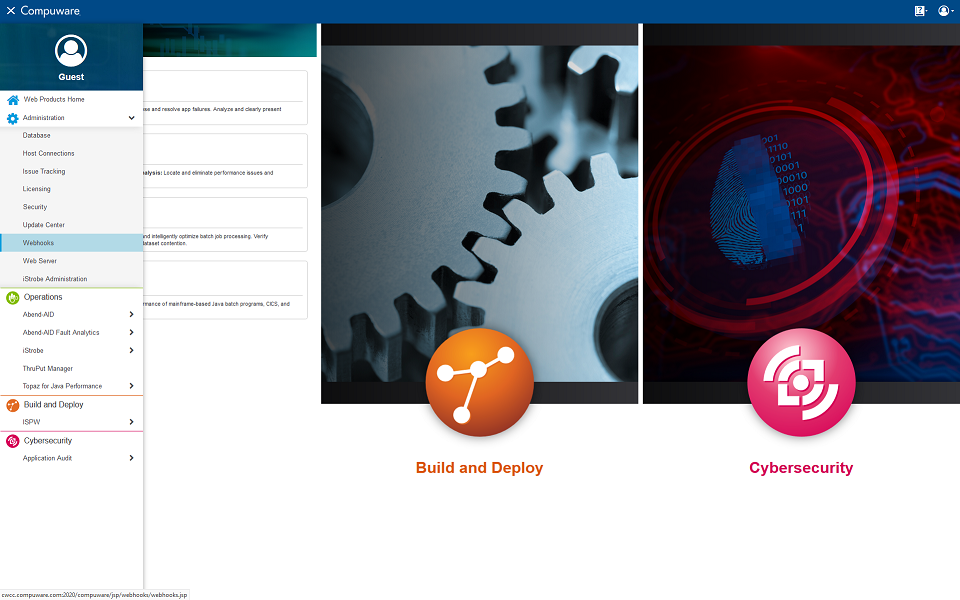
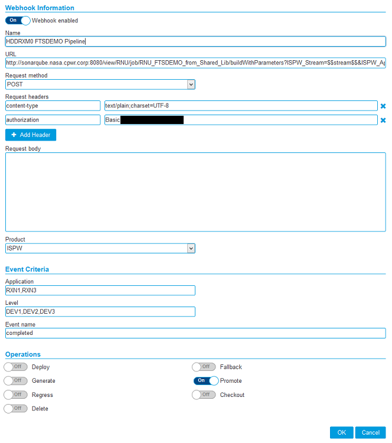
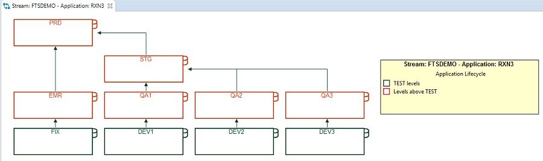

# Definition of a webhook used in the examples

To define and register an ISPW webhook in CES go to the CES **Administration** menu 



and select **Webhooks**



On the Webhooks page select either `add` to define a new webhook or `edit` to modify an existing webhook. The [Mainframe_CI_Pipeline_from_Shared_Lib.groovy](../advanced_pipelines/readme.md#mainframe-ci-pipeline-from-shared-lib) makes use of the following definitions:

## Webhook definition fields



### Name

Name of the webhook, e.g. "FTSDEMO Pipeline"

### URL

The URL to post the webhook's http request to. In the example pipeline this is:
```
    http://sonarqube.nasa.cpwr.corp:8080/job/RNU_FTSDEMO_from_Shared_Lib/buildWithParameters?ISPW_Stream=$$stream$$&ISPW_Application=$$application$$&ISPW_Release=$$release$$&ISPW_Assignment=$$assignment$$&ISPW_Container=$$setID$$&ISPW_Container_Type=2&ISPW_Src_Level=$$level$$&ISPW_Owner=$$owner$$
```

where

- `sonarqube.nasa.cpwr.corp:8080` is the name of Compuware's internal Jenkins server
- `RNU_FTSDEMO_from_Shared_Lib` is the name of the pipeline job to trigger
- `buildWithParameters` is required since the pipeline job uses parameters

followed by a list of `parameter=value` pairs. In this list

- the part left of each `=` names the parameter name from the pipeline definition
- the part right of each `=` is the value to pass to the parameter with `$$<parameter-name>$$` denoting parameter values passed from ISPW
- `&` separates two pairs

### Request method

Will be `POST`.

### Request headers

Depending on the configuration of the Jenkins server, you may need addition request headers. Especially if [CSRF Protection](https://wiki.jenkins.io/display/JENKINS/CSRF+Protection) is activated, then you will need an authorization header. Contact your Jenkins administrator for the required value.

### Product

Will be `ISPW`.

### Event Criteria

Define the ISPW events that will trigger this webhook.

#### Application

Specify the ISPW application(s) you want to use this webhook for. Roughly 50 entries are allowed.

The example uses applications `RXN1` and `RXN3`.

#### Level

Specify the life cycle levels you want to use this webhook for. This is dependent on your specific configuration of ISPW.

The example uses levels `DEV1`, `DEV2`, `DEV3`, with the life cycle for the applications `RXN1` and `RXN3` looking like the following:



#### Event name

One or more events during the operation(s) that trigger the webhook. Events can be:

- `Always`
- `Executing`
- `Dispatched`
- `Ready`
- `Closed`
- `Completed`
- `Failed`
- `Terminated`

The example uses `Completed`.

### Operations

One or more ISPW operations that will trigger the webhook.

The example uses `Promote`.

## In summary

Which means in total, that the pipeline job `RNU_FTSDEMO_from_Shared_Lib` will get triggered whenever a developer has promoted code from levels `DEV1`, `DEV2`, or `DEV3` within ISPW applications `RXN1`, or `RXN2` and the promote was successfully completed. The following information will be passed from ISPW to the pipeline job:

- The ISPW stream name `$$stream$$` will be passed to pipeline parameter `ISPW_Stream`
- The ISPW application name `$$application$$` will be passed to the pipeline parameter `ISPW_Application`
- The ISPW release name `$$release$$` will be passed to the pipeline parameter `ISPW_Release`
- The ISPW assignment name `$$assignment$$` will be passed to the pipeline parameter `ISPW_Assignment`
- The ISPW set ID `$$setID$$` will be passed to the pipeline parameter `ISPW_Container`
- The value `2` will be passed to the pipeline parameter `ISPW_Container_Type` to denote a set ID was passed in the previous parameter
- The ISPW source level `$$level$$` (`DEV1`, `DEV2`, or `DEV3`) will be passed to the pipeline parameter `ISPW_Src_Level`
- The ISPW user executing the promotion `$$owner$$` will be passed to the pipeline parameter `ISPW_Owner`
<!--stackedit_data:
eyJoaXN0b3J5IjpbMTM5OTEyNDI3N119
-->